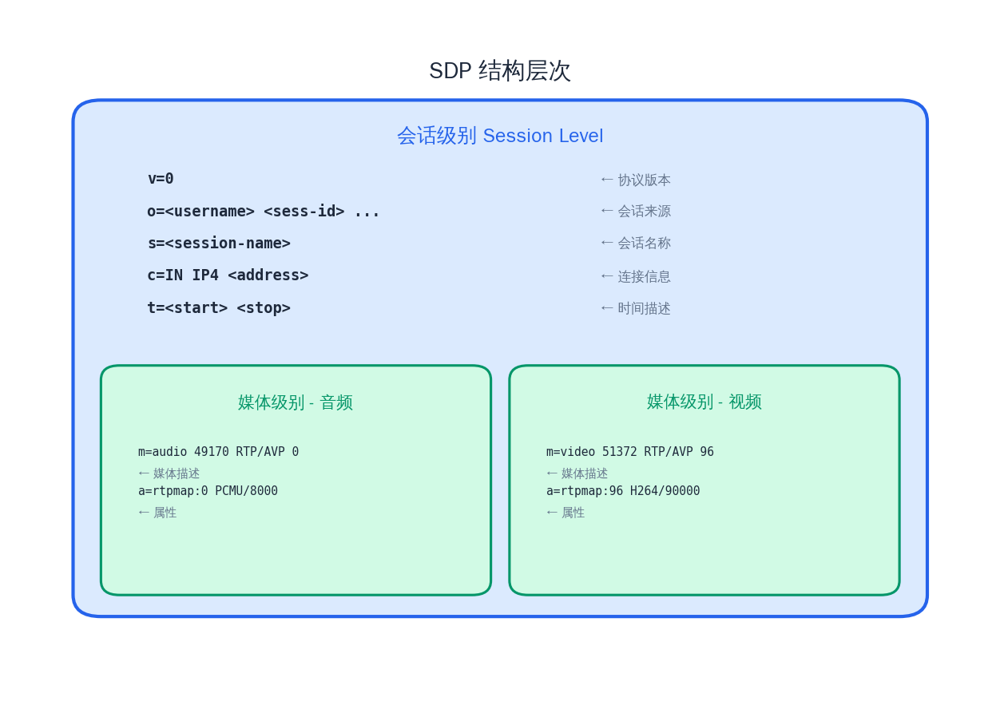
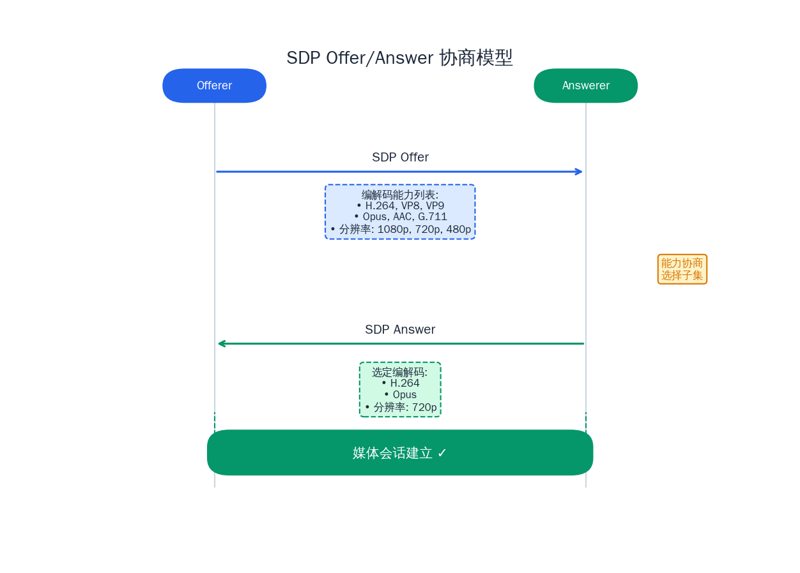

# SDP 与媒体协商机制

## 前言

在前一篇文章中，我们深入学习了 RTP/RTCP 协议——它们解决了"音视频数据如何在网络上传输"的问题。但在传输开始之前，还有一个关键问题需要回答：通信双方怎么知道对方支持哪些编解码器？数据该发到哪个端口？用什么传输方式？

在 RTSP 场景中，客户端向服务器发送 DESCRIBE 请求，服务器在响应中告诉客户端"我这里有一路 H.264 视频和一路 AAC 音频"；在 WebRTC 场景中，两个浏览器通过信令服务器交换各自的媒体能力，最终协商出双方都支持的编解码方案。这两个看似不同的场景，背后使用的都是同一种描述格式——**SDP（Session Description Protocol）**。

本文将全面剖析 SDP 的格式与语义，深入理解 Offer/Answer 协商模型，对比 SDP 在 RTSP 和 WebRTC 中的不同用法，并动手实现一个 C++ 版本的 SDP 解析器。

## 1. SDP 协议概述

### 1.1 SDP 是什么

SDP（Session Description Protocol，会话描述协议）定义在 [RFC 8866](https://datatracker.ietf.org/doc/html/rfc8866)（前身为 RFC 4566）中。它是一种**纯文本格式**，用于描述多媒体会话的参数信息，包括：

- 会话的元信息（名称、发起者、时间等）
- 媒体流的类型（音频、视频、应用数据）
- 编解码器的能力（支持哪些 codec、参数如何）
- 网络传输参数（IP 地址、端口号、传输协议）

一个关键概念需要明确：**SDP 不是传输协议**。它不负责数据的发送和接收，也没有请求-响应的交互语义。SDP 只是一种"描述格式"——就像一张菜单，列出了餐厅提供的所有菜品，但菜单本身不负责上菜。SDP 需要依附于其他协议来传递，比如通过 RTSP、SIP 或 WebRTC 的信令通道。

### 1.2 SDP 的应用场景

SDP 在音视频通信领域的三大核心应用场景：

| 协议 | SDP 的角色 | 传递方式 |
|------|-----------|---------|
| RTSP | 服务器描述媒体资源 | DESCRIBE 响应体 |
| SIP | 通话双方协商媒体 | INVITE/200 OK 消息体 |
| WebRTC | 浏览器间协商媒体能力 | 通过信令服务器交换 Offer/Answer |

虽然场景不同，但 SDP 的核心格式是一致的。理解了 SDP，就掌握了打开这三扇门的通用钥匙。

## 2. SDP 格式详解

### 2.1 基本语法规则

SDP 由多行文本组成，每行的格式为：

```
<type>=<value>
```

其中 `<type>` 是一个**单字符**（如 `v`、`o`、`s`），`=` 号两侧**不能有空格**，`<value>` 的格式因类型而异。行与行之间用 `\r\n`（CRLF）分隔。

SDP 的字段分为**会话级**和**媒体级**两个层次。在第一个 `m=` 行出现之前的字段属于会话级，描述整个会话的全局信息；每个 `m=` 行开启一个新的媒体描述块，其后的字段属于该媒体级。

### 2.2 核心字段逐行解析

| 字段 | 含义 | 层级 | 示例 |
|------|------|------|------|
| `v=` | 协议版本（始终为 0） | 会话级 | `v=0` |
| `o=` | 会话发起者信息 | 会话级 | `o=- 123456 2 IN IP4 192.168.1.100` |
| `s=` | 会话名称 | 会话级 | `s=Live Stream` |
| `c=` | 连接信息（网络类型/地址） | 两者皆可 | `c=IN IP4 239.0.0.1` |
| `t=` | 会话时间（0 0 表示永久） | 会话级 | `t=0 0` |
| `m=` | 媒体描述 | 媒体级起始 | `m=video 5004 RTP/AVP 96` |
| `a=` | 属性（扩展信息的万能字段） | 两者皆可 | `a=rtpmap:96 H264/90000` |
| `b=` | 带宽信息 | 两者皆可 | `b=AS:2000` |

`o=` 行的完整格式为 `o=<username> <sess-id> <sess-version> <nettype> <addrtype> <unicast-address>`，其中 `sess-id` 通常是一个随机数字标识，`sess-version` 每次 SDP 更新时递增。

### 2.3 完整 SDP 示例

下面是一个典型的 RTSP 场景 SDP，包含一路 H.264 视频和一路 AAC 音频：

```
v=0
o=- 289463150 289463150 IN IP4 192.168.1.100
s=Live Stream
c=IN IP4 0.0.0.0
t=0 0
m=video 0 RTP/AVP 96
a=rtpmap:96 H264/90000
a=fmtp:96 packetization-mode=1;profile-level-id=42e01f;sprop-parameter-sets=Z0LgH5ZUBaHogA==,aM4G4g==
a=control:trackID=0
m=audio 0 RTP/AVP 97
a=rtpmap:97 MPEG4-GENERIC/44100/2
a=fmtp:97 streamtype=5;profile-level-id=1;mode=AAC-hbr;sizelength=13;indexlength=3;indexdeltalength=3;config=1210
a=control:trackID=1
```

逐行解读：

- **`v=0`**：SDP 版本号，目前只有 0 这一个版本。
- **`o=- 289463150 ...`**：会话发起者信息，`-` 表示无用户名，后面是会话 ID 和版本号。
- **`s=Live Stream`**：会话名称，人类可读的描述。
- **`c=IN IP4 0.0.0.0`**：会话级的连接地址。0.0.0.0 表示在 RTSP SETUP 阶段再确定实际地址。
- **`t=0 0`**：会话起止时间，两个零表示会话是永久有效的（直播场景的常见写法）。
- **`m=video 0 RTP/AVP 96`**：**视频媒体描述**——媒体类型是 video，端口为 0（RTSP 中端口在 SETUP 时协商），传输协议是 RTP/AVP，Payload Type 为 96。
- **`a=rtpmap:96 H264/90000`**：PT 96 对应的编解码器是 H.264，时钟频率 90000 Hz。
- **`a=fmtp:96 ...`**：H.264 的格式参数，包含 profile-level-id 和 SPS/PPS 信息。
- **`a=control:trackID=0`**：RTSP 控制 URL，用于 SETUP 时引用该媒体轨。
- **`m=audio 0 RTP/AVP 97`**：**音频媒体描述**——PT 97 的音频流。
- **`a=rtpmap:97 MPEG4-GENERIC/44100/2`**：PT 97 对应 AAC 编解码器，采样率 44100 Hz，双声道。
- **`a=fmtp:97 ...`**：AAC 的格式参数，`config=1210` 是 AudioSpecificConfig 的十六进制表示。



### 2.4 m= 行深入解析

`m=` 行是 SDP 最核心的字段，其格式为：

```
m=<media> <port> <proto> <fmt> [<fmt> ...]
```

- **media**：媒体类型，常见值有 `audio`、`video`、`application`。
- **port**：传输端口号。在 RTSP 中通常为 0（端口在 SETUP 时确定）；在 WebRTC 中常见 9（占位，实际通过 ICE 确定）。
- **proto**：传输协议，如 `RTP/AVP`（RTP over UDP）、`RTP/SAVPF`（SRTP with feedback，WebRTC 常用）、`UDP/TLS/RTP/SAVPF`。
- **fmt**：Payload Type 列表，可以有多个，表示该媒体流支持的所有编解码格式。

一个 `m=` 行列出多个 PT 值意味着"我支持这些编解码器中的任意一个"：

```
m=audio 49170 RTP/AVP 0 8 97
```

这表示音频流支持 PT 0（PCMU）、PT 8（PCMA）和 PT 97（需要查看对应的 `a=rtpmap` 确认）。

### 2.5 a= 行的两种形式

`a=` 行是 SDP 最灵活的扩展点，有两种形式：

- **属性标记**：`a=<flag>`，如 `a=sendrecv`、`a=recvonly`
- **键值属性**：`a=<attribute>:<value>`，如 `a=rtpmap:96 H264/90000`

会话级的 `a=` 行对所有媒体生效；媒体级的 `a=` 行仅对当前媒体块生效（且会覆盖会话级的同名属性）。

## 3. 编解码能力协商

### 3.1 Payload Type 映射体系

RTP 协议中，Payload Type（PT）是一个 7 位整数（0~127），用于标识 RTP 包中承载的媒体格式。PT 分为两类：

**静态 Payload Type（0~95）**：由 [RFC 3551](https://datatracker.ietf.org/doc/html/rfc3551) 预定义了固定映射关系，无需通过 SDP 额外声明。常见的静态 PT 包括：

| PT | 编解码器 | 采样率 | 说明 |
|----|---------|--------|------|
| 0 | PCMU | 8000 | G.711 μ-law |
| 8 | PCMA | 8000 | G.711 A-law |
| 14 | MPA | 90000 | MPEG Audio (MP3) |
| 26 | JPEG | 90000 | Motion JPEG |

**动态 Payload Type（96~127）**：用于标准中未预定义的编解码器，需要通过 SDP 的 `a=rtpmap` 行来建立 PT 与 codec 的映射关系。现代流媒体中常用的 H.264、H.265、VP8、VP9、Opus、AAC 等编解码器都使用动态 PT。

### 3.2 a=rtpmap 详解

`a=rtpmap` 建立动态 PT 与编解码器之间的映射：

```
a=rtpmap:<payload-type> <encoding-name>/<clock-rate>[/<encoding-params>]
```

- **encoding-name**：编解码器名称（大小写不敏感），如 `H264`、`opus`、`MPEG4-GENERIC`。
- **clock-rate**：RTP 时间戳的时钟频率。视频通常为 90000 Hz，音频等于采样率。
- **encoding-params**：可选，对音频而言通常是声道数。

几个典型例子：

```
a=rtpmap:96 H264/90000           # H.264 视频, 90kHz 时钟
a=rtpmap:97 H265/90000           # H.265 视频
a=rtpmap:111 opus/48000/2        # Opus 音频, 48kHz, 立体声
a=rtpmap:98 VP8/90000            # VP8 视频
a=rtpmap:100 MPEG4-GENERIC/44100/2  # AAC 音频, 44.1kHz, 立体声
```

### 3.3 a=fmtp 详解

`a=fmtp` 提供编解码器的详细参数，格式为：

```
a=fmtp:<payload-type> <format-specific-params>
```

参数的具体含义取决于编解码器类型，下面分别讲解两个最常用的场景。

**H.264 的 fmtp 参数：**

```
a=fmtp:96 packetization-mode=1;profile-level-id=42e01f;sprop-parameter-sets=Z0LgH5ZUBaHogA==,aM4G4g==
```

- **packetization-mode**：RTP 打包模式。0=单 NALU 模式，1=非交织模式（最常用），2=交织模式。
- **profile-level-id**：3 字节的十六进制值，编码了 H.264 的 profile、constraint flags 和 level。`42e01f` 表示 Baseline Profile, Level 3.1。
- **sprop-parameter-sets**：Base64 编码的 SPS 和 PPS，用逗号分隔。解码器可以在收到第一个 I 帧之前就完成初始化。

**Opus 的 fmtp 参数：**

```
a=rtpmap:111 opus/48000/2
a=fmtp:111 minptime=10;useinbandfec=1;stereo=1
```

- **minptime**：最小打包时长（毫秒）。
- **useinbandfec**：是否启用 Opus 内置的前向纠错。值为 1 表示启用，对抗丢包时非常有用。
- **stereo**：是否启用立体声。注意 `a=rtpmap` 中的 `/2` 是 Opus 规范要求必须写 2 声道，实际的立体声/单声道由 fmtp 中的 `stereo` 参数控制。

### 3.4 协商的本质

编解码协商的本质是一个**能力交集**的过程：发起方列出自己支持的所有编解码方案（可能在一个 `m=` 行中列出多个 PT），接收方从中选择自己也支持的子集。SDP 就是这份能力清单的标准化表达方式。

## 4. Offer/Answer 模型

### 4.1 RFC 3264 的核心思想

[RFC 3264](https://datatracker.ietf.org/doc/html/rfc3264) 定义了基于 SDP 的 Offer/Answer 模型，这是 SIP 和 WebRTC 媒体协商的基石。核心流程分为三步：

1. **Offerer 生成 Offer SDP**：列出自己支持的所有媒体类型和编解码能力。这是一个"超集"——把能支持的都写上。
2. **Answerer 返回 Answer SDP**：从 Offer 中选择自己也支持的子集，对每条 `m=` 行给出回应。
3. **双方按 Answer 确定的参数开始传输**。

关键规则：

- Answer 中的 `m=` 行数量和顺序**必须与 Offer 完全一致**。
- Answer 中每条 `m=` 行的 PT 列表必须是 Offer 中对应 `m=` 行 PT 列表的**子集**。
- 如果 Answerer 不支持某条 `m=` 行描述的媒体，必须将端口设为 **0** 表示拒绝（而不是删除该行）。

### 4.2 一个完整的协商示例

**Offer（Alice 发送）：**

```
v=0
o=alice 2890844526 2890844526 IN IP4 10.0.0.1
s=-
t=0 0
m=audio 49170 RTP/AVP 0 8 97
a=rtpmap:97 opus/48000/2
a=sendrecv
m=video 51372 RTP/AVP 96 98
a=rtpmap:96 H264/90000
a=rtpmap:98 VP8/90000
a=sendrecv
```

Alice 提出：音频支持 PCMU（PT 0）、PCMA（PT 8）和 Opus（PT 97）；视频支持 H.264（PT 96）和 VP8（PT 98）。

**Answer（Bob 回应）：**

```
v=0
o=bob 2808844564 2808844564 IN IP4 10.0.0.2
s=-
t=0 0
m=audio 60000 RTP/AVP 97
a=rtpmap:97 opus/48000/2
a=sendrecv
m=video 60002 RTP/AVP 96
a=rtpmap:96 H264/90000
a=sendrecv
```

Bob 的回应：音频选择 Opus，视频选择 H.264。协商完成后，双方就使用这两种编解码器进行通信。



### 4.3 媒体方向属性

SDP 通过 `a=` 属性标记来描述媒体流的方向：

| 属性 | Offer 中的含义 | Answer 中的含义 |
|------|---------------|----------------|
| `sendrecv` | 我既发送也接收 | 我同意双向传输 |
| `sendonly` | 我只发送（如摄像头推流） | 我同意只接收 |
| `recvonly` | 我只接收（如播放器拉流） | 我同意只发送 |
| `inactive` | 我暂时不传输 | 我同意暂停 |

方向属性是成对呼应的：Offer 中的 `sendonly` 对应 Answer 中的 `recvonly`，反之亦然。在直播场景中，推流端通常使用 `sendonly`，拉流端使用 `recvonly`。

### 4.4 媒体拒绝

如果 Answerer 不支持 Offer 中某条 `m=` 行的任何编解码器，或者不需要该媒体流，它应当将该 `m=` 行的端口设为 0：

```
m=video 0 RTP/AVP 96
```

端口为 0 意味着"我拒绝这条媒体流"，但这一行不能省略——Answer 的 `m=` 行必须与 Offer 一一对应。

## 5. SDP 在不同协议中的应用

### 5.1 RTSP 中的 SDP

在 RTSP 协议中，SDP 用于描述服务器上的媒体资源。客户端发送 `DESCRIBE` 请求，服务器在响应体中返回 SDP：

```
DESCRIBE rtsp://192.168.1.100/live.sdp RTSP/1.0
CSeq: 2
Accept: application/sdp

RTSP/1.0 200 OK
CSeq: 2
Content-Type: application/sdp
Content-Length: 326

v=0
o=- 289463150 289463150 IN IP4 192.168.1.100
s=Live Stream
c=IN IP4 0.0.0.0
t=0 0
m=video 0 RTP/AVP 96
a=rtpmap:96 H264/90000
a=fmtp:96 packetization-mode=1;profile-level-id=42e01f
a=control:trackID=0
m=audio 0 RTP/AVP 97
a=rtpmap:97 MPEG4-GENERIC/44100/2
a=fmtp:97 streamtype=5;profile-level-id=1;mode=AAC-hbr;sizelength=13;indexlength=3;indexdeltalength=3
a=control:trackID=1
```

RTSP 场景的特点：

- **不存在 Offer/Answer 协商**——服务器单方面描述媒体资源，客户端要么接受要么不播。
- `m=` 行的端口通常为 0，实际端口在 `SETUP` 阶段通过 `Transport` 头协商。
- `a=control` 字段指定每个媒体轨道的 RTSP 控制 URL，用于后续的 SETUP 和 PLAY 操作。

### 5.2 WebRTC 中的 SDP

WebRTC 的 SDP 要复杂得多，因为它需要描述 ICE 连接、DTLS 安全、RTCP 反馈等额外信息。下面是一个简化的 WebRTC Offer SDP：

```
v=0
o=- 4658location 2 IN IP4 127.0.0.1
s=-
t=0 0
a=group:BUNDLE 0 1
a=msid-semantic: WMS stream1

m=audio 9 UDP/TLS/RTP/SAVPF 111 0
c=IN IP4 0.0.0.0
a=mid:0
a=rtpmap:111 opus/48000/2
a=fmtp:111 minptime=10;useinbandfec=1
a=rtcp-mux
a=setup:actpass
a=fingerprint:sha-256 A1:B2:C3:D4:...
a=ice-ufrag:abcd
a=ice-pwd:efghijklmnopqrstuvwx
a=candidate:1 1 udp 2130706431 192.168.1.100 50000 typ host
a=sendrecv

m=video 9 UDP/TLS/RTP/SAVPF 96 98
c=IN IP4 0.0.0.0
a=mid:1
a=rtpmap:96 H264/90000
a=rtpmap:98 VP8/90000
a=rtcp-mux
a=rtcp-fb:96 nack
a=rtcp-fb:96 nack pli
a=rtcp-fb:96 goog-remb
a=setup:actpass
a=fingerprint:sha-256 A1:B2:C3:D4:...
a=ice-ufrag:abcd
a=ice-pwd:efghijklmnopqrstuvwx
a=candidate:1 1 udp 2130706431 192.168.1.100 50002 typ host
a=sendrecv
```

WebRTC 独有的 SDP 字段：

- **`a=group:BUNDLE`**：将多条 `m=` 行捆绑到同一个传输通道上（共用一个 ICE 连接和端口），避免为每条媒体流单独进行 ICE 打洞。
- **`a=ice-ufrag` / `a=ice-pwd`**：ICE 连接的用户名片段和密码，用于 STUN Binding 请求的认证。
- **`a=fingerprint`**：DTLS 证书的指纹（哈希值），用于验证 DTLS 握手中对端的身份。
- **`a=setup`**：DTLS 角色协商，`actpass` 表示可以主动也可以被动发起握手。
- **`a=rtcp-mux`**：将 RTP 和 RTCP 复用到同一个端口上，减少端口占用。
- **`a=rtcp-fb`**：RTCP 反馈能力声明，如 `nack`（丢包重传）、`nack pli`（画面刷新请求）、`goog-remb`（带宽估计）。
- **`a=candidate`**：ICE 候选地址，告诉对端可以尝试连接的 IP 和端口。
- **`a=mid`**：媒体标识符，与 `BUNDLE` 组中的 ID 对应。

### 5.3 两种场景对比

| 维度 | RTSP SDP | WebRTC SDP |
|------|----------|------------|
| 协商模型 | 单向描述（服务器告知客户端） | 双向 Offer/Answer |
| 传输协议字段 | `RTP/AVP` | `UDP/TLS/RTP/SAVPF` |
| 端口确定方式 | SETUP 阶段协商 | ICE 候选地址 |
| 安全机制 | 通常无（或通过 RTSPS） | 必须 DTLS-SRTP |
| RTCP 处理 | 独立端口 | rtcp-mux 复用 |
| 复杂度 | 较低 | 较高（ICE/DTLS/BUNDLE 等） |

## 6. C++ 实战：SDP 解析器

理解了 SDP 的格式之后，我们来实现一个轻量级的 SDP 解析器。它能解析 `m=` 行提取媒体信息，解析 `a=rtpmap` 建立 PT 与编解码器的映射，并解析 `a=fmtp` 提取格式参数。

```cpp
#include <iostream>
#include <sstream>
#include <string>
#include <vector>
#include <map>
#include <algorithm>
#include <cstdint>

struct RtpMap {
    int payload_type;
    std::string encoding_name;
    int clock_rate;
    int channels;  // 0 表示未指定
};

struct MediaDescription {
    std::string media_type;   // "audio" / "video"
    int port;
    std::string protocol;     // "RTP/AVP" 等
    std::vector<int> formats; // PT 列表
    std::map<int, RtpMap> rtpmaps;
    std::map<int, std::string> fmtps;
    std::string direction;    // "sendrecv" 等
    std::string control;      // RTSP control URL
};

struct SdpSession {
    int version = 0;
    std::string origin;
    std::string session_name;
    std::string connection;
    std::vector<MediaDescription> media_descriptions;
};

static std::string trim(const std::string& s) {
    auto start = s.find_first_not_of(" \t\r\n");
    if (start == std::string::npos) return "";
    auto end = s.find_last_not_of(" \t\r\n");
    return s.substr(start, end - start + 1);
}

static std::vector<std::string> split(const std::string& s, char delimiter) {
    std::vector<std::string> tokens;
    std::istringstream stream(s);
    std::string token;
    while (std::getline(stream, token, delimiter)) {
        tokens.push_back(token);
    }
    return tokens;
}

RtpMap parse_rtpmap(const std::string& value) {
    // 格式: <pt> <encoding>/<clock-rate>[/<channels>]
    RtpMap rm{};
    auto space_pos = value.find(' ');
    if (space_pos == std::string::npos) return rm;

    rm.payload_type = std::stoi(value.substr(0, space_pos));
    std::string codec_part = value.substr(space_pos + 1);

    auto parts = split(codec_part, '/');
    if (parts.size() >= 1) rm.encoding_name = parts[0];
    if (parts.size() >= 2) rm.clock_rate = std::stoi(parts[1]);
    if (parts.size() >= 3) rm.channels = std::stoi(parts[2]);
    return rm;
}

MediaDescription parse_media_line(const std::string& value) {
    // 格式: <media> <port> <proto> <fmt> [<fmt> ...]
    MediaDescription md{};
    std::istringstream iss(value);

    iss >> md.media_type >> md.port >> md.protocol;
    int fmt;
    while (iss >> fmt) {
        md.formats.push_back(fmt);
    }
    md.direction = "sendrecv";  // 默认方向
    return md;
}

SdpSession parse_sdp(const std::string& sdp_text) {
    SdpSession session;
    MediaDescription* current_media = nullptr;

    auto lines = split(sdp_text, '\n');
    for (auto& raw_line : lines) {
        std::string line = trim(raw_line);
        if (line.size() < 2 || line[1] != '=') continue;

        char type = line[0];
        std::string value = line.substr(2);

        switch (type) {
        case 'v':
            session.version = std::stoi(value);
            break;
        case 'o':
            session.origin = value;
            break;
        case 's':
            session.session_name = value;
            break;
        case 'c':
            if (!current_media)
                session.connection = value;
            break;
        case 'm': {
            session.media_descriptions.push_back(parse_media_line(value));
            current_media = &session.media_descriptions.back();
            break;
        }
        case 'a': {
            if (!current_media) break;
            auto colon_pos = value.find(':');
            if (colon_pos == std::string::npos) {
                // 属性标记 (sendrecv, recvonly, etc.)
                if (value == "sendrecv" || value == "sendonly" ||
                    value == "recvonly" || value == "inactive") {
                    current_media->direction = value;
                }
            } else {
                std::string attr_name = value.substr(0, colon_pos);
                std::string attr_value = value.substr(colon_pos + 1);

                if (attr_name == "rtpmap") {
                    auto rm = parse_rtpmap(attr_value);
                    current_media->rtpmaps[rm.payload_type] = rm;
                } else if (attr_name == "fmtp") {
                    auto space_pos = attr_value.find(' ');
                    if (space_pos != std::string::npos) {
                        int pt = std::stoi(attr_value.substr(0, space_pos));
                        current_media->fmtps[pt] = attr_value.substr(space_pos + 1);
                    }
                } else if (attr_name == "control") {
                    current_media->control = attr_value;
                }
            }
            break;
        }
        default:
            break;
        }
    }
    return session;
}

void print_session(const SdpSession& session) {
    std::cout << "=== SDP Session ===" << std::endl;
    std::cout << "Version: " << session.version << std::endl;
    std::cout << "Origin: " << session.origin << std::endl;
    std::cout << "Session: " << session.session_name << std::endl;
    std::cout << "Connection: " << session.connection << std::endl;
    std::cout << std::endl;

    for (size_t i = 0; i < session.media_descriptions.size(); ++i) {
        const auto& md = session.media_descriptions[i];
        std::cout << "--- Media #" << i << " ---" << std::endl;
        std::cout << "  Type: " << md.media_type << std::endl;
        std::cout << "  Port: " << md.port << std::endl;
        std::cout << "  Protocol: " << md.protocol << std::endl;
        std::cout << "  Direction: " << md.direction << std::endl;
        if (!md.control.empty())
            std::cout << "  Control: " << md.control << std::endl;

        std::cout << "  Payload Types: ";
        for (int pt : md.formats) std::cout << pt << " ";
        std::cout << std::endl;

        for (const auto& [pt, rm] : md.rtpmaps) {
            std::cout << "  RtpMap[" << pt << "]: " << rm.encoding_name
                      << "/" << rm.clock_rate;
            if (rm.channels > 0) std::cout << "/" << rm.channels;
            std::cout << std::endl;
        }

        for (const auto& [pt, params] : md.fmtps) {
            std::cout << "  Fmtp[" << pt << "]: " << params << std::endl;
        }
        std::cout << std::endl;
    }
}

int main() {
    const std::string sdp_text = R"(v=0
o=- 289463150 289463150 IN IP4 192.168.1.100
s=Live Stream
c=IN IP4 0.0.0.0
t=0 0
m=video 0 RTP/AVP 96
a=rtpmap:96 H264/90000
a=fmtp:96 packetization-mode=1;profile-level-id=42e01f;sprop-parameter-sets=Z0LgH5ZUBaHogA==,aM4G4g==
a=control:trackID=0
a=sendonly
m=audio 0 RTP/AVP 97
a=rtpmap:97 MPEG4-GENERIC/44100/2
a=fmtp:97 streamtype=5;profile-level-id=1;mode=AAC-hbr;sizelength=13;indexlength=3;indexdeltalength=3;config=1210
a=control:trackID=1
a=sendonly
)";

    auto session = parse_sdp(sdp_text);
    print_session(session);

    return 0;
}
```

编译并运行：

```bash
g++ -std=c++17 -o sdp_parser sdp_parser.cpp && ./sdp_parser
```

预期输出：

```
=== SDP Session ===
Version: 0
Origin: - 289463150 289463150 IN IP4 192.168.1.100
Session: Live Stream
Connection: IN IP4 0.0.0.0

--- Media #0 ---
  Type: video
  Port: 0
  Protocol: RTP/AVP
  Direction: sendonly
  Control: trackID=0
  Payload Types: 96
  RtpMap[96]: H264/90000
  Fmtp[96]: packetization-mode=1;profile-level-id=42e01f;sprop-parameter-sets=Z0LgH5ZUBaHogA==,aM4G4g==

--- Media #1 ---
  Type: audio
  Port: 0
  Protocol: RTP/AVP
  Direction: sendonly
  Control: trackID=1
  Payload Types: 97
  RtpMap[97]: MPEG4-GENERIC/44100/2
  Fmtp[97]: streamtype=5;profile-level-id=1;mode=AAC-hbr;sizelength=13;indexlength=3;indexdeltalength=3;config=1210
```

这个解析器虽然简单，但覆盖了 SDP 最核心的解析逻辑。在实际项目中，可以在此基础上扩展对 `a=ice-ufrag`、`a=fingerprint`、`a=candidate` 等 WebRTC 字段的支持，也可以添加 SDP 的序列化（生成）功能来实现完整的 Offer/Answer 流程。

## 总结

本文系统地学习了 SDP 协议与媒体协商机制，回顾核心知识点：

- **SDP 是描述格式，不是传输协议**。它以纯文本方式描述多媒体会话的参数，需要依附于 RTSP、SIP 或 WebRTC 信令通道进行传递。
- **SDP 的层次结构**：会话级字段描述全局信息，每个 `m=` 行开启一个媒体级描述块，`a=` 行提供灵活的扩展属性。
- **编解码协商**依赖 Payload Type 映射体系：静态 PT 有预定义映射，动态 PT 通过 `a=rtpmap` 和 `a=fmtp` 来描述编解码器及其参数。
- **Offer/Answer 模型**（RFC 3264）是 WebRTC 和 SIP 的协商基础：Offerer 提出能力超集，Answerer 选择子集，通过方向属性控制媒体流向，端口置 0 表示拒绝。
- **RTSP 与 WebRTC 使用 SDP 的方式差异显著**：RTSP 是单向描述，WebRTC 是双向协商，且 WebRTC 的 SDP 包含大量安全和连接相关的扩展字段。

下一篇文章，我们将讨论**抖动缓冲（Jitter Buffer）与前向纠错（FEC）**——当网络环境不理想时，如何通过这些机制保证音视频播放的流畅性。
