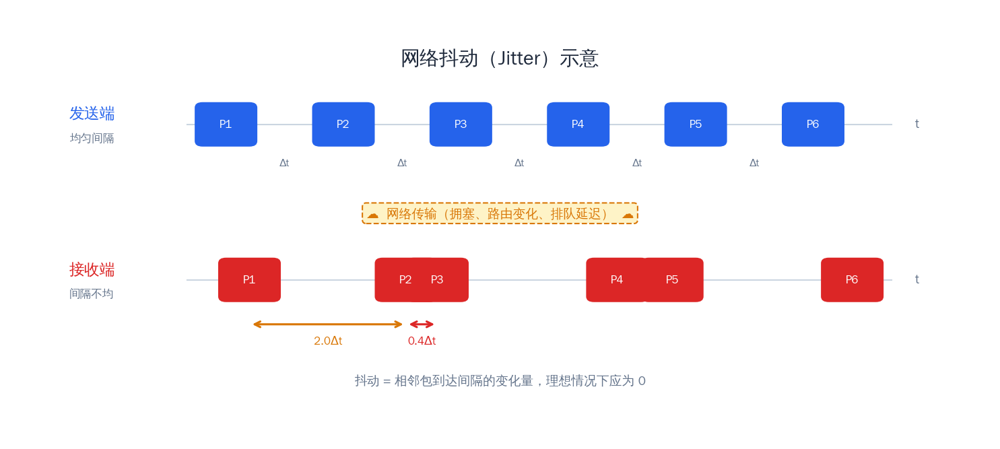
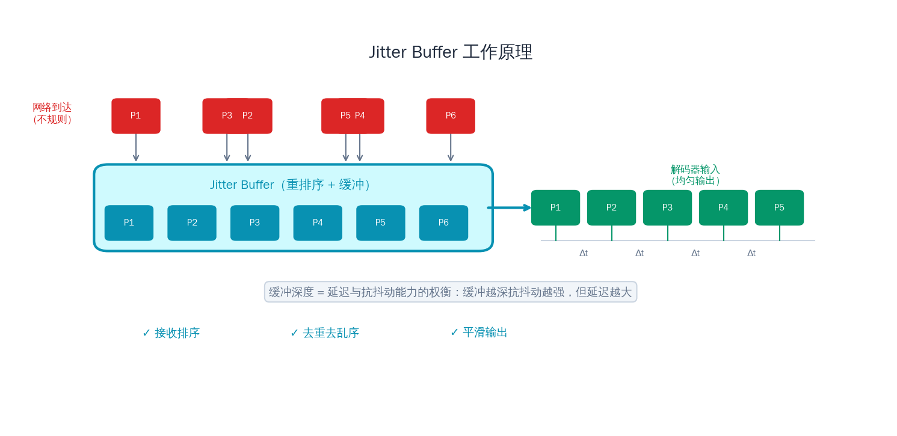
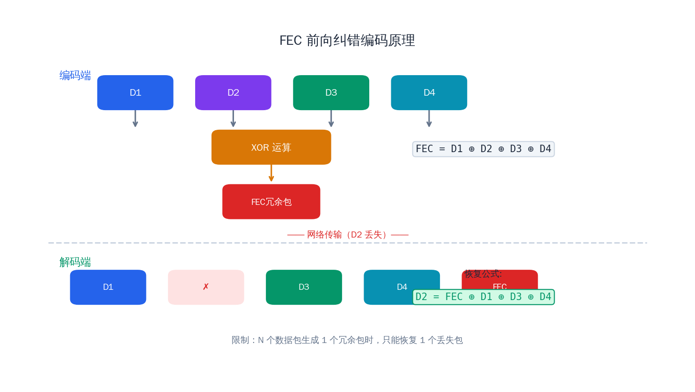
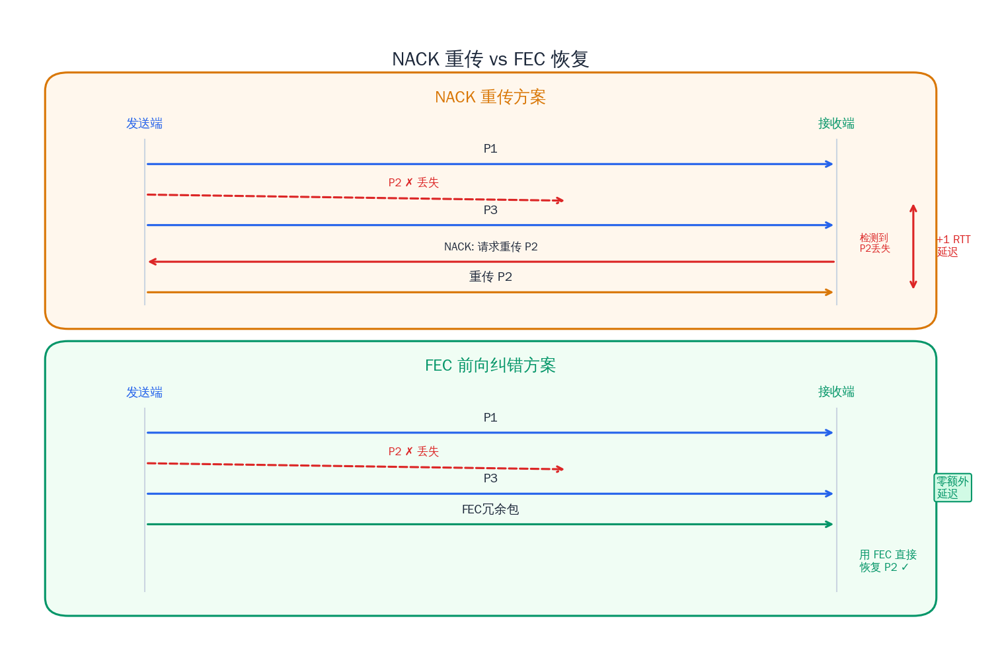

# 抖动缓冲与前向纠错

## 前言

在前面的文章中，我们学习了 RTP/RTCP 协议如何将音视频数据封装成数据包在网络上传输，也了解了 SDP 如何描述媒体会话的能力。但学完协议只是第一步——真实网络远不是实验室中理想的点对点链路。数据包在经过多跳路由器、穿越不同运营商网络、在 Wi-Fi 和蜂窝网络间切换时，会遭遇三个几乎无法回避的问题：**抖动（jitter）**、**丢包（packet loss）** 和 **乱序（out-of-order）**。

想象一下：发送端每 20ms 发出一个音频 RTP 包，但接收端收到的间隔可能是 5ms、50ms、15ms、80ms……如果直接把收到的包送去解码播放，听到的就是忽快忽慢、断断续续的声音。而如果中间丢了几个包，画面会出现马赛克、绿屏甚至卡顿。

流媒体系统如何对抗这些问题？答案是两项关键技术：**Jitter Buffer（抖动缓冲）** 负责对抗抖动和乱序，**FEC（前向纠错）** 负责对抗丢包。它们是保证播放流畅性的核心机制，几乎所有实时音视频系统——WebRTC、SIP 电话、视频会议、直播——都依赖它们的组合来提供可靠的用户体验。

## 1. 网络抖动的成因与度量

### 什么是网络抖动

网络抖动（jitter）是指数据包到达时间间隔的变化。如果发送端以固定间隔 T 发出数据包，在理想网络中接收端也应以间隔 T 收到。但实际上，每个包经历的网络路径延迟不同，导致到达间隔产生波动。这种波动就是抖动。

举个具体的例子：发送端每隔 20ms 发送一个音频包（序号 1~5），但接收端的到达时间可能是这样：

| 包序号 | 发送时间 (ms) | 到达时间 (ms) | 到达间隔 (ms) | 偏差 (ms) |
|:---:|:---:|:---:|:---:|:---:|
| 1 | 0 | 100 | — | — |
| 2 | 20 | 118 | 18 | -2 |
| 3 | 40 | 145 | 27 | +7 |
| 4 | 60 | 158 | 13 | -7 |
| 5 | 80 | 202 | 44 | +24 |

可以看到，虽然发送间隔恒定为 20ms，但到达间隔在 13ms 到 44ms 之间波动。这就是抖动的直观表现。

### 抖动的来源

抖动主要来自以下几个方面：

- **路由器排队延迟**：数据包在路由器的出端口队列中等待转发，队列长度随网络流量波动。在拥塞高峰期，一个包可能需要等待数十毫秒才能被转发，而下一个包可能队列已空，几乎零等待。
- **路径变化**：动态路由协议可能在传输过程中改变数据包的转发路径，不同路径的传播延迟不同。
- **链路层重传**：Wi-Fi 网络中 802.11 协议会在链路层进行自动重传，一个遭遇冲突的包可能延迟数毫秒才完成传输。
- **操作系统调度**：发送端和接收端的操作系统内核对网络数据包的处理并非严格实时的，进程调度抖动会传导到网络层。

### RTCP RR 中的抖动度量

RFC 3550 定义了 interarrival jitter 的标准计算方法，这是 RTCP Receiver Report 中一个重要字段。它使用一个加权递推公式来平滑估计抖动值：

对于收到的第 i 个包，首先计算传输延迟的差值 D(i,j)：

```
D(i,j) = (Rj - Ri) - (Sj - Si)
```

其中 R 是接收时间戳，S 是 RTP 时间戳（转换为相同的时间单位）。然后用指数加权移动平均更新抖动估计：

```
J(i) = J(i-1) + (|D(i-1,i)| - J(i-1)) / 16
```

分母 16 是 RFC 推荐的增益系数，它使得抖动估计对突发波动不会过于敏感，同时也能较快跟踪持续的变化。这个值在 RTCP RR 中以 RTP 时间戳单位报告给发送端。



## 2. Jitter Buffer 的设计

### 基本原理

Jitter Buffer 的核心思想非常简单：在接收端引入一个缓冲区，先把收到的 RTP 包存起来，等积累到一定量之后，再按照 RTP 时间戳的顺序依次取出送去解码播放。这样即使网络上的包到达时间不规律，播放端看到的数据流也是平滑均匀的。

本质上，Jitter Buffer 是在**用延迟换平滑**——缓冲引入的额外延迟就是我们为对抗抖动付出的代价。

### 静态 Jitter Buffer

最简单的实现方案是固定缓冲深度。例如设定缓冲 100ms，意味着每个包到达后都要在缓冲区中等待约 100ms 才被取出播放。

静态方案的优点是实现简单、行为可预测。缺点也很明显：
- 如果网络抖动通常只有 30ms，固定 100ms 的缓冲意味着浪费了 70ms 的延迟。
- 如果网络抖动突然飙升到 150ms，100ms 的缓冲又不够用，仍然会出现卡顿。

在对延迟要求不高的场景（如视频点播、单向直播）中，静态缓冲足够用。但在实时互动场景（如视频会议、连麦直播）中，每增加 100ms 延迟都会显著影响交互体验。

### 自适应 Jitter Buffer

更好的方案是根据网络状况动态调整缓冲深度。自适应 Jitter Buffer 实时统计最近收到的包的抖动情况，据此调整缓冲目标延迟：

- **网络平稳时**：缩小缓冲深度，降低端到端延迟。
- **网络波动时**：增大缓冲深度，吸收更多抖动，避免卡顿。

典型的自适应策略基于抖动的统计分布：取最近 N 个包的到达间隔，计算其某个高分位值（如 95 百分位）作为目标缓冲深度。这意味着 95% 的包到达时缓冲区里有足够的数据可供播放，只有 5% 的极端情况可能出现欠载。

WebRTC 中的 NetEQ 就是一个经典的自适应 Jitter Buffer 实现，它不仅动态调整缓冲深度，还结合了 DSP 技术在缓冲调整时对音频做时间伸缩（time stretching），使得缓冲深度的变化对用户几乎无感知。



### 缓冲深度与延迟的权衡

这是 Jitter Buffer 设计中最核心的权衡：

| 缓冲深度 | 抗抖动能力 | 端到端延迟 | 适用场景 |
|:---:|:---:|:---:|:---:|
| 小（20~50ms） | 弱 | 低 | 实时通话、电竞直播 |
| 中（50~200ms） | 中 | 中 | 视频会议、连麦 |
| 大（200ms~1s） | 强 | 高 | 单向直播、点播 |

没有一个万能的数值。系统需要根据业务场景设定一个合理的范围，并在运行时动态调整。

### 何时丢弃过期的包

Jitter Buffer 还需要处理"过期包"——当一个包到达时，如果它的时间戳对应的播放时刻已经过去了，这个包就没有播放价值了。

丢弃策略通常有两种：
- **基于时间戳**：如果包的播放时间点已过期超过一定阈值（如当前播放点之前 40ms），直接丢弃。
- **基于缓冲区容量**：当缓冲区满时，丢弃最老的包为新包腾出空间。

对于视频流，还需要考虑帧间依赖：如果一个 P 帧依赖的参考帧已经被丢弃，那么这个 P 帧即使完整到达也无法正确解码，应该一并丢弃。

## 3. C++ 实战：简易 Jitter Buffer

下面实现一个简易但功能完整的 Jitter Buffer，支持按序列号排序、最大缓冲深度控制和超时丢弃：

```cpp
#include <cstdint>
#include <cstring>
#include <chrono>
#include <map>
#include <vector>
#include <optional>
#include <mutex>
#include <iostream>

struct RtpPacket {
    uint16_t sequence_number;
    uint32_t timestamp;
    std::vector<uint8_t> payload;
    std::chrono::steady_clock::time_point arrival_time;
};

class JitterBuffer {
public:
    struct Config {
        size_t max_packets = 100;
        std::chrono::milliseconds max_age{500};
        std::chrono::milliseconds target_delay{80};
    };

    explicit JitterBuffer(const Config& config) : config_(config) {}

    void insert(RtpPacket packet) {
        std::lock_guard<std::mutex> lock(mutex_);

        packet.arrival_time = std::chrono::steady_clock::now();

        if (buffer_.size() >= config_.max_packets) {
            buffer_.erase(buffer_.begin());
        }

        uint16_t seq = packet.sequence_number;
        buffer_.emplace(seq, std::move(packet));

        if (!playback_started_) {
            if (buffer_.size() >= initial_fill_count_) {
                playback_started_ = true;
                playback_start_ = std::chrono::steady_clock::now();
                first_timestamp_ = buffer_.begin()->second.timestamp;
            }
        }
    }

    std::optional<RtpPacket> pop() {
        std::lock_guard<std::mutex> lock(mutex_);

        purge_expired();

        if (buffer_.empty() || !playback_started_) {
            return std::nullopt;
        }

        auto it = buffer_.begin();
        auto now = std::chrono::steady_clock::now();
        auto elapsed = std::chrono::duration_cast<std::chrono::milliseconds>(
            now - playback_start_);

        uint32_t ts_diff = it->second.timestamp - first_timestamp_;
        uint32_t packet_time_ms = ts_diff / (clock_rate_ / 1000);

        int64_t target_ms =
            static_cast<int64_t>(packet_time_ms) +
            config_.target_delay.count();

        if (elapsed.count() < target_ms) {
            return std::nullopt;
        }

        RtpPacket pkt = std::move(it->second);
        buffer_.erase(it);
        return pkt;
    }

    size_t size() const {
        std::lock_guard<std::mutex> lock(mutex_);
        return buffer_.size();
    }

    void set_clock_rate(uint32_t rate) { clock_rate_ = rate; }

private:
    void purge_expired() {
        auto now = std::chrono::steady_clock::now();
        for (auto it = buffer_.begin(); it != buffer_.end(); ) {
            auto age = std::chrono::duration_cast<std::chrono::milliseconds>(
                now - it->second.arrival_time);
            if (age > config_.max_age) {
                it = buffer_.erase(it);
            } else {
                break;
            }
        }
    }

    Config config_;
    mutable std::mutex mutex_;
    std::map<uint16_t, RtpPacket> buffer_;

    bool playback_started_ = false;
    std::chrono::steady_clock::time_point playback_start_;
    uint32_t first_timestamp_ = 0;
    uint32_t clock_rate_ = 48000;
    size_t initial_fill_count_ = 5;
};
```

这里有几个设计要点值得说明：

- **`std::map<uint16_t, RtpPacket>`** 自动按序列号排序，查找和插入都是 O(log N)。相比 `std::priority_queue`，`map` 的优势是可以方便地按序列号去重和遍历。
- **`purge_expired()`** 清理那些在缓冲区中驻留时间超过 `max_age` 的过期包。由于 `map` 按序列号有序，较老的包通常排在前面，因此从头部开始清理效率很高。
- **播放控制** 通过比较实际经过的时间和包的理论播放时间来决定是否弹出。`target_delay` 就是我们的缓冲深度。

下面写一个测试驱动函数来验证它的行为：

```cpp
#include <thread>
#include <random>

void simulate_jitter_buffer() {
    JitterBuffer::Config config;
    config.max_packets = 50;
    config.max_age = std::chrono::milliseconds(500);
    config.target_delay = std::chrono::milliseconds(100);

    JitterBuffer jbuf(config);
    jbuf.set_clock_rate(48000);

    std::mt19937 rng(42);
    std::normal_distribution<double> jitter_dist(0.0, 15.0);

    auto start = std::chrono::steady_clock::now();

    // 模拟发送端：每 20ms 发送一个包，序列号递增
    // 接收端到达时间带有随机抖动
    std::vector<std::pair<int, double>> send_schedule;
    for (int i = 0; i < 50; ++i) {
        double nominal_arrival = 20.0 * i + 50.0;  // 50ms 基础网络延迟
        double actual_arrival = nominal_arrival + jitter_dist(rng);
        if (actual_arrival < 0) actual_arrival = 0;
        send_schedule.push_back({i, actual_arrival});
    }

    // 乱序模拟：按到达时间排序
    std::sort(send_schedule.begin(), send_schedule.end(),
        [](const auto& a, const auto& b) {
            return a.second < b.second;
        });

    // 插入线程
    std::thread producer([&]() {
        auto base = std::chrono::steady_clock::now();
        for (auto& [seq, arrival_ms] : send_schedule) {
            auto target = base + std::chrono::microseconds(
                static_cast<int64_t>(arrival_ms * 1000));
            std::this_thread::sleep_until(target);

            RtpPacket pkt;
            pkt.sequence_number = static_cast<uint16_t>(seq);
            pkt.timestamp = seq * 960;  // 48kHz, 20ms = 960 samples
            pkt.payload = {0x01, 0x02, 0x03, 0x04};
            jbuf.insert(std::move(pkt));
        }
    });

    // 消费线程：每 20ms 尝试取一个包
    std::thread consumer([&]() {
        std::this_thread::sleep_for(std::chrono::milliseconds(120));

        int played = 0;
        int missed = 0;
        for (int i = 0; i < 80; ++i) {
            auto pkt = jbuf.pop();
            if (pkt) {
                std::cout << "Play seq=" << pkt->sequence_number
                          << " ts=" << pkt->timestamp << "\n";
                ++played;
            } else {
                ++missed;
            }
            std::this_thread::sleep_for(std::chrono::milliseconds(20));
        }
        std::cout << "\nStats: played=" << played
                  << " missed=" << missed << "\n";
    });

    producer.join();
    consumer.join();
}

int main() {
    simulate_jitter_buffer();
    return 0;
}
```

编译运行：

```bash
g++ -std=c++17 -pthread -o jitter_buffer jitter_buffer.cpp && ./jitter_buffer
```

运行后可以观察到：即使包的到达顺序是乱的（模拟了网络抖动和乱序），消费端取出的包序列号是严格递增的，实现了平滑播放。

## 4. 前向纠错（FEC）原理

### FEC 的核心思想

Jitter Buffer 能对抗抖动和乱序，但对丢包无能为力——丢失的包不会凭空出现在缓冲区里。传统的做法是通过 NACK 请求发送端重传，但重传至少需要一个 RTT 的额外延迟，在高延迟或高丢包率的网络中效果很差。

**前向纠错（Forward Error Correction, FEC）** 采用完全不同的思路：发送端在原始数据包之外，额外发送一些**冗余校验包**。接收端即使丢失了部分原始包，也可以利用收到的原始包和冗余包在本地**直接恢复**丢失的数据，完全不需要重传。

### 简单 XOR FEC

最容易理解的 FEC 方案是基于异或（XOR）运算的。假设有 N 个原始数据包 P1, P2, ..., PN，生成一个校验包 F：

```
F = P1 ⊕ P2 ⊕ P3 ⊕ ... ⊕ PN
```

如果其中任意一个包 Pk 丢失了，接收端可以用其他所有包和校验包恢复它：

```
Pk = F ⊕ P1 ⊕ ... ⊕ P(k-1) ⊕ P(k+1) ⊕ ... ⊕ PN
```

这就是 XOR FEC 的全部原理。XOR 运算的美妙之处在于它满足结合律和自反性：`A ⊕ A = 0`，`A ⊕ 0 = A`。

实际实现中，XOR 是逐字节进行的。如果各包长度不同，短包在逻辑上用零填充到最长包的长度。校验包中还需要记录各原始包的长度信息，以便恢复时能裁剪到正确的长度。

这种方案的保护能力是：**每 N 个原始包 + 1 个校验包组成一个 FEC 组，该组内最多能恢复 1 个丢失的包**。如果同一组内丢了 2 个或更多包，则无法恢复。

N 的选择是一个权衡：
- **N 越小**（如 N=3），冗余开销越大（33%），但保护粒度更细，能应对较高的丢包率。
- **N 越大**（如 N=10），冗余开销越小（10%），但保护粒度粗，同一组内丢 2 包的概率增大。



### Reed-Solomon 编码

XOR FEC 每组只能恢复 1 个包，对于连续丢包（burst loss）无能为力。Reed-Solomon（RS）编码提供了更强大的纠错能力。

RS 编码的参数通常表示为 RS(n, k)：将 k 个原始数据包编码生成 n 个包（其中 n-k 个为冗余包）。接收端只要收到**任意 k 个包**（无论是原始包还是冗余包），就能恢复全部 k 个原始数据。

例如 RS(6, 4) 意味着：4 个原始包生成 2 个冗余包，共 6 个包。只要收到其中任意 4 个就能完全恢复，即最多容忍丢失 2 个包（50% 的冗余率，33% 的丢包容忍度）。

RS 编码基于有限域（Galois Field）上的多项式运算，计算复杂度远高于 XOR，但现代 CPU 通过 SIMD 指令集（如 SSE/AVX）可以高效实现。在需要对抗连续丢包的场景中，RS 编码是比 XOR 更好的选择。

### WebRTC 中的 FEC 方案

WebRTC 实现了两种 FEC 方案：

**UlpFEC（Uneven Level Protection FEC，RFC 5109）**：基于 XOR 的 FEC，按 RTP 包级别进行保护。它支持不等级保护——可以对包头和包体使用不同的保护强度（包头保护 Level 0 通常更短的分组，包体保护 Level 1 可以用更长的分组）。这对视频很有意义：即使包体无法恢复，恢复包头就能保持视频流的同步信息。

**FlexFEC（Flexible FEC，RFC 8627）**：UlpFEC 的增强版本，提供更灵活的保护结构。FlexFEC 支持一维行保护、一维列保护和二维保护（行+列）。二维保护结构类似矩阵：将 N 个包排成 R 行 C 列，分别对每行和每列做 XOR 生成校验包。这种结构在只增加约 `(R+C)/(R*C)` 的冗余率时，就能应对很多连续丢包模式。

## 5. NACK 重传 vs FEC 的权衡

在实际系统中，NACK 重传和 FEC 通常不是二选一，而是互补使用。理解它们各自的优缺点，才能在工程实践中做出正确的选择。

### NACK 重传

**优点**：
- 精确恢复，只在检测到丢包时才触发重传，不浪费带宽。
- 实现简单，RTCP NACK 在 RFC 4585 中有标准定义。

**缺点**：
- 至少需要一个 RTT 的额外延迟：接收端检测到丢包 → 发送 NACK → 发送端收到 NACK → 重传数据包 → 接收端收到重传包。如果 RTT 是 200ms，这就是不可接受的延迟。
- 在高丢包率下，NACK 本身也可能丢失，需要多次重传，延迟进一步恶化。
- 重传风暴：如果丢包率突然飙升，大量 NACK 请求涌向发送端，可能加剧网络拥塞。

### FEC

**优点**：
- 零额外延迟恢复，接收端收到足够的包就能立即恢复丢失数据。
- 不依赖反馈通道，纯单向传输也能工作（这对卫星链路、组播等场景至关重要）。
- 能对抗突发丢包，特别是使用 RS 编码或二维 FlexFEC 时。

**缺点**：
- 始终消耗额外带宽，无论是否发生丢包都需要发送冗余数据。
- 保护能力有上限，如果丢包数超过 FEC 的纠错能力，仍然无法恢复。
- 增加编解码计算开销。

### 混合策略

成熟的实时音视频系统通常采用 **FEC + NACK** 的混合策略：

1. **FEC 作为第一道防线**：以较低冗余率（如 10%~20%）发送 FEC 包，覆盖常见的随机丢包。
2. **NACK 作为补充**：对于 FEC 无法恢复的丢包（如同一 FEC 组内丢了多个包），再通过 NACK 请求重传。
3. **自适应调整**：根据实时丢包率动态调整 FEC 冗余率。丢包率高时增加冗余，丢包率低时降低冗余以节省带宽。



### 不同场景的选择建议

**实时视频会议（RTT < 100ms）**：
- 使用低冗余率 FEC（10%~15%）覆盖随机丢包。
- NACK 重传作为补充，RTT 低所以重传延迟可接受。
- 延迟预算紧张，Jitter Buffer 深度控制在 50~100ms。

**互动直播 / 连麦（RTT 100~300ms）**：
- 中等冗余率 FEC（15%~25%），FEC 在这个 RTT 下比 NACK 更有价值。
- NACK 仅用于关键帧保护（丢了关键帧必须恢复，否则整个 GOP 无法解码）。
- Jitter Buffer 深度 100~300ms。

**单向直播 / 广播（RTT > 500ms 或单向链路）**：
- 高冗余率 FEC（20%~50%），因为 NACK 重传延迟太高甚至不可用。
- 可以使用 RS 编码获得更强的纠错能力。
- Jitter Buffer 深度可以较大（500ms~2s），延迟要求相对宽松。

**视频点播**：
- 通常基于 TCP，协议层保证可靠传输，不需要应用层 FEC。
- Jitter Buffer 主要用于平滑 TCP 的突发传输行为。

## 6. 其他抗丢包技术

除了 Jitter Buffer 和 FEC，流媒体系统还有一些其他技术来应对丢包带来的质量问题。

### PLC：音频丢包隐藏

当音频包丢失且无法恢复（FEC 和 NACK 都失败）时，最后的手段是 **PLC（Packet Loss Concealment）**。PLC 不是真的恢复了数据，而是用算法生成一段"听起来还行"的音频来填充丢失的间隙，避免出现刺耳的静音或噪声突变。

常见的 PLC 策略包括：
- **重复上一帧**：最简单的方案，将丢失帧用前一帧的音频数据替代。对于短时间丢包效果尚可，但连续丢包会产生明显的"机器人"音效。
- **基于 LPC 的外推**：分析前几帧的线性预测系数（LPC），外推生成丢失帧的音频。Opus 编码器内置了这种 PLC 算法。
- **渐变静音**：如果连续丢失多帧，逐渐降低音量直到静音，比突然静音在听感上更自然。

现代音频编解码器（如 Opus、AAC-LD）通常在解码器内部集成了 PLC 功能。当调用解码接口时传入空数据指示丢包，解码器会自动执行 PLC 输出过渡帧。

### 视频参考帧请求：PLI 与 FIR

视频编码采用帧间预测，P 帧和 B 帧依赖前面的参考帧。一旦参考帧丢失，后续所有依赖它的帧都无法正确解码，画面会出现严重花屏。这种错误会一直传播，直到下一个关键帧（I 帧）到来。

为了尽快终止错误传播，接收端可以通过 RTCP 反馈消息请求发送端生成新的关键帧：

- **PLI（Picture Loss Indication，RFC 4585）**：告知发送端"我丢了一些画面数据"，发送端在合适的时机插入关键帧。PLI 是一个建议性请求，发送端可以根据编码策略决定何时响应。
- **FIR（Full Intra Request，RFC 5104）**：比 PLI 更强制，要求发送端**立即**生成一个完整的关键帧。通常用于新参与者加入会议等场景。

### 关键帧请求的代价与频率控制

频繁请求关键帧是有代价的：

- **带宽突增**：一个关键帧的大小通常是 P 帧的 5~20 倍。如果每秒请求多次关键帧，会造成巨大的带宽波动，甚至引发拥塞。
- **编码质量下降**：编码器为了控制码率，插入额外关键帧后可能需要降低后续帧的质量。
- **加剧丢包**：大的关键帧被分成更多 RTP 包，增加了丢包概率，可能形成恶性循环。

因此，实际系统需要对关键帧请求做频率限制（throttling）。常见策略是设置最小间隔（如不超过每 2 秒一次），并结合 FEC 优先保护关键帧——通过对关键帧的 RTP 包使用更高冗余率的 FEC 编码，减少请求关键帧的频率。

## 总结

本篇文章围绕实时流媒体传输中的两个核心问题——抖动和丢包——介绍了对抗它们的关键技术：

- **网络抖动**来自路由器排队、路径变化、链路层行为等因素，通过 RTCP RR 中的 interarrival jitter 字段度量。
- **Jitter Buffer** 通过在接收端缓存数据包并按序播放来平滑抖动，设计的核心是缓冲深度与延迟的权衡。自适应 Jitter Buffer 能在抗抖动能力和低延迟之间取得更好的平衡。
- **FEC** 通过发送冗余数据实现零延迟的丢包恢复。XOR FEC 简单高效但每组只能恢复一个包，Reed-Solomon 编码更强大但计算开销更高。
- **NACK 与 FEC** 各有优劣：NACK 精确但有延迟，FEC 快速但耗带宽。实际系统通常采用 FEC + NACK 的混合策略。
- **PLC** 和 **PLI/FIR** 是最后的兜底手段，分别用于音频丢包隐藏和视频错误恢复。

这些技术不是孤立使用的，而是层层嵌套、相互配合：FEC 恢复大部分丢包 → NACK 补充恢复漏网之鱼 → Jitter Buffer 平滑抖动保证有序播放 → PLC/PLI 作为最后一道防线兜底。理解这套组合拳的协作方式，是构建高质量实时音视频系统的基础。

下一篇文章，我们将进入流媒体信令协议的世界，学习 RTSP 协议的设计思想，并基于 live555 进行实战开发。
