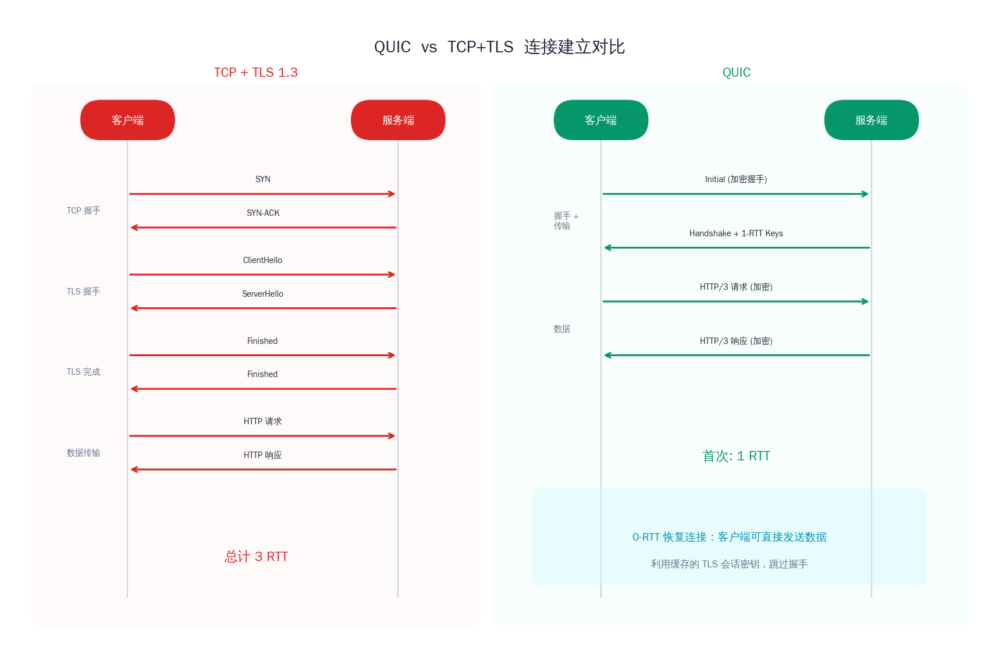
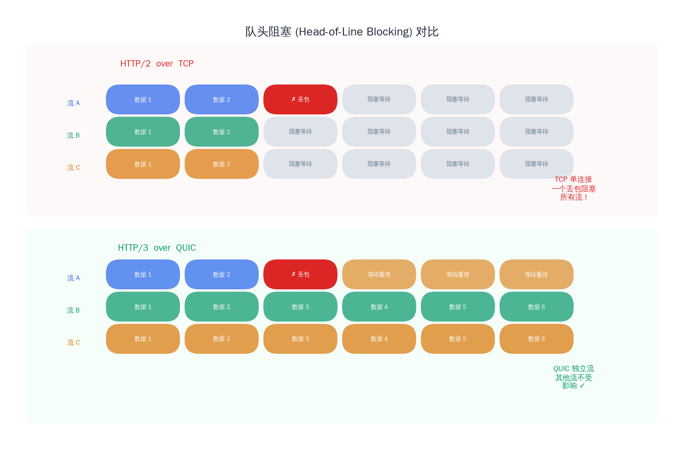
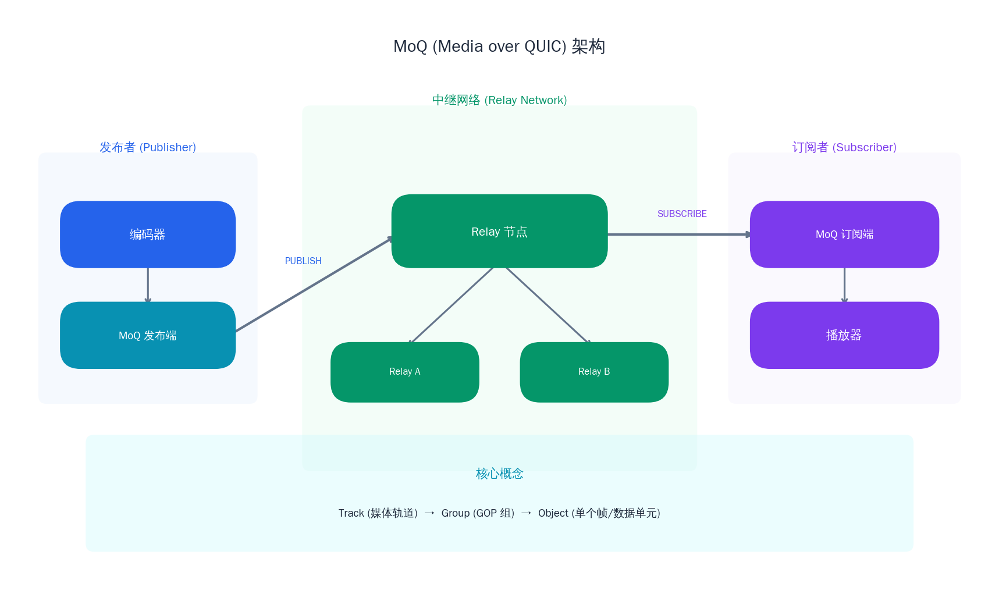

# QUIC/HTTP3 在流媒体中的应用

## 前言

在前几篇文章中，我们学习了 HLS、DASH 这类基于 HTTP 的自适应流媒体协议，以及 SRT 这种基于 UDP 的低延迟传输方案。它们各自解决了流媒体分发链路上的不同痛点，但底层传输层的根本矛盾始终存在——TCP 有队头阻塞，UDP 要自建可靠性。有没有一个传输协议，能兼具两者的优势？

**QUIC** 就是这个问题的答案。它最初由 Google 在 2012 年设计并部署在 Chrome 和 Google 服务之间，经过多年实战验证后，于 2021 年被 IETF 正式标准化为 RFC 9000。如今，QUIC 已成为 HTTP/3 的传输层协议，驱动着全球超过 30% 的 Web 流量。

QUIC 的核心设计理念——0-RTT 快速连接建立、消除队头阻塞、内置加密、连接迁移——天然契合流媒体场景的需求。更令人兴奋的是，IETF 正在基于 QUIC 设计全新的媒体传输协议 **Media over QUIC（MoQ）**，试图统一直播、实时通信和大规模分发的底层传输。

本文将深入剖析 QUIC 的核心特性，分析 HTTP/3 对 HLS/DASH 分发的提升，对比 QUIC 与 TCP 在流媒体场景中的表现，前瞻 MoQ 协议的设计思路，并给出 QUIC 开源库的实践指引。

---

## 1. QUIC 协议核心特性

### 基于 UDP 的传输层协议

QUIC 运行在 UDP 之上，但它绝不是简单的"UDP + 可靠性"。QUIC 在用户态实现了一整套传输层功能：可靠传输、流量控制、拥塞控制、多路复用——本质上是在 UDP 的"白纸"上重新画了一个比 TCP 更现代的传输协议。

选择 UDP 作为底层有两个关键原因：一是绕开操作系统内核中 TCP 协议栈的限制，可以在用户态快速迭代协议逻辑；二是避免了网络中间设备（NAT、防火墙、负载均衡器）对 TCP 的各种"优化"干扰——这些设备往往会篡改 TCP 选项、重置连接或缓存数据，导致新的 TCP 扩展很难被部署。

### 0-RTT / 1-RTT 快速连接建立

TCP + TLS 1.3 建立一个安全连接需要 2-3 个 RTT：TCP 三次握手消耗 1 RTT，TLS 握手再消耗 1-2 RTT。对于短视频场景下频繁的播放请求，每次连接建立都意味着几十到几百毫秒的等待。

QUIC 将传输层握手和加密握手合并为一个过程：

- **首次连接（1-RTT）**：客户端在第一个数据包中同时发送传输层参数和 TLS ClientHello，服务端回复传输层参数和 TLS ServerHello 后即可开始传输数据。整个过程只需 1 个 RTT。
- **恢复连接（0-RTT）**：如果客户端之前连接过该服务端，可以利用缓存的会话信息在第一个数据包中就携带应用数据（如 HTTP 请求），无需等待服务端回复。这就是 0-RTT——用户点击播放的瞬间，请求已经在路上了。



0-RTT 存在重放攻击的风险（攻击者可以重发截获的 0-RTT 数据包），因此只适合幂等请求（如 GET）。对于流媒体场景，segment 的 GET 请求天然是幂等的，非常适合利用 0-RTT 加速。

### 内置 TLS 1.3 加密

QUIC 强制加密所有传输数据，包括大部分传输层头部信息。这不仅提供了隐私保护，还有一个重要的工程效果：中间设备无法解析 QUIC 的传输层语义，也就无法对其进行"善意的干预"。这确保了协议的端到端语义不会被篡改，为协议演进扫清了障碍。

相比之下，TCP 的头部是明文的，运营商和企业网关经常会根据 TCP 序列号、窗口大小等信息做各种优化或限制，这也是 TCP 协议近二十年来几乎无法引入新特性的原因之一。

### 多路流复用（无队头阻塞）

这是 QUIC 对流媒体场景最关键的特性。

HTTP/2 虽然也支持多路复用——多个请求共享一条 TCP 连接，但问题在于 TCP 层并不知道上层有多个独立的流。当 TCP 的某个数据包丢失时，**所有流**的数据都必须等待这个包重传完成后才能交付。一个音频 segment 的丢包，会导致并行下载的视频 segment 也被阻塞——这就是 TCP 层面的队头阻塞。

QUIC 在传输层原生支持多路流（Stream），每个 Stream 有独立的序列号和流控窗口。一个 Stream 上的丢包重传不会影响其他 Stream 的数据交付。这意味着：

- 音频和视频可以走不同的 Stream，互不干扰
- 多个 segment 的并行下载真正实现了独立传输
- 关键帧所在的 Stream 可以优先调度

### 连接迁移（Connection Migration）

TCP 连接由四元组（源 IP、源端口、目的 IP、目的端口）标识。当用户从 Wi-Fi 切换到 4G 时，IP 地址改变，TCP 连接就断了，播放器需要重新建立连接、重新协商——这期间视频会卡顿。

QUIC 用一个 **Connection ID** 来标识连接，与 IP 地址无关。网络切换时，客户端用新的 IP 地址发送包含相同 Connection ID 的数据包，服务端验证通过后继续传输，整个过程对应用层完全透明。对于移动场景下的流媒体播放，这意味着在通勤途中切换基站、进出电梯时，视频可以做到几乎无感恢复。

---

## 2. HTTP/3 与流媒体传输

### HTTP/3 = HTTP over QUIC

HTTP/3 本质上是将 HTTP 语义（请求/响应、头部压缩、服务器推送）映射到 QUIC 的传输模型上。从应用层的视角看，HTTP/3 与 HTTP/2 的 API 几乎相同；但底层从 TCP 换成了 QUIC，带来了质的提升。

HTTP/3 使用 QUIC Stream 替代了 HTTP/2 的 Stream 概念，头部压缩算法从 HPACK 升级为 QPACK（适应 QUIC 的乱序交付特性），并引入了新的帧类型来管理 QUIC 层的流控。

### HTTP/3 对 HLS/DASH 分发的提升

HLS 和 DASH 都是基于 HTTP 的分片传输协议，天然可以受益于 HTTP/3 的升级，无需修改任何应用层逻辑：

**更快的首帧加载**。播放器启动时需要依次完成：DNS 解析 → 建立连接 → 下载 manifest → 下载首个 segment → 解码渲染。在 TCP + TLS 1.3 的方案中，连接建立需要 2 RTT；切换到 QUIC 后，首次连接只需 1 RTT，恢复连接更是 0 RTT。在跨洲际链路（RTT > 100ms）上，这意味着首帧时间缩短 100-300ms——这在用户体验上是显著的。

**更好的弱网表现**。移动网络中丢包率 2-5% 是常态。TCP 在丢包时的队头阻塞会让所有正在下载的 segment 一起停滞；QUIC 的独立 Stream 设计使得单个 segment 的丢包不会影响其他 segment 的下载进度。实测数据表明，在 3% 丢包率下，QUIC 的视频播放卡顿率比 TCP 降低 30% 以上。

**无队头阻塞的 segment 并行下载**。ABR（自适应码率）算法通常会预加载多个 segment 以构建缓冲区。在 HTTP/2 over TCP 的方案中，多路复用的 segment 请求共享一条 TCP 连接，存在队头阻塞风险。HTTP/3 的每个 segment 请求走独立的 QUIC Stream，真正实现了无干扰的并行传输。

### 当前主流 CDN 对 HTTP/3 的支持情况

截至目前，主流 CDN 厂商对 HTTP/3 的支持已趋于成熟：

- **Cloudflare**：全网默认启用 HTTP/3，基于自研的 quiche 库
- **Google Cloud CDN**：全面支持 HTTP/3
- **AWS CloudFront**：2022 年起支持 HTTP/3
- **Akamai**：支持 HTTP/3，可在配置中启用
- **Fastly**：基于自研的 H2O 服务器支持 HTTP/3

浏览器侧，Chrome、Firefox、Safari、Edge 均已默认启用 HTTP/3。客户端通常通过 HTTP 响应头中的 `Alt-Svc`（Alternative Service）字段发现服务端的 HTTP/3 支持，然后在后续请求中自动升级。

---

## 3. QUIC vs TCP 在流媒体场景的对比

### 连接建立延迟

TCP + TLS 1.3 的安全连接需要 2 RTT（TCP 握手 1 RTT + TLS 握手 1 RTT），如果使用 TLS 1.2 则需要 3 RTT。QUIC 首次连接只需 1 RTT，恢复连接可以做到 0-RTT。

对于短视频"刷一刷就划走"的使用模式，每个视频可能对应一次新的 CDN 连接。将连接建立延迟从 2 RTT 降到 1 RTT 甚至 0 RTT，直接影响用户感知到的起播速度。

### 队头阻塞问题

这是 QUIC 相对于 TCP 最显著的优势。TCP 的队头阻塞发生在传输层，HTTP/2 的多路复用无法绕过这个限制。QUIC 通过独立 Stream 的设计彻底消除了这一问题。



在实际的视频播放场景中，播放器同时请求音频和视频 segment。如果视频 segment 的某个包丢失：

- **TCP**：音频 segment 的数据虽然已经到达，但被阻塞在内核缓冲区中等待视频 segment 的重传完成
- **QUIC**：音频 segment 立即交付给应用层，视频 segment 独立等待重传，音频播放不受影响

### 拥塞控制

TCP 的拥塞控制算法（Cubic、BBR 等）在内核中实现，修改需要升级操作系统内核，部署周期以年计。QUIC 的拥塞控制在用户态实现，可以针对不同场景灵活选择和调优算法，部署周期缩短到天级别。

这对流媒体意义重大。视频传输的流量模式有其独特性——周期性的突发（每个 segment 的下载是一次突发传输），长时间的稳态传输，对延迟和带宽的双重敏感。通用的拥塞控制算法未必是最优解，QUIC 让应用开发者可以根据流媒体的流量特征定制拥塞控制策略。

### NAT/防火墙穿越与 UDP 限制

QUIC 基于 UDP，而 UDP 在企业网络中的待遇一直不太好。部分企业防火墙会限制或完全屏蔽非 53 端口的 UDP 流量；某些 NAT 设备对 UDP 的映射超时时间较短（30 秒），需要频繁发送 keep-alive 包来维持映射。

不过，随着 QUIC 的普及，这一状况正在改善。Google 的数据显示，全球范围内 QUIC 连接的成功率已经超过 95%。对于那 5% 的场景，所有 QUIC 实现都内置了 TCP 回退（fallback）机制——当 QUIC 连接失败时自动切换到 HTTP/2 over TCP。

### 综合对比

| 维度 | TCP (HTTP/2) | QUIC (HTTP/3) |
|------|-------------|---------------|
| **连接建立** | 2-3 RTT（TCP + TLS） | 1 RTT / 0-RTT |
| **队头阻塞** | 有（传输层） | 无（独立 Stream） |
| **加密** | 可选（TLS） | 强制（TLS 1.3） |
| **拥塞控制** | 内核态，难以修改 | 用户态，灵活可定制 |
| **连接迁移** | 不支持（四元组绑定） | 支持（Connection ID） |
| **NAT 穿越** | 成熟，广泛支持 | UDP 可能被限制，需 fallback |
| **中间设备兼容** | 完全兼容 | 部分设备可能丢弃 UDP |
| **调试工具** | 成熟（tcpdump、Wireshark 直接解析） | 需要密钥才能解密分析 |
| **CPU 开销** | 较低 | 较高（强制加密 + 用户态处理） |

---

## 4. Media over QUIC（MoQ）协议前瞻

### 背景

HLS/DASH 解决了大规模分发的问题，但延迟在秒级；WebRTC 解决了实时通信的问题，但难以扩展到百万级观众；SRT 专注于 contribution（贡献链路），缺乏 distribution（分发）的标准化方案。流媒体行业一直缺少一个能同时覆盖**低延迟**和**大规模分发**的统一协议。

**Media over QUIC（MoQ）** 正是为此而生。它是 IETF 正在标准化的基于 QUIC 的媒体传输协议（对应工作组为 moq），目标是提供一个适用于直播、实时通信和大规模分发的通用媒体传输层。

### 核心概念

MoQ 的数据模型围绕三个核心抽象构建：

- **Track**：一个命名的媒体流，如"视频轨道-1080p"或"音频轨道-opus"。每个 Track 由发布者（Publisher）创建，订阅者（Subscriber）按需订阅。
- **Group**：Track 内的一组相关数据单元，通常对应一个 GOP（Group of Pictures）。Group 是独立可解码的最小单位，也是 QUIC 流映射和缓存的基本单元。
- **Object**：Group 内的最小数据单元，通常对应一个编码帧。Object 有明确的优先级和依赖关系。

这个三层结构（Track → Group → Object）允许 MoQ 在不同粒度上进行灵活的传输决策：按 Track 订阅、按 Group 缓存和丢弃、按 Object 调度优先级。

### 发布/订阅模型

与 HLS/DASH 的"客户端主动拉取"不同，MoQ 采用**发布/订阅（Pub/Sub）**模型：

1. **发布者**将媒体数据以 Track 的形式发布到 **Relay**（中继节点）
2. **订阅者**向 Relay 订阅感兴趣的 Track
3. Relay 负责将数据从发布者转发到所有订阅者

这个模型天然适合直播场景——一个主播发布，百万观众订阅。Relay 可以级联部署形成树状分发网络，类似 CDN 的架构，但传输延迟远低于 HLS/DASH。



### MoQ vs WebRTC vs HLS 的定位对比

| 维度 | HLS/DASH | WebRTC | MoQ |
|------|----------|--------|-----|
| **延迟** | 3-30 秒 | < 500ms | 目标 < 1 秒 |
| **规模** | 百万级（CDN） | 小规模（P2P/SFU） | 百万级（Relay 级联） |
| **传输模型** | HTTP 拉取 | P2P + SFU 转发 | Pub/Sub |
| **可靠性** | 完全可靠（TCP） | 尽力恢复（RTP/UDP + NACK/FEC） | 可配置（部分可靠） |
| **底层传输** | TCP | UDP/ICE（DTLS-SRTP 加密） | QUIC |
| **适用场景** | 点播、大规模直播 | 视频通话、小规模互动 | 低延迟大规模直播、实时互动 |

MoQ 的一个重要设计特点是**部分可靠传输**：对于实时直播场景，过期的 Group 可以被主动丢弃而不重传，避免了累积延迟。这是 QUIC 的 Stream 机制赋予的能力——发布者可以为每个 Group 创建独立的 QUIC Stream，如果某个 Group 已过时，直接重置（RESET_STREAM）该 Stream 即可。

### 当前标准化进展

MoQ 的核心传输协议 **MoQ Transport（moqt）** 已发布多个 Internet-Draft 版本，目前仍处于积极迭代中。主要参与者包括 Meta（前 Facebook）、Cisco、Akamai、BBC 等。开源实现方面，Meta 的 moxygen、Akamai 的 moq-rs 等项目已可用于原型验证。

需要注意的是，MoQ 仍在标准化过程中，距离生产级部署尚有距离。但其设计理念——基于 QUIC 的 Pub/Sub 媒体分发——代表了流媒体传输协议的演进方向。

---

## 5. 实践指引：QUIC 开源库概览

### 主流 QUIC 实现

如果你想在项目中使用 QUIC，以下是目前最活跃的开源实现：

**quiche（Cloudflare）**

Rust 实现，提供 C API 供 C/C++ 项目调用。Cloudflare 全球 CDN 的 HTTP/3 就基于 quiche 构建。它的 API 设计偏底层，给开发者充分的控制权，适合需要深度定制的场景。

**msquic（Microsoft）**

纯 C 实现，跨平台支持 Windows、Linux、macOS。微软的 Windows Server、.NET、Teams 等产品都在使用。API 设计偏向事件驱动，有完善的文档和示例，对 C++ 开发者比较友好。

**ngtcp2**

纯 C 实现，被 curl 用作 HTTP/3 的传输层。设计精简，依赖少，适合嵌入到现有项目中。

### msquic 使用示例

下面展示使用 msquic 建立 QUIC 连接并发送数据的基本框架：

```cpp
#include <msquic.h>

const QUIC_API_TABLE* MsQuic = nullptr;
HQUIC Registration = nullptr;
HQUIC Configuration = nullptr;

bool InitializeQuic() {
    if (QUIC_FAILED(MsQuicOpen2(&MsQuic))) {
        return false;
    }

    QUIC_REGISTRATION_CONFIG reg_config = { "streaming_app", QUIC_EXECUTION_PROFILE_LOW_LATENCY };
    if (QUIC_FAILED(MsQuic->RegistrationOpen(&reg_config, &Registration))) {
        return false;
    }

    QUIC_SETTINGS settings = {};
    settings.IdleTimeoutMs = 30000;
    settings.IsSet.IdleTimeoutMs = TRUE;
    settings.PeerBidiStreamCount = 128;
    settings.IsSet.PeerBidiStreamCount = TRUE;

    QUIC_BUFFER alpn = { sizeof("h3") - 1, (uint8_t*)"h3" };
    if (QUIC_FAILED(MsQuic->ConfigurationOpen(
            Registration, &alpn, 1, &settings, sizeof(settings),
            nullptr, &Configuration))) {
        return false;
    }

    QUIC_CREDENTIAL_CONFIG cred_config = {};
    cred_config.Type = QUIC_CREDENTIAL_TYPE_NONE;
    cred_config.Flags = QUIC_CREDENTIAL_FLAG_CLIENT |
                        QUIC_CREDENTIAL_FLAG_NO_CERTIFICATE_VALIDATION;
    MsQuic->ConfigurationLoadCredential(Configuration, &cred_config);

    return true;
}
```

msquic 采用回调驱动模型，连接和 Stream 的状态变化通过回调函数通知应用层：

```cpp
QUIC_STATUS StreamCallback(HQUIC Stream, void* Context,
                           QUIC_STREAM_EVENT* Event) {
    switch (Event->Type) {
    case QUIC_STREAM_EVENT_RECEIVE:
        // 收到对端数据
        ProcessReceivedData(Event->RECEIVE.Buffers,
                           Event->RECEIVE.BufferCount);
        break;
    case QUIC_STREAM_EVENT_SEND_COMPLETE:
        // 发送完成，释放缓冲区
        free(Event->SEND_COMPLETE.ClientContext);
        break;
    case QUIC_STREAM_EVENT_PEER_SEND_SHUTDOWN:
        // 对端关闭了发送方向
        break;
    case QUIC_STREAM_EVENT_SHUTDOWN_COMPLETE:
        MsQuic->StreamClose(Stream);
        break;
    }
    return QUIC_STATUS_SUCCESS;
}
```

### 部署 HTTP/3 服务器的基本步骤

如果你的流媒体服务目前基于 Nginx 分发 HLS/DASH，启用 HTTP/3 的步骤如下：

**1. 编译支持 HTTP/3 的 Nginx**

Nginx 从 1.25.0 开始原生支持 HTTP/3（基于 quictls 或 BoringSSL）：

```bash
# 获取依赖
git clone --depth 1 https://github.com/quictls/openssl.git
cd openssl && ./config --prefix=/opt/quictls && make -j$(nproc) && make install && cd ..

# 编译 Nginx
./configure \
    --with-http_v3_module \
    --with-cc-opt="-I/opt/quictls/include" \
    --with-ld-opt="-L/opt/quictls/lib64"
make -j$(nproc) && make install
```

**2. 配置 Nginx**

```nginx
server {
    listen 443 quic reuseport;
    listen 443 ssl;

    ssl_certificate     /path/to/cert.pem;
    ssl_certificate_key /path/to/key.pem;
    ssl_protocols       TLSv1.3;

    add_header Alt-Svc 'h3=":443"; ma=86400';

    location /hls/ {
        root /var/www/media;
        add_header Cache-Control "no-cache";
        types {
            application/vnd.apple.mpegurl m3u8;
            video/mp2t ts;
        }
    }
}
```

关键配置是 `listen 443 quic` 开启 QUIC 监听，以及 `Alt-Svc` 响应头告知客户端可以升级到 HTTP/3。`listen 443 ssl` 保留了 TCP 的 HTTPS 支持，确保不支持 QUIC 的客户端能正常回退。

**3. 开放防火墙 UDP 端口**

```bash
# QUIC 使用 UDP 443 端口
sudo ufw allow 443/udp
```

部署完成后，可以用 curl 验证 HTTP/3 是否生效：

```bash
curl --http3-only -I https://your-server.com/hls/stream.m3u8
```

---

## 6. 挑战与展望

### UDP 在企业网络中的限制

尽管 QUIC 的全球连接成功率已超过 95%，但在某些企业内网、学校网络或特定运营商环境中，UDP 流量仍可能被限速或屏蔽。QUIC 的通用做法是实现 TCP 回退机制，但这会回退到 HTTP/2 的性能水平。长期来看，随着 HTTP/3 流量占比持续增长，网络运营者主动屏蔽 UDP 443 的动机将越来越弱。

### CPU 开销

QUIC 强制使用 TLS 1.3 加密所有数据，且协议栈运行在用户态。相比 TCP（内核态处理 + 可选加密），QUIC 的 CPU 开销更高。Google 的工程实践表明，QUIC 服务端的 CPU 消耗约为 TCP 的 2 倍。对于高带宽的视频分发 CDN 节点，这是不可忽视的成本。

硬件加速（如 Intel QAT 的 AES-GCM 加速、Linux 内核的 UDP GSO/GRO 支持）和协议栈优化（如零拷贝发送）正在缩小这一差距。此外，一些 QUIC 实现（如 msquic）正在探索将部分 QUIC 处理下沉到内核态以提升性能。

### 调试工具链

TCP 的调试生态非常成熟——tcpdump 抓包、Wireshark 直接解析每个字段。QUIC 由于强制加密，Wireshark 需要导入 TLS 密钥日志文件（通过 `SSLKEYLOGFILE` 环境变量导出）才能解密分析。此外，QUIC 的 qlog 日志格式正在标准化中，配合 qvis 等可视化工具可以分析连接级别的传输行为，但整体工具链的成熟度仍不及 TCP。

```bash
# 导出密钥日志以配合 Wireshark 解密 QUIC
export SSLKEYLOGFILE=/tmp/quic_keys.log
```

### 流媒体场景的特殊需求

标准的 QUIC 提供完全可靠的传输语义，但流媒体场景有独特的需求：

- **部分可靠传输**：过期的视频帧不值得重传，应用层需要能主动放弃某些数据。QUIC 的 RESET_STREAM 和 STOP_SENDING 机制提供了基础能力，MoQ 正在此之上构建更精细的策略。
- **优先级调度**：关键帧（I 帧）应该优先于参考帧（P/B 帧）传输，音频应该优先于视频（人对音频中断更敏感）。QUIC 支持 Stream 优先级，但如何将媒体语义映射到传输优先级仍是活跃的研究领域。
- **拥塞控制定制**：视频流的流量模式与 Web 页面加载截然不同，通用的拥塞控制算法未必最优。QUIC 的用户态实现使得开发者可以为流媒体场景量身定制拥塞控制算法。

---

## 总结

QUIC 不仅仅是"更快的 TCP"，它是传输层协议的一次范式转移。本文的核心要点回顾：

- **QUIC 的核心特性**——0-RTT 连接建立、消除队头阻塞、连接迁移、内置加密——每一项都精准命中了流媒体传输的痛点
- **HTTP/3** 让 HLS/DASH 无需修改应用逻辑即可获得更快的首帧加载、更好的弱网表现和真正的并行下载
- **QUIC vs TCP** 在流媒体场景中优势明显，但 UDP 限制、CPU 开销和调试工具链仍是需要面对的挑战
- **MoQ 协议**代表了下一代流媒体传输的方向——基于 QUIC 的 Pub/Sub 模型，有望统一低延迟和大规模分发
- **实践层面**，msquic、quiche、ngtcp2 等开源库已可用于生产，Nginx 1.25+ 原生支持 HTTP/3 部署

QUIC 和 MoQ 正在重塑流媒体传输的技术格局。作为流媒体开发者，现在是学习和实验这些技术的最佳时机——当 MoQ 正式标准化并大规模部署时，提前积累的认知将成为巨大的竞争优势。

下一篇文章，我们将进入 **WebRTC 技术体系**，从信令设计到拥塞控制，全面剖析这个端到端实时通信框架的架构与实践。
