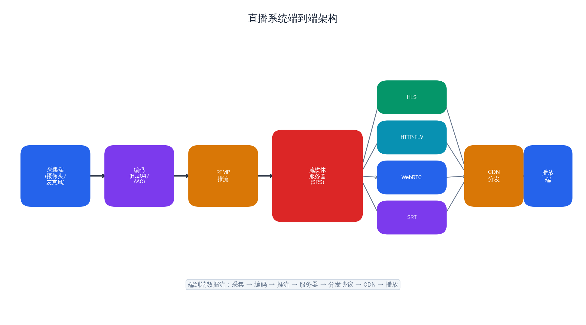
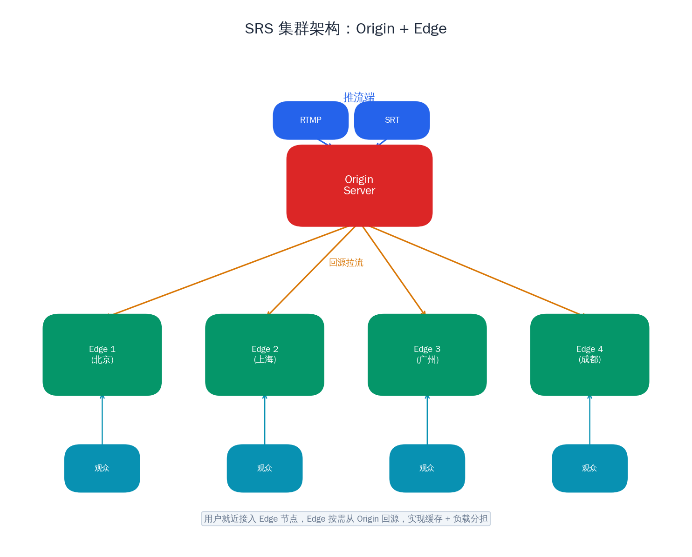

# 实战：构建一套完整的直播系统

## 前言

经过前面十九篇文章的学习，我们从最底层的 Socket 编程出发，逐步掌握了 I/O 多路复用、RTP/RTCP、RTMP、HLS、SRT、WebRTC 等一系列流媒体核心技术。每一种技术都像一块拼图，而直播系统就是把所有拼图组合在一起的那幅完整画面。

直播系统是流媒体技术的集大成应用。一场直播的背后，涉及音视频采集与编码、RTMP 推流、服务端转封装与分发、CDN 边缘加速、多协议拉流播放，以及录制、转码、鉴权、监控等一系列工程问题。理解这些环节如何协同工作，是从"学会协议"到"做出产品"的关键一步。

本文的目标是：**理解直播系统的整体架构，并基于 SRS（Simple Realtime Server）搭建一套完整的推流—分发—播放链路**。我们不会停留在理论层面，而是给出每一步可执行的命令和配置，让你在一台 Linux 机器上就能跑通完整的直播流程。

---

## 1. 直播系统架构设计

### 端到端的数据流

一场直播从主播端到观众端，数据经历了完整的处理链路：

```
采集 → 编码 → 推流 → 流媒体服务器 → 分发 → 拉流 → 解码 → 渲染
```

- **采集**：摄像头采集视频帧（YUV/NV12），麦克风采集音频采样（PCM）
- **编码**：视频编码为 H.264/H.265，音频编码为 AAC/Opus，压缩比通常在 100:1 以上
- **推流**：将编码后的音视频数据通过 RTMP/SRT 等协议发送到流媒体服务器
- **服务器处理**：接收推流、转封装（RTMP → HLS/HTTP-FLV）、可选转码
- **分发**：通过 CDN 或边缘节点将流分发到离观众最近的位置
- **拉流**：播放器通过 HLS/HTTP-FLV/WebRTC 等协议从分发节点获取数据
- **解码与渲染**：解码还原为原始帧，交给显示器和扬声器输出

### 核心组件

一个可用的直播系统至少包含四个核心组件：

**推流端**：负责采集、编码和推流。可以是 OBS Studio、FFmpeg、手机 App，或者自研的采集 SDK。推流端的核心指标是编码质量和推流稳定性。

**流媒体服务器**：直播系统的中枢。接收推流、做协议转换、管理流的生命周期。SRS、Nginx-RTMP、MediaMTX 都是常见的选择。

**CDN / 分发层**：将流从源站分发到全球各地的边缘节点，降低观众端的拉流延迟。小规模场景下可以用 SRS 自身的 Edge 节点替代。

**播放端**：拉取直播流并播放。可以是 VLC、FFplay 等桌面播放器，也可以是集成了 flv.js / hls.js 的 Web 页面，或者移动端 App。



### 协议选型

不同环节对协议的需求不同，典型选型如下：

| 环节 | 协议 | 理由 |
|------|------|------|
| 推流 | RTMP | 生态最成熟，OBS/FFmpeg 原生支持，CDN 接入方便 |
| 推流（弱网） | SRT | 内置 ARQ 重传，弱网表现远优于 RTMP |
| 分发（兼容性优先） | HLS | 所有浏览器和移动端原生支持，CDN 友好 |
| 分发（低延迟优先） | HTTP-FLV | 延迟 1~3 秒，比 HLS 低一个量级 |
| 分发（超低延迟） | WebRTC | 延迟可控制在 500ms 以内，适合连麦互动 |

实际工程中，一个流媒体服务器通常同时输出多种协议，由播放端根据场景选择最合适的拉流方式。

---

## 2. 基于 SRS 搭建流媒体服务集群

### SRS 简介

SRS（Simple Realtime Server）是一个开源的流媒体服务器，由国人开发，在国内直播行业有着广泛的应用。它的核心优势在于：

- **协议覆盖全**：支持 RTMP、HLS、HTTP-FLV、WebRTC（WHIP/WHEP）、SRT、GB28181
- **高性能**：单进程异步架构，单核可承载数千路并发
- **易部署**：提供官方 Docker 镜像，一条命令即可启动
- **配置简洁**：配置文件语法清晰，功能模块化

### Docker 快速部署

最快的方式是用 Docker 一键启动：

```bash
docker run --rm -it \
  -p 1935:1935 \
  -p 1985:1985 \
  -p 8080:8080 \
  -p 8000:8000/udp \
  registry.cn-hangzhou.aliyuncs.com/ossrs/srs:5 \
  ./objs/srs -c conf/docker.conf
```

端口说明：

| 端口 | 协议 | 用途 |
|------|------|------|
| 1935 | TCP | RTMP 推流/拉流 |
| 1985 | TCP | SRS HTTP API |
| 8080 | TCP | HTTP-FLV 拉流、HLS 拉流、SRS 控制台 |
| 8000 | UDP | WebRTC (WHIP/WHEP) |

启动成功后，访问 `http://<服务器IP>:8080` 即可看到 SRS 控制台。

### SRS 配置文件详解

SRS 默认的 `docker.conf` 已经启用了主要功能，但在生产环境中我们通常需要自定义配置。下面是一份覆盖核心功能的配置文件：

```nginx
listen              1935;
max_connections     1000;
daemon              off;
srs_log_tank        console;

http_api {
    enabled         on;
    listen          1985;
}

http_server {
    enabled         on;
    listen          8080;
    dir             ./objs/nginx/html;
}

rtc_server {
    enabled         on;
    listen          8000;
    candidate       $CANDIDATE;
}

vhost __defaultVhost__ {
    # HLS 输出配置
    hls {
        enabled         on;
        hls_fragment    2;       # 每个 TS 切片时长（秒）
        hls_window      10;      # M3U8 播放列表窗口（秒）
        hls_path        ./objs/nginx/html;
        hls_m3u8_file   [app]/[stream].m3u8;
        hls_ts_file     [app]/[stream]-[seq].ts;
    }

    # HTTP-FLV 输出配置
    http_remux {
        enabled     on;
        mount       [vhost]/[app]/[stream].flv;
    }

    # WebRTC 输出配置
    rtc {
        enabled     on;
        rtmp_to_rtc on;      # RTMP 推流自动转为 WebRTC
        rtc_to_rtmp on;      # WebRTC 推流自动转为 RTMP
    }
}
```

**关键参数解读**：

- `hls_fragment`：控制 TS 切片时长，值越小延迟越低，但切片数量越多、CDN 压力越大。直播场景通常设 2~6 秒。
- `hls_window`：M3U8 列表中保留的总时长，一般设为 `hls_fragment` 的 3~5 倍。
- `candidate`：WebRTC 的 ICE Candidate 地址，必须设为服务器的公网 IP，否则浏览器无法建立连接。
- `rtmp_to_rtc`：开启后，通过 RTMP 推上来的流可以直接用 WebRTC 拉取，无需重新推流。

### 单节点部署与测试

如果不想用 Docker，也可以从源码编译部署：

```bash
git clone https://github.com/ossrs/srs.git
cd srs/trunk
./configure
make -j$(nproc)

# 启动
./objs/srs -c conf/srs.conf
```

验证服务是否正常运行：

```bash
# 检查 RTMP 端口
curl http://localhost:1985/api/v1/versions

# 预期输出类似：
# {"code":0,"server":"vid-xxxxx","data":{"major":5,...}}
```

---

## 3. 推流实战

### 使用 OBS 推流

OBS Studio 是最流行的直播推流工具，配置步骤如下：

1. 打开 OBS → 设置 → 直播
2. 服务选择"自定义"
3. 服务器填写：`rtmp://<服务器IP>/live`
4. 推流码填写：`stream01`（即流名称）
5. 输出设置中调整编码参数：
   - 编码器：x264 或硬件编码（NVENC）
   - 码率：2500~4000 Kbps（1080p）
   - 关键帧间隔：2 秒
6. 点击"开始直播"

### 使用 FFmpeg 推流

对于服务端场景或自动化测试，FFmpeg 是更灵活的选择。

**推摄像头 + 麦克风**：

```bash
ffmpeg -f v4l2 -i /dev/video0 \
       -f alsa -i default \
       -c:v libx264 -preset veryfast -tune zerolatency \
       -c:a aac -ar 44100 -b:a 128k \
       -f flv rtmp://localhost/live/camera
```

**推本地文件循环播放**（模拟 24 小时直播源）：

```bash
ffmpeg -re -stream_loop -1 -i test_video.mp4 \
       -c copy \
       -f flv rtmp://localhost/live/loop
```

`-re` 参数让 FFmpeg 按照文件的原始帧率读取，而不是全速读取，否则会一瞬间把整个文件推完。`-stream_loop -1` 表示无限循环。

**推桌面录屏**：

```bash
ffmpeg -f x11grab -framerate 30 -video_size 1920x1080 -i :0.0 \
       -f pulse -i default \
       -c:v libx264 -preset ultrafast -tune zerolatency -b:v 3000k \
       -c:a aac -b:a 128k \
       -f flv rtmp://localhost/live/desktop
```

### 推流参数优化

推流质量直接决定观众端的观看体验，以下几个参数需要重点关注：

**码率**：码率决定了画面质量的上限。参考值：

| 分辨率 | 帧率 | 推荐码率 |
|--------|------|----------|
| 720p | 30fps | 1500~2500 Kbps |
| 1080p | 30fps | 3000~5000 Kbps |
| 1080p | 60fps | 4500~6000 Kbps |

**关键帧间隔（GOP）**：建议设为 2 秒。GOP 太大会导致播放器首帧加载慢（必须等到下一个关键帧才能开始解码）；GOP 太小会降低压缩效率。HLS 切片通常以关键帧为边界，所以 GOP 应该是 `hls_fragment` 的因数。

**编码预设**：x264 的 `-preset` 参数控制编码速度与质量的平衡。直播场景推荐 `veryfast` 或 `ultrafast`——编码延迟比压缩效率更重要。`-tune zerolatency` 可以禁用 B 帧和减少前瞻帧数，进一步降低编码延迟。

---

## 4. 拉流与播放

### FFplay / VLC 拉流测试

在调试阶段，用命令行工具快速验证流是否正常：

```bash
# RTMP 拉流
ffplay rtmp://localhost/live/stream01

# HTTP-FLV 拉流
ffplay http://localhost:8080/live/stream01.flv

# HLS 拉流
ffplay http://localhost:8080/live/stream01.m3u8
```

VLC 同样支持这些地址，直接在"打开网络串流"中输入即可。

### 浏览器播放

浏览器端播放是直播系统的核心场景。根据协议不同，需要使用不同的 JavaScript 库。

**flv.js 播放 HTTP-FLV**：

```html
<video id="player" controls autoplay muted></video>
<script src="https://cdn.jsdelivr.net/npm/flv.js@latest/dist/flv.min.js"></script>
<script>
if (flvjs.isSupported()) {
    const player = flvjs.createPlayer({
        type: 'flv',
        url: 'http://localhost:8080/live/stream01.flv',
        isLive: true
    });
    player.attachMediaElement(document.getElementById('player'));
    player.load();
    player.play();
}
</script>
```

flv.js 通过 `fetch`（Streaming Response）或 `XMLHttpRequest` 接收 HTTP-FLV 数据，在浏览器端解封装为 fMP4，然后通过 MSE（Media Source Extensions）送入 `<video>` 标签播放。延迟通常在 1~3 秒。

**hls.js 播放 HLS**：

```html
<video id="player" controls autoplay muted></video>
<script src="https://cdn.jsdelivr.net/npm/hls.js@latest"></script>
<script>
if (Hls.isSupported()) {
    const hls = new Hls({
        liveSyncDurationCount: 3,
        liveMaxLatencyDurationCount: 6
    });
    hls.loadSource('http://localhost:8080/live/stream01.m3u8');
    hls.attachMedia(document.getElementById('player'));
}
</script>
```

HLS 的延迟取决于切片策略，通常在 6~15 秒。`liveSyncDurationCount` 控制播放器追赶直播边缘的积极程度。

**WebRTC 播放（SRS WHEP）**：

SRS 5.0+ 支持 WHEP（WebRTC-HTTP Egress Protocol），可以用标准的 WebRTC API 拉流：

```javascript
const pc = new RTCPeerConnection();
pc.addTransceiver('video', { direction: 'recvonly' });
pc.addTransceiver('audio', { direction: 'recvonly' });

pc.ontrack = (event) => {
    document.getElementById('player').srcObject = event.streams[0];
};

const offer = await pc.createOffer();
await pc.setLocalDescription(offer);

const response = await fetch('http://localhost:1985/rtc/v1/whep/?app=live&stream=stream01', {
    method: 'POST',
    headers: { 'Content-Type': 'application/sdp' },
    body: offer.sdp
});

const answerSdp = await response.text();
await pc.setRemoteDescription(new RTCSessionDescription({
    type: 'answer',
    sdp: answerSdp
}));
```

WebRTC 的端到端延迟可以控制在 200~500ms，是目前延迟最低的浏览器播放方案。

### 各方式延迟对比

| 拉流方式 | 典型延迟 | 兼容性 | 适用场景 |
|----------|----------|--------|----------|
| RTMP | 1~3s | 需要 Flash（已淘汰） | 仅用于推流 |
| HTTP-FLV | 1~3s | 需要 flv.js + MSE | 秀场直播、游戏直播 |
| HLS | 6~15s | 原生支持，兼容性最佳 | 大规模分发、点播回放 |
| WebRTC | 0.2~0.5s | 现代浏览器原生支持 | 连麦互动、实时竞拍 |

选择拉流方式时，需要在延迟、兼容性和规模之间权衡。大多数直播平台会同时提供 HTTP-FLV（给 PC 端）和 HLS（给移动端）两种拉流地址。

---

## 5. 扩展功能

一个生产可用的直播系统不止"能播"这么简单，还需要录制、转码、截图、鉴权等配套能力。SRS 对这些功能都有原生支持。

### 录制

将直播流录制为文件，用于回放或归档：

```nginx
vhost __defaultVhost__ {
    dvr {
        enabled         on;
        dvr_path        ./objs/nginx/html/[app]/[stream].[timestamp].flv;
        dvr_plan        session;    # 一次推流录制为一个文件
        dvr_duration    0;          # 不限制单文件时长
    }
}
```

`dvr_plan` 支持两种模式：`session` 表示一次推流生成一个文件；`segment` 表示按固定时长切割。如果需要录制为 MP4 格式，可以在录制结束后用 FFmpeg 转封装：

```bash
ffmpeg -i record.flv -c copy record.mp4
```

### 转码

将高码率的原始流转码为多个码率版本，适应不同观众的网络条件：

```nginx
vhost __defaultVhost__ {
    transcode {
        enabled     on;
        ffmpeg      ./objs/ffmpeg/bin/ffmpeg;

        engine sd {
            enabled         on;
            vfilter {
                v           quiet;
            }
            vcodec          libx264;
            vbitrate        800;
            vfps            25;
            vwidth          854;
            vheight         480;
            vthreads        2;
            vprofile        baseline;
            vpreset         superfast;
            acodec          aac;
            abitrate        64;
            asample_rate    44100;
            achannels       2;
            output          rtmp://127.0.0.1:[port]/[app]?vhost=[vhost]/[stream]_sd;
        }
    }
}
```

转码后的流以 `[stream]_sd` 为名发布，播放端可以根据网络状况选择不同码率的流。转码是 CPU 密集型操作，生产环境中通常单独部署转码服务器，或使用 GPU 加速（NVENC/QSV）。

### 截图

定时截取直播画面，用于生成封面、审核内容：

SRS 本身不内置截图功能，但可以通过 HTTP 回调 + FFmpeg 实现：

```bash
# 从直播流截取一帧
ffmpeg -i rtmp://localhost/live/stream01 \
       -vframes 1 -q:v 2 \
       -y /tmp/snapshot_stream01.jpg
```

在生产环境中，通常用定时任务或在收到 `on_publish` 回调后启动截图进程。

### 回调通知

SRS 支持在流的生命周期事件中发送 HTTP 回调，让业务系统感知推流状态：

```nginx
vhost __defaultVhost__ {
    http_hooks {
        enabled         on;
        on_connect      http://your-api-server/api/srs/on_connect;
        on_publish      http://your-api-server/api/srs/on_publish;
        on_unpublish    http://your-api-server/api/srs/on_unpublish;
        on_play         http://your-api-server/api/srs/on_play;
        on_stop         http://your-api-server/api/srs/on_stop;
    }
}
```

回调请求体是 JSON 格式，包含 `app`、`stream`、`client_id`、`ip` 等信息。业务服务器可以在 `on_publish` 回调中做推流鉴权：返回 HTTP 200 允许推流，返回非 200 则 SRS 会断开连接。

### 鉴权

防止未授权的用户推流是直播系统的基本安全需求。常用方案是在推流 URL 中携带签名参数：

```
rtmp://server/live/stream01?token=abc123&expire=1735689600
```

业务服务器在 `on_publish` 回调中验证 `token` 和 `expire`，通过则放行，否则拒绝。鉴权逻辑完全由业务方控制，SRS 只负责转发回调和执行结果。

典型的鉴权逻辑（业务服务器端）：

```python
@app.post("/api/srs/on_publish")
def on_publish(request):
    params = parse_qs(request.json.get("param", ""))
    token = params.get("token", [None])[0]
    expire = int(params.get("expire", [0])[0])

    if not token or time.time() > expire:
        return {"code": 1}  # 拒绝推流

    expected = hmac_sha256(secret_key, f"{request.json['stream']}:{expire}")
    if not hmac.compare_digest(token, expected):
        return {"code": 1}  # 签名不匹配

    return {"code": 0}  # 允许推流
```

---

## 6. 集群与高可用

单节点的 SRS 能承载数千路并发，但对于大规模直播场景，我们需要集群架构来解决容量和可用性问题。

### SRS 的 Edge-Origin 架构

SRS 原生支持 Origin-Edge 集群模式，架构思路很清晰：

- **Origin（源站）**：接收推流，是流数据的唯一来源
- **Edge（边缘节点）**：不接收推流，当有观众拉流时自动回源拉取，然后本地分发

这种架构的优势在于：边缘节点数量可以水平扩展，每增加一个 Edge 就能支撑更多的并发观众，而源站的压力始终等于"流的数量"而不是"观众的数量"。

**Origin 配置**：

```nginx
listen              1935;
max_connections     1000;
daemon              off;

vhost __defaultVhost__ {
    hls {
        enabled     on;
    }
    http_remux {
        enabled     on;
    }
}
```

**Edge 配置**：

```nginx
listen              1935;
max_connections     5000;
daemon              off;

vhost __defaultVhost__ {
    cluster {
        mode        remote;
        origin      192.168.1.100:1935;  # 指向 Origin 地址
    }
}
```

当观众请求 Edge 上某条流时，Edge 发现本地没有该流，就会自动从 Origin 回源拉取，后续的观众请求都由 Edge 本地分发，不再回源。



### 多节点分发

实际部署中，通常是 1 个 Origin + N 个 Edge 的拓扑：

```
                    ┌──── Edge-1 (北京)  ── 观众群A
                    │
推流端 → Origin ────┼──── Edge-2 (上海)  ── 观众群B
                    │
                    └──── Edge-3 (广州)  ── 观众群C
```

Edge 节点的部署位置要贴近观众，这和 CDN 的思路一致。如果你的直播系统接入了商业 CDN（如阿里云、腾讯云），那么 CDN 本身就充当了 Edge 的角色，SRS Origin 只需要对接 CDN 的回源协议即可。

### 负载均衡策略

多个 Edge 节点之间需要负载均衡来分配观众请求。常见方案：

**DNS 轮询**：最简单的方式，为直播域名配置多个 A 记录，由 DNS 轮询分配。缺点是无法感知节点健康状态。

**HTTP 302 调度**：播放端先请求调度服务，调度服务根据观众地理位置、节点负载等信息返回最优的 Edge 地址。这是大型直播平台的主流方案。

**Nginx/HAProxy 反向代理**：在 Edge 前面加一层四层或七层代理，支持健康检查和加权轮询。适合中小规模部署。

```nginx
# Nginx stream 模块做 RTMP 负载均衡
stream {
    upstream srs_edges {
        server 192.168.1.101:1935 weight=5;
        server 192.168.1.102:1935 weight=3;
        server 192.168.1.103:1935 weight=2;
    }

    server {
        listen 1935;
        proxy_pass srs_edges;
    }
}
```

### 监控与告警

集群规模大了，监控是运维的生命线。SRS 提供了丰富的 HTTP API，可以方便地对接 Prometheus + Grafana 监控体系。

SRS 内置的 Exporter 接口：

```bash
# 查询服务器概要信息
curl http://localhost:1985/api/v1/summaries

# 查询所有在线流
curl http://localhost:1985/api/v1/streams

# 查询所有客户端连接
curl http://localhost:1985/api/v1/clients
```

配合 Prometheus 的 `srs-exporter`，可以采集以下关键指标并配置告警规则：

| 指标 | 含义 | 告警阈值建议 |
|------|------|-------------|
| srs_streams_count | 在线流数量 | 突降到 0 时告警 |
| srs_clients_count | 连接客户端数 | 超过容量 80% 时告警 |
| srs_bandwidth_kbps | 总带宽 | 接近出口带宽上限时告警 |
| srs_cpu_percent | CPU 使用率 | 超过 70% 时告警 |

---

## 7. 监控与运维

### SRS 控制台

SRS 自带一个 Web 控制台，访问 `http://<服务器IP>:8080` 即可使用。控制台提供了以下功能：

- **流列表**：查看当前所有正在推送的流，包括流名称、编码信息、码率、在线时长
- **在线播放**：直接在页面上播放 HTTP-FLV / HLS / WebRTC 流
- **客户端列表**：查看所有连接的推流端和播放端
- **服务器信息**：CPU、内存、网络带宽等系统指标

控制台适合开发调试阶段使用。生产环境建议通过 API 对接到统一的运维平台。

### 关键指标监控

日常运维中需要关注的核心指标：

**流级别指标**：
- 推流码率是否稳定（波动过大说明推流端网络不稳定）
- 视频帧率是否正常（帧率下降可能是编码器过载）
- 音视频时间戳是否同步（不同步会导致音画不一致）
- GOP 是否符合预期（影响 HLS 切片和首帧加载时间）

**服务器级别指标**：
- CPU 使用率（转码场景下尤其关键）
- 内存使用（HLS 切片会产生大量临时文件）
- 网络带宽（出方向带宽 = 在线流数 × 平均码率 × 观众数）
- 磁盘 I/O（录制和 HLS 切片会写磁盘）

### 常见故障排查

**推流失败**：
1. 检查 RTMP 端口（1935）是否可达：`telnet <server> 1935`
2. 查看 SRS 日志是否有连接记录
3. 确认推流地址格式正确：`rtmp://host/app/stream`
4. 如果使用了鉴权，检查回调服务是否正常响应

**播放卡顿**：
1. 用 `curl` 直接访问 HTTP-FLV 地址，确认服务端输出正常
2. 检查推流端码率是否超过观众带宽
3. 检查 Edge 到 Origin 的回源链路是否畅通
4. 查看服务器 CPU/带宽是否已达瓶颈

**HLS 延迟过高**：
1. 减小 `hls_fragment` 到 2 秒
2. 确认推流端的 GOP 与 `hls_fragment` 对齐
3. 检查播放端的 `liveSyncDurationCount` 配置
4. 考虑切换到 HTTP-FLV 或 WebRTC 以获得更低延迟

**WebRTC 无法播放**：
1. 确认 `rtc_server.candidate` 设置为正确的公网 IP
2. 检查 UDP 8000 端口是否开放（安全组/防火墙）
3. 浏览器控制台查看 ICE 连接状态
4. 确认推流端已在推流（WebRTC 拉流要求流已存在）

**音画不同步**：
1. 检查推流端的音视频时间戳是否正确
2. 确认编码器没有引入异常延迟
3. 如果用 FFmpeg 推流，添加 `-async 1` 参数尝试修正

---

## 总结

本文从架构设计出发，完整走通了一个直播系统从搭建到运维的全流程：

- **架构层面**：理解了推流端 → 流媒体服务器 → CDN → 播放端的端到端数据流，以及各环节的协议选型依据
- **单节点**：基于 SRS + Docker 快速搭建了支持 RTMP 推流、HLS/HTTP-FLV/WebRTC 多协议分发的流媒体服务
- **推流端**：掌握了 OBS 和 FFmpeg 两种推流方式，以及码率、GOP、编码预设等关键参数的调优方法
- **播放端**：实现了 flv.js、hls.js、WebRTC 三种浏览器播放方案，理解了各方案的延迟特性
- **扩展功能**：配置了录制、转码、截图、回调通知和鉴权等生产必备功能
- **集群架构**：通过 SRS 的 Origin-Edge 模式实现了水平扩展，配合负载均衡和监控体系保障高可用

从单节点到集群的演进路径是渐进的：先在单节点上跑通全部功能，确认推流和播放都正常；然后加入 Edge 节点做分发扩展；最后接入监控和告警体系。不要一开始就追求复杂的集群架构，先让数据流动起来。

下一篇文章，我们将把目光从"一对多"的直播场景转向"多对多"的 **多人视频会议系统**。我们会深入 SFU 架构（Selective Forwarding Unit），基于 Janus Gateway 搭建一个支持多人实时通话的会议服务，探讨 Simulcast、弱网对抗等核心工程问题。
