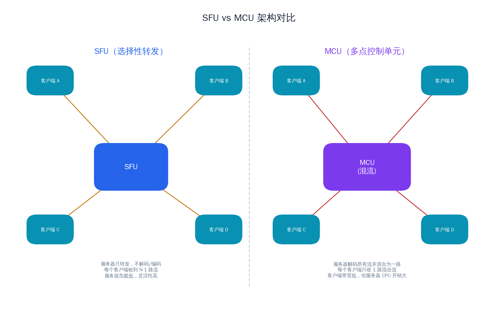
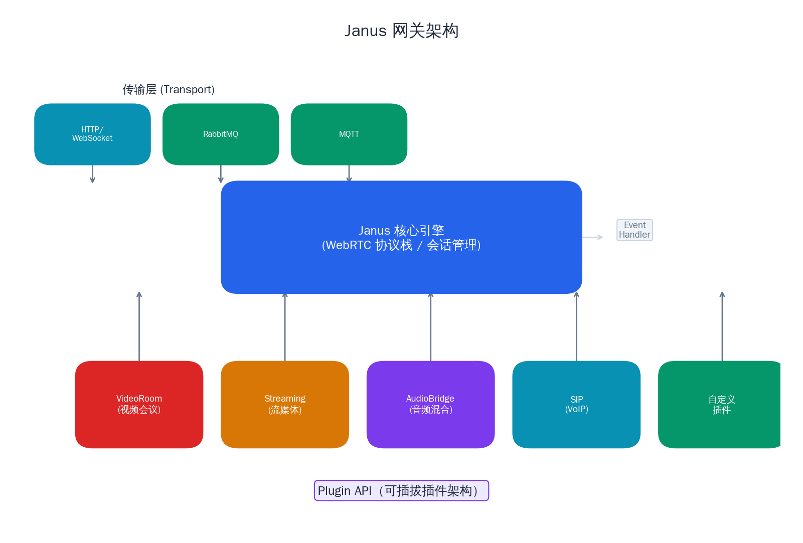
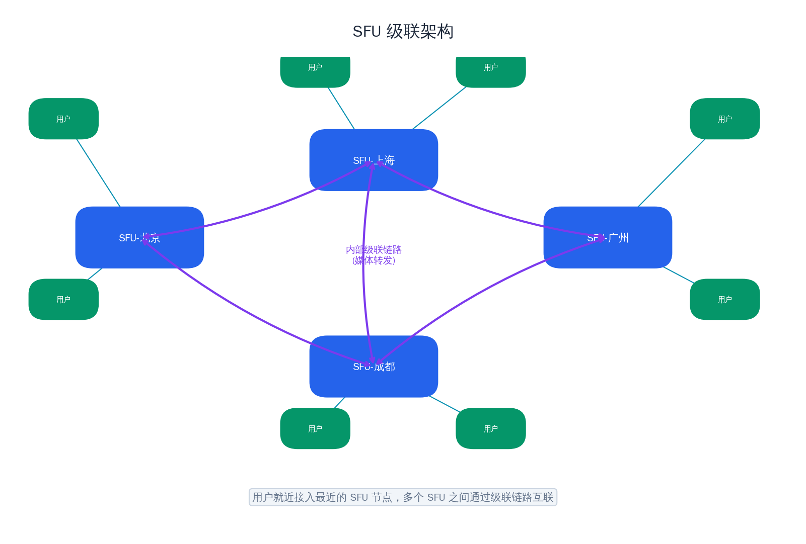

# 实战：多人视频会议系统

## 前言

上一篇文章中，我们基于 SRS 搭建了一套完整的直播系统，跑通了从推流到播放的全链路。直播本质上是"一对多"的单向媒体分发——一个主播推流，成千上万的观众拉流观看。然而，当我们把场景从直播切换到视频会议，问题的性质就发生了根本变化。

多人视频会议是"多对多"的双向实时通信。每个参与者既是发送端也是接收端，所有人的音视频数据需要在 200ms 以内到达其他每一位参与者。与直播相比，视频会议面临的核心挑战完全不同：**媒体如何路由？带宽如何分配？系统如何随参与人数扩展？**

这些问题催生了 SFU、MCU 等服务端媒体架构，也让多人视频会议成为 WebRTC 技术栈中最具工程复杂度的应用场景之一。

本文的目标是：**理解 SFU/MCU 架构的原理与取舍，基于 Janus WebRTC Server 搭建一套可运行的多人视频会议系统**，并深入讨论弱网对抗、质量优化、级联扩展等生产环境中必然面对的关键问题。

---

## 1. SFU vs MCU 架构对比

当参与者超过两人时，最直觉的方案是让每个人都与其他所有人建立 P2P 连接。但稍加分析就会发现，这种方案在规模上完全不可行。于是，"服务器中转"成为必然选择，而中转的方式又分为两条截然不同的路线。

### Mesh：P2P 的天然延伸

Mesh 架构让每个参与者与其他所有人建立直连的 PeerConnection。在 3 人会议中，每人需要维护 2 条连接；4 人则需要 3 条。总连接数为 N×(N-1)/2，每人的上行和下行带宽都是 (N-1) 倍。

```
连接数 = N × (N-1) / 2
每人上行 = (N-1) × 单路码率
每人下行 = (N-1) × 单路码率
```

当 N=4 时，总连接数是 6，每人的上下行都是 3 倍码率。当 N=8 时，总连接数暴增到 28，任何家用网络都无法承受。Mesh 的优点是不需要任何服务器基础设施，但它只适合 2~3 人的小规模通话。

### MCU：服务器混流

MCU（Multipoint Control Unit）是传统电信会议系统的主流方案。服务器接收所有参与者的音视频流，将视频解码后混合成一路画面（比如宫格布局），音频混音后输出一路音频，再编码分发给每个参与者。

**对客户端的好处是显而易见的**：无论会议中有多少人，每个客户端只需发送一路上行、接收一路下行。带宽开销恒定，终端设备的压力极小，非常适合弱终端（如老旧手机、SIP 硬件话机）。

**但代价全部转嫁给了服务器**。MCU 需要对每一路输入流做解码，然后在像素级别进行视频合成和音频混音，最后重新编码输出。这个"解码→合成→编码"的流水线对 CPU 的消耗极大，而且布局是服务端决定的，客户端无法灵活选择观看哪些人、以什么分辨率观看。

### SFU：只转发，不混流

SFU（Selective Forwarding Unit）走了一条完全不同的路线：**服务器只负责转发媒体包，不做任何解码、混合或编码操作**。每个参与者将自己的音视频流发给 SFU，SFU 再将这些流按需转发给其他参与者。

```
每人上行 = 1 路（发给 SFU）
每人下行 = (N-1) 路（从 SFU 接收其他人的流）
服务器带宽 = N × (N-1) × 单路码率
```

SFU 不碰媒体内容，只做路由层面的转发，因此服务器的 CPU 开销极低——本质上是一个媒体数据包的路由器。同时，由于每路流独立存在，客户端可以自由决定订阅哪些流、以什么质量接收，灵活性远超 MCU。



### 为什么 SFU 是当前的主流方案

三种架构的对比总结如下：

| 特性 | Mesh | MCU | SFU |
|------|------|-----|-----|
| 服务器需求 | 无 | 高（解码+混合+编码） | 低（仅转发） |
| 客户端上行 | (N-1) 路 | 1 路 | 1 路 |
| 客户端下行 | (N-1) 路 | 1 路 | (N-1) 路 |
| 布局灵活性 | 客户端自定 | 服务端固定 | 客户端自定 |
| 延迟 | 最低 | 较高（混流引入延迟） | 低 |
| 适用规模 | 2~3 人 | 任意 | 数十人 |

在实际工程中，SFU 凭借**低服务器开销、低延迟、高灵活性**的优势，成为了 Google Meet、Zoom、腾讯会议等几乎所有现代视频会议系统的核心架构。客户端下行带宽随人数增长的问题，则通过 Simulcast 和 SVC 技术来缓解——SFU 可以根据每个接收端的网络状况，选择性地转发不同质量的流。

---

## 2. SFU 核心技术

SFU 不仅仅是"收包转包"这么简单。一个生产可用的 SFU 需要实现一系列精细的媒体路由和质量控制机制。

### 选择性转发

SFU 最核心的能力是"选择性"——根据接收端的网络条件和订阅偏好，决定转发哪些流、转发什么质量。这需要 SFU 理解 RTP 包的结构，能够解析出哪些包属于同一帧、哪些是关键帧、当前流的码率是多少。

SFU 不需要解码视频内容，但需要解析 RTP Header 和部分 Payload Header（如 H.264 的 NAL Unit Type），以做出正确的转发决策。

### Simulcast 支持

Simulcast（同步多播）是 SFU 架构下最重要的带宽优化技术。发送端同时编码并发送多路不同分辨率的视频流（通常是高、中、低三路），每路使用不同的 SSRC 标识。SFU 为每个接收端独立选择转发哪一路。

典型配置：

| 层级 | 分辨率 | 帧率 | 码率 |
|------|--------|------|------|
| High | 1280×720 | 30fps | 1.5 Mbps |
| Medium | 640×360 | 25fps | 500 Kbps |
| Low | 320×180 | 15fps | 150 Kbps |

当某个接收端的下行带宽不足时，SFU 自动将该接收端订阅的流从 High 切换到 Medium 或 Low。这个切换对发送端完全透明，也不需要发送端做任何调整。

### SVC 支持

SVC（Scalable Video Coding）提供了另一种分层编码的方案。与 Simulcast 的"多路独立流"不同，SVC 将视频编码为一路包含多个质量层的流。SFU 可以通过丢弃高层数据包来降低转发码率，而无需发送端编码多路流。

VP9 SVC 和 AV1 SVC 在 WebRTC 中的支持日趋成熟。SVC 相比 Simulcast 的优势在于编码效率更高（层间可参考），带宽节省约 20%~30%，但实现复杂度也更高。

### 关键帧请求

当 SFU 切换 Simulcast 层级或新的参与者加入时，接收端需要一个关键帧（IDR）才能开始解码。SFU 通过发送 RTCP 消息来触发发送端生成关键帧：

- **PLI（Picture Loss Indication）**：通知发送端"我丢了一些帧，请发个关键帧"
- **FIR（Full Intra Request）**：明确要求发送端立即生成一个完整的关键帧

关键帧请求是 SFU 中非常频繁的操作。在大型会议中，如果不加控制，过多的关键帧请求会导致发送端频繁生成 IDR 帧，严重增加码率波动。因此 SFU 通常会对 PLI/FIR 做节流（throttling），在一定时间窗口内合并多个请求。

### 带宽估计与码率分配

SFU 需要持续估算每个接收端的可用下行带宽，并据此分配各路流的码率预算。常见的做法是：

1. 通过 RTCP Receiver Report 中的丢包率和 RTT 来推断网络质量
2. 使用 REMB（Receiver Estimated Maximum Bitrate）或 Transport-CC 进行精确的带宽估计
3. 在预算内优先保障音频带宽，剩余带宽按优先级分配给各路视频

当总带宽不足以承载所有流时，SFU 会按策略降级：降低视频质量、减少订阅的流数量，但始终保留音频。

---

## 3. Janus WebRTC Server

在众多开源 SFU 实现中，Janus 凭借其灵活的插件架构和活跃的社区，成为了搭建视频会议系统的热门选择。

### Janus 简介

Janus 是由 Meetecho 开发的开源 WebRTC 服务器，采用 C 语言编写，核心设计理念是**可插拔的插件体系**。Janus 的核心引擎只负责 WebRTC 协议栈的处理（ICE、DTLS、SRTP），所有业务逻辑都由插件实现。

这种设计带来了极大的灵活性——你可以只加载需要的插件，也可以开发自定义插件来实现特定的业务逻辑。

### 架构设计

Janus 的架构分为三层：

**传输层（Transports）**：负责信令通信，支持 HTTP/HTTPS、WebSocket、RabbitMQ、MQTT 等多种传输方式。客户端通过传输层发送 JSON 格式的信令消息与 Janus 交互。

**核心引擎（Core）**：处理 WebRTC 连接的建立与维护，包括 ICE 协商、DTLS 握手、SRTP 加解密、RTP/RTCP 收发等。核心引擎向上提供标准化的插件 API，向下对接传输层。

**插件层（Plugins）**：实现具体的媒体处理逻辑。每个插件是一个动态加载的共享库（.so 文件），通过标准的回调接口与核心引擎交互。



### 内置插件

Janus 内置了多个实用插件，覆盖了常见的实时通信场景：

| 插件 | 功能 | 适用场景 |
|------|------|----------|
| VideoRoom | SFU 视频会议 | 多人视频会议、在线教育 |
| AudioBridge | MCU 音频混音 | 语音会议、音频聊天室 |
| Streaming | 媒体流分发 | 直播、IPTV |
| VideoCall | 1v1 视频通话 | 一对一通话、客服 |
| SIP | SIP 网关 | 与传统电话系统互通 |
| TextRoom | 数据通道文字聊天 | 文字消息、文件传输 |
| RecordPlay | 录制与回放 | 录课、回放 |

对于多人视频会议，核心是 **VideoRoom** 插件。它实现了一个完整的 SFU，支持 Simulcast、数据通道、录制等功能。参与者可以以"发布者（Publisher）"身份推流，或以"订阅者（Subscriber）"身份拉流，一个参与者通常同时扮演两种角色。

---

## 4. 实战：基于 Janus 搭建视频会议

### Janus 安装

**Docker 方式（推荐）**：

```bash
docker run -d --name janus \
  -p 8088:8088 \
  -p 8089:8089 \
  -p 8188:8188 \
  -p 8989:8989 \
  -p 20000-20100:20000-20100/udp \
  canlocation/janus-gateway:latest  # 请替换为经过验证的镜像，或参考 Janus 官方仓库的 Dockerfile 自行构建
```

端口说明：

| 端口 | 用途 |
|------|------|
| 8088 | Janus HTTP API |
| 8089 | Janus HTTPS API |
| 8188 | WebSocket 信令 |
| 8989 | Admin API |
| 20000-20100 | RTP/RTCP 媒体传输（UDP） |

**编译安装**：

如果需要自定义编译，Janus 依赖以下核心库：

```bash
sudo apt-get install -y \
  libmicrohttpd-dev libjansson-dev libssl-dev \
  libsofia-sip-ua-dev libglib2.0-dev libopus-dev \
  libogg-dev libcurl4-openssl-dev liblua5.3-dev \
  libconfig-dev pkg-config gengetopt libtool automake \
  libnice-dev libsrtp2-dev libwebsockets-dev

git clone https://github.com/meetecho/janus-gateway.git
cd janus-gateway
sh autogen.sh
./configure --prefix=/opt/janus
make && sudo make install
```

### VideoRoom 插件配置

VideoRoom 的配置文件为 `janus.plugin.videoroom.jcfg`，关键配置项：

```ini
room-1234: {
    description = "Demo Room"
    publishers = 10           # 最大发布者数量
    bitrate = 1500000         # 最大码率（bps）
    fir_freq = 10             # 关键帧请求间隔（秒）
    audiocodec = "opus"       # 音频编码器
    videocodec = "vp8"        # 视频编码器
    record = false            # 是否录制
    transport_wide_cc_ext = true  # 启用 Transport-CC
}
```

### API 交互流程

Janus 的信令交互基于 JSON 消息，通过 WebSocket 或 HTTP 传输。完整的视频会议入会流程分为以下几步：

**第一步：创建 Session**

```json
{
  "janus": "create",
  "transaction": "txn_001"
}
// 响应中返回 session_id
```

**第二步：Attach 到 VideoRoom 插件**

```json
{
  "janus": "attach",
  "session_id": 1234567890,
  "plugin": "janus.plugin.videoroom",
  "transaction": "txn_002"
}
// 响应中返回 handle_id
```

**第三步：作为 Publisher 加入房间**

```json
{
  "janus": "message",
  "session_id": 1234567890,
  "handle_id": 9876543210,
  "transaction": "txn_003",
  "body": {
    "request": "join",
    "ptype": "publisher",
    "room": 1234,
    "display": "Alice"
  }
}
```

Janus 返回房间内已有的 Publisher 列表：

```json
{
  "janus": "event",
  "plugindata": {
    "data": {
      "videoroom": "joined",
      "room": 1234,
      "id": 111,
      "publishers": [
        {"id": 222, "display": "Bob", "audio_codec": "opus", "video_codec": "vp8"},
        {"id": 333, "display": "Charlie", "audio_codec": "opus", "video_codec": "vp8"}
      ]
    }
  }
}
```

**第四步：发布本地流（Publish）**

客户端创建 PeerConnection，生成 SDP Offer 并发送：

```json
{
  "janus": "message",
  "session_id": 1234567890,
  "handle_id": 9876543210,
  "transaction": "txn_004",
  "body": {
    "request": "publish",
    "audio": true,
    "video": true
  },
  "jsep": {
    "type": "offer",
    "sdp": "v=0\r\n..."
  }
}
```

Janus 返回 SDP Answer，WebRTC 连接建立，音视频上行开始。

**第五步：订阅其他参与者（Subscribe）**

对每个需要订阅的 Publisher，客户端创建一个新的 Handle 并 attach 到 VideoRoom，然后以 Subscriber 身份加入：

```json
{
  "janus": "message",
  "session_id": 1234567890,
  "handle_id": 5555555555,
  "transaction": "txn_005",
  "body": {
    "request": "join",
    "ptype": "subscriber",
    "room": 1234,
    "feed": 222
  }
}
```

Janus 会推送 SDP Offer，客户端回复 Answer 后开始接收该 Publisher 的音视频流。

### 前端页面集成

Janus 提供了官方的 JavaScript 库 `janus.js`，封装了与 Janus 服务器交互的完整逻辑。一个简化的前端集成流程：

```javascript
let janus = new Janus({
  server: 'wss://your-server:8188/janus',
  success: function() {
    janus.attach({
      plugin: "janus.plugin.videoroom",
      success: function(pluginHandle) {
        pluginHandle.send({
          message: { request: "join", ptype: "publisher", room: 1234, display: "Alice" }
        });
      },
      onmessage: function(msg, jsep) {
        if (msg.videoroom === "joined") {
          publishOwnFeed(pluginHandle);
          msg.publishers.forEach(p => subscribeTo(p.id));
        }
        if (jsep) {
          pluginHandle.handleRemoteJsep({ jsep: jsep });
        }
      },
      onremotetrack: function(track, mid, on) {
        // 将远端 track 挂载到 <video> 元素
      }
    });
  }
});
```

### 测试与验证

启动 Janus 后，可以使用其自带的 Demo 页面进行快速测试：

1. 浏览器打开 `https://<server>:8089/videoroomtest.html`
2. 输入房间号，点击 Start
3. 开启多个浏览器标签页模拟多人入会
4. 观察各参与者的视频画面是否正常显示

调试技巧：

- 通过 `chrome://webrtc-internals` 查看 WebRTC 连接的详细统计
- Janus 日志中观察 ICE 状态变化和 DTLS 握手过程
- 使用 Admin API（`http://<server>:8989/admin`）查看活跃的 Session 和 Handle

---

## 5. 弱网对抗与质量优化

视频会议面对的网络环境远比直播复杂。直播的观众端可以用几秒的缓冲来平滑网络波动，而视频会议的延迟容忍度只有 150~300ms，任何网络抖动都会立刻被参与者感知到。

### 弱网检测

SFU 需要持续监测每个连接的网络质量，核心指标包括：

- **丢包率**：通过 RTCP Receiver Report 获取，>5% 时用户体验明显下降
- **RTT（往返时延）**：通过 RTCP SR/RR 计算，>300ms 时对话感受变差
- **可用带宽**：通过 Transport-CC 或 REMB 估算

SFU 综合这些指标，将每个连接的网络质量划分为等级（好、一般、差、极差），并据此触发不同的降级策略。

### 降级策略

当检测到网络质量下降时，按照以下优先级逐级降级：

**第一级：降低视频质量**。将 Simulcast 从 High 切换到 Medium 或 Low。这个操作由 SFU 直接完成，对发送端透明，延迟几乎为零。

**第二级：降低帧率**。通知发送端降低编码帧率，从 30fps 降到 15fps 甚至 10fps，节省约 30%~50% 带宽。

**第三级：关闭视频，只保留音频**。在极端弱网下，一路音频只需要 20~40 Kbps（Opus 编码），可以在绝大多数网络条件下保持流畅。

**第四级：只订阅活跃说话人**。在多人会议中，大部分时间只有 1~2 人在说话。SFU 基于音频能量检测识别出当前说话人（Active Speaker Detection），客户端只订阅说话人的视频流。

### 音频优先原则

这是视频会议质量优化中最重要的原则：**任何情况下，音频的流畅性优先于视频**。人类对音频卡顿的敏感度远高于视频卡顿——视频冻结几帧不影响理解，但音频断续几百毫秒就会让人无法听清内容。

在带宽分配时，音频的预算必须首先保障。假设可用带宽为 500 Kbps，音频占用 40 Kbps，剩余 460 Kbps 才用于视频。

### 抗丢包：NACK + FEC 配合

WebRTC 内置了两种互补的抗丢包机制：

- **NACK（Negative Acknowledgement）**：接收端检测到丢包后请求重传。在 RTT 较低时非常有效，但重传本身会增加延迟。
- **FEC（Forward Error Correction）**：发送端附加冗余数据，接收端即使丢失部分包也能恢复。不增加延迟，但会额外消耗约 15%~30% 的带宽。

在实践中，两者配合使用效果最佳：FEC 负责应对突发的随机丢包（<10%），NACK 负责在 FEC 无法恢复时做兜底重传。SFU 可以根据当前丢包模式动态调整 FEC 的冗余度。

---

## 6. 扩展性：级联与负载均衡

### 单个 SFU 的容量上限

一个 SFU 实例的容量主要受限于三个因素：

- **网络带宽**：一个 10 人会议（每人 1.5 Mbps 视频），SFU 的总带宽需求约为 10 × 9 × 1.5 = 135 Mbps。百兆带宽下只能支撑一个这样的会议。
- **CPU**：虽然 SFU 不做编解码，但 SRTP 加解密、RTCP 处理、包路由决策仍然消耗 CPU。
- **内存和 FD**：每个 PeerConnection 涉及多个 Socket 和缓冲区。

实测数据（Janus，4 核 8G 服务器）：

- 10 人视频会议（720p）：约 20 个 PeerConnection，CPU 使用率约 15%~25%
- 支持并发 20~30 个这样的会议，此后性能开始下降

当单节点无法满足需求时，就需要引入多节点架构。

### 级联（Cascading）

级联是 SFU 扩展的核心方案：多个 SFU 节点之间建立 PeerConnection 或 RTP 转发通道，将跨节点的媒体流互相转发。



典型的级联流程：

1. 参与者 A 在 SFU-1 上发布了视频流
2. 参与者 B 在 SFU-2 上订阅了 A 的流
3. SFU-2 向 SFU-1 发起订阅请求
4. SFU-1 将 A 的流转发给 SFU-2
5. SFU-2 再将流转发给 B

这种方式的关键优势是**每路流在节点间只传输一次**，即使 SFU-2 上有多个人订阅了 A，SFU-1 也只需向 SFU-2 发送一份。

级联的挑战在于：

- **关键帧协调**：某个节点上有新订阅者加入时，需要跨节点请求关键帧
- **故障传播**：一个节点宕机会影响所有与之级联的节点
- **延迟增加**：跨节点转发增加一跳延迟，通常在 10~50ms

### 负载均衡策略

决定一个参与者应该连接到哪个 SFU 节点，是负载均衡层的职责。常见的策略包括：

**按房间分配**：同一个房间的所有参与者尽量分配到同一个 SFU 节点，减少跨节点级联。当单节点无法容纳整个房间时，才将房间拆分到多个节点。

**按地域分配**：将参与者连接到地理位置最近的 SFU 节点，减少首跳延迟。这种策略在全球化部署中尤为重要。

**混合策略**：先按地域就近选择候选节点，再从候选节点中选择负载最低、且已有该房间参与者的节点。

### 知名方案参考

主流视频会议产品的架构演进可以作为学习参考：

- **Google Meet**：早期使用名为 Oaks 的 SFU 架构，后来演进为 Ozone 架构，支持全球级联。公开论文中描述了其基于 Bandwidth Probing 的带宽估计和基于 Simulcast 的自适应码率方案。
- **Zoom**：采用 SFU + 轻量 MCU 的混合架构，在部分场景下（如 Gallery View）仍然使用服务端合流。
- **Twilio**：基于 SFU 的 Programmable Video 平台，提供了完整的 Group Room API，支持 Simulcast 和 Network Quality API。

---

## 总结

本文从架构层面系统梳理了多人视频会议的核心技术：

- **架构选型**：Mesh、MCU、SFU 三种架构各有适用场景，SFU 凭借低服务器开销和高灵活性成为当前主流
- **SFU 核心机制**：选择性转发、Simulcast/SVC、关键帧管理、带宽估计与码率分配
- **Janus 实战**：从安装配置到 VideoRoom 信令交互，跑通了一个完整的多人视频会议系统
- **弱网对抗**：分级降级策略、音频优先原则、NACK + FEC 协同抗丢包
- **规模化扩展**：SFU 级联、多维度负载均衡策略

视频会议系统的工程复杂度远超单纯的协议实现。一个生产级别的系统还需要考虑录制与回放、屏幕共享、虚拟背景、端到端加密、SRTP 密钥轮转、会议管理后台等诸多功能模块。但只要理解了 SFU 的核心原理和本文介绍的关键技术，这些扩展功能都是可以逐步叠加的。

下一篇文章中，我们将进入另一个高价值场景——**超低延迟直播**。我们会探讨如何利用 WHIP/WHEP 协议和 SRT 将直播延迟压缩到亚秒级，并分析从"低延迟"到"超低延迟"之间的技术鸿沟。
