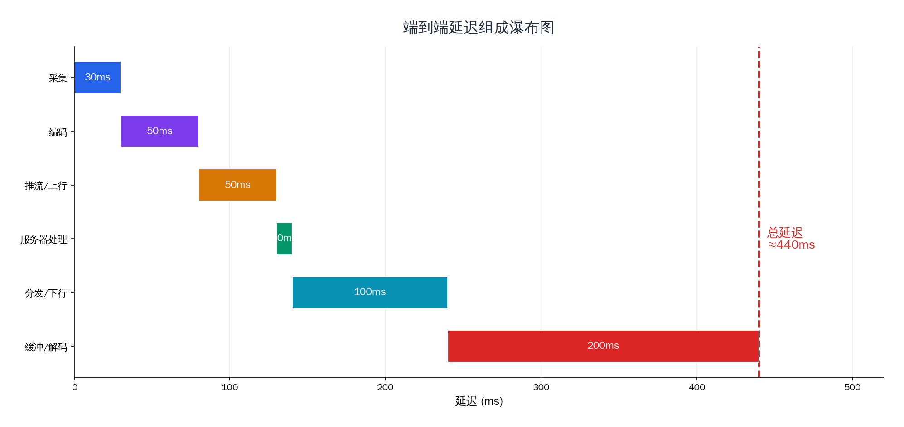
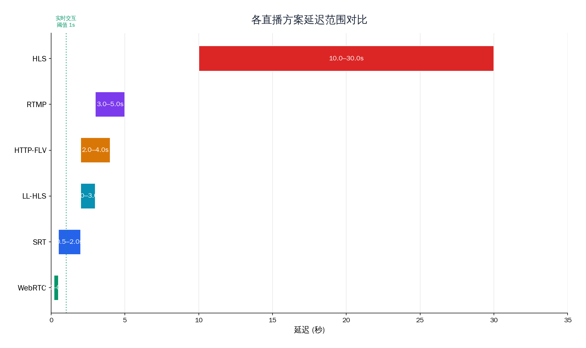
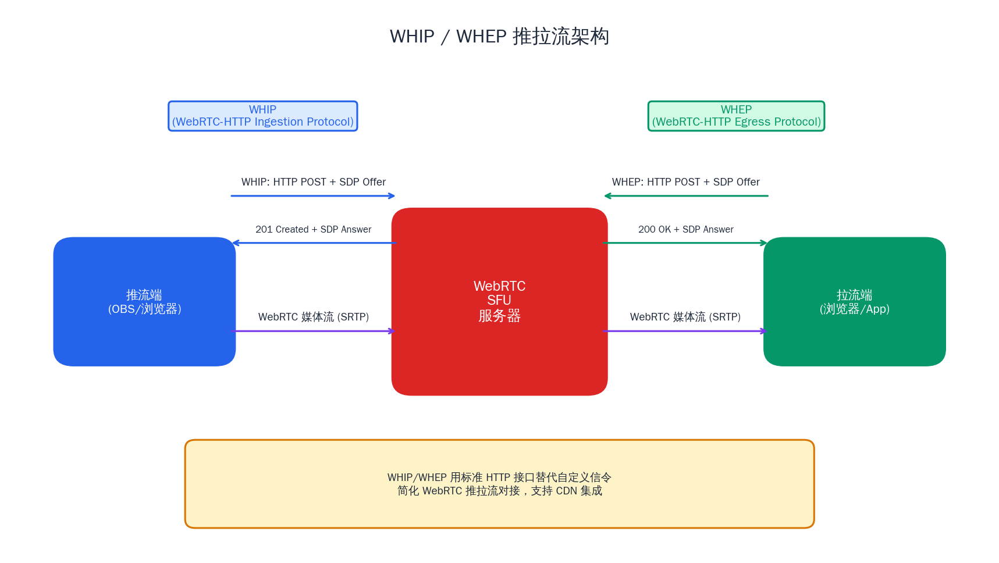

# 实战：超低延迟直播方案

## 前言

走到这一篇，整个系列教程的知识拼图已经接近完成。从最底层的 Socket 编程、I/O 多路复用，到 RTP/RTCP、RTMP、HLS、SRT、WebRTC，再到上一篇的直播系统和视频会议系统——我们已经掌握了构建流媒体系统所需的全部核心技术。

但在真实的业务场景中，有一个问题始终悬而未决：**延迟**。

传统 RTMP 直播的端到端延迟在 3~5 秒，HLS 更是高达 10~30 秒。对于普通的娱乐直播，这个延迟尚可接受。但当场景切换到直播带货（"3、2、1，上链接！"）、赛事竞猜（比分已经进了但观众还没看到）、在线教育互动（老师提问后要等 10 秒才看到学生举手）、远程连麦（对话延迟超过 300ms 就令人不适）时，几秒甚至十几秒的延迟就成了体验的致命伤。

超低延迟直播——端到端延迟控制在 1 秒甚至 500ms 以内——是行业持续追求的目标。这不是靠调一个参数就能实现的，它涉及从采集、编码、传输、服务器处理到播放端的**全链路优化**，是我们整个系列所学知识的综合运用。

本文作为系列的收官之作，将系统地分析延迟的来源，对比各主流低延迟方案，并给出基于 WebRTC（WHIP/WHEP）和 SRT 的完整实战方案和端到端优化清单。

---

## 1. 延迟组成分析

要优化延迟，首先要知道延迟从哪里来。一帧画面从主播的摄像头到观众的屏幕，经历了一条完整的处理流水线，每个环节都会引入延迟。



### 采集延迟（5~50ms）

摄像头以固定帧率采集画面。30fps 意味着每帧间隔约 33ms，60fps 约 16.7ms。采集设备通常有 1~2 帧的内部缓冲，所以实际采集延迟约为一到两个帧间隔。USB 摄像头的采集延迟通常比专业采集卡高。

音频采集的延迟取决于采样缓冲区大小。以 48kHz 采样率、1024 采样点一帧为例，单帧约 21ms。ASIO 等低延迟音频驱动可以将缓冲降到 5ms 以内，但在直播场景中通常不是瓶颈。

### 编码延迟（10~200ms）

编码器是延迟的第一个大头。影响编码延迟的关键因素：

- **B 帧**：B 帧需要参考后续帧才能编码，每增加一层 B 帧就要多缓冲 1~2 帧。开启 B 帧后编码延迟可增加 60~100ms。
- **Lookahead（前瞻）**：编码器通过"向前看"若干帧来做更好的码率分配决策。x264 默认的 `rc-lookahead` 为 40 帧，按 30fps 计算就是 1.3 秒的额外延迟。
- **编码预设**：`slow` 和 `medium` 等高质量预设会使用更多的分析过程，增加编码耗时。`ultrafast` 和 `zerolatency` 则牺牲压缩效率换取最低编码延迟。
- **硬件编码**：NVENC、QSV 等硬件编码器的编码延迟通常低于软件编码（x264），因为并行度更高且流水线延迟固定。

### 推流传输延迟（10~100ms）

推流端到流媒体服务器之间的网络传输延迟。主要取决于：

- **物理距离**：推流端到服务器的 RTT（往返时延）。同城接入通常 5~20ms，跨区域可达 50~100ms。
- **协议握手**：TCP 的三次握手需要 1.5 RTT，RTMP 还有额外的握手和 connect/publish 流程。首次推流建连可能需要数百毫秒，但稳态传输后这个开销不再存在。
- **发送缓冲**：推流端的 Socket 发送缓冲区可能累积数据，尤其在上行带宽不稳定时。

### 服务器处理延迟（5~50ms）

流媒体服务器收到推流数据后的处理时间：

- **协议解析**：解析 RTMP Chunk、RTP 包等，通常在微秒级。
- **转封装**：RTMP 转 HLS 需要等待一个完整的 TS 切片（通常 2~6 秒），这是 HLS 高延迟的根本原因。RTMP 转 HTTP-FLV 或转 WebRTC 则几乎是逐帧转发，延迟极低。
- **转发路由**：SFU 将媒体包从入口路由到出口，纯内存操作，延迟可忽略。

### 分发传输延迟（10~200ms）

从源站到观众端经过的分发链路延迟：

- **CDN 回源**：边缘节点首次请求某条流时，需要从源站回源。回源链路的 RTT 直接影响首帧加载时间。
- **边缘缓存**：CDN 边缘节点通常会缓冲若干秒的数据来应对突发请求。HLS 场景下边缘节点缓存的是完整的 TS 切片，延迟至少等于一个切片时长。
- **级联转发**：大规模 CDN 可能存在多级缓存（L1 → L2 → Origin），每一级都增加一个 RTT 的延迟。

### 播放端缓冲延迟（100ms~数秒）

播放端是延迟的另一个大头，也是最容易被忽视的环节：

- **Jitter Buffer（抖动缓冲）**：播放端通过缓冲一定量的数据来平滑网络抖动。缓冲越大，播放越流畅，但延迟也越高。WebRTC 的自适应 Jitter Buffer 通常维持在 50~200ms；HLS 播放器默认缓冲 3 个切片，可能 6~18 秒。
- **解码缓冲**：解码器自身有 1~2 帧的流水线延迟。
- **渲染缓冲**：操作系统的显示子系统（如垂直同步）可能引入 1 帧（16ms@60Hz）的额外延迟。

### 延迟预算汇总

| 环节 | 最小值 | 典型值 | 最大值 |
|------|--------|--------|--------|
| 采集 | 5ms | 30ms | 50ms |
| 编码 | 10ms | 50ms | 200ms |
| 推流传输 | 10ms | 30ms | 100ms |
| 服务器处理 | 1ms | 10ms | 50ms |
| 分发传输 | 10ms | 50ms | 200ms |
| 播放端缓冲 | 50ms | 500ms | 数秒 |
| **端到端** | **~100ms** | **~700ms** | **数十秒** |

可以看到，**编码**和**播放端缓冲**是两个最大的延迟贡献者。但在传统 HLS 方案中，**服务器转封装**（等待完整切片）才是延迟的绝对瓶颈。不同的技术方案，本质上就是在这几个环节上做不同的取舍。

---

## 2. 各方案延迟对比

理解了延迟的来源之后，我们来横向对比当前主流的直播方案在延迟维度上的表现。

### RTMP 直播：3~5 秒

RTMP 基于 TCP 长连接传输，推流到服务器后逐帧转发给拉流端。理论上可以做到 1~2 秒的延迟，但实际中由于 TCP 拥塞控制、推流端/播放端缓冲等因素，稳态延迟通常在 3~5 秒。弱网下 TCP 重传导致的队头阻塞会进一步拉高延迟。随着 Flash 的淘汰，RTMP 在播放侧已经退出历史舞台，但在推流侧仍然是事实标准。

### HTTP-FLV：2~4 秒

HTTP-FLV 本质上是 RTMP 的 HTTP 封装——服务器将 RTMP 数据转为 FLV 格式，通过 HTTP chunked transfer 持续推送给客户端。相比 RTMP 拉流，它省去了 RTMP 握手和 Chunk 解包的开销，配合 flv.js 可以在浏览器中通过 MSE 播放。延迟特性与 RTMP 接近，但 HTTP 协议天然兼容 CDN 和防火墙，部署更友好。

### HLS：10~30 秒（LL-HLS：2~3 秒）

HLS 将直播流切割为 TS/fMP4 小文件，通过 HTTP 分发。播放器需要下载 M3U8 索引文件和至少 3 个切片才能开始播放。如果每个切片 6 秒，仅切片缓冲就已经 18 秒。

Apple 在 2019 年提出的 LL-HLS（Low-Latency HLS）通过**部分切片**（Partial Segments）和**预加载提示**（Preload Hints）将延迟降至 2~3 秒。部分切片允许播放器在一个完整切片生成之前就开始下载其中的片段（通常 200ms 一个 Part），大幅缩短了等待时间。但 LL-HLS 对服务端和 CDN 的要求更高（需要支持阻塞式播放列表请求和 HTTP Chunked Transfer），实际部署复杂度不低。

### SRT：0.5~2 秒

SRT 在 UDP 之上实现了 ARQ 选择性重传和自适应拥塞控制，专为不稳定网络上的低延迟传输设计。SRT 的延迟通过 `latency` 参数显式配置（最低可设 120ms），这个值本质上就是发送端和接收端的重传缓冲窗口。在洲际传输或卫星链路等高丢包场景下，SRT 的表现远优于 RTMP。

### RIST：0.5~2 秒

RIST（Reliable Internet Stream Transport）与 SRT 定位类似，也是基于 UDP 的可靠传输协议，由 VSF（Video Services Forum）制定标准。RIST 支持 Simple Profile（纯 ARQ）和 Main Profile（加密、鉴权、多路径传输），标准化程度更高。延迟特性与 SRT 基本相当，但在广电领域的采用度正在上升。

### WebRTC：200~500ms

WebRTC 是目前能实现最低端到端延迟的方案。它基于 UDP 传输 SRTP，配合自适应 Jitter Buffer、GCC/BBR 拥塞控制和 NACK/PLI 反馈机制，可以在保证可用画质的前提下将延迟压到 200~500ms。WebRTC 在浏览器端有原生支持，无需安装任何插件。



### 综合对比表

| 方案 | 端到端延迟 | 浏览器支持 | CDN 友好度 | 规模化成本 | 适用场景 |
|------|-----------|-----------|-----------|-----------|---------|
| RTMP | 3~5s | 不支持（仅推流） | 高 | 低 | 推流端 |
| HTTP-FLV | 2~4s | 需 flv.js + MSE | 高 | 低 | 秀场/游戏直播 |
| HLS | 10~30s | 原生支持 | 极高 | 极低 | 大规模分发 |
| LL-HLS | 2~3s | 原生/hls.js | 中 | 中 | 兼顾延迟和兼容性 |
| SRT | 0.5~2s | 不支持 | 低 | 中 | 推流/第一公里 |
| RIST | 0.5~2s | 不支持 | 低 | 中 | 广电推流 |
| WebRTC | 0.2~0.5s | 原生支持 | 低 | 高 | 连麦/超低延迟互动 |

可以看到，延迟和规模化成本基本上是此消彼长的关系。HLS 延迟最高但最容易通过 CDN 大规模分发；WebRTC 延迟最低但每一路连接都需要独立的 ICE 协商和 DTLS 握手，服务端资源消耗远高于 HTTP 分发。工程中需要根据业务场景在这两个维度之间找到平衡点。

---

## 3. 基于 WebRTC 的超低延迟直播

WebRTC 最初是为 P2P 音视频通话设计的，但通过引入 SFU（Selective Forwarding Unit）架构，它完全可以胜任"一对多"的直播场景。

### 方案架构

WebRTC 超低延迟直播的基本架构：

```
推流端 ──(WHIP)──> WebRTC SFU ──(WHEP)──> 拉流端（浏览器）
```

推流端通过 WHIP 协议将媒体流推送到 SFU 服务器，SFU 将接收到的 RTP 包直接转发给所有通过 WHEP 连接的拉流端。SFU 不做编解码操作，只负责包的路由和转发，因此处理延迟极低（亚毫秒级）。

### WHIP：WebRTC 推流的标准化

WHIP（WebRTC-HTTP Ingestion Protocol）是 IETF 标准化的 WebRTC 推流协议（RFC 9725），解决了一个长期困扰 WebRTC 直播的问题——**推流端的信令**。

在 WebRTC 通话场景中，信令通常通过 WebSocket 传递 SDP Offer/Answer 和 ICE Candidate。但对于直播推流来说，这套信令机制过于复杂：推流端需要与服务器建立 WebSocket 连接、实现完整的信令状态机、处理各种边界情况。如果推流工具是 OBS 这样的桌面应用，集成 WebSocket 信令的工作量不小。

WHIP 的设计极为简洁：**用一个 HTTP POST 请求完成整个信令交换**。

工作流程如下：

1. 推流端创建 `RTCPeerConnection`，生成 SDP Offer
2. 推流端向 WHIP 端点发送 HTTP POST 请求，`Content-Type: application/sdp`，Body 为 SDP Offer
3. 服务器返回 HTTP 201 Created，Body 为 SDP Answer，`Location` 头指向本次会话的资源 URL
4. ICE 协商通过 Trickle ICE（HTTP PATCH）或 SDP 中的 ICE Candidate 完成
5. 推流结束时，向 `Location` URL 发送 HTTP DELETE 即可

```
推流端                           WHIP Server
  |                                    |
  |---- POST /whip (SDP Offer) ------->|
  |                                    |
  |<--- 201 Created (SDP Answer) ------|
  |     Location: /whip/session/xxx    |
  |                                    |
  |==== WebRTC Media (SRTP/UDP) ======>|
  |                                    |
  |---- DELETE /whip/session/xxx ----->|
  |<--- 200 OK ------------------------|
```

这种设计让任何支持 HTTP 的环境都可以轻松实现 WebRTC 推流，OBS 从 30.0 版本开始已原生支持 WHIP 推流。

### WHEP：WebRTC 拉流的标准化

WHEP（WebRTC-HTTP Egress Protocol）是与 WHIP 对称设计的 WebRTC 拉流协议。流程几乎相同：

1. 播放端创建 `RTCPeerConnection`（设置 `recvonly`），生成 SDP Offer
2. 向 WHEP 端点发送 HTTP POST，Body 为 SDP Offer
3. 服务器返回 SDP Answer
4. WebRTC 连接建立，开始接收媒体流

WHIP 和 WHEP 的对称设计使得推拉流的接口风格一致，降低了开发和运维的复杂度。



### SRS 实战：WHIP 推流 + WHEP 播放

SRS 5.0+ 已经完整支持 WHIP 和 WHEP。下面我们动手跑通完整链路。

**第一步：启动 SRS**

```bash
CANDIDATE="你的服务器IP"
docker run --rm -it \
  -p 1935:1935 -p 1985:1985 -p 8080:8080 \
  -p 8000:8000/udp \
  --env CANDIDATE=$CANDIDATE \
  registry.cn-hangzhou.aliyuncs.com/ossrs/srs:5 \
  ./objs/srs -c conf/docker.conf
```

`CANDIDATE` 环境变量非常关键——它会作为 WebRTC 的 ICE Candidate 地址写入 SDP Answer。如果不设置或设置为内网地址，浏览器将无法与服务器建立 UDP 连接。

**第二步：OBS WHIP 推流**

OBS 30.0+ 内置了 WHIP 支持：

1. 打开 OBS → 设置 → 直播
2. 服务选择 **WHIP**
3. 服务器填写：`http://<服务器IP>:1985/rtc/v1/whip/?app=live&stream=ultralow`
4. 输出设置：
   - 编码器：x264
   - 码率：2000~3000 Kbps
   - 关键帧间隔：1 秒
   - Profile：Baseline（禁用 B 帧）
   - Tune：zerolatency
5. 点击"开始直播"

如果没有 OBS 30.0+，也可以用 FFmpeg 配合 GStreamer 或 webrtc-sendrecv 等工具，但 OBS 是目前最便捷的 WHIP 推流方案。

**第三步：浏览器 WHEP 播放**

在浏览器端通过 WHEP 拉流的完整代码：

```html
<!DOCTYPE html>
<html>
<body>
<video id="player" autoplay muted playsinline
       style="width:100%;max-width:960px;"></video>
<p>延迟: <span id="latency">计算中...</span></p>

<script>
async function startPlay() {
    const pc = new RTCPeerConnection();
    pc.addTransceiver('video', { direction: 'recvonly' });
    pc.addTransceiver('audio', { direction: 'recvonly' });

    pc.ontrack = (event) => {
        document.getElementById('player').srcObject = event.streams[0];
    };

    const offer = await pc.createOffer();
    await pc.setLocalDescription(offer);

    const resp = await fetch(
        'http://YOUR_SERVER_IP:1985/rtc/v1/whep/?app=live&stream=ultralow',
        {
            method: 'POST',
            headers: { 'Content-Type': 'application/sdp' },
            body: offer.sdp
        }
    );

    const answerSdp = await resp.text();
    await pc.setRemoteDescription(
        new RTCSessionDescription({ type: 'answer', sdp: answerSdp })
    );
}

startPlay();
</script>
</body>
</html>
```

注意 WHEP 页面必须通过 HTTPS 访问（或者 localhost），否则浏览器会阻止 `RTCPeerConnection` 的使用。开发测试时可以使用 `localhost` 或者 Chrome 的 `--unsafely-treat-insecure-origin-as-secure` 标志。

**第四步：延迟测量**

推流正常后，可以通过 WebRTC 的 `getStats()` API 获取实时统计信息：

```javascript
setInterval(async () => {
    const stats = await pc.getStats();
    stats.forEach(report => {
        if (report.type === 'inbound-rtp' && report.kind === 'video') {
            const jitterMs = (report.jitter || 0) * 1000;
            document.getElementById('latency').textContent =
                `Jitter: ${jitterMs.toFixed(1)}ms, ` +
                `丢包: ${report.packetsLost}, ` +
                `帧率: ${report.framesPerSecond || 'N/A'}`;
        }
    });
}, 1000);
```

在同一局域网内，WebRTC 端到端延迟通常可以控制在 200ms 以内。跨公网场景下，延迟主要取决于物理距离和网络质量，通常在 200~500ms。

---

## 4. SRT 低延迟方案

WebRTC 延迟最低，但它对服务器资源消耗较大（每路连接都需要独立的 DTLS/SRTP 会话），大规模分发时成本高昂。SRT 则在延迟和可部署性之间取得了很好的平衡，特别适合"第一公里"的推流场景。

### SRT 在"第一公里"的应用

"第一公里"指的是推流端到流媒体服务器（或 CDN 入口）之间的传输链路。这段链路往往是最不可控的——主播可能在户外用 4G 网络推流，运营商基站切换、丢包、抖动都很常见。

RTMP 基于 TCP，在丢包率超过 2% 时延迟就会明显飙升（TCP 重传 + 拥塞窗口回退）。SRT 基于 UDP，使用 ARQ（自动重传请求）做选择性重传，配合独立的拥塞控制算法，在 10%+ 丢包率下仍能维持稳定的低延迟传输。

### SRT + 转封装的混合方案

SRT 本身在播放侧的生态不够完善（浏览器不支持 SRT），因此实际工程中通常采用混合方案：

```
推流端 ──(SRT)──> 流媒体服务器 ──┬──(WebRTC/WHEP)──> 超低延迟播放
                                ├──(HTTP-FLV)─────> 低延迟播放
                                └──(HLS)──────────> 大规模分发
```

推流端通过 SRT 推流保证"第一公里"的稳定性，服务器接收后转封装为多种协议分发。这样既利用了 SRT 的抗弱网能力，又兼顾了播放侧的兼容性和延迟需求。

SRS 原生支持 SRT 推流并自动转为 RTMP/WebRTC/HLS 输出：

```bash
# FFmpeg 通过 SRT 推流到 SRS
ffmpeg -re -i test_video.mp4 \
       -c:v libx264 -preset ultrafast -tune zerolatency \
       -c:a aac \
       -f mpegts "srt://localhost:10080?streamid=#!::r=live/stream01,m=publish"
```

### 关键配置参数

SRT 的延迟行为由几个核心参数控制：

**`latency`（延迟缓冲，单位 ms）**

这是 SRT 最重要的参数，定义了发送端和接收端之间的缓冲窗口。在这个窗口内，丢失的包有机会被重传并按序重组。值越大，抗丢包能力越强，但延迟也越高。

```bash
# 设置 200ms 的延迟缓冲（适合局域网或良好网络）
srt://server:10080?latency=200

# 设置 1000ms（适合跨区域传输或弱网环境）
srt://server:10080?latency=1000
```

经验公式：`latency` ≥ 4 × RTT。如果 RTT 为 50ms，建议 `latency` 至少设为 200ms。

**`maxbw`（最大带宽）和 `inputbw`（输入带宽）**

SRT 的拥塞控制需要知道发送端的目标码率来计算开销带宽预算（用于重传）。`inputbw` 设为实际推流码率，`maxbw` 设为 0 表示自动计算（通常是 `inputbw × 1.25`）。

**`oheadbw`（开销带宽百分比）**

默认 25%，表示 SRT 会预留 25% 的额外带宽用于 ARQ 重传。在高丢包环境下可以适当调大。

### SRT vs RIST

SRT 和 RIST 经常被拿来对比，两者定位相似但设计哲学不同：

| 维度 | SRT | RIST |
|------|-----|------|
| 标准化 | Haivision 开源协议 | VSF 行业标准（TR-06-1/2） |
| 传输单元 | 基于 UDT 库改造 | 基于标准 RTP/RTCP |
| 多路径 | 不支持 | Main Profile 支持 |
| 加密 | AES-128/256 | DTLS（Main Profile） |
| 隧道复用 | 单连接单流 | 支持多流复用 |
| 生态 | OBS/FFmpeg/SRS 广泛支持 | 广电设备支持增长中 |
| 适用场景 | 直播推流、远程制作 | 广电贡献链路、Studio 间互联 |

对于互联网直播场景，SRT 的工具链更成熟；对于广电专业场景，RIST 的标准化和多路径特性更有吸引力。两者都能达到亚秒级延迟。

---

## 5. 端到端延迟优化技巧

选对方案只是起点，要真正达到超低延迟，还需要在全链路的每个环节做精细化调优。

### 编码端优化

**禁用 B 帧**

B 帧是延迟的大敌。它需要参考未来的帧才能编码，每增加一层 B 帧就多一帧的编码延迟。对于超低延迟场景，必须明确禁用：

```bash
# x264 禁用 B 帧
-x264-params "bframes=0"

# 或者使用 zerolatency tune（会自动禁用 B 帧和 lookahead）
-tune zerolatency
```

**使用低延迟编码预设**

x264 的 `zerolatency` tune 会关闭以下增加延迟的特性：B 帧、lookahead、线程延迟、周期性内部刷新。代价是压缩效率下降约 10~15%，但在超低延迟场景中这是值得的取舍。

```bash
ffmpeg -i input \
       -c:v libx264 -preset ultrafast -tune zerolatency \
       -profile:v baseline \
       ...
```

**缩短关键帧间隔**

关键帧间隔（GOP）直接影响播放端的首帧加载时间和追帧效率。建议设为 1~2 秒：

```bash
-g 30    # 30fps 下 1 秒一个关键帧
-keyint_min 30
```

**CBR 优于 VBR**

恒定码率（CBR）比可变码率（VBR）更有利于低延迟传输。VBR 的码率波动可能导致瞬间的带宽突发，触发传输层的缓冲或拥塞；CBR 则输出更平稳，传输层更容易调度。

### 传输链路优化

**就近接入**

推流端应连接到物理距离最近的接入节点。RTT 每减少 10ms，端到端延迟就能减少约 10~20ms（考虑重传和缓冲的级联效应）。大型直播平台通常在全国部署多个推流接入点，通过 DNS 调度将推流端引导到最近的节点。

**减少中间环节**

每多一级转发就多一个 RTT 的延迟。超低延迟场景下应尽量减少中间节点：

- 避免多级 CDN 级联，尽量让边缘节点直接连源站
- 如果用 SFU 架构，避免 SFU 之间的级联转发
- 推流和拉流走同一个服务器实例（如果规模允许）

**协议选择**

第一公里用 SRT 或 WHIP，最后一公里用 WebRTC（WHEP）。避免在超低延迟链路中引入 TCP 段（如 RTMP 中转）。

### 播放端优化

**最小化 Jitter Buffer**

Jitter Buffer 大小直接等于播放端引入的延迟。对于超低延迟场景，应该将 Jitter Buffer 设到最小，接受偶尔的卡顿来换取更低的延迟：

```javascript
// WebRTC 场景下，可以通过 SDP munging 调整 jitter buffer
// 或者在 SFU 侧配置最小缓冲

// flv.js 场景下的追赶策略
const player = flvjs.createPlayer({
    type: 'flv',
    url: 'http://server/live/stream.flv',
    isLive: true
}, {
    enableStashBuffer: false,    // 禁用内部缓冲
    stashInitialSize: 128        // 最小初始缓冲（字节）
});
```

**追帧/跳帧策略**

当播放端因为网络抖动而累积了延迟时，需要一种机制来"追上"直播进度。常见策略：

- **加速播放**：将播放速率临时提升到 1.1x~1.5x，逐渐追赶直播边缘。用户感知较小，但追赶速度慢。
- **跳帧**：直接丢弃缓冲区中过时的帧，跳到最新的关键帧开始播放。追赶速度快，但会有一次画面跳变。
- **混合策略**：当延迟偏差在 200ms 以内用加速播放，超过 200ms 则直接跳帧。

```javascript
// 示例：基于 video 元素的自动追赶
setInterval(() => {
    const video = document.getElementById('player');
    if (video.buffered.length > 0) {
        const bufferEnd = video.buffered.end(video.buffered.length - 1);
        const lag = bufferEnd - video.currentTime;
        if (lag > 1.0) {
            // 延迟超过 1 秒，跳到缓冲区末尾
            video.currentTime = bufferEnd - 0.1;
        } else if (lag > 0.3) {
            // 延迟 0.3~1 秒，轻微加速追赶
            video.playbackRate = 1.1;
        } else {
            video.playbackRate = 1.0;
        }
    }
}, 500);
```

### 端到端低延迟优化清单

将以上所有优化技巧汇总为一份可执行的清单：

| 环节 | 优化项 | 操作 | 预期收益 |
|------|--------|------|----------|
| 编码 | 禁用 B 帧 | `-tune zerolatency` 或 `bframes=0` | 减少 30~100ms |
| 编码 | 关闭 lookahead | `-tune zerolatency` 会自动关闭 | 减少 100~500ms |
| 编码 | 缩短 GOP | `-g 30`（1 秒） | 加快追帧，减少首帧时间 |
| 编码 | 使用 CBR | `-b:v 2500k -maxrate 2500k -bufsize 2500k` | 减少传输抖动 |
| 推流 | 使用 SRT/WHIP | 替代 RTMP | 减少 50~200ms |
| 推流 | 就近接入 | DNS 调度到最近节点 | 减少 10~50ms |
| 服务器 | 逐帧转发 | 使用 SFU/HTTP-FLV，避免 HLS 切片 | 减少数秒 |
| 服务器 | 减少级联 | 边缘直连源站 | 减少 10~50ms |
| 播放 | 最小化缓冲 | 降低 Jitter Buffer 大小 | 减少 100~500ms |
| 播放 | 启用追帧 | 自动加速或跳帧 | 防止延迟累积 |
| 网络 | TCP_NODELAY | 信令连接禁用 Nagle | 减少信令延迟 |

---

## 6. 延迟测量方法

"没有度量就没有优化。"要验证优化效果，必须有可靠的延迟测量手段。

### NTP 时钟同步法

**原理**：推流端和播放端都与 NTP 服务器同步时钟。推流端在每帧数据中嵌入当前 NTP 时间戳，播放端在渲染该帧时读取本地 NTP 时间，两者之差即为端到端延迟。

**实现方式**：可以利用 RTP 报文中的 NTP 时间戳（通过 RTCP Sender Report 关联），或者在自定义协议中携带发送时间。

**精度**：依赖 NTP 同步精度，通常在 1~10ms 级别。如果两端在同一局域网内且 NTP 服务器相同，精度可达亚毫秒级。

**局限**：推流端和播放端必须能够访问相同或同步的时钟源。跨运营商场景下 NTP 同步误差可能较大。

### SEI 注入时间戳法

**原理**：在 H.264/H.265 编码流中，利用 SEI（Supplemental Enhancement Information）NAL 单元携带自定义数据。推流端在每个关键帧（或每帧）的 SEI 中注入当前时间戳，播放端解析 SEI 提取时间戳后与本地时间比较。

**实现方式**：

```bash
# FFmpeg 注入 SEI 的方法（通过 x264 的 --nal-hrd 和自定义 SEI）
# 更常见的做法是在编码 SDK 层面调用 API 插入自定义 SEI
```

在实际工程中，各大云厂商的直播 SDK 通常内置了 SEI 时间戳注入功能，播放 SDK 解析后直接报告延迟。

**精度**：与 NTP 同步法类似，约 1~10ms，取决于时钟同步质量和 SEI 解析时机。

**优势**：时间戳嵌入在视频流本身中，经过转封装、CDN 转发后仍然保留，可以测量完整的端到端链路延迟。

### 视觉时钟法

**原理**：最直观也是最"笨"的方法。推流端的画面上显示一个实时更新的时钟（精确到毫秒），然后用一台手机同时拍摄推流端屏幕和播放端屏幕，对比两个时钟的差值。

**操作步骤**：

1. 在推流端画面上叠加一个毫秒级时钟（可以用 FFmpeg 的 `drawtext` 滤镜）：
   ```bash
   ffmpeg -f v4l2 -i /dev/video0 \
          -vf "drawtext=text='%{localtime\:%H\\\:%M\\\:%S}.%{eif\:mod(t*1000,1000)\:d\:3}':fontsize=72:fontcolor=white:x=10:y=10" \
          -c:v libx264 -tune zerolatency \
          -f flv rtmp://server/live/clock_test
   ```
2. 打开播放端播放该流
3. 用另一台设备（手机）同时拍摄推流端屏幕和播放端屏幕
4. 在拍摄的照片中读取两个时钟的差值

**精度**：受限于时钟分辨率和相机快门速度。使用毫秒级时钟和高速相机（或慢动作模式），精度可达 30~50ms。

**优势**：不依赖任何软件层面的时钟同步，测量的是"真正的"端到端延迟，包括渲染延迟和显示器延迟。是验证其他测量方法的"真值参考"。

### 各方法对比

| 方法 | 精度 | 测量范围 | 自动化 | 适用场景 |
|------|------|----------|--------|----------|
| NTP 时钟同步 | 1~10ms | 软件端到端 | 可自动化 | 精确的自动化监控 |
| SEI 时间戳 | 1~10ms | 完整编码链路 | 可自动化 | CDN 链路延迟测量 |
| 视觉时钟 | 30~50ms | 真正端到端（含显示） | 手动 | 方案验证、端到端标定 |

在工程实践中，建议用**视觉时钟法**做初始标定和方案验证（因为它最不会"说谎"），然后用**SEI 或 NTP 方法**做自动化的持续监控。

---

## 总结与系列回顾

### 超低延迟方案选型建议

经过本文的分析，给出以下选型建议：

- **延迟 < 500ms（连麦互动、实时竞拍）**：WebRTC（WHIP/WHEP），端到端全链路 WebRTC，推流端使用 `zerolatency` 编码，播放端最小化 Jitter Buffer。
- **延迟 500ms~2s（直播带货、在线教育）**：SRT 推流 + WebRTC 或 HTTP-FLV 播放。第一公里用 SRT 保证弱网稳定性，最后一公里根据规模选择 WebRTC（小规模高互动）或 HTTP-FLV（中规模低成本）。
- **延迟 2~5s（常规直播）**：RTMP 推流 + HTTP-FLV 播放，成熟方案，成本最低。
- **延迟 5s+（大规模分发）**：RTMP 推流 + HLS/LL-HLS 播放，CDN 友好，可承载百万级并发。

没有万能方案，只有适合业务场景的方案。延迟、成本、规模、兼容性——四者不可兼得，选型的本质是在这四个维度上做工程权衡。

### 系列教程知识图谱回顾

到这里，整个系列教程的 22 篇文章全部完成。让我们回顾一下这条从基础到实战的学习路径：

**第一篇 · 网络编程基础**：Socket 编程、I/O 多路复用（epoll）、Reactor 模式、网络优化。这是所有流媒体技术的底座——无论上层协议多么复杂，最终都要通过 Socket 收发数据，通过 epoll 管理并发连接。

**第二篇 · 流媒体传输基础**：RTP/RTCP、SDP 媒体协商、Jitter Buffer 与 FEC。这一层定义了音视频数据在网络上传输的基本单元和质量保障机制，是理解所有上层协议的关键。

**第三篇 · 经典流媒体协议**：RTSP、RTMP、FLV/HTTP-FLV。这些协议在过去十多年撑起了整个直播和监控行业，理解它们的设计决策（为什么 RTMP 选 TCP、为什么 RTSP 用带外信令）有助于理解后来者为什么要"革新"。

**第四篇 · 现代流媒体协议**：HLS、DASH、SRT、QUIC/HTTP3。这一代协议解决了经典协议在自适应码率、弱网传输、HTTP 兼容性等方面的不足，代表了当前行业的主流技术栈。

**第五篇 · WebRTC 技术体系**：架构与信令、ICE/STUN/TURN、DTLS-SRTP、GCC 拥塞控制、libwebrtc 实战。WebRTC 是实时通信的集大成者，几乎集成了所有流媒体传输技术（RTP、DTLS、ICE、FEC、NACK、ABR），理解 WebRTC 就是对前面所有知识的综合检验。

**第六篇 · 综合实战**：直播系统、视频会议、超低延迟直播。三个项目分别对应了流媒体的三大应用场景——一对多分发、多对多通信、超低延迟互动，将所有理论知识落地为可运行的工程方案。

```
网络编程基础          传输基础            经典协议
  Socket  ──────>  RTP/RTCP  ──────>  RTSP
  epoll             SDP               RTMP
  Reactor           Jitter Buffer     HTTP-FLV
  网络优化            FEC/NACK           │
     │                │                 │
     v                v                 v
现代协议             WebRTC            综合实战
  HLS/DASH  <────> 架构/信令  ──────> 直播系统
  SRT               ICE/NAT穿越       视频会议
  QUIC/HTTP3        DTLS-SRTP         超低延迟直播
                    GCC/BBR
```

### 进一步学习方向

系列教程覆盖了流媒体技术的核心知识，但这个领域仍在快速演进。以下方向值得持续关注：

- **MoQ（Media over QUIC）**：IETF 正在标准化的基于 QUIC 的媒体传输协议，目标是统一直播和实时通信的传输层，有望成为下一代标准。
- **AV1/H.266(VVC)**：新一代视频编码标准，同等画质下码率可再降 30~50%，但编码复杂度显著增加。实时编码的性能优化是当前研究热点。
- **端侧 AI**：超分辨率（Super Resolution）、视频增强、智能帧率补偿等 AI 技术正在被引入播放端，可以在不增加传输码率的前提下提升观看体验。
- **WebTransport**：基于 HTTP/3 和 QUIC 的新传输 API，支持不可靠数据报传输，是 WebSocket 在实时场景下的潜在替代者。
- **边缘计算 + 流媒体**：将转码、AI 分析等计算密集型任务下沉到 CDN 边缘节点执行，降低回源带宽和延迟。

### 推荐资源

- **SRS Wiki**：[ossrs.io](https://ossrs.io) — SRS 的官方文档，是中文流媒体开发者最全面的参考资料
- **WebRTC for the Curious**：[webrtcforthecurious.com](https://webrtcforthecurious.com) — 深入浅出的 WebRTC 技术书
- **RFC 文档**：RFC 3550 (RTP)、RFC 8829 (JSEP)、RFC 9725 (WHIP) — 协议设计的第一手资料
- **FFmpeg Wiki**：[trac.ffmpeg.org](https://trac.ffmpeg.org) — 编解码和流媒体处理的实践参考

### 寄语

流媒体技术看似门槛很高——协议繁多、概念晦涩、链路复杂。但当你从第一篇的 Socket 编程一步步走到这里，你会发现所有的复杂性都可以被拆解为可理解的模块：Socket 负责传输字节、RTP 负责携带媒体、SDP 负责协商能力、Jitter Buffer 负责平滑抖动、SFU 负责路由转发。每一层都在前一层的基础上解决一个具体的问题。

这个系列试图传递的不仅是知识点本身，更是**从底层往上理解系统**的方法论。当你下次遇到一个新的流媒体协议或产品时，你不再需要死记硬背它的 API，而是能自然地思考：它用什么传输层？怎么做信令协商？拥塞控制是什么策略？延迟模型是怎样的？有了这套思维框架，任何新技术都只是已有知识的组合与变体。

希望这 22 篇文章能成为你流媒体技术之路上有用的参考。技术永远在演进，保持好奇，持续实践。
