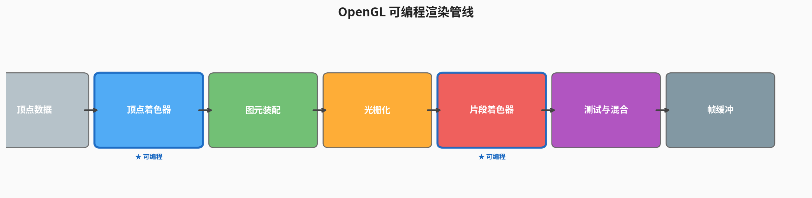
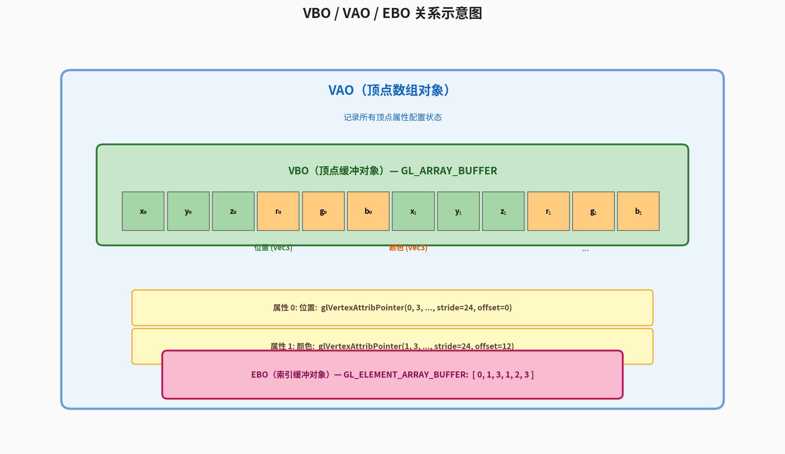
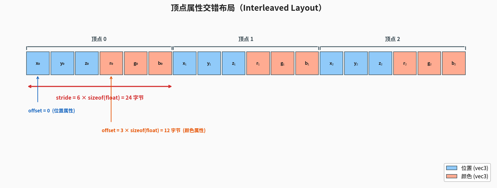

# 第2篇：渲染管线与第一个三角形

## 前置知识

- 第1篇：环境搭建与第一个窗口 — 你需要已经配置好 GLFW + GLAD 的开发环境，并能创建一个空白窗口。

## 本篇目标

- 理解 OpenGL **可编程渲染管线**的完整流程
- 掌握 **VBO、VAO、EBO** 三大缓冲对象的概念与用法
- 学会编写、编译、链接最简 **着色器（Shader）**
- 在屏幕上渲染一个**彩色三角形**
- 使用 **EBO（索引绘制）** 画一个矩形

---

## 一、OpenGL 可编程渲染管线

OpenGL 的渲染管线是一条将 3D 顶点数据最终转化为屏幕上 2D 像素的流水线。下图展示了它的主要阶段：



### 1.1 顶点着色器（Vertex Shader）

顶点着色器是管线中**第一个可编程阶段**。它对每个输入顶点执行一次，主要职责是：

- 将顶点坐标从模型空间变换到裁剪空间（通过 MVP 矩阵）
- 将颜色、法线等顶点属性传递给后续阶段

最简顶点着色器示例：

```glsl
#version 330 core
layout (location = 0) in vec3 aPos;
layout (location = 1) in vec3 aColor;

out vec3 vertexColor;

void main() {
    gl_Position = vec4(aPos, 1.0);
    vertexColor = aColor;
}
```

`gl_Position` 是内置变量，表示该顶点在裁剪空间中的位置。`layout (location = 0)` 指定了顶点属性的索引，与后面 `glVertexAttribPointer` 对应。

### 1.2 图元装配（Primitive Assembly）

顶点着色器处理完所有顶点后，图元装配阶段将顶点按照指定模式（`GL_TRIANGLES`、`GL_LINES` 等）组装成几何图元（三角形、线段、点）。

> **通俗地说：** 图元装配就是将分散的顶点按规则连接成三角形（或其他基本形状）的过程。你可以理解为"把散落的点用线连起来，组成一个个小三角形"。

### 1.3 光栅化（Rasterization）

光栅化将图元映射到屏幕像素上，生成**片段（Fragment）**。每个片段对应屏幕上一个潜在的像素位置，并携带经过插值的属性（颜色、纹理坐标等）。

> **通俗地说：** 光栅化就是将数学描述的几何图形转换为屏幕上的像素点阵的过程，类比一下，就像把矢量图转换为位图——把"用公式描述的三角形"变成"由一个个像素点填充的三角形"。

> **关键概念**：如果三角形三个顶点有不同颜色，光栅化阶段会自动进行线性插值，使得三角形内部呈现平滑的颜色渐变。

### 1.4 片段着色器（Fragment Shader）

片段着色器是管线中**第二个可编程阶段**。它对每个片段执行一次，决定最终像素的颜色。

```glsl
#version 330 core
in vec3 vertexColor;
out vec4 FragColor;

void main() {
    FragColor = vec4(vertexColor, 1.0);
}
```

### 1.5 测试与混合（Tests & Blending）

管线最后阶段包含一系列测试和操作：

| 阶段 | 作用 |
|------|------|
| 深度测试 | 比较片段深度值，丢弃被遮挡的片段 |
| 模板测试 | 根据模板缓冲区的值决定是否丢弃片段 |
| 混合 | 将片段颜色与帧缓冲中已有颜色混合（实现半透明效果） |

通过所有测试的片段颜色被写入帧缓冲区，最终显示到屏幕上。

---

## 二、顶点数据与缓冲对象

### 2.1 标准化设备坐标（NDC）

在没有任何变换矩阵的情况下，OpenGL 使用**标准化设备坐标**：x、y、z 三个轴的范围都是 **[-1.0, 1.0]**。只有落在这个范围内的坐标才会最终显示到屏幕上。

### 2.2 VBO（Vertex Buffer Object）

VBO 是一块 GPU 上的内存区域，用来存储顶点数据。使用 VBO 可以一次性将大量顶点数据发送到 GPU，避免逐顶点传输的性能开销。

```cpp
float vertices[] = {
    // 位置              // 颜色
    -0.5f, -0.5f, 0.0f,  1.0f, 0.0f, 0.0f,  // 左下 - 红
     0.5f, -0.5f, 0.0f,  0.0f, 1.0f, 0.0f,  // 右下 - 绿
     0.0f,  0.5f, 0.0f,  0.0f, 0.0f, 1.0f   // 顶部 - 蓝
};

unsigned int VBO;
glGenBuffers(1, &VBO);
glBindBuffer(GL_ARRAY_BUFFER, VBO);
glBufferData(GL_ARRAY_BUFFER, sizeof(vertices), vertices, GL_STATIC_DRAW);
```

`glBufferData` 的最后一个参数指定数据使用模式：

| 模式 | 含义 |
|------|------|
| `GL_STATIC_DRAW` | 数据几乎不变（最常用） |
| `GL_DYNAMIC_DRAW` | 数据会频繁改变 |
| `GL_STREAM_DRAW` | 数据每次绘制都改变 |

### 2.3 VAO（Vertex Array Object）

VAO 记录了"如何解读 VBO 中的顶点数据"。它保存了 `glVertexAttribPointer` 的调用状态，这样在绑定 VAO 后就能自动恢复所有顶点属性配置。

> **"自动恢复"是什么意思？** VAO 就像一个"配置快照"。在初始化阶段，你绑定一个 VAO，然后配置好所有顶点属性（`glVertexAttribPointer`、`glEnableVertexAttribArray`、绑定 EBO 等），这些配置都会被 VAO 记住。之后在渲染循环中，你只需要 `glBindVertexArray(VAO)` 一行代码，之前的全部配置就自动生效了，不需要重新调用一遍。这在绘制多个不同物体时尤其有用——每个物体一个 VAO，切换绘制时只需切换 VAO 即可。



```cpp
unsigned int VAO;
glGenVertexArrays(1, &VAO);
glBindVertexArray(VAO);
// 在这之后配置 VBO 和顶点属性……
```

### 2.4 顶点属性与交错布局

我们的顶点数据采用**交错存储**：每个顶点的位置和颜色紧挨着排列。



```cpp
// 位置属性 (location = 0)
glVertexAttribPointer(0, 3, GL_FLOAT, GL_FALSE, 6 * sizeof(float), (void*)0);
glEnableVertexAttribArray(0);

// 颜色属性 (location = 1)
glVertexAttribPointer(1, 3, GL_FLOAT, GL_FALSE, 6 * sizeof(float), (void*)(3 * sizeof(float)));
glEnableVertexAttribArray(1);
```

> **`glEnableVertexAttribArray` 的作用：** `glVertexAttribPointer` 只是告诉 OpenGL 某个属性的数据**怎么读**（格式、步长、偏移等），但该属性通道默认是**关闭的**。必须调用 `glEnableVertexAttribArray` 将其打开，数据才能真正流向着色器。如果漏掉这一步，着色器中对应的 `in` 变量会收到默认值 `(0, 0, 0, 1)`——这也是三角形显示纯黑的常见原因之一。

`glVertexAttribPointer` 各参数含义：

| 参数 | 说明 |
|------|------|
| 第1个 | 属性索引，对应着色器 `layout (location = x)` |
| 第2个 | 属性分量数（vec3 → 3） |
| 第3个 | 数据类型 |
| 第4个 | 是否归一化 |
| 第5个 | **步长（stride）**：相邻两个同属性值之间的字节距离 |
| 第6个 | **偏移（offset）**：该属性在一个顶点中的起始字节位置 |

### 2.5 EBO（Element Buffer Object）

绘制矩形需要两个三角形（6个顶点），但矩形只有4个顶点，其中有2个顶点被共用了。EBO 通过**索引数组**引用 VBO 中的顶点，避免重复存储。

```cpp
float rectVertices[] = {
     0.5f,  0.5f, 0.0f,   // 右上
     0.5f, -0.5f, 0.0f,   // 右下
    -0.5f, -0.5f, 0.0f,   // 左下
    -0.5f,  0.5f, 0.0f    // 左上
};

unsigned int indices[] = {
    0, 1, 3,   // 第一个三角形
    1, 2, 3    // 第二个三角形
};

unsigned int EBO;
glGenBuffers(1, &EBO);
glBindBuffer(GL_ELEMENT_ARRAY_BUFFER, EBO);
glBufferData(GL_ELEMENT_ARRAY_BUFFER, sizeof(indices), indices, GL_STATIC_DRAW);
```

使用 `glDrawElements` 代替 `glDrawArrays` 进行索引绘制：

```cpp
glDrawElements(GL_TRIANGLES, 6, GL_UNSIGNED_INT, 0);
```

---

## 三、着色器的编译与链接

着色器程序需要经历 **编写 → 编译 → 链接** 三个步骤：

### 3.1 编译着色器

```cpp
unsigned int vertexShader = glCreateShader(GL_VERTEX_SHADER);
glShaderSource(vertexShader, 1, &vertexShaderSource, NULL);
glCompileShader(vertexShader);

// 检查编译错误
int success;
char infoLog[512];
glGetShaderiv(vertexShader, GL_COMPILE_STATUS, &success);
if (!success) {
    glGetShaderInfoLog(vertexShader, 512, NULL, infoLog);
    std::cerr << "顶点着色器编译失败:\n" << infoLog << std::endl;
}
```

### 3.2 链接着色器程序

```cpp
unsigned int shaderProgram = glCreateProgram();
glAttachShader(shaderProgram, vertexShader);
glAttachShader(shaderProgram, fragmentShader);
glLinkProgram(shaderProgram);

// 检查链接错误
glGetProgramiv(shaderProgram, GL_LINK_STATUS, &success);
if (!success) {
    glGetProgramInfoLog(shaderProgram, 512, NULL, infoLog);
    std::cerr << "着色器程序链接失败:\n" << infoLog << std::endl;
}

// 链接成功后删除着色器对象
glDeleteShader(vertexShader);
glDeleteShader(fragmentShader);
```

### 3.3 使用着色器程序

```cpp
glUseProgram(shaderProgram);
```

---

## 四、核心 API 速查表

### 缓冲对象

| API | 说明 |
|-----|------|
| `glGenBuffers(n, &id)` | 生成 n 个缓冲对象，ID 存入 id |
| `glBindBuffer(target, id)` | 将缓冲对象绑定到目标（`GL_ARRAY_BUFFER` / `GL_ELEMENT_ARRAY_BUFFER`） |
| `glBufferData(target, size, data, usage)` | 创建缓冲存储并上传数据 |

### 顶点数组对象

| API | 说明 |
|-----|------|
| `glGenVertexArrays(n, &id)` | 生成 n 个 VAO |
| `glBindVertexArray(id)` | 绑定 VAO（后续顶点属性配置都记录在此 VAO 中） |
| `glVertexAttribPointer(index, size, type, normalized, stride, offset)` | 定义顶点属性的读取方式 |
| `glEnableVertexAttribArray(index)` | 启用指定索引的顶点属性 |

### 着色器

| API | 说明 |
|-----|------|
| `glCreateShader(type)` | 创建着色器对象（`GL_VERTEX_SHADER` / `GL_FRAGMENT_SHADER`） |
| `glShaderSource(shader, count, &source, lengths)` | 设置着色器源码 |
| `glCompileShader(shader)` | 编译着色器 |
| `glCreateProgram()` | 创建着色器程序 |
| `glAttachShader(program, shader)` | 将着色器附加到程序 |
| `glLinkProgram(program)` | 链接着色器程序 |
| `glUseProgram(program)` | 激活着色器程序 |

### 绘制

| API | 说明 |
|-----|------|
| `glDrawArrays(mode, first, count)` | 按顺序绘制顶点 |
| `glDrawElements(mode, count, type, offset)` | 使用索引绘制 |

---

## 五、代码实战

完整源码见 [src/main.cpp](src/main.cpp)。下面是关键流程总结：

### 5.1 整体流程

```
初始化 GLFW / GLAD
        ↓
编写着色器源码（字符串）
        ↓
编译顶点着色器 + 片段着色器
        ↓
链接为着色器程序
        ↓
准备顶点数据 → 创建 VAO / VBO（/ EBO）
        ↓
渲染循环：
  清屏 → 激活着色器 → 绑定 VAO → 绘制 → 交换缓冲
        ↓
清理资源 → 退出
```

### 5.2 彩色三角形

三角形的三个顶点分别为红、绿、蓝色，光栅化阶段的插值会产生平滑的彩色渐变效果。

核心顶点数据：

```cpp
float triangleVertices[] = {
    // 位置                // 颜色
    -0.5f, -0.5f, 0.0f,   1.0f, 0.0f, 0.0f,   // 左下 - 红
     0.5f, -0.5f, 0.0f,   0.0f, 1.0f, 0.0f,   // 右下 - 绿
     0.0f,  0.5f, 0.0f,   0.0f, 0.0f, 1.0f    // 顶部 - 蓝
};
```

绘制调用：

```cpp
glBindVertexArray(triangleVAO);
glDrawArrays(GL_TRIANGLES, 0, 3);
```

### 5.3 EBO 矩形

矩形由4个顶点 + 6个索引组成。按下 **空格键** 可以在三角形和矩形之间切换显示。

```cpp
unsigned int rectIndices[] = {
    0, 1, 3,
    1, 2, 3
};
```

绘制调用：

```cpp
glBindVertexArray(rectVAO);
glDrawElements(GL_TRIANGLES, 6, GL_UNSIGNED_INT, 0);
```

### 5.4 构建与运行

```bash
cd src
mkdir build && cd build
cmake ..
make
./OpenGL_Triangle
```

---

## 六、常见问题

### Q1：窗口一片黑，什么都看不到？

**排查清单**：

1. 确认 `glClearColor` 和 `glClear` 被正确调用
2. 检查着色器编译/链接是否有错误日志输出
3. 确认顶点坐标在 NDC 范围 [-1, 1] 内
4. 确认 `glUseProgram` 在 `glDrawArrays` 之前调用
5. 确认 VAO 在绑定 VBO 和配置属性**之前**绑定

### Q2：三角形是纯白/纯黑的，没有颜色？

- 片段着色器可能没有正确接收 `vertexColor`。确认顶点着色器的 `out` 变量名和片段着色器的 `in` 变量名一致。
- 确认第二个顶点属性（颜色）已经通过 `glEnableVertexAttribArray(1)` 启用。

### Q3：`glVertexAttribPointer` 的 stride 和 offset 怎么算？

- **stride** = 一个顶点占用的总字节数。我们的顶点有位置(3 float) + 颜色(3 float) = 6 float = `6 * sizeof(float)` = 24 字节。
- **offset** = 该属性在顶点内部的起始偏移。位置是第一个属性，偏移为 0；颜色紧随其后，偏移为 `3 * sizeof(float)` = 12 字节。

### Q4：为什么要在链接后 `glDeleteShader`？

着色器对象在链接到程序后就不再需要了。删除它们可以释放 GPU 上的编译中间产物，是良好实践。程序对象仍然持有编译后的代码。

### Q5：`GL_STATIC_DRAW` 和 `GL_DYNAMIC_DRAW` 有什么区别？

它们是给驱动的**提示**，帮助驱动决定把数据放在哪种内存区域。`STATIC` 适合不变的几何体，`DYNAMIC` 适合频繁更新的数据（如粒子系统）。用错不会导致错误，但可能影响性能。

---

## 七、练习

### 练习 1：倒三角形
修改顶点数据，将三角形翻转为倒三角形（尖朝下）。思考一下：你需要改哪些坐标？

### 练习 2：两个三角形
使用两个 VAO 和两个 VBO，在屏幕上并排绘制两个不同颜色的三角形。提示：一个三角形偏左，一个偏右。

### 练习 3：线框模式
调用 `glPolygonMode(GL_FRONT_AND_BACK, GL_LINE)` 将矩形以线框模式绘制。尝试切换回 `GL_FILL` 模式，观察区别。如何在运行时通过按键切换两种模式？

---

## 参考资料

- [LearnOpenGL - Hello Triangle](https://learnopengl.com/Getting-started/Hello-Triangle)
- [OpenGL Reference Pages](https://registry.khronos.org/OpenGL-Refpages/gl4/)
- [Khronos OpenGL Wiki - Rendering Pipeline](https://www.khronos.org/opengl/wiki/Rendering_Pipeline_Overview)

---
