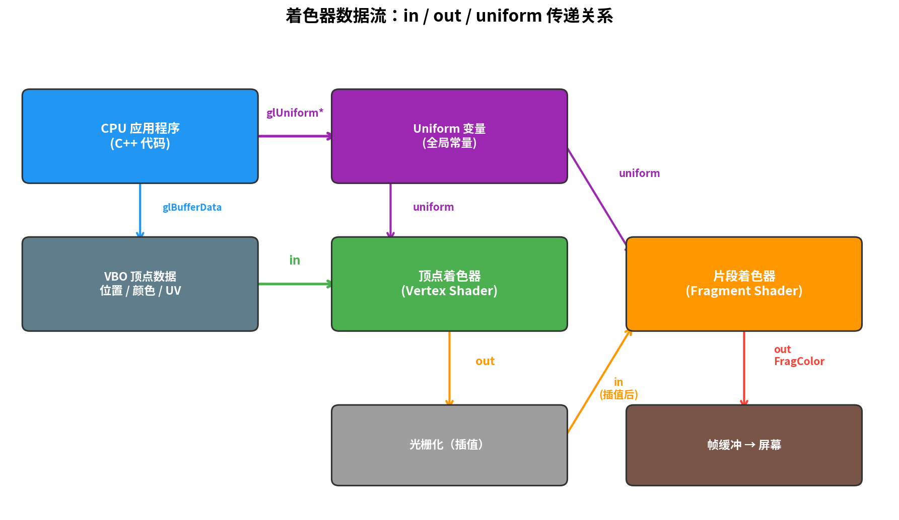
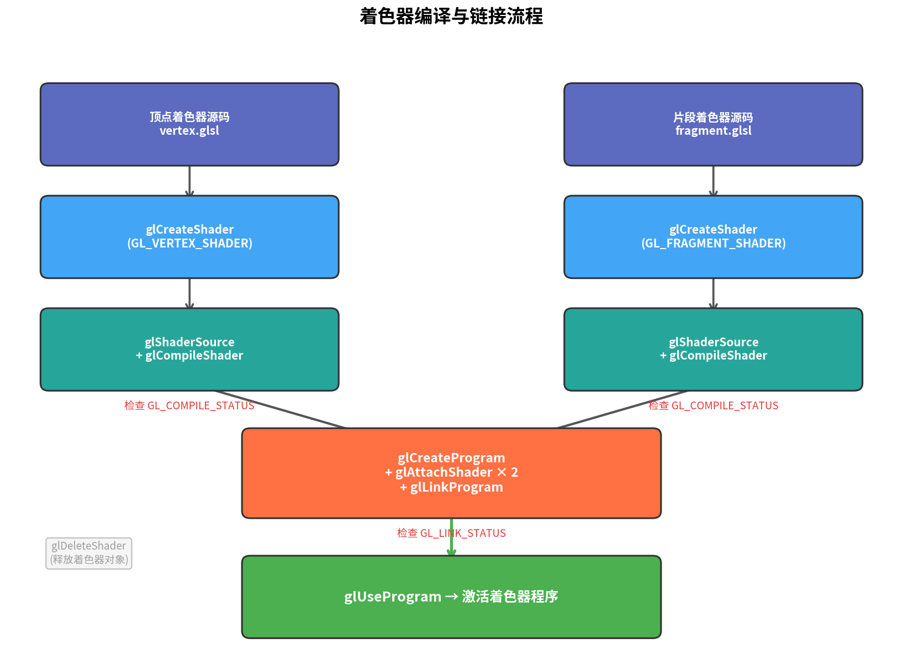

# 第3篇：深入着色器与 GLSL

## 前置知识

- 第1篇：开发环境搭建与第一个窗口
- 第2篇：渲染管线与第一个三角形
- 了解 VAO/VBO 的基本用法、能跑通第2篇的三角形

## 本篇目标

**掌握 GLSL 着色语言的核心语法，理解 CPU 与 GPU 之间的数据传递机制（in/out/uniform），并封装一个可复用的 Shader 工具类。**

完成本篇后，你将拥有一个随时间动态变色的三角形，以及一个后续章节都会复用的 `Shader` 类。

---

## 一、着色器到底是什么

在第2篇中，我们已经写过顶点着色器和片段着色器的硬编码字符串。本篇将正式学习它们背后的语言 —— **GLSL**（OpenGL Shading Language）。

着色器是运行在 **GPU** 上的小程序，每个顶点/片段都会并行执行一份。它们有自己的语法、类型系统和内置函数，但核心语法与 C 语言非常相似。



关键要点：
- **顶点着色器**：每个顶点执行一次，负责坐标变换，输出 `gl_Position`
- **片段着色器**：每个像素片段执行一次，负责计算最终颜色，输出 `FragColor`
- 顶点着色器的 `out` 变量会经过**光栅化插值**后传递给片段着色器的 `in` 变量

---

## 二、GLSL 语言基础

### 2.1 版本声明

每个着色器文件必须以版本声明开头：

```glsl
#version 330 core
```

`330` 对应 OpenGL 3.3，`core` 表示核心模式（不使用已废弃的功能）。

### 2.2 类型系统

GLSL 拥有丰富的向量和矩阵类型，这是它与 C 语言最大的区别：


**标量类型：**

| 类型 | 说明 | 示例 |
|------|------|------|
| `bool` | 布尔值 | `bool flag = true;` |
| `int` | 32位整数 | `int count = 10;` |
| `float` | 32位浮点数 | `float speed = 1.5;` |
| `uint` | 无符号整数 | `uint id = 3u;` |

**向量类型：**

| 类型 | 分量数 | 常见用途 |
|------|--------|----------|
| `vec2` | 2 (x,y) | 纹理坐标 |
| `vec3` | 3 (x,y,z / r,g,b) | 位置、颜色、法线 |
| `vec4` | 4 (x,y,z,w / r,g,b,a) | 齐次坐标、带透明度的颜色 |
| `ivec2/3/4` | 2/3/4 | 整数向量 |

**矩阵类型：**

| 类型 | 维度 | 常见用途 |
|------|------|----------|
| `mat2` | 2×2 | 2D旋转 |
| `mat3` | 3×3 | 法线变换 |
| `mat4` | 4×4 | MVP矩阵（模型/视图/投影变换） |

**采样器类型：**

| 类型 | 说明 |
|------|------|
| `sampler2D` | 2D纹理采样器（第4篇详解） |
| `samplerCube` | 立方体贴图采样器 |

### 2.3 Swizzling（分量重排）

GLSL 的向量支持灵活的分量访问，这是一个非常强大的语法糖：

```glsl
vec4 color = vec4(1.0, 0.5, 0.3, 1.0);

vec3 rgb = color.rgb;      // (1.0, 0.5, 0.3)
vec2 rg  = color.rg;       // (1.0, 0.5)
vec3 bgr = color.bgr;      // (0.3, 0.5, 1.0) 可以换序！
vec4 rrra = color.rrra;    // (1.0, 1.0, 1.0, 1.0) 可以重复！

// 等价的访问方式
color.x == color.r == color.s  // 第1个分量
color.y == color.g == color.t  // 第2个分量
color.z == color.b == color.p  // 第3个分量
color.w == color.a == color.q  // 第4个分量
```

三组访问方式（xyzw / rgba / stpq）不能混用，例如 `color.xg` 是非法的。

### 2.4 常用内置函数

| 函数 | 签名 | 说明 |
|------|------|------|
| `mix` | `mix(a, b, t)` | 线性插值：`a*(1-t) + b*t` |
| `clamp` | `clamp(x, min, max)` | 将 x 限制在 [min, max] |
| `step` | `step(edge, x)` | x < edge 返回 0.0，否则 1.0 |
| `smoothstep` | `smoothstep(a, b, x)` | 平滑版 step，Hermite 插值 |
| `normalize` | `normalize(v)` | 返回单位向量 |
| `dot` | `dot(a, b)` | 点积（光照计算核心） |
| `cross` | `cross(a, b)` | 叉积（仅 vec3） |
| `length` | `length(v)` | 向量长度 |
| `reflect` | `reflect(I, N)` | 反射向量 |
| `sin / cos` | `sin(x)` | 三角函数 |
| `pow` | `pow(x, y)` | 幂运算 |
| `abs` | `abs(x)` | 绝对值 |
| `min / max` | `min(a, b)` | 取较小/较大值 |
| `texture` | `texture(sampler, uv)` | 纹理采样（第4篇） |

**实用示例：**

```glsl
// 脉冲效果：0→1→0 平滑循环
float pulse = (sin(uTime * 2.0) + 1.0) * 0.5;

// 两种颜色之间平滑过渡
vec3 finalColor = mix(colorA, colorB, pulse);

// 限制亮度范围
finalColor = clamp(finalColor, 0.0, 1.0);
```

---

## 三、数据传递三件套

着色器程序需要接收外部数据才能工作。GLSL 提供了三种数据传递机制：

### 3.1 `in` / `out` —— 着色器间传递

```glsl
// ---- 顶点着色器 ----
#version 330 core
layout (location = 0) in vec3 aPos;    // 从 VBO 读入
layout (location = 1) in vec3 aColor;  // 从 VBO 读入

out vec3 vertexColor;                  // 输出给片段着色器

void main() {
    gl_Position = vec4(aPos, 1.0);
    vertexColor = aColor;              // 传递颜色
}
```

```glsl
// ---- 片段着色器 ----
#version 330 core
in vec3 vertexColor;    // 接收（名称必须与顶点着色器的 out 一致）
out vec4 FragColor;     // 最终输出颜色

void main() {
    FragColor = vec4(vertexColor, 1.0);
}
```

**重要规则：**
- 顶点着色器的 `out` 和片段着色器的 `in` 必须**同名同类型**
- 光栅化阶段会自动对 `out` 变量做**透视校正插值** —— 三角形顶点的不同颜色会在内部平滑过渡，这就是彩色三角形的原理

### 3.2 `layout(location = x)` —— 属性位置绑定

```glsl
layout (location = 0) in vec3 aPos;
layout (location = 1) in vec3 aColor;
```

`location` 是顶点属性的**槽位编号**，它将着色器中的变量与 C++ 代码中 `glVertexAttribPointer` 的第一个参数对应起来：

```cpp
// C++ 端：location = 0 → 位置
glVertexAttribPointer(0, 3, GL_FLOAT, GL_FALSE, 6 * sizeof(float), (void*)0);
glEnableVertexAttribArray(0);

// C++ 端：location = 1 → 颜色
glVertexAttribPointer(1, 3, GL_FLOAT, GL_FALSE, 6 * sizeof(float),
                      (void*)(3 * sizeof(float)));
glEnableVertexAttribArray(1);
```

### 3.3 `uniform` —— CPU 到 GPU 的通道

`uniform` 是从 C++ 程序向着色器传递数据的方式。与顶点属性不同，uniform 对所有顶点/片段都是**相同的值**（全局常量）。

```glsl
// 片段着色器中声明
uniform float uTime;
uniform vec3  uTintColor;
```

```cpp
// C++ 端设置值
shader.use();  // 必须先激活着色器！
shader.setFloat("uTime", glfwGetTime());
shader.setVec3("uTintColor", 1.0f, 0.5f, 0.3f);
```

**底层 API 调用流程：**

```cpp
// 1. 查询 uniform 位置
GLint loc = glGetUniformLocation(shaderProgram, "uTime");

// 2. 设置值（必须在 glUseProgram 之后）
glUniform1f(loc, timeValue);

// 不同类型使用不同的函数
glUniform1i(loc, intValue);           // int / bool / sampler
glUniform1f(loc, floatValue);         // float
glUniform3f(loc, x, y, z);           // vec3
glUniform4f(loc, x, y, z, w);        // vec4
glUniformMatrix4fv(loc, 1, GL_FALSE, matPtr);  // mat4
```

> ⚠️ 如果 `glGetUniformLocation` 返回 `-1`，说明该 uniform 不存在或被编译器优化掉了（声明了但从未在着色器中使用）。

---

## 四、着色器的编译与链接

着色器从源代码到可执行程序需要经历编译和链接两个阶段，类似 C/C++ 的构建流程：



完整流程：

```
1. glCreateShader(type)          → 创建着色器对象
2. glShaderSource(shader, src)   → 附加源码
3. glCompileShader(shader)       → 编译
4. glGetShaderiv(COMPILE_STATUS) → 检查编译结果
5. glCreateProgram()             → 创建程序对象
6. glAttachShader(program, vs)   → 附加顶点着色器
7. glAttachShader(program, fs)   → 附加片段着色器
8. glLinkProgram(program)        → 链接
9. glGetProgramiv(LINK_STATUS)   → 检查链接结果
10. glDeleteShader(vs / fs)      → 删除着色器对象（已链接到程序中）
11. glUseProgram(program)        → 激活程序
```

---

## 五、工程实践：封装 Shader 类

每次手写编译/链接代码既冗长又容易出错。我们将其封装为一个 `Shader` 类，后续所有章节都直接复用。

### 5.1 设计目标

- 从文件加载着色器源码（告别硬编码字符串）
- 自动编译 + 链接 + 错误检查
- 提供友好的 `setXxx()` 接口设置 uniform
- 头文件 only（header-only），无需额外 `.cpp`

### 5.2 完整头文件 `shader.h`

```cpp
#ifndef SHADER_H
#define SHADER_H

#include <glad/glad.h>
#include <glm/glm.hpp>
#include <string>
#include <fstream>
#include <sstream>
#include <iostream>

class Shader {
public:
    unsigned int ID;

    Shader(const char* vertexPath, const char* fragmentPath) {
        std::string vertexCode   = readFile(vertexPath);
        std::string fragmentCode = readFile(fragmentPath);

        unsigned int vertex   = compileShader(GL_VERTEX_SHADER,
                                              vertexCode.c_str(), vertexPath);
        unsigned int fragment = compileShader(GL_FRAGMENT_SHADER,
                                              fragmentCode.c_str(), fragmentPath);

        ID = glCreateProgram();
        glAttachShader(ID, vertex);
        glAttachShader(ID, fragment);
        glLinkProgram(ID);
        checkLinkErrors(ID);

        glDeleteShader(vertex);
        glDeleteShader(fragment);
    }

    ~Shader() { glDeleteProgram(ID); }

    void use() const { glUseProgram(ID); }

    // --- uniform 设置函数 ---
    void setBool(const std::string& name, bool value) const {
        glUniform1i(getLocation(name), static_cast<int>(value));
    }
    void setInt(const std::string& name, int value) const {
        glUniform1i(getLocation(name), value);
    }
    void setFloat(const std::string& name, float value) const {
        glUniform1f(getLocation(name), value);
    }
    void setVec2(const std::string& name, float x, float y) const {
        glUniform2f(getLocation(name), x, y);
    }
    void setVec2(const std::string& name, const glm::vec2& v) const {
        glUniform2f(getLocation(name), v.x, v.y);
    }
    void setVec3(const std::string& name, float x, float y, float z) const {
        glUniform3f(getLocation(name), x, y, z);
    }
    void setVec3(const std::string& name, const glm::vec3& v) const {
        glUniform3f(getLocation(name), v.x, v.y, v.z);
    }
    void setVec4(const std::string& name, float x, float y, float z, float w) const {
        glUniform4f(getLocation(name), x, y, z, w);
    }
    void setVec4(const std::string& name, const glm::vec4& v) const {
        glUniform4f(getLocation(name), v.x, v.y, v.z, v.w);
    }
    void setMat4(const std::string& name, const float* value) const {
        glUniformMatrix4fv(getLocation(name), 1, GL_FALSE, value);
    }
    void setMat4(const std::string& name, const glm::mat4& mat) const {
        glUniformMatrix4fv(getLocation(name), 1, GL_FALSE, &mat[0][0]);
    }

private:
    GLint getLocation(const std::string& name) const {
        GLint loc = glGetUniformLocation(ID, name.c_str());
        if (loc == -1)
            std::cerr << "[Shader] Warning: uniform '" << name
                      << "' not found (may be optimized out)." << std::endl;
        return loc;
    }

    static std::string readFile(const char* path) {
        std::ifstream file(path);
        if (!file.is_open()) {
            std::cerr << "[Shader] ERROR: cannot open file: " << path << std::endl;
            return "";
        }
        std::stringstream ss;
        ss << file.rdbuf();
        return ss.str();
    }

    static unsigned int compileShader(GLenum type, const char* source,
                                       const char* path) {
        unsigned int shader = glCreateShader(type);
        glShaderSource(shader, 1, &source, nullptr);
        glCompileShader(shader);

        int success;
        glGetShaderiv(shader, GL_COMPILE_STATUS, &success);
        if (!success) {
            char infoLog[1024];
            glGetShaderInfoLog(shader, sizeof(infoLog), nullptr, infoLog);
            const char* typeName = (type == GL_VERTEX_SHADER) ? "VERTEX" : "FRAGMENT";
            std::cerr << "[Shader] " << typeName << " compilation failed ("
                      << path << "):\n" << infoLog << std::endl;
        }
        return shader;
    }

    static void checkLinkErrors(unsigned int program) {
        int success;
        glGetProgramiv(program, GL_LINK_STATUS, &success);
        if (!success) {
            char infoLog[1024];
            glGetProgramInfoLog(program, sizeof(infoLog), nullptr, infoLog);
            std::cerr << "[Shader] PROGRAM linking failed:\n"
                      << infoLog << std::endl;
        }
    }
};

#endif
```

### 5.3 使用方式

```cpp
// 创建（自动编译+链接）
Shader shader("vertex.glsl", "fragment.glsl");

// 渲染循环中使用
shader.use();
shader.setFloat("uTime", glfwGetTime());
shader.setVec3("uTintColor", 1.0f, 0.5f, 0.3f);

// 也可以直接传入 GLM 类型（第5篇起常用）
shader.setVec3("uColor", glm::vec3(1.0f, 0.5f, 0.3f));
shader.setMat4("model", modelMatrix);  // glm::mat4
```

是不是比第2篇中手写的一大段编译代码清爽多了？

---

## 六、核心 API 速查

### 着色器编译链接

| 函数 | 作用 |
|------|------|
| `glCreateShader(type)` | 创建着色器对象（GL_VERTEX_SHADER / GL_FRAGMENT_SHADER） |
| `glShaderSource(shader, count, &src, len)` | 附加 GLSL 源码 |
| `glCompileShader(shader)` | 编译着色器 |
| `glGetShaderiv(shader, GL_COMPILE_STATUS, &ok)` | 查询编译结果 |
| `glGetShaderInfoLog(shader, len, &outLen, log)` | 获取编译错误日志 |
| `glCreateProgram()` | 创建着色器程序对象 |
| `glAttachShader(program, shader)` | 将编译好的着色器附加到程序 |
| `glLinkProgram(program)` | 链接着色器程序 |
| `glGetProgramiv(program, GL_LINK_STATUS, &ok)` | 查询链接结果 |
| `glGetProgramInfoLog(program, len, &outLen, log)` | 获取链接错误日志 |
| `glUseProgram(program)` | 激活/使用着色器程序 |
| `glDeleteShader(shader)` | 删除着色器对象 |
| `glDeleteProgram(program)` | 删除着色器程序 |

### Uniform 操作

| 函数 | 作用 |
|------|------|
| `glGetUniformLocation(program, name)` | 查询 uniform 变量的位置（返回 -1 表示未找到） |
| `glUniform1i(loc, v)` | 设置 int / bool / sampler |
| `glUniform1f(loc, v)` | 设置 float |
| `glUniform2f(loc, x, y)` | 设置 vec2 |
| `glUniform3f(loc, x, y, z)` | 设置 vec3 |
| `glUniform4f(loc, x, y, z, w)` | 设置 vec4 |
| `glUniformMatrix4fv(loc, count, transpose, ptr)` | 设置 mat4 |

---

## 七、完整代码实战

### 7.1 项目结构

```
03-深入着色器与GLSL/
├── article.md
├── images/
│   └── generate_images.py
└── src/
    ├── CMakeLists.txt
    ├── main.cpp
    ├── shader.h
    ├── vertex.glsl
    └── fragment.glsl
```

### 7.2 顶点着色器 `vertex.glsl`

```glsl
#version 330 core

layout (location = 0) in vec3 aPos;
layout (location = 1) in vec3 aColor;

out vec3 vertexColor;

void main() {
    gl_Position = vec4(aPos, 1.0);
    vertexColor = aColor;
}
```

- `layout(location = 0)` 绑定到 C++ 中 `glVertexAttribPointer` 的第一个参数
- `aPos` 接收每个顶点的位置，`aColor` 接收颜色
- `vertexColor` 传递给片段着色器，光栅化阶段会自动插值

### 7.3 片段着色器 `fragment.glsl`

```glsl
#version 330 core

in vec3 vertexColor;
out vec4 FragColor;

uniform float uTime;
uniform vec3  uTintColor;

void main() {
    float pulse = (sin(uTime * 2.0) + 1.0) * 0.5;
    vec3 finalColor = mix(vertexColor, uTintColor, pulse);
    FragColor = vec4(finalColor, 1.0);
}
```

- `vertexColor`：从顶点着色器接收的插值颜色
- `uTime`：CPU 每帧传入的时间值
- `uTintColor`：CPU 传入的动态色调
- `mix` + `sin`：产生脉动效果，三角形颜色在顶点原色和色调之间平滑切换

### 7.4 主程序 `main.cpp`

```cpp
#include <glad/glad.h>
#include <GLFW/glfw3.h>
#include <iostream>
#include <cmath>
#include "shader.h"

void framebuffer_size_callback(GLFWwindow* window, int width, int height) {
    glViewport(0, 0, width, height);
}

void processInput(GLFWwindow* window) {
    if (glfwGetKey(window, GLFW_KEY_ESCAPE) == GLFW_PRESS)
        glfwSetWindowShouldClose(window, true);
}

int main() {
    // ---------- 初始化 GLFW ----------
    if (!glfwInit()) {
        std::cerr << "Failed to initialize GLFW" << std::endl;
        return -1;
    }

    glfwWindowHint(GLFW_CONTEXT_VERSION_MAJOR, 3);
    glfwWindowHint(GLFW_CONTEXT_VERSION_MINOR, 3);
    glfwWindowHint(GLFW_OPENGL_PROFILE, GLFW_OPENGL_CORE_PROFILE);
#ifdef __APPLE__
    glfwWindowHint(GLFW_OPENGL_FORWARD_COMPAT, GL_TRUE);
#endif

    GLFWwindow* window = glfwCreateWindow(800, 600,
        "OpenGL Tutorial 03 - Shaders & GLSL", nullptr, nullptr);
    if (!window) {
        std::cerr << "Failed to create GLFW window" << std::endl;
        glfwTerminate();
        return -1;
    }
    glfwMakeContextCurrent(window);
    glfwSetFramebufferSizeCallback(window, framebuffer_size_callback);

    if (!gladLoadGLLoader((GLADloadproc)glfwGetProcAddress)) {
        std::cerr << "Failed to initialize GLAD" << std::endl;
        return -1;
    }

    std::cout << "OpenGL Version: " << glGetString(GL_VERSION) << std::endl;

    // ---------- 创建 Shader ----------
    Shader shader("vertex.glsl", "fragment.glsl");

    // ---------- 顶点数据：位置 + 颜色 ----------
    float vertices[] = {
        // 位置              // 颜色
        -0.5f, -0.5f, 0.0f,  1.0f, 0.0f, 0.0f,  // 左下 - 红
         0.5f, -0.5f, 0.0f,  0.0f, 1.0f, 0.0f,  // 右下 - 绿
         0.0f,  0.5f, 0.0f,  0.0f, 0.0f, 1.0f   // 顶部 - 蓝
    };

    unsigned int VAO, VBO;
    glGenVertexArrays(1, &VAO);
    glGenBuffers(1, &VBO);

    glBindVertexArray(VAO);

    glBindBuffer(GL_ARRAY_BUFFER, VBO);
    glBufferData(GL_ARRAY_BUFFER, sizeof(vertices), vertices, GL_STATIC_DRAW);

    // 位置属性 layout(location = 0)
    glVertexAttribPointer(0, 3, GL_FLOAT, GL_FALSE,
                          6 * sizeof(float), (void*)0);
    glEnableVertexAttribArray(0);

    // 颜色属性 layout(location = 1)
    glVertexAttribPointer(1, 3, GL_FLOAT, GL_FALSE,
                          6 * sizeof(float), (void*)(3 * sizeof(float)));
    glEnableVertexAttribArray(1);

    glBindVertexArray(0);

    // ---------- 渲染循环 ----------
    while (!glfwWindowShouldClose(window)) {
        processInput(window);

        glClearColor(0.15f, 0.15f, 0.18f, 1.0f);
        glClear(GL_COLOR_BUFFER_BIT);

        shader.use();

        float time = static_cast<float>(glfwGetTime());
        shader.setFloat("uTime", time);

        float r = (std::sin(time * 0.5f) + 1.0f) * 0.5f;
        float g = (std::sin(time * 0.3f + 2.0f) + 1.0f) * 0.5f;
        float b = (std::sin(time * 0.7f + 4.0f) + 1.0f) * 0.5f;
        shader.setVec3("uTintColor", r, g, b);

        glBindVertexArray(VAO);
        glDrawArrays(GL_TRIANGLES, 0, 3);

        glfwSwapBuffers(window);
        glfwPollEvents();
    }

    // ---------- 清理 ----------
    glDeleteVertexArrays(1, &VAO);
    glDeleteBuffers(1, &VBO);
    glfwTerminate();
    return 0;
}
```

### 7.5 CMakeLists.txt

```cmake
cmake_minimum_required(VERSION 3.16)
project(03_Shaders)

set(CMAKE_CXX_STANDARD 17)
set(CMAKE_CXX_STANDARD_REQUIRED ON)

find_package(glfw3 3.3 REQUIRED)
find_package(OpenGL REQUIRED)

set(GLAD_DIR "${CMAKE_SOURCE_DIR}/../common/third_party/glad"
    CACHE PATH "Path to GLAD directory")

add_library(glad STATIC ${GLAD_DIR}/src/glad.c)
target_include_directories(glad PUBLIC ${GLAD_DIR}/include)

add_executable(${PROJECT_NAME} main.cpp)
target_link_libraries(${PROJECT_NAME} PRIVATE glfw glad OpenGL::GL)

# 将着色器文件复制到构建输出目录
file(GLOB SHADER_FILES "${CMAKE_SOURCE_DIR}/*.glsl")
foreach(SHADER ${SHADER_FILES})
    get_filename_component(SHADER_NAME ${SHADER} NAME)
    configure_file(${SHADER} ${CMAKE_BINARY_DIR}/${SHADER_NAME} COPYONLY)
endforeach()
```

### 7.6 构建与运行

```bash
cd src
mkdir build && cd build
cmake ..
make
./03_Shaders
```

运行后你会看到一个三角形，三个顶点分别是红、绿、蓝，颜色在内部平滑插值，并且整体色调随时间脉动变化。按 ESC 退出。

---

## 八、常见问题

### Q1: 着色器编译失败但没有报错信息

一定要调用 `glGetShaderInfoLog` 获取日志。我们封装的 `Shader` 类已经自动做了这件事，请检查终端输出。

### Q2: uniform 设置无效，画面不变化

最常见原因：
1. **忘记调用 `glUseProgram`**：设置 uniform 前必须先激活对应的着色器程序
2. **名字写错了**：uniform 名称是字符串匹配，大小写敏感
3. **被优化掉了**：如果 uniform 在着色器中声明但未被使用，编译器会将其移除，`glGetUniformLocation` 返回 -1

### Q3: 三角形是纯色而不是渐变色

检查是否正确设置了两个顶点属性（位置 + 颜色）。确保 `stride`（步长）为 `6 * sizeof(float)`，颜色属性的 `offset` 为 `3 * sizeof(float)`。

### Q4: 着色器文件找不到

着色器文件路径是相对于**程序运行目录**的，而不是源码目录。CMakeLists.txt 中的 `configure_file` 会将 `.glsl` 文件复制到构建目录。如果直接从 IDE 运行，工作目录可能不同，需要设置运行配置。

### Q5: 顶点着色器的 out 和片段着色器的 in 对不上

两者必须**同名同类型**。例如顶点着色器输出 `out vec3 vertexColor`，片段着色器就必须有 `in vec3 vertexColor`，名称和类型都不能变。

---

## 九、练习

### 练习1：倒三角 + 自定义配色

修改顶点数据，将三角形上下翻转（顶点在下方，底边在上方），并将三个顶点颜色改为你喜欢的配色方案（例如 cyan/magenta/yellow）。

### 练习2：鼠标位置控制色调

使用 `glfwGetCursorPos` 获取鼠标位置，将其归一化到 [0,1] 后传入片段着色器作为 `uTintColor` 的 rg 分量。效果：鼠标移动时三角形颜色实时变化。

提示：
```cpp
double xpos, ypos;
glfwGetCursorPos(window, &xpos, &ypos);
float r = static_cast<float>(xpos) / 800.0f;
float g = static_cast<float>(ypos) / 600.0f;
```

### 练习3：扩展 Shader 类

为 `Shader` 类添加以下功能：
1. 添加 `setVec3(name, const float*)` 重载，接受 float 数组指针
2. 添加 uniform location 缓存（用 `std::unordered_map`），避免每帧重复查询
3. 添加一个 `reload()` 方法，支持运行时重新加载着色器文件（热重载）

---

## 十、参考资料

- [GLSL 规范 (OpenGL 3.3)](https://www.khronos.org/registry/OpenGL/specs/gl/GLSLangSpec.3.30.pdf)
- [OpenGL Reference Pages](https://docs.gl/)
- [LearnOpenGL - Shaders](https://learnopengl.com/Getting-started/Shaders)
- [The Book of Shaders](https://thebookofshaders.com/) — 强烈推荐的 GLSL 可视化学习资源

---
