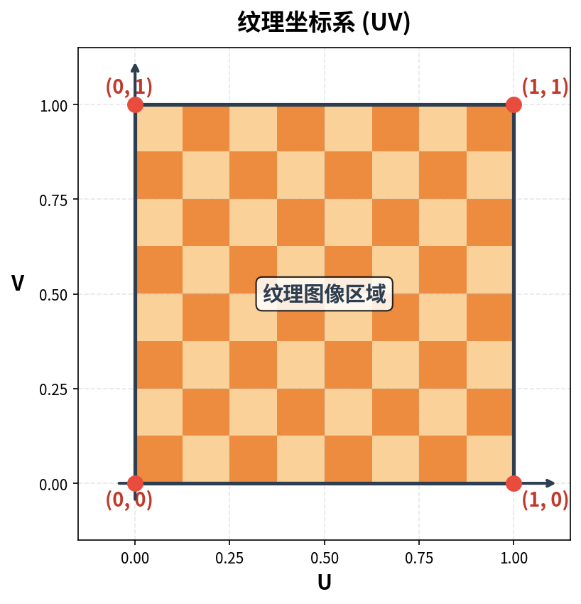
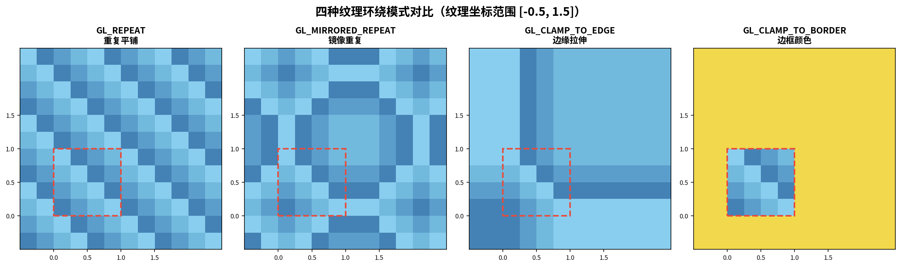
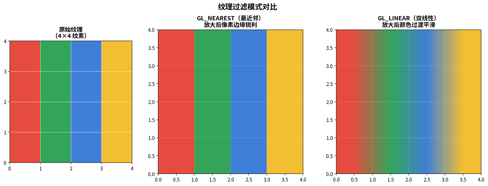
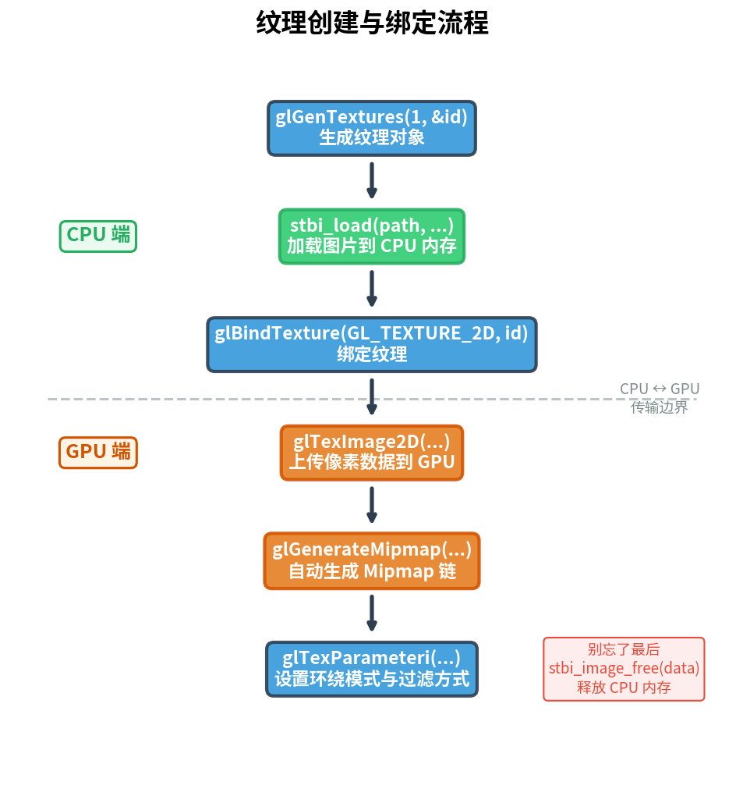

# 第4篇：纹理映射

## 前置知识

- 第1篇：开发环境搭建与第一个窗口
- 第2篇：渲染管线与第一个三角形
- 第3篇：深入着色器与 GLSL
- 理解顶点属性、着色器 uniform 的基本用法

## 本篇目标

**掌握 2D 纹理的加载、配置与使用，理解纹理坐标映射原理。**

完成本篇后，你将能够：
- 使用 stb_image 加载图片文件并生成 OpenGL 纹理
- 配置纹理的环绕模式与过滤方式
- 在片段着色器中采样多张纹理并用 `mix()` 混合
- 通过键盘动态调整纹理混合比例

---

## 一、纹理基础概念

在前几篇中，我们通过顶点颜色让图形变得多彩。但在真实的 3D 应用中，要让物体表面呈现丰富的细节（木纹、砖墙、皮肤），逐顶点指定颜色是不现实的。**纹理（Texture）** 就是为此而生的——它本质上是一张贴在几何体表面的图片。

### 1.1 纹理坐标系（UV）

为了把一张 2D 图片"贴"到 3D 几何体上，我们需要告诉 GPU：几何体表面的每个点对应图片的哪个位置。这就是 **纹理坐标（Texture Coordinates）**，也常称为 **UV 坐标**。



纹理坐标的规则：
- 取值范围通常在 **[0, 0]** 到 **[1, 1]** 之间
- **U 轴**（水平）：从左到右，0 → 1
- **V 轴**（垂直）：从下到上，0 → 1
- **(0, 0)** 位于纹理的左下角，**(1, 1)** 位于右上角
- 坐标值可以超出 [0,1] 范围，此时由**环绕模式**决定如何采样

在我们的代码中，矩形的四个顶点各自附带了纹理坐标：

```cpp
float vertices[] = {
//  位置                颜色              纹理坐标
     0.5f,  0.5f, 0.0f, 1.0f, 0.0f, 0.0f, 1.0f, 1.0f, // 右上
     0.5f, -0.5f, 0.0f, 0.0f, 1.0f, 0.0f, 1.0f, 0.0f, // 右下
    -0.5f, -0.5f, 0.0f, 0.0f, 0.0f, 1.0f, 0.0f, 0.0f, // 左下
    -0.5f,  0.5f, 0.0f, 1.0f, 1.0f, 0.0f, 0.0f, 1.0f  // 左上
};
```

右上角顶点的纹理坐标是 `(1.0, 1.0)`，左下角是 `(0.0, 0.0)`，这意味着整张纹理图恰好铺满整个矩形。

### 1.2 纹理环绕模式（Wrapping）

当纹理坐标超出 [0, 1] 范围时，OpenGL 需要知道如何处理。这由 **环绕模式（Wrapping Mode）** 控制，可以分别为 S（水平）和 T（垂直）方向独立设置。



OpenGL 提供了四种环绕模式：

| 模式 | 枚举值 | 效果 |
|------|--------|------|
| **Repeat** | `GL_REPEAT` | 纹理重复平铺（默认） |
| **Mirrored Repeat** | `GL_MIRRORED_REPEAT` | 每次重复时镜像翻转 |
| **Clamp to Edge** | `GL_CLAMP_TO_EDGE` | 超出部分使用边缘像素颜色 |
| **Clamp to Border** | `GL_CLAMP_TO_BORDER` | 超出部分使用指定的边框颜色 |

设置方式：

```cpp
glTexParameteri(GL_TEXTURE_2D, GL_TEXTURE_WRAP_S, GL_REPEAT);     // S 方向
glTexParameteri(GL_TEXTURE_2D, GL_TEXTURE_WRAP_T, GL_REPEAT);     // T 方向
```

如果选择 `GL_CLAMP_TO_BORDER`，还需要指定边框颜色：

```cpp
float borderColor[] = { 1.0f, 1.0f, 0.0f, 1.0f }; // 黄色
glTexParameterfv(GL_TEXTURE_2D, GL_TEXTURE_BORDER_COLOR, borderColor);
```

### 1.3 纹理过滤（Filtering）

纹理像素（texel）与屏幕像素（pixel）并不总是一一对应。当纹理被放大或缩小时，GPU 需要决定如何从已有纹素中采样出最终颜色，这就是**纹理过滤（Texture Filtering）**。



两种基本过滤方式：

| 过滤方式 | 枚举值 | 效果 | 适用场景 |
|----------|--------|------|----------|
| **最近邻** | `GL_NEAREST` | 取最近的一个纹素，像素边缘锐利 | 像素风格游戏 |
| **双线性** | `GL_LINEAR` | 对周围纹素做加权平均，过渡平滑 | 大多数场景 |

缩小纹理时还可以使用 **Mipmap**——一组预计算的、逐级缩小一半的纹理副本。GPU 会根据物体到摄像机的距离自动选择合适层级，既提升画质又节省带宽。

Mipmap 过滤选项（仅用于 `GL_TEXTURE_MIN_FILTER`）：

| 枚举值 | 含义 |
|--------|------|
| `GL_NEAREST_MIPMAP_NEAREST` | 选最近的 mip 层级，层内用最近邻 |
| `GL_LINEAR_MIPMAP_NEAREST` | 选最近的 mip 层级，层内用双线性 |
| `GL_NEAREST_MIPMAP_LINEAR` | 在两层 mip 之间线性插值，层内用最近邻 |
| `GL_LINEAR_MIPMAP_LINEAR` | 在两层 mip 之间线性插值，层内用双线性（最高质量） |

> **注意：** Mipmap 只在纹理缩小时有意义。`GL_TEXTURE_MAG_FILTER` 不要设置 mipmap 选项，否则会产生 `GL_INVALID_ENUM` 错误。

设置过滤：

```cpp
glTexParameteri(GL_TEXTURE_2D, GL_TEXTURE_MIN_FILTER, GL_LINEAR_MIPMAP_LINEAR);
glTexParameteri(GL_TEXTURE_2D, GL_TEXTURE_MAG_FILTER, GL_LINEAR);
```

---

## 二、使用 stb_image 加载图片

纹理图片存储在磁盘上（.jpg、.png 等），我们需要一个库来解码它们。本教程使用 **stb_image**——一个仅头文件的开源图片加载库，极其轻量。

### 2.1 引入方式

stb_image 是一个 header-only 库。在**恰好一个** `.cpp` 文件中定义宏 `STB_IMAGE_IMPLEMENTATION`，然后包含头文件：

```cpp
#define STB_IMAGE_IMPLEMENTATION
#include "stb_image.h"
```

> 不要在多个 `.cpp` 中定义该宏，否则会导致链接时重复定义错误。

### 2.2 加载图片

```cpp
int width, height, nrChannels;
unsigned char* data = stbi_load("textures/container.jpg",
                                &width, &height, &nrChannels, 0);
if (data) {
    // 加载成功，data 指向解码后的像素数据
} else {
    std::cerr << "Failed to load texture" << std::endl;
}

// 使用完毕后释放内存
stbi_image_free(data);
```

参数说明：
- `path`：图片文件路径
- `width / height`：输出图片的宽高（像素）
- `nrChannels`：输出颜色通道数（1=灰度，3=RGB，4=RGBA）
- 最后一个参数 `0` 表示保持原始通道数

### 2.3 翻转 Y 轴

OpenGL 期望纹理的 **(0, 0)** 在左下角，而大多数图片格式的原点在左上角。加载前调用：

```cpp
stbi_set_flip_vertically_on_load(true);
```

---

## 三、生成并配置 OpenGL 纹理对象

有了像素数据后，接下来把它上传到 GPU，并配置好参数。整个流程如下图所示：



### 3.1 完整流程

```cpp
unsigned int loadTexture(const char* path, bool flipY = true) {
    // 1. 生成纹理对象
    unsigned int textureID;
    glGenTextures(1, &textureID);

    // 2. 翻转Y轴（可选）
    stbi_set_flip_vertically_on_load(flipY);

    // 3. 加载图片
    int width, height, nrChannels;
    unsigned char* data = stbi_load(path, &width, &height, &nrChannels, 0);

    if (data) {
        // 根据通道数确定格式
        GLenum format = GL_RGB;
        if (nrChannels == 1)      format = GL_RED;
        else if (nrChannels == 3) format = GL_RGB;
        else if (nrChannels == 4) format = GL_RGBA;

        // 4. 绑定纹理
        glBindTexture(GL_TEXTURE_2D, textureID);

        // 5. 上传像素数据
        glTexImage2D(GL_TEXTURE_2D, 0, format, width, height, 0,
                     format, GL_UNSIGNED_BYTE, data);

        // 6. 生成 Mipmap
        glGenerateMipmap(GL_TEXTURE_2D);

        // 7. 设置环绕与过滤参数
        glTexParameteri(GL_TEXTURE_2D, GL_TEXTURE_WRAP_S, GL_REPEAT);
        glTexParameteri(GL_TEXTURE_2D, GL_TEXTURE_WRAP_T, GL_REPEAT);
        glTexParameteri(GL_TEXTURE_2D, GL_TEXTURE_MIN_FILTER,
                        GL_LINEAR_MIPMAP_LINEAR);
        glTexParameteri(GL_TEXTURE_2D, GL_TEXTURE_MAG_FILTER, GL_LINEAR);
    } else {
        std::cerr << "Failed to load texture: " << path << std::endl;
    }

    // 8. 释放 CPU 端图片内存
    stbi_image_free(data);

    return textureID;
}
```

### 3.2 glTexImage2D 参数详解

`glTexImage2D` 是上传纹理数据的核心函数，参数较多，逐一解释：

```cpp
glTexImage2D(GL_TEXTURE_2D,   // 纹理目标
             0,               // Mipmap 层级（0 = 基础层）
             GL_RGB,          // GPU 内部存储格式
             width, height,   // 纹理宽高
             0,               // 历史遗留参数，必须为 0
             GL_RGB,          // 源数据格式
             GL_UNSIGNED_BYTE,// 源数据类型
             data);           // 像素数据指针
```

> **关于 PNG 透明度：** 如果图片有 alpha 通道（如 `.png`），内部格式和源数据格式都要用 `GL_RGBA`，否则颜色会偏移。代码中通过 `nrChannels` 自动判断。

---

## 四、纹理单元与多纹理混合

OpenGL 支持同时绑定多张纹理，通过 **纹理单元（Texture Unit）** 实现。每个纹理单元就是一个"插槽"，着色器中的每个 `sampler2D` uniform 对应一个纹理单元编号。

### 4.1 绑定流程

```cpp
// 激活纹理单元 0，绑定第一张纹理
glActiveTexture(GL_TEXTURE0);
glBindTexture(GL_TEXTURE_2D, texture1);

// 激活纹理单元 1，绑定第二张纹理
glActiveTexture(GL_TEXTURE1);
glBindTexture(GL_TEXTURE_2D, texture2);
```

然后告诉着色器每个 sampler 对应哪个纹理单元：

```cpp
shader.use();
shader.setInt("texture1", 0);  // texture1 对应 GL_TEXTURE0
shader.setInt("texture2", 1);  // texture2 对应 GL_TEXTURE1
```

> `GL_TEXTURE0` 是默认激活的纹理单元。OpenGL 保证至少支持 16 个纹理单元（`GL_TEXTURE0` ~ `GL_TEXTURE15`）。

### 4.2 片段着色器中的纹理混合

在片段着色器中，使用 `texture()` 函数采样纹理，用 `mix()` 混合：

```glsl
#version 330 core

in vec3 ourColor;
in vec2 TexCoord;

out vec4 FragColor;

uniform sampler2D texture1;
uniform sampler2D texture2;
uniform float mixValue;

void main() {
    vec4 tex1 = texture(texture1, TexCoord);
    vec4 tex2 = texture(texture2, TexCoord);
    FragColor = mix(tex1, tex2, mixValue);
}
```

`mix(x, y, a)` 的公式为：**x × (1 - a) + y × a**。当 `mixValue = 0.0` 时只显示 `tex1`，`= 1.0` 时只显示 `tex2`。

### 4.3 顶点着色器

顶点着色器负责将纹理坐标传递给片段着色器：

```glsl
#version 330 core

layout (location = 0) in vec3 aPos;
layout (location = 1) in vec3 aColor;
layout (location = 2) in vec2 aTexCoord;

out vec3 ourColor;
out vec2 TexCoord;

void main() {
    gl_Position = vec4(aPos, 1.0);
    ourColor = aColor;
    TexCoord = aTexCoord;
}
```

注意 `layout (location = 2)` 与 C++ 端的顶点属性配置相对应：

```cpp
// 纹理坐标属性 layout(location = 2)
glVertexAttribPointer(2, 2, GL_FLOAT, GL_FALSE, 8 * sizeof(float),
                      (void*)(6 * sizeof(float)));
glEnableVertexAttribArray(2);
```

每个顶点有 8 个 float（3 位置 + 3 颜色 + 2 纹理坐标），纹理坐标从第 6 个 float 开始，占 2 个分量。

---

## 五、核心 API 速查表

| 函数 | 用途 | 关键参数 |
|------|------|----------|
| `glGenTextures(n, &id)` | 生成 n 个纹理对象，ID 写入 `id` | `n`：数量 |
| `glBindTexture(target, id)` | 将纹理绑定到指定目标 | `target`：`GL_TEXTURE_2D` 等 |
| `glTexParameteri(target, pname, param)` | 设置纹理参数（环绕/过滤） | 见下方参数列表 |
| `glTexImage2D(...)` | 上传 2D 纹理数据到 GPU | 9 个参数，详见 3.2 节 |
| `glGenerateMipmap(target)` | 为当前绑定的纹理自动生成 mipmap 链 | 须在 `glTexImage2D` 之后调用 |
| `glActiveTexture(unit)` | 激活指定纹理单元 | `GL_TEXTURE0` ~ `GL_TEXTURE15` |
| `glDeleteTextures(n, &id)` | 删除纹理对象，释放 GPU 资源 | 与 `glGenTextures` 配对 |

`glTexParameteri` 常用参数：

| `pname` | 可选值 |
|---------|--------|
| `GL_TEXTURE_WRAP_S` | `GL_REPEAT`, `GL_MIRRORED_REPEAT`, `GL_CLAMP_TO_EDGE`, `GL_CLAMP_TO_BORDER` |
| `GL_TEXTURE_WRAP_T` | 同上 |
| `GL_TEXTURE_MIN_FILTER` | `GL_NEAREST`, `GL_LINEAR`, 及 4 种 mipmap 变体 |
| `GL_TEXTURE_MAG_FILTER` | `GL_NEAREST`, `GL_LINEAR` |

---

## 六、完整代码解析

下面对 `src/main.cpp` 的关键部分进行逐段解析。

### 6.1 引入 stb_image

```cpp
#define STB_IMAGE_IMPLEMENTATION
#include "stb_image.h"
```

`STB_IMAGE_IMPLEMENTATION` 宏使 stb_image 在这个编译单元中生成函数实现。整个项目只能定义一次。

### 6.2 键盘交互：动态调节混合值

```cpp
float mixValue = 0.5f;

void processInput(GLFWwindow* window) {
    if (glfwGetKey(window, GLFW_KEY_ESCAPE) == GLFW_PRESS)
        glfwSetWindowShouldClose(window, true);

    if (glfwGetKey(window, GLFW_KEY_UP) == GLFW_PRESS) {
        mixValue += 0.01f;
        if (mixValue > 1.0f) mixValue = 1.0f;
    }
    if (glfwGetKey(window, GLFW_KEY_DOWN) == GLFW_PRESS) {
        mixValue -= 0.01f;
        if (mixValue < 0.0f) mixValue = 0.0f;
    }
}
```

按 **↑** 键增加第二张纹理的比重，按 **↓** 键减少，`mixValue` 始终被限制在 [0, 1] 范围内。

### 6.3 纹理加载函数

```cpp
unsigned int loadTexture(const char* path, bool flipY = true) {
    unsigned int textureID;
    glGenTextures(1, &textureID);
    stbi_set_flip_vertically_on_load(flipY);

    int width, height, nrChannels;
    unsigned char* data = stbi_load(path, &width, &height, &nrChannels, 0);
    if (data) {
        GLenum format = GL_RGB;
        if (nrChannels == 1)      format = GL_RED;
        else if (nrChannels == 3) format = GL_RGB;
        else if (nrChannels == 4) format = GL_RGBA;

        glBindTexture(GL_TEXTURE_2D, textureID);
        glTexImage2D(GL_TEXTURE_2D, 0, format, width, height, 0,
                     format, GL_UNSIGNED_BYTE, data);
        glGenerateMipmap(GL_TEXTURE_2D);

        glTexParameteri(GL_TEXTURE_2D, GL_TEXTURE_WRAP_S, GL_REPEAT);
        glTexParameteri(GL_TEXTURE_2D, GL_TEXTURE_WRAP_T, GL_REPEAT);
        glTexParameteri(GL_TEXTURE_2D, GL_TEXTURE_MIN_FILTER,
                        GL_LINEAR_MIPMAP_LINEAR);
        glTexParameteri(GL_TEXTURE_2D, GL_TEXTURE_MAG_FILTER, GL_LINEAR);

        std::cout << "Texture loaded: " << path
                  << " (" << width << "x" << height
                  << ", " << nrChannels << " channels)" << std::endl;
    } else {
        std::cerr << "Failed to load texture: " << path << std::endl;
    }
    stbi_image_free(data);
    return textureID;
}
```

这个函数封装了纹理加载的完整流程：生成 → 加载图片 → 绑定 → 上传 → 生成 mipmap → 设置参数 → 释放 CPU 内存。`flipY` 参数控制是否翻转 Y 轴，默认为 `true`。

### 6.4 顶点数据布局

```cpp
float vertices[] = {
//  位置                颜色              纹理坐标
     0.5f,  0.5f, 0.0f, 1.0f, 0.0f, 0.0f, 1.0f, 1.0f,
     0.5f, -0.5f, 0.0f, 0.0f, 1.0f, 0.0f, 1.0f, 0.0f,
    -0.5f, -0.5f, 0.0f, 0.0f, 0.0f, 1.0f, 0.0f, 0.0f,
    -0.5f,  0.5f, 0.0f, 1.0f, 1.0f, 0.0f, 0.0f, 1.0f
};
```

与第2篇、第3篇的区别在于，每个顶点多了 2 个 float 的纹理坐标。**步长（stride）** 变为 `8 * sizeof(float)`，纹理坐标的偏移量是 `6 * sizeof(float)`。

### 6.5 渲染循环

```cpp
while (!glfwWindowShouldClose(window)) {
    processInput(window);

    glClearColor(0.15f, 0.15f, 0.18f, 1.0f);
    glClear(GL_COLOR_BUFFER_BIT);

    // 绑定纹理到对应纹理单元
    glActiveTexture(GL_TEXTURE0);
    glBindTexture(GL_TEXTURE_2D, texture1);
    glActiveTexture(GL_TEXTURE1);
    glBindTexture(GL_TEXTURE_2D, texture2);

    shader.use();
    shader.setFloat("mixValue", mixValue);

    glBindVertexArray(VAO);
    glDrawElements(GL_TRIANGLES, 6, GL_UNSIGNED_INT, 0);

    glfwSwapBuffers(window);
    glfwPollEvents();
}
```

每帧渲染前：
1. 处理键盘输入，更新 `mixValue`
2. 清屏
3. 激活两个纹理单元并绑定对应纹理
4. 设置 uniform 变量
5. 绘制矩形（2 个三角形，6 个索引）

### 6.6 资源清理

```cpp
glDeleteVertexArrays(1, &VAO);
glDeleteBuffers(1, &VBO);
glDeleteBuffers(1, &EBO);
glDeleteTextures(1, &texture1);
glDeleteTextures(1, &texture2);
glfwTerminate();
```

程序退出时，除了删除 VAO/VBO/EBO，还要调用 `glDeleteTextures` 释放 GPU 上的纹理资源。

---

## 七、常见问题

### Q1：纹理显示为纯黑或纯白？

最常见的原因：
- 图片文件路径错误，`stbi_load` 返回 `nullptr`（检查控制台输出）
- 纹理单元编号设置不正确（`shader.setInt("texture1", 0)` 忘了调用）
- 忘记调用 `shader.use()` 就设置 uniform

### Q2：纹理上下颠倒？

OpenGL 纹理坐标的 Y 轴方向与大多数图片格式相反。解决方案：
- 加载前调用 `stbi_set_flip_vertically_on_load(true)`
- 或在着色器中翻转：`texture(tex, vec2(TexCoord.x, 1.0 - TexCoord.y))`

### Q3：PNG 纹理颜色异常（偏紫/偏绿）？

通道数不匹配。PNG 通常有 4 个通道（RGBA），但如果你用 `GL_RGB` 格式上传，像素就会错位。要根据 `nrChannels` 动态选择 `GL_RGB` 或 `GL_RGBA`。

### Q4：放大后纹理为什么出现马赛克？

使用了 `GL_NEAREST` 过滤。如果希望平滑效果，改用 `GL_LINEAR`：

```cpp
glTexParameteri(GL_TEXTURE_2D, GL_TEXTURE_MAG_FILTER, GL_LINEAR);
```

### Q5：Mipmap 相关的 GL_INVALID_ENUM 错误？

`GL_TEXTURE_MAG_FILTER`（放大过滤）不接受 mipmap 选项。Mipmap 只在缩小时有意义。确保放大过滤只用 `GL_NEAREST` 或 `GL_LINEAR`：

```cpp
// 正确
glTexParameteri(GL_TEXTURE_2D, GL_TEXTURE_MAG_FILTER, GL_LINEAR);

// 错误！会产生 GL_INVALID_ENUM
glTexParameteri(GL_TEXTURE_2D, GL_TEXTURE_MAG_FILTER, GL_LINEAR_MIPMAP_LINEAR);
```

---

## 八、练习题

### 练习 1：修改纹理坐标实现 2×2 平铺

将矩形的纹理坐标从 `[0,1]` 范围改为 `[0,2]`，使纹理在矩形表面重复平铺 2×2 次。观察 `GL_REPEAT` 和 `GL_CLAMP_TO_EDGE` 模式下的不同效果。

**提示：** 只需修改 `vertices` 数组中的纹理坐标值。

### 练习 2：只显示纹理中心区域

修改纹理坐标，让矩形只显示纹理图片的中心 50% 区域（即纹理坐标从 `(0.25, 0.25)` 到 `(0.75, 0.75)`）。

**提示：** 这相当于"放大"显示纹理的一部分。

### 练习 3：使用键盘切换过滤模式

扩展 `processInput` 函数，按 `N` 键切换到 `GL_NEAREST`，按 `L` 键切换到 `GL_LINEAR`，实时观察两种过滤方式的差异（在纹理被放大时差异最明显）。

**提示：** 运行时也可以调用 `glTexParameteri` 修改纹理参数。

---

## 九、参考资料

- [LearnOpenGL - Textures](https://learnopengl.com/Getting-started/Textures)
- [OpenGL Reference - glTexImage2D](https://registry.khronos.org/OpenGL-Refpages/gl4/html/glTexImage2D.xhtml)
- [OpenGL Reference - glTexParameter](https://registry.khronos.org/OpenGL-Refpages/gl4/html/glTexParameter.xhtml)
- [stb_image GitHub](https://github.com/nothings/stb/blob/master/stb_image.h)
- [OpenGL Wiki - Texture](https://www.khronos.org/opengl/wiki/Texture)

---
