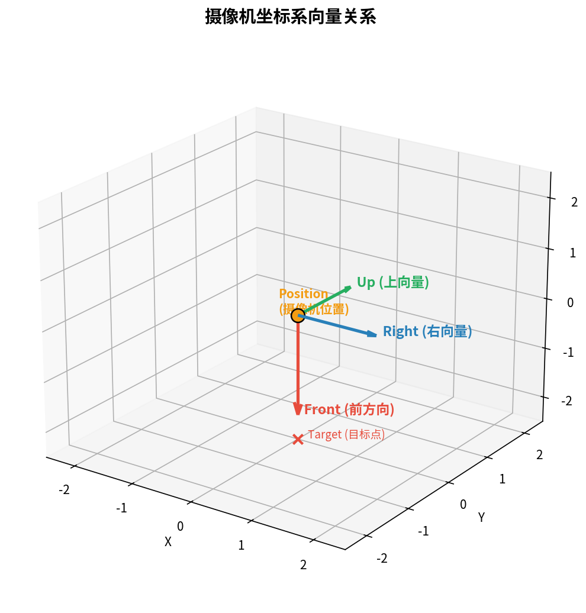
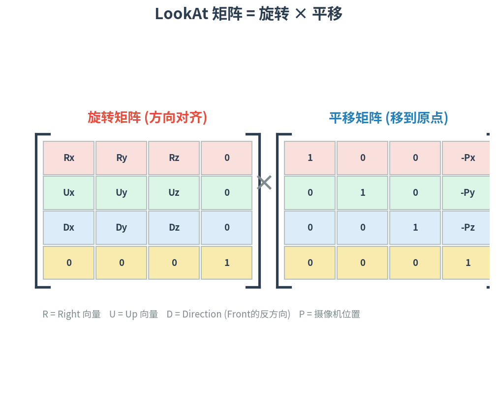
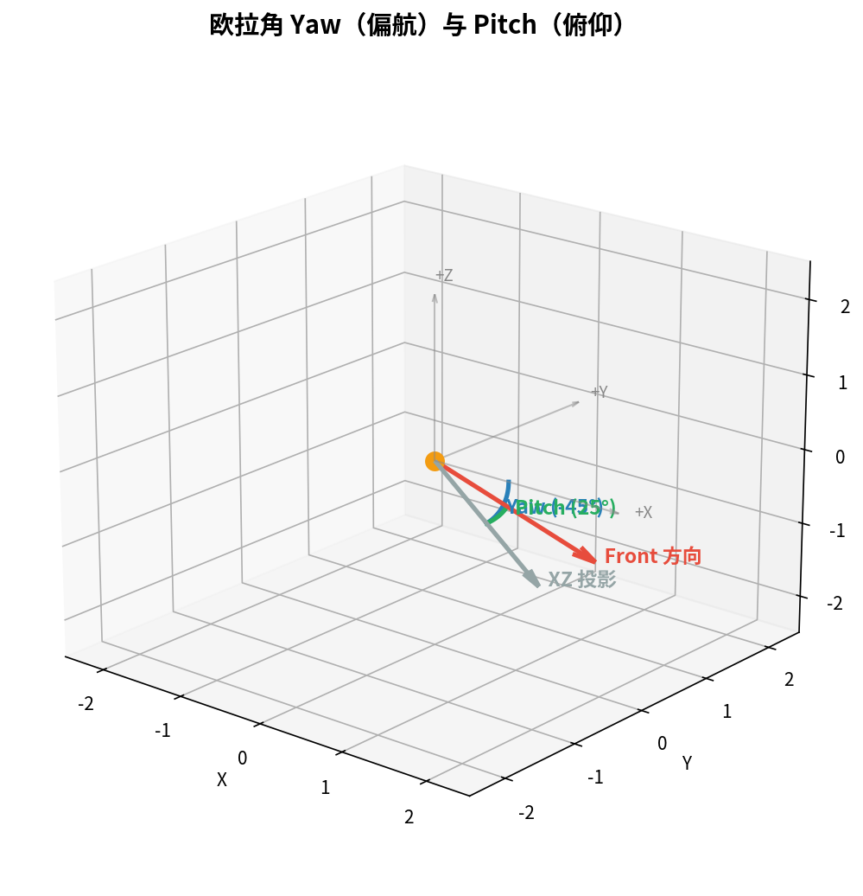

# 第 6 篇：摄像机系统 — 构建 FPS 风格自由视角

> **前置知识**：第 1–5 篇（窗口创建、三角形、着色器、纹理、坐标系统与矩阵变换）
>
> **本篇目标**：从零构建一个完整的 FPS 风格摄像机，实现 **键盘 WASD 移动 + 鼠标视角控制 + 滚轮缩放**，并将其封装为可复用的 `Camera` 类。

---

## 1. 为什么需要摄像机？

在上一篇中，我们通过 Model、View、Projection 三个矩阵将 3D 物体投影到屏幕上。其中 **View 矩阵**决定了"观察者站在哪里、朝哪里看"——这正是摄像机所做的事情。

OpenGL 本身没有"摄像机"的概念。我们所做的，是 **移动整个世界到摄像机的反方向**，从而制造出摄像机在移动的错觉。

---

## 2. 摄像机坐标系

一个摄像机由四个向量完全定义：



| 向量 | 含义 | 计算方式 |
|------|------|----------|
| **Position** | 摄像机在世界空间中的位置 | 直接指定 |
| **Front** | 摄像机注视的前方向（单位向量） | 由欧拉角计算 |
| **Right** | 摄像机的右方向 | `normalize(cross(Front, WorldUp))` |
| **Up** | 摄像机的上方向 | `normalize(cross(Right, Front))` |

> `WorldUp` 通常固定为 `(0, 1, 0)`，代表世界空间中"天空朝上"。

---

## 3. LookAt 矩阵原理推导

GLM 提供了 `glm::lookAt()` 函数来生成 View 矩阵，但理解其内部原理至关重要。

### 3.1 直觉

View 矩阵需要做两件事：
1. **平移**：把世界原点移到摄像机位置（取反）
2. **旋转**：让摄像机的三个轴对齐到标准坐标轴

### 3.2 公式



$$
\text{LookAt} =
\begin{bmatrix}
R_x & R_y & R_z & 0 \\
U_x & U_y & U_z & 0 \\
D_x & D_y & D_z & 0 \\
0   & 0   & 0   & 1
\end{bmatrix}
\times
\begin{bmatrix}
1 & 0 & 0 & -P_x \\
0 & 1 & 0 & -P_y \\
0 & 0 & 1 & -P_z \\
0 & 0 & 0 & 1
\end{bmatrix}
$$

其中：
- **R** = Right 向量（摄像机的 +X 轴）
- **U** = Up 向量（摄像机的 +Y 轴）
- **D** = Direction = `-Front`（摄像机的 +Z 轴，注意 OpenGL 的摄像机朝 -Z 看）
- **P** = Position（摄像机位置）

### 3.3 在代码中使用

```cpp
glm::mat4 view = glm::lookAt(
    cameraPos,                   // 摄像机位置
    cameraPos + cameraFront,     // 目标点（位置 + 前方向）
    cameraUp                     // 上向量
);
```

> 注意：我们传入的目标点是 `Position + Front`，而不是一个固定的世界坐标。这样摄像机转向时，目标点会跟着更新。

---

## 4. 欧拉角与鼠标视角控制

### 4.1 什么是欧拉角？

**欧拉角（Euler Angles）** 用两个角度描述摄像机的朝向：



| 角度 | 英文 | 含义 | 旋转轴 | 范围 |
|------|------|------|--------|------|
| 偏航角 | **Yaw** | 水平转头（左右看） | Y 轴 | 无限制（通常 0°~360°） |
| 俯仰角 | **Pitch** | 垂直点头（上下看） | X 轴 | 限制在 -89°~89° |

> 我们不使用第三个欧拉角 **Roll**（翻滚），因为 FPS 摄像机不需要歪头。

### 4.2 从欧拉角计算 Front 向量

```cpp
glm::vec3 front;
front.x = cos(glm::radians(Yaw)) * cos(glm::radians(Pitch));
front.y = sin(glm::radians(Pitch));
front.z = sin(glm::radians(Yaw)) * cos(glm::radians(Pitch));
Front = glm::normalize(front);
```

**推导过程**：

1. 仅考虑 Yaw（在 XZ 平面旋转）：`x = cos(Yaw), z = sin(Yaw)`
2. 加入 Pitch（在竖直方向倾斜）：水平分量乘以 `cos(Pitch)`，竖直分量为 `sin(Pitch)`
3. 最终归一化得到单位方向向量

### 4.3 鼠标回调

```cpp
void mouse_callback(GLFWwindow* window, double xpos, double ypos)
{
    float xoffset = xpos - lastX;
    float yoffset = lastY - ypos; // 注意 Y 反转
    lastX = xpos;
    lastY = ypos;

    camera.ProcessMouseMovement(xoffset, yoffset);
}
```

**为什么 Y 要反转？** 屏幕坐标系 Y 轴向下，而 OpenGL 世界坐标系 Y 轴向上。鼠标向上移动时 `ypos` 减小，但我们希望 Pitch 增加（仰头），所以需要 `lastY - ypos`。

### 4.4 首次鼠标进入处理

窗口刚获得鼠标焦点时，`lastX/lastY` 可能与实际鼠标位置差异很大，导致画面突然跳转。解决方法：

```cpp
if (firstMouse) {
    lastX = xpos;
    lastY = ypos;
    firstMouse = false;
}
```

---

## 5. 键盘 WASD 移动

移动的核心思想：**沿着摄像机自身的方向向量移动，而不是沿世界坐标轴移动**。

```cpp
void ProcessKeyboard(Camera_Movement direction, float deltaTime)
{
    float velocity = MovementSpeed * deltaTime;
    if (direction == FORWARD)
        Position += Front * velocity;
    if (direction == BACKWARD)
        Position -= Front * velocity;
    if (direction == LEFT)
        Position -= Right * velocity;
    if (direction == RIGHT)
        Position += Right * velocity;
}
```

| 按键 | 移动方向 | 向量运算 |
|------|----------|----------|
| W | 向前 | `Position += Front * velocity` |
| S | 向后 | `Position -= Front * velocity` |
| A | 向左 | `Position -= Right * velocity` |
| D | 向右 | `Position += Right * velocity` |

---

## 6. 滚轮缩放（动态 FOV）

传统的"缩放"其实不是移动摄像机，而是改变 **投影矩阵的视野角（FOV）**：

```cpp
void ProcessMouseScroll(float yoffset)
{
    Zoom -= yoffset;
    if (Zoom < 1.0f)
        Zoom = 1.0f;
    if (Zoom > 45.0f)
        Zoom = 45.0f;
}
```

然后在渲染循环中使用 `camera.Zoom` 作为 FOV：

```cpp
glm::mat4 projection = glm::perspective(
    glm::radians(camera.Zoom),  // 动态 FOV
    (float)SCR_WIDTH / SCR_HEIGHT,
    0.1f, 100.0f
);
```

- `Zoom = 45°` 是默认视野（正常视角）
- `Zoom = 1°` 极度放大（望远镜效果）
- FOV 越小，物体看起来越大

---

## 7. deltaTime — 帧率无关移动

不同机器的帧率不同（30fps vs 144fps），如果每帧移动固定距离，高帧率的机器上角色会"飞"起来。

**解决方案**：用 **deltaTime**（两帧之间的时间差）乘以速度。

```cpp
float currentFrame = glfwGetTime();
deltaTime = currentFrame - lastFrame;
lastFrame = currentFrame;

// 在 ProcessKeyboard 中
float velocity = MovementSpeed * deltaTime;
```

| 帧率 | deltaTime | 每帧移动（Speed=2.5） | 每秒总移动 |
|------|-----------|----------------------|-----------|
| 60 fps | 0.0167s | 0.042 | 2.5 |
| 144 fps | 0.0069s | 0.017 | 2.5 |
| 30 fps | 0.0333s | 0.083 | 2.5 |

无论帧率如何，每秒移动距离恒为 `MovementSpeed`。

---

## 8. Camera 类封装设计

将所有逻辑封装到一个 header-only 的 `Camera` 类中：

```
camera.h
├── Camera_Movement 枚举        // FORWARD, BACKWARD, LEFT, RIGHT
├── 默认参数常量                // YAW, PITCH, SPEED, SENSITIVITY, ZOOM
└── Camera 类
    ├── 公开属性
    │   ├── Position, Front, Up, Right, WorldUp
    │   ├── Yaw, Pitch
    │   └── MovementSpeed, MouseSensitivity, Zoom
    ├── 构造函数（两种重载）
    ├── GetViewMatrix()          // 返回 lookAt 矩阵
    ├── ProcessKeyboard()        // 处理 WASD
    ├── ProcessMouseMovement()   // 处理鼠标移动
    ├── ProcessMouseScroll()     // 处理滚轮缩放
    └── (private) updateCameraVectors()  // 根据欧拉角重算方向向量
```

### 设计原则

1. **Header-only**：无需额外 .cpp 文件，直接 `#include` 即可使用
2. **输入与渲染解耦**：Camera 类不直接读取 GLFW 事件，而是由外部回调函数传入参数
3. **欧拉角驱动**：所有方向变化通过修改 Yaw/Pitch → 重算向量来完成
4. **Pitch 约束**：限制在 ±89° 避免万向锁

---

## 9. 核心 API 速查表

| API | 功能 | 典型调用 |
|-----|------|----------|
| `Camera(pos, up, yaw, pitch)` | 构造摄像机 | `Camera camera(glm::vec3(0,0,3))` |
| `GetViewMatrix()` | 获取 View 矩阵 | `shader.setMat4("view", camera.GetViewMatrix())` |
| `ProcessKeyboard(dir, dt)` | 键盘移动 | `camera.ProcessKeyboard(FORWARD, deltaTime)` |
| `ProcessMouseMovement(xoff, yoff)` | 鼠标旋转 | 在鼠标回调中调用 |
| `ProcessMouseScroll(yoff)` | 滚轮缩放 | 在滚轮回调中调用 |
| `camera.Zoom` | 当前 FOV | 用于 `glm::perspective()` |
| `camera.Position` | 当前位置 | 可用于碰撞检测等 |

---

## 10. 完整代码

### 10.1 camera.h

```cpp
#ifndef CAMERA_H
#define CAMERA_H

#include <glad/glad.h>
#include <glm/glm.hpp>
#include <glm/gtc/matrix_transform.hpp>
#include <vector>

enum Camera_Movement {
    FORWARD,
    BACKWARD,
    LEFT,
    RIGHT
};

const float YAW         = -90.0f;
const float PITCH       =  0.0f;
const float SPEED        =  2.5f;
const float SENSITIVITY  =  0.1f;
const float ZOOM         =  45.0f;

class Camera
{
public:
    // 摄像机属性
    glm::vec3 Position;
    glm::vec3 Front;
    glm::vec3 Up;
    glm::vec3 Right;
    glm::vec3 WorldUp;

    // 欧拉角
    float Yaw;
    float Pitch;

    // 选项
    float MovementSpeed;
    float MouseSensitivity;
    float Zoom;

    // 构造函数（向量版）
    Camera(glm::vec3 position = glm::vec3(0.0f, 0.0f, 3.0f),
           glm::vec3 up       = glm::vec3(0.0f, 1.0f, 0.0f),
           float yaw = YAW, float pitch = PITCH)
        : Front(glm::vec3(0.0f, 0.0f, -1.0f)),
          MovementSpeed(SPEED),
          MouseSensitivity(SENSITIVITY),
          Zoom(ZOOM)
    {
        Position = position;
        WorldUp  = up;
        Yaw      = yaw;
        Pitch    = pitch;
        updateCameraVectors();
    }

    // 构造函数（标量版）
    Camera(float posX, float posY, float posZ,
           float upX,  float upY,  float upZ,
           float yaw, float pitch)
        : Front(glm::vec3(0.0f, 0.0f, -1.0f)),
          MovementSpeed(SPEED),
          MouseSensitivity(SENSITIVITY),
          Zoom(ZOOM)
    {
        Position = glm::vec3(posX, posY, posZ);
        WorldUp  = glm::vec3(upX,  upY,  upZ);
        Yaw      = yaw;
        Pitch    = pitch;
        updateCameraVectors();
    }

    // 返回 View 矩阵
    glm::mat4 GetViewMatrix()
    {
        return glm::lookAt(Position, Position + Front, Up);
    }

    // 处理键盘输入
    void ProcessKeyboard(Camera_Movement direction, float deltaTime)
    {
        float velocity = MovementSpeed * deltaTime;
        if (direction == FORWARD)
            Position += Front * velocity;
        if (direction == BACKWARD)
            Position -= Front * velocity;
        if (direction == LEFT)
            Position -= Right * velocity;
        if (direction == RIGHT)
            Position += Right * velocity;
    }

    // 处理鼠标移动
    void ProcessMouseMovement(float xoffset, float yoffset,
                              GLboolean constrainPitch = true)
    {
        xoffset *= MouseSensitivity;
        yoffset *= MouseSensitivity;

        Yaw   += xoffset;
        Pitch += yoffset;

        if (constrainPitch)
        {
            if (Pitch > 89.0f)
                Pitch = 89.0f;
            if (Pitch < -89.0f)
                Pitch = -89.0f;
        }

        updateCameraVectors();
    }

    // 处理鼠标滚轮
    void ProcessMouseScroll(float yoffset)
    {
        Zoom -= (float)yoffset;
        if (Zoom < 1.0f)
            Zoom = 1.0f;
        if (Zoom > 45.0f)
            Zoom = 45.0f;
    }

private:
    // 根据当前欧拉角重新计算 Front、Right、Up
    void updateCameraVectors()
    {
        glm::vec3 front;
        front.x = cos(glm::radians(Yaw)) * cos(glm::radians(Pitch));
        front.y = sin(glm::radians(Pitch));
        front.z = sin(glm::radians(Yaw)) * cos(glm::radians(Pitch));
        Front   = glm::normalize(front);

        Right = glm::normalize(glm::cross(Front, WorldUp));
        Up    = glm::normalize(glm::cross(Right, Front));
    }
};

#endif
```

### 10.2 顶点着色器（`shaders/vertex.glsl`）

```glsl
#version 330 core
layout (location = 0) in vec3 aPos;

uniform mat4 model;
uniform mat4 view;
uniform mat4 projection;

out vec3 FragPos;

void main()
{
    FragPos = aPos;
    gl_Position = projection * view * model * vec4(aPos, 1.0);
}
```

### 10.3 片段着色器（`shaders/fragment.glsl`）

```glsl
#version 330 core
in vec3 FragPos;
out vec4 FragColor;

uniform vec3 cubeColor;

void main()
{
    vec3 dx = dFdx(FragPos);
    vec3 dy = dFdy(FragPos);
    vec3 normal = normalize(cross(dx, dy));

    vec3 lightDir = normalize(vec3(0.5, 1.0, 0.8));
    float diff = max(dot(normal, lightDir), 0.0);
    vec3 ambient = 0.3 * cubeColor;
    vec3 diffuse = diff * cubeColor;

    FragColor = vec4(ambient + diffuse, 1.0);
}
```

### 10.4 main.cpp

```cpp
#include <glad/glad.h>
#include <GLFW/glfw3.h>

#include <glm/glm.hpp>
#include <glm/gtc/matrix_transform.hpp>
#include <glm/gtc/type_ptr.hpp>

#include "shader.h"
#include "camera.h"

#include <iostream>
#include <cmath>

// ---------- 函数声明 ----------
void framebuffer_size_callback(GLFWwindow* window, int width, int height);
void mouse_callback(GLFWwindow* window, double xpos, double ypos);
void scroll_callback(GLFWwindow* window, double xoffset, double yoffset);
void processInput(GLFWwindow* window);

// ---------- 全局状态 ----------
const unsigned int SCR_WIDTH  = 800;
const unsigned int SCR_HEIGHT = 600;

Camera camera(glm::vec3(0.0f, 0.0f, 6.0f));
float lastX = SCR_WIDTH  / 2.0f;
float lastY = SCR_HEIGHT / 2.0f;
bool firstMouse = true;

float deltaTime = 0.0f;
float lastFrame = 0.0f;

int main()
{
    // 初始化 GLFW
    glfwInit();
    glfwWindowHint(GLFW_CONTEXT_VERSION_MAJOR, 3);
    glfwWindowHint(GLFW_CONTEXT_VERSION_MINOR, 3);
    glfwWindowHint(GLFW_OPENGL_PROFILE, GLFW_OPENGL_CORE_PROFILE);
#ifdef __APPLE__
    glfwWindowHint(GLFW_OPENGL_FORWARD_COMPAT, GL_TRUE);
#endif

    GLFWwindow* window = glfwCreateWindow(SCR_WIDTH, SCR_HEIGHT,
                                           "06 - Camera System", NULL, NULL);
    if (window == NULL) {
        std::cerr << "Failed to create GLFW window" << std::endl;
        glfwTerminate();
        return -1;
    }
    glfwMakeContextCurrent(window);
    glfwSetFramebufferSizeCallback(window, framebuffer_size_callback);
    glfwSetCursorPosCallback(window, mouse_callback);
    glfwSetScrollCallback(window, scroll_callback);
    glfwSetInputMode(window, GLFW_CURSOR, GLFW_CURSOR_DISABLED);

    // 初始化 GLAD
    if (!gladLoadGLLoader((GLADloadproc)glfwGetProcAddress)) {
        std::cerr << "Failed to initialize GLAD" << std::endl;
        return -1;
    }

    glEnable(GL_DEPTH_TEST);

    Shader shader("shaders/vertex.glsl", "shaders/fragment.glsl");

    // 立方体 36 个顶点（6面 × 2三角形 × 3顶点）
    float vertices[] = {
        -0.5f, -0.5f, -0.5f,   0.5f, -0.5f, -0.5f,   0.5f,  0.5f, -0.5f,
         0.5f,  0.5f, -0.5f,  -0.5f,  0.5f, -0.5f,  -0.5f, -0.5f, -0.5f,
        -0.5f, -0.5f,  0.5f,   0.5f, -0.5f,  0.5f,   0.5f,  0.5f,  0.5f,
         0.5f,  0.5f,  0.5f,  -0.5f,  0.5f,  0.5f,  -0.5f, -0.5f,  0.5f,
        -0.5f,  0.5f,  0.5f,  -0.5f,  0.5f, -0.5f,  -0.5f, -0.5f, -0.5f,
        -0.5f, -0.5f, -0.5f,  -0.5f, -0.5f,  0.5f,  -0.5f,  0.5f,  0.5f,
         0.5f,  0.5f,  0.5f,   0.5f,  0.5f, -0.5f,   0.5f, -0.5f, -0.5f,
         0.5f, -0.5f, -0.5f,   0.5f, -0.5f,  0.5f,   0.5f,  0.5f,  0.5f,
        -0.5f, -0.5f, -0.5f,   0.5f, -0.5f, -0.5f,   0.5f, -0.5f,  0.5f,
         0.5f, -0.5f,  0.5f,  -0.5f, -0.5f,  0.5f,  -0.5f, -0.5f, -0.5f,
        -0.5f,  0.5f, -0.5f,   0.5f,  0.5f, -0.5f,   0.5f,  0.5f,  0.5f,
         0.5f,  0.5f,  0.5f,  -0.5f,  0.5f,  0.5f,  -0.5f,  0.5f, -0.5f,
    };

    // 10 个立方体的世界坐标
    glm::vec3 cubePositions[] = {
        glm::vec3( 0.0f,  0.0f,  0.0f),
        glm::vec3( 2.0f,  5.0f, -15.0f),
        glm::vec3(-1.5f, -2.2f, -2.5f),
        glm::vec3(-3.8f, -2.0f, -12.3f),
        glm::vec3( 2.4f, -0.4f, -3.5f),
        glm::vec3(-1.7f,  3.0f, -7.5f),
        glm::vec3( 1.3f, -2.0f, -2.5f),
        glm::vec3( 1.5f,  2.0f, -2.5f),
        glm::vec3( 1.5f,  0.2f, -1.5f),
        glm::vec3(-1.3f,  1.0f, -1.5f)
    };

    // 每个立方体的颜色
    glm::vec3 cubeColors[] = {
        glm::vec3(0.90f, 0.30f, 0.30f),
        glm::vec3(0.30f, 0.85f, 0.40f),
        glm::vec3(0.30f, 0.50f, 0.90f),
        glm::vec3(0.95f, 0.75f, 0.20f),
        glm::vec3(0.80f, 0.30f, 0.80f),
        glm::vec3(0.20f, 0.80f, 0.80f),
        glm::vec3(0.95f, 0.55f, 0.25f),
        glm::vec3(0.55f, 0.80f, 0.30f),
        glm::vec3(0.40f, 0.40f, 0.85f),
        glm::vec3(0.85f, 0.45f, 0.55f)
    };

    unsigned int VBO, VAO;
    glGenVertexArrays(1, &VAO);
    glGenBuffers(1, &VBO);
    glBindVertexArray(VAO);
    glBindBuffer(GL_ARRAY_BUFFER, VBO);
    glBufferData(GL_ARRAY_BUFFER, sizeof(vertices), vertices, GL_STATIC_DRAW);
    glVertexAttribPointer(0, 3, GL_FLOAT, GL_FALSE, 3 * sizeof(float), (void*)0);
    glEnableVertexAttribArray(0);

    // ---------- 渲染循环 ----------
    while (!glfwWindowShouldClose(window))
    {
        // deltaTime
        float currentFrame = static_cast<float>(glfwGetTime());
        deltaTime = currentFrame - lastFrame;
        lastFrame = currentFrame;

        processInput(window);

        glClearColor(0.1f, 0.1f, 0.12f, 1.0f);
        glClear(GL_COLOR_BUFFER_BIT | GL_DEPTH_BUFFER_BIT);

        shader.use();

        // 投影矩阵（使用摄像机 Zoom 作为 FOV）
        glm::mat4 projection = glm::perspective(
            glm::radians(camera.Zoom),
            (float)SCR_WIDTH / (float)SCR_HEIGHT,
            0.1f, 100.0f);
        shader.setMat4("projection", projection);

        // 视图矩阵
        glm::mat4 view = camera.GetViewMatrix();
        shader.setMat4("view", view);

        // 绘制 10 个旋转的彩色立方体
        glBindVertexArray(VAO);
        for (unsigned int i = 0; i < 10; i++)
        {
            glm::mat4 model = glm::mat4(1.0f);
            model = glm::translate(model, cubePositions[i]);
            float angle = 20.0f * i + currentFrame * (10.0f + i * 3.0f);
            model = glm::rotate(model, glm::radians(angle),
                                glm::vec3(1.0f, 0.3f, 0.5f));
            shader.setMat4("model", model);
            shader.setVec3("cubeColor", cubeColors[i]);
            glDrawArrays(GL_TRIANGLES, 0, 36);
        }

        glfwSwapBuffers(window);
        glfwPollEvents();
    }

    glDeleteVertexArrays(1, &VAO);
    glDeleteBuffers(1, &VBO);
    glfwTerminate();
    return 0;
}

// ---------- 回调函数实现 ----------

void processInput(GLFWwindow* window)
{
    if (glfwGetKey(window, GLFW_KEY_ESCAPE) == GLFW_PRESS)
        glfwSetWindowShouldClose(window, true);
    if (glfwGetKey(window, GLFW_KEY_W) == GLFW_PRESS)
        camera.ProcessKeyboard(FORWARD, deltaTime);
    if (glfwGetKey(window, GLFW_KEY_S) == GLFW_PRESS)
        camera.ProcessKeyboard(BACKWARD, deltaTime);
    if (glfwGetKey(window, GLFW_KEY_A) == GLFW_PRESS)
        camera.ProcessKeyboard(LEFT, deltaTime);
    if (glfwGetKey(window, GLFW_KEY_D) == GLFW_PRESS)
        camera.ProcessKeyboard(RIGHT, deltaTime);
}

void framebuffer_size_callback(GLFWwindow* window, int width, int height)
{
    glViewport(0, 0, width, height);
}

void mouse_callback(GLFWwindow* window, double xposIn, double yposIn)
{
    float xpos = static_cast<float>(xposIn);
    float ypos = static_cast<float>(yposIn);
    if (firstMouse) {
        lastX = xpos;
        lastY = ypos;
        firstMouse = false;
    }
    float xoffset = xpos - lastX;
    float yoffset = lastY - ypos; // Y 轴反转
    lastX = xpos;
    lastY = ypos;
    camera.ProcessMouseMovement(xoffset, yoffset);
}

void scroll_callback(GLFWwindow* window, double xoffset, double yoffset)
{
    camera.ProcessMouseScroll(static_cast<float>(yoffset));
}
```

---

## 11. 编译与运行

### macOS (Homebrew)

```bash
cd src
mkdir build && cd build
cmake .. -DCMAKE_BUILD_TYPE=Release
make -j4
./camera_demo
```

### Ubuntu / Debian

```bash
sudo apt install libglfw3-dev libglm-dev
# 确保已安装 GLAD 源码到 third_party/glad/
cd src && mkdir build && cd build
cmake .. && make -j$(nproc)
./camera_demo
```

### 操作方式

| 输入 | 效果 |
|------|------|
| **W / A / S / D** | 前 / 左 / 后 / 右 移动 |
| **鼠标移动** | 旋转视角 |
| **鼠标滚轮** | 缩放（改变 FOV） |
| **ESC** | 退出程序 |

---

## 12. 常见问题

### Q1: 程序启动后画面猛烈抖动一下？

这是"首次鼠标跳跃"问题。鼠标首次进入窗口时 `lastX/lastY` 与实际位置差距很大，产生巨大的 offset。解决方案是使用 `firstMouse` 标志跳过第一次计算。

### Q2: 为什么 Pitch 要限制在 ±89° 而不是 ±90°？

当 Pitch 恰好为 ±90° 时，Front 向量与 WorldUp 平行，`cross(Front, WorldUp)` 结果为零向量，Right 和 Up 无法计算。这就是 **万向锁（Gimbal Lock）** 问题。限制为 ±89° 可以避免这种退化情况。

### Q3: 为什么默认 Yaw 是 -90° 而不是 0°？

因为 `cos(0°) = 1, sin(0°) = 0`，代入公式得到 `Front = (1, 0, 0)`，即面朝 +X 方向。而 OpenGL 惯例中摄像机默认朝 -Z 看，`cos(-90°) = 0, sin(-90°) = -1` → `Front = (0, 0, -1)`，这才是我们期望的默认朝向。

### Q4: 如何实现 FPS 风格的"不能飞"（锁定 Y 轴移动）？

将 `ProcessKeyboard` 中的 `Front` 替换为它在 XZ 平面的投影：

```cpp
glm::vec3 frontXZ = glm::normalize(glm::vec3(Front.x, 0.0f, Front.z));
if (direction == FORWARD)  Position += frontXZ * velocity;
if (direction == BACKWARD) Position -= frontXZ * velocity;
```

### Q5: 灵敏度太高 / 太低怎么调？

修改 `MouseSensitivity` 的值。默认 0.1 适合大多数场景。你也可以在运行时通过 `camera.MouseSensitivity = 0.05f;` 动态调整。

---

## 13. 练习题

### 练习 1：锁定 Y 轴移动

修改 `ProcessKeyboard()`，使得 W/S 只沿 XZ 平面移动（不会飞上天），实现真正的 FPS 地面行走。

**提示**：将 Front 投影到 XZ 平面并归一化。

### 练习 2：手写 LookAt 矩阵

不使用 `glm::lookAt()`，根据本篇推导的公式，自己实现一个 `MyLookAt(position, target, worldUp)` 函数，返回 `glm::mat4`。对比结果是否与 `glm::lookAt()` 一致。

**提示**：
1. 计算 Direction = normalize(position - target)
2. 计算 Right = normalize(cross(worldUp, Direction))
3. 计算 Up = cross(Direction, Right)
4. 手动构造 4×4 矩阵

### 练习 3：添加移动加速

按住 Shift 键时移动速度变为 2 倍。

**提示**：在 `processInput()` 中检测 Shift 键状态，修改 `camera.MovementSpeed` 或直接传入不同的 `deltaTime`。

---

## 14. 参考资料

1. [LearnOpenGL - Camera](https://learnopengl.com/Getting-started/Camera) — 本篇的主要参考
2. [OpenGL 投影矩阵推导](http://www.songho.ca/opengl/gl_projectionmatrix.html)
3. [欧拉角与万向锁](https://en.wikipedia.org/wiki/Gimbal_lock)
4. [GLM 文档](https://glm.g-truc.net/)
5. [GLFW 输入处理](https://www.glfw.org/docs/latest/input_guide.html)

---
