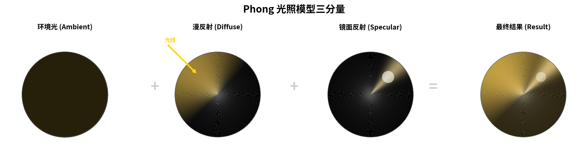
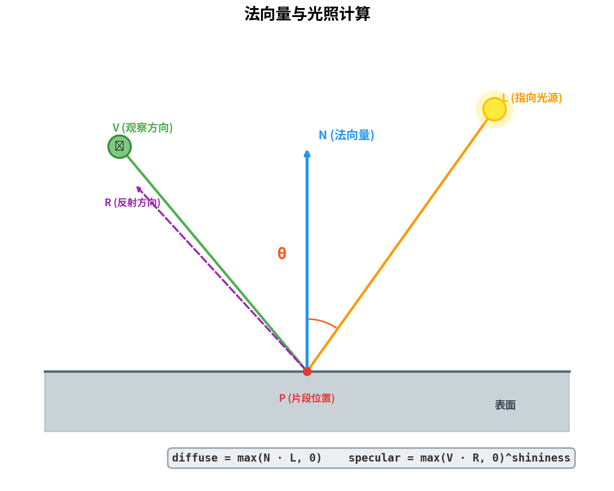
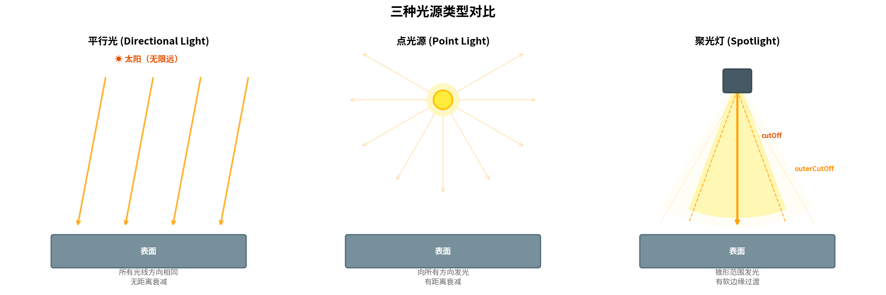
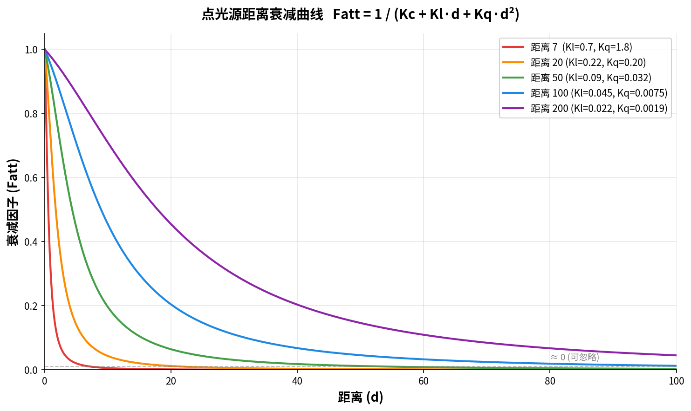

# 第7篇：基础光照

## 前置知识

- 第1篇：开发环境搭建与第一个窗口
- 第2篇：渲染管线与第一个三角形
- 第3篇：深入着色器与 GLSL
- 第4篇：纹理映射
- 第5篇：坐标系统与 3D 变换
- 第6篇：摄像机系统
- 理解 MVP 矩阵变换、GLSL 的 struct 与 uniform 机制

## 本篇目标

**实现完整的 Phong 光照模型，理解环境光、漫反射、镜面反射三个分量的着色器实现，并在一个场景中组合平行光、点光源、聚光灯三种光源类型。**

完成本篇后，你将拥有一个带多光源照明的 3D 场景，对象表面呈现真实的光照效果，能够自由地调节材质参数和光源属性。

---

## 一、为什么需要光照

在前几篇中，我们绘制的物体要么是纯色，要么贴了纹理，但它们在任何角度看起来都一样 —— 没有明暗变化、没有高光、没有立体感。这是因为我们忽略了现实世界中最重要的视觉要素：**光照**。

光照模型试图模拟光线与物体表面的交互。虽然完全物理精确的全局光照（如光线追踪）计算量巨大，但我们可以用一个经典的近似模型来获得相当不错的效果 —— **Phong 光照模型**。

---

## 二、Phong 光照模型

Phong 光照模型由 Bui Tuong Phong 在 1975 年提出，它将光照分为三个独立分量相加：



### 2.1 环境光（Ambient）

现实世界中，即使没有直接光照，物体也不会完全黑暗，因为光线经过多次反弹后会间接照亮物体。环境光就是对这种间接光照的简单近似 —— 一个恒定的底色。

```glsl
vec3 ambient = lightAmbient * materialAmbient;
```

- `lightAmbient`：光源的环境光强度
- `materialAmbient`：材质对环境光的反射系数

环境光与方向无关，只提供最基本的可见性，防止未被光线直射的面完全变黑。

### 2.2 漫反射（Diffuse）

漫反射是光照模型中最核心的部分。当光线照射到粗糙表面时，光线向各个方向均匀散射。漫反射的强度取决于**光线方向**与**表面法线**之间的夹角。



关键公式（兰伯特余弦定律）：

$$
I_{diffuse} = L_{diffuse} \times M_{diffuse} \times \max(\vec{n} \cdot \vec{l},\ 0)
$$

其中：
- $\vec{n}$ 是表面法线（单位向量）
- $\vec{l}$ 是从片段指向光源的方向（单位向量）
- 点乘结果为夹角的余弦值，夹角越小（光线越正对表面），值越大
- `max(..., 0)` 确保背面不产生负值光照

```glsl
vec3 norm     = normalize(Normal);
vec3 lightDir = normalize(lightPos - FragPos);
float diff    = max(dot(norm, lightDir), 0.0);
vec3 diffuse  = lightDiffuse * diff * materialDiffuse;
```

### 2.3 镜面反射（Specular）

镜面反射模拟光滑表面上的高光点。它不仅取决于光线方向和法线，还取决于**观察者的方向**。

计算步骤：
1. 计算光线关于法线的反射方向 $\vec{r} = \text{reflect}(-\vec{l}, \vec{n})$
2. 计算反射方向与观察方向 $\vec{v}$ 的夹角
3. 用 `shininess`（光泽度）指数控制高光的集中程度

$$
I_{specular} = L_{specular} \times M_{specular} \times \left(\max(\vec{v} \cdot \vec{r},\ 0)\right)^{shininess}
$$

- `shininess` 越大，高光越小越集中（如金属表面 = 128+），越小越分散（如橡胶 = 4~8）

```glsl
vec3 viewDir    = normalize(viewPos - FragPos);
vec3 reflectDir = reflect(-lightDir, norm);
float spec      = pow(max(dot(viewDir, reflectDir), 0.0), material.shininess);
vec3 specular   = lightSpecular * spec * materialSpecular;
```

### 2.4 最终合成

将三个分量相加即得到最终颜色：

$$
I_{Phong} = I_{ambient} + I_{diffuse} + I_{specular}
$$

```glsl
vec3 result = ambient + diffuse + specular;
FragColor = vec4(result, 1.0);
```

---

## 三、法向量

### 3.1 什么是法向量

法向量（Normal Vector）是垂直于表面的单位向量，它决定了表面如何与光线交互。对于立方体，每个面的法向量指向面的外侧。

在顶点数据中，我们为每个顶点附带一个法线：

```cpp
float vertices[] = {
    // positions          // normals
    -0.5f, -0.5f, -0.5f,  0.0f,  0.0f, -1.0f,  // 后面
     0.5f, -0.5f, -0.5f,  0.0f,  0.0f, -1.0f,
     0.5f,  0.5f, -0.5f,  0.0f,  0.0f, -1.0f,
    // ...
};
```

顶点属性布局变为 `位置(3) + 法线(3) = stride 6`：

```cpp
// 位置属性 (location = 0)
glVertexAttribPointer(0, 3, GL_FLOAT, GL_FALSE, 6 * sizeof(float), (void*)0);
glEnableVertexAttribArray(0);
// 法线属性 (location = 1)
glVertexAttribPointer(1, 3, GL_FLOAT, GL_FALSE, 6 * sizeof(float),
                      (void*)(3 * sizeof(float)));
glEnableVertexAttribArray(1);
```

### 3.2 法线矩阵

法向量在世界空间中计算时，不能简单地用模型矩阵变换。原因在于：**如果模型进行了非等比缩放（如只拉伸 X 轴），法向量会被扭曲，不再垂直于表面。**

正确的做法是使用**法线矩阵**（Normal Matrix）—— 模型矩阵左上角 3x3 部分的逆矩阵的转置：

$$
\mathbf{N} = (\mathbf{M}_{3\times3}^{-1})^T = \text{mat3}(\text{transpose}(\text{inverse}(\mathbf{M})))
$$

在顶点着色器中：

```glsl
Normal = mat3(transpose(inverse(model))) * aNormal;
```

> **性能注意**：`inverse()` 是一个开销较大的操作。在生产环境中，通常在 CPU 端预计算法线矩阵再通过 uniform 传入，而不是在每个顶点着色器调用中计算。本教程为了代码简洁直接在着色器中计算。

---

## 四、材质系统

不同物体对光的反射特性不同（金属、木头、塑料等），我们用 **Material 结构体**来描述这些属性：

```glsl
struct Material {
    vec3  ambient;    // 环境光反射颜色
    vec3  diffuse;    // 漫反射反射颜色（通常就是物体的"颜色"）
    vec3  specular;   // 镜面反射颜色（通常偏白或灰）
    float shininess;  // 光泽度指数（2~256，越大高光越集中）
};

uniform Material material;
```

一些常见材质参数参考：

| 材质 | ambient | diffuse | specular | shininess |
|------|---------|---------|----------|-----------|
| 黄金 | (0.25, 0.20, 0.07) | (0.75, 0.61, 0.23) | (0.63, 0.56, 0.37) | 51.2 |
| 翡翠 | (0.02, 0.17, 0.02) | (0.08, 0.61, 0.08) | (0.63, 0.73, 0.63) | 76.8 |
| 白色塑料 | (0.0, 0.0, 0.0) | (0.55, 0.55, 0.55) | (0.70, 0.70, 0.70) | 32.0 |
| 红色橡胶 | (0.05, 0.0, 0.0) | (0.5, 0.4, 0.4) | (0.7, 0.04, 0.04) | 10.0 |

在 CPU 端设置材质：

```cpp
objectShader.setVec3("material.ambient",  0.25f, 0.20f, 0.07f);
objectShader.setVec3("material.diffuse",  0.75f, 0.61f, 0.23f);
objectShader.setVec3("material.specular", 0.63f, 0.56f, 0.37f);
objectShader.setFloat("material.shininess", 32.0f);
```

---

## 五、光源类型详解



### 5.1 平行光（Directional Light）

平行光模拟无限远处的光源（如太阳光）。它的所有光线方向相同，不存在距离衰减。

只需要一个**方向向量**，不需要位置：

```glsl
struct DirLight {
    vec3 direction;   // 光线方向（从光源指向场景）
    vec3 ambient;
    vec3 diffuse;
    vec3 specular;
};
```

计算函数：

```glsl
vec3 CalcDirLight(DirLight light, vec3 normal, vec3 viewDir)
{
    vec3 lightDir = normalize(-light.direction);  // 反转为从片段指向光源

    float diff = max(dot(normal, lightDir), 0.0);

    vec3 reflectDir = reflect(-lightDir, normal);
    float spec = pow(max(dot(viewDir, reflectDir), 0.0), material.shininess);

    vec3 ambient  = light.ambient  * material.ambient;
    vec3 diffuse  = light.diffuse  * diff * material.diffuse;
    vec3 specular = light.specular * spec * material.specular;
    return ambient + diffuse + specular;
}
```

### 5.2 点光源（Point Light）

点光源从一个位置向所有方向均匀发光（如灯泡），它的强度随距离衰减。



#### 距离衰减公式

使用一个包含常数项、一次项和二次项的公式来模拟衰减：

$$
F_{att} = \frac{1.0}{K_c + K_l \times d + K_q \times d^2}
$$

| 参数 | 含义 | 效果 |
|------|------|------|
| $K_c$（constant） | 常数衰减因子 | 保证分母不小于1，通常设为 1.0 |
| $K_l$（linear） | 一次衰减因子 | 控制线性衰减的速度 |
| $K_q$（quadratic） | 二次衰减因子 | 距离较大时起主导作用 |
| $d$ | 片段到光源的距离 | — |

常用衰减系数参考表：

| 覆盖距离 | constant | linear | quadratic |
|----------|----------|--------|-----------|
| 7 | 1.0 | 0.7 | 1.8 |
| 13 | 1.0 | 0.35 | 0.44 |
| 20 | 1.0 | 0.22 | 0.20 |
| 32 | 1.0 | 0.14 | 0.07 |
| 50 | 1.0 | 0.09 | 0.032 |
| 100 | 1.0 | 0.045 | 0.0075 |
| 200 | 1.0 | 0.022 | 0.0019 |

```glsl
struct PointLight {
    vec3  position;
    float constant;
    float linear;
    float quadratic;
    vec3  ambient;
    vec3  diffuse;
    vec3  specular;
};
```

计算函数：

```glsl
vec3 CalcPointLight(PointLight light, vec3 normal, vec3 fragPos, vec3 viewDir)
{
    vec3 lightDir = normalize(light.position - fragPos);

    float diff = max(dot(normal, lightDir), 0.0);

    vec3 reflectDir = reflect(-lightDir, normal);
    float spec = pow(max(dot(viewDir, reflectDir), 0.0), material.shininess);

    // 距离衰减
    float distance    = length(light.position - fragPos);
    float attenuation = 1.0 / (light.constant + light.linear * distance
                              + light.quadratic * (distance * distance));

    vec3 ambient  = light.ambient  * material.ambient;
    vec3 diffuse  = light.diffuse  * diff * material.diffuse;
    vec3 specular = light.specular * spec * material.specular;

    return (ambient + diffuse + specular) * attenuation;
}
```

### 5.3 聚光灯（Spotlight）

聚光灯是一种特殊的点光源，它只在一个锥形范围内发光（如手电筒、舞台灯）。需要：
- **位置**（从哪发光）
- **方向**（照向哪里）
- **内切光角（cutOff）**：全强度光照的锥角
- **外切光角（outerCutOff）**：光照逐渐衰减到0的锥角

在内外切光角之间做平滑插值，就能得到**柔和的边缘**（soft edge），而不是硬切的边界：

$$
I = \text{clamp}\left(\frac{\theta - \gamma_{outer}}{\gamma_{inner} - \gamma_{outer}},\ 0,\ 1\right)
$$

其中 $\theta$ 是光线方向与片段方向的夹角余弦值，$\gamma_{inner}$ 和 $\gamma_{outer}$ 分别是内外切光角的余弦值。

> 注意：我们传入的是余弦值（`cos(angle)`）而非角度本身，因为在着色器中直接用点乘得到的就是余弦值，避免了额外的 `acos()` 运算。

```glsl
struct SpotLight {
    vec3  position;
    vec3  direction;
    float cutOff;       // cos(内切光角)
    float outerCutOff;  // cos(外切光角)
    float constant;
    float linear;
    float quadratic;
    vec3  ambient;
    vec3  diffuse;
    vec3  specular;
};
```

计算函数：

```glsl
vec3 CalcSpotLight(SpotLight light, vec3 normal, vec3 fragPos, vec3 viewDir)
{
    vec3 lightDir = normalize(light.position - fragPos);

    float diff = max(dot(normal, lightDir), 0.0);

    vec3 reflectDir = reflect(-lightDir, normal);
    float spec = pow(max(dot(viewDir, reflectDir), 0.0), material.shininess);

    // 距离衰减
    float distance    = length(light.position - fragPos);
    float attenuation = 1.0 / (light.constant + light.linear * distance
                              + light.quadratic * (distance * distance));

    // 聚光灯软边缘
    float theta     = dot(lightDir, normalize(-light.direction));
    float epsilon   = light.cutOff - light.outerCutOff;
    float intensity = clamp((theta - light.outerCutOff) / epsilon, 0.0, 1.0);

    vec3 ambient  = light.ambient  * material.ambient;
    vec3 diffuse  = light.diffuse  * diff * material.diffuse;
    vec3 specular = light.specular * spec * material.specular;

    return (ambient + diffuse * intensity + specular * intensity) * attenuation;
}
```

在 CPU 端设置聚光灯（让它跟随摄像机）：

```cpp
objectShader.setVec3("spotLight.position",  camera.Position);
objectShader.setVec3("spotLight.direction", camera.Front);
objectShader.setFloat("spotLight.cutOff",      glm::cos(glm::radians(12.5f)));
objectShader.setFloat("spotLight.outerCutOff", glm::cos(glm::radians(17.5f)));
```

---

## 六、多光源整合

在实际场景中，我们通常需要同时使用多种光源。思路很简单：**分别计算每种光源的贡献，然后相加。**

片段着色器的 `main()` 函数：

```glsl
#define NR_POINT_LIGHTS 4

uniform DirLight   dirLight;
uniform PointLight pointLights[NR_POINT_LIGHTS];
uniform SpotLight  spotLight;

void main()
{
    vec3 norm    = normalize(Normal);
    vec3 viewDir = normalize(viewPos - FragPos);

    // 阶段1：平行光
    vec3 result = CalcDirLight(dirLight, norm, viewDir);

    // 阶段2：所有点光源
    for (int i = 0; i < NR_POINT_LIGHTS; i++)
        result += CalcPointLight(pointLights[i], norm, FragPos, viewDir);

    // 阶段3：聚光灯
    result += CalcSpotLight(spotLight, norm, FragPos, viewDir);

    FragColor = vec4(result, 1.0);
}
```

在 CPU 端设置数组 uniform 时，需要拼接索引字符串：

```cpp
for (int i = 0; i < 4; i++)
{
    std::string base = "pointLights[" + std::to_string(i) + "]";
    objectShader.setVec3(base + ".position",  pointLightPositions[i]);
    objectShader.setFloat(base + ".constant",  1.0f);
    objectShader.setFloat(base + ".linear",    0.09f);
    objectShader.setFloat(base + ".quadratic", 0.032f);
    // ... ambient, diffuse, specular
}
```

---

## 七、核心 API 速查表

| API / 操作 | 说明 |
|------------|------|
| `glVertexAttribPointer(1, 3, ...)` | 设置法线属性（location=1, 3个float分量） |
| `glUniform3fv(loc, 1, &val[0])` | 传递 `vec3` uniform（光源/材质参数） |
| `glUniform1f(loc, val)` | 传递 `float` uniform（shininess 等） |
| `normalize(v)` (GLSL) | 向量归一化为单位向量 |
| `dot(a, b)` (GLSL) | 向量点乘，返回夹角余弦 |
| `reflect(-l, n)` (GLSL) | 计算反射向量 |
| `pow(base, exp)` (GLSL) | 幂运算（控制高光集中度） |
| `max(x, 0.0)` (GLSL) | 钳制负值为0 |
| `clamp(x, 0, 1)` (GLSL) | 将值限制在 [0,1] 范围 |
| `length(v)` (GLSL) | 计算向量长度（用于距离计算） |
| `transpose(m)` (GLSL) | 矩阵转置 |
| `inverse(m)` (GLSL) | 矩阵求逆（用于法线矩阵） |

---

## 八、完整代码

### 8.1 物体顶点着色器（`shaders/object.vs`）

```glsl
#version 330 core
layout (location = 0) in vec3 aPos;
layout (location = 1) in vec3 aNormal;

out vec3 FragPos;
out vec3 Normal;

uniform mat4 model;
uniform mat4 view;
uniform mat4 projection;

void main()
{
    FragPos = vec3(model * vec4(aPos, 1.0));
    Normal  = mat3(transpose(inverse(model))) * aNormal;
    gl_Position = projection * view * vec4(FragPos, 1.0);
}
```

### 8.2 物体片段着色器（`shaders/object.fs`）

```glsl
#version 330 core
out vec4 FragColor;

in vec3 FragPos;
in vec3 Normal;

// ==================== 材质 ====================
struct Material {
    vec3  ambient;
    vec3  diffuse;
    vec3  specular;
    float shininess;
};

// ==================== 光源 ====================
struct DirLight {
    vec3 direction;
    vec3 ambient;
    vec3 diffuse;
    vec3 specular;
};

struct PointLight {
    vec3 position;
    float constant;
    float linear;
    float quadratic;
    vec3 ambient;
    vec3 diffuse;
    vec3 specular;
};

struct SpotLight {
    vec3 position;
    vec3 direction;
    float cutOff;
    float outerCutOff;
    float constant;
    float linear;
    float quadratic;
    vec3 ambient;
    vec3 diffuse;
    vec3 specular;
};

#define NR_POINT_LIGHTS 4

uniform vec3 viewPos;
uniform Material material;
uniform DirLight dirLight;
uniform PointLight pointLights[NR_POINT_LIGHTS];
uniform SpotLight spotLight;

vec3 CalcDirLight(DirLight light, vec3 normal, vec3 viewDir);
vec3 CalcPointLight(PointLight light, vec3 normal, vec3 fragPos, vec3 viewDir);
vec3 CalcSpotLight(SpotLight light, vec3 normal, vec3 fragPos, vec3 viewDir);

void main()
{
    vec3 norm    = normalize(Normal);
    vec3 viewDir = normalize(viewPos - FragPos);

    vec3 result = CalcDirLight(dirLight, norm, viewDir);

    for (int i = 0; i < NR_POINT_LIGHTS; i++)
        result += CalcPointLight(pointLights[i], norm, FragPos, viewDir);

    result += CalcSpotLight(spotLight, norm, FragPos, viewDir);

    FragColor = vec4(result, 1.0);
}

vec3 CalcDirLight(DirLight light, vec3 normal, vec3 viewDir)
{
    vec3 lightDir = normalize(-light.direction);
    float diff = max(dot(normal, lightDir), 0.0);
    vec3 reflectDir = reflect(-lightDir, normal);
    float spec = pow(max(dot(viewDir, reflectDir), 0.0), material.shininess);

    vec3 ambient  = light.ambient  * material.ambient;
    vec3 diffuse  = light.diffuse  * diff * material.diffuse;
    vec3 specular = light.specular * spec * material.specular;
    return ambient + diffuse + specular;
}

vec3 CalcPointLight(PointLight light, vec3 normal, vec3 fragPos, vec3 viewDir)
{
    vec3 lightDir = normalize(light.position - fragPos);
    float diff = max(dot(normal, lightDir), 0.0);
    vec3 reflectDir = reflect(-lightDir, normal);
    float spec = pow(max(dot(viewDir, reflectDir), 0.0), material.shininess);

    float distance    = length(light.position - fragPos);
    float attenuation = 1.0 / (light.constant + light.linear * distance
                              + light.quadratic * (distance * distance));

    vec3 ambient  = light.ambient  * material.ambient;
    vec3 diffuse  = light.diffuse  * diff * material.diffuse;
    vec3 specular = light.specular * spec * material.specular;
    return (ambient + diffuse + specular) * attenuation;
}

vec3 CalcSpotLight(SpotLight light, vec3 normal, vec3 fragPos, vec3 viewDir)
{
    vec3 lightDir = normalize(light.position - fragPos);
    float diff = max(dot(normal, lightDir), 0.0);
    vec3 reflectDir = reflect(-lightDir, normal);
    float spec = pow(max(dot(viewDir, reflectDir), 0.0), material.shininess);

    float distance    = length(light.position - fragPos);
    float attenuation = 1.0 / (light.constant + light.linear * distance
                              + light.quadratic * (distance * distance));

    float theta     = dot(lightDir, normalize(-light.direction));
    float epsilon   = light.cutOff - light.outerCutOff;
    float intensity = clamp((theta - light.outerCutOff) / epsilon, 0.0, 1.0);

    vec3 ambient  = light.ambient  * material.ambient;
    vec3 diffuse  = light.diffuse  * diff * material.diffuse;
    vec3 specular = light.specular * spec * material.specular;
    return (ambient + diffuse * intensity + specular * intensity) * attenuation;
}
```

### 8.3 光源着色器（`shaders/light.vs` + `shaders/light.fs`）

```glsl
// light.vs
#version 330 core
layout (location = 0) in vec3 aPos;
uniform mat4 model;
uniform mat4 view;
uniform mat4 projection;
void main()
{
    gl_Position = projection * view * model * vec4(aPos, 1.0);
}
```

```glsl
// light.fs
#version 330 core
out vec4 FragColor;
uniform vec3 lightColor;
void main()
{
    FragColor = vec4(lightColor, 1.0);
}
```

### 8.4 主程序（`main.cpp`）

```cpp
#include <glad/glad.h>
#include <GLFW/glfw3.h>

#include <glm/glm.hpp>
#include <glm/gtc/matrix_transform.hpp>
#include <glm/gtc/type_ptr.hpp>

#include "shader.h"
#include "camera.h"

#include <iostream>

void framebuffer_size_callback(GLFWwindow* window, int width, int height);
void mouse_callback(GLFWwindow* window, double xpos, double ypos);
void scroll_callback(GLFWwindow* window, double xoffset, double yoffset);
void processInput(GLFWwindow* window);

const unsigned int SCR_WIDTH  = 800;
const unsigned int SCR_HEIGHT = 600;

Camera camera(glm::vec3(0.0f, 0.0f, 5.0f));
float lastX = SCR_WIDTH  / 2.0f;
float lastY = SCR_HEIGHT / 2.0f;
bool firstMouse = true;
float deltaTime = 0.0f;
float lastFrame = 0.0f;

int main()
{
    glfwInit();
    glfwWindowHint(GLFW_CONTEXT_VERSION_MAJOR, 3);
    glfwWindowHint(GLFW_CONTEXT_VERSION_MINOR, 3);
    glfwWindowHint(GLFW_OPENGL_PROFILE, GLFW_OPENGL_CORE_PROFILE);
#ifdef __APPLE__
    glfwWindowHint(GLFW_OPENGL_FORWARD_COMPAT, GL_TRUE);
#endif

    GLFWwindow* window = glfwCreateWindow(SCR_WIDTH, SCR_HEIGHT,
                                          "07 - Basic Lighting", NULL, NULL);
    if (!window) { /* 错误处理 */ return -1; }
    glfwMakeContextCurrent(window);
    glfwSetFramebufferSizeCallback(window, framebuffer_size_callback);
    glfwSetCursorPosCallback(window, mouse_callback);
    glfwSetScrollCallback(window, scroll_callback);
    glfwSetInputMode(window, GLFW_CURSOR, GLFW_CURSOR_DISABLED);

    if (!gladLoadGLLoader((GLADloadproc)glfwGetProcAddress)) return -1;

    glEnable(GL_DEPTH_TEST);

    Shader objectShader("shaders/object.vs", "shaders/object.fs");
    Shader lightShader("shaders/light.vs",   "shaders/light.fs");

    // 立方体顶点数据：位置(3) + 法线(3)
    float vertices[] = {
        -0.5f,-0.5f,-0.5f,  0.0f, 0.0f,-1.0f,
         0.5f,-0.5f,-0.5f,  0.0f, 0.0f,-1.0f,
         0.5f, 0.5f,-0.5f,  0.0f, 0.0f,-1.0f,
         0.5f, 0.5f,-0.5f,  0.0f, 0.0f,-1.0f,
        -0.5f, 0.5f,-0.5f,  0.0f, 0.0f,-1.0f,
        -0.5f,-0.5f,-0.5f,  0.0f, 0.0f,-1.0f,
        // ... 其余 5 个面 (共 36 个顶点，完整代码见 src/main.cpp)
    };

    glm::vec3 cubePositions[] = {
        glm::vec3( 0.0f,  0.0f,   0.0f), glm::vec3( 2.0f,  5.0f,-15.0f),
        glm::vec3(-1.5f, -2.2f,  -2.5f), glm::vec3(-3.8f, -2.0f,-12.3f),
        glm::vec3( 2.4f, -0.4f,  -3.5f), glm::vec3(-1.7f,  3.0f, -7.5f),
        glm::vec3( 1.3f, -2.0f,  -2.5f), glm::vec3( 1.5f,  2.0f, -2.5f),
        glm::vec3( 1.5f,  0.2f,  -1.5f), glm::vec3(-1.3f,  1.0f, -1.5f)
    };

    glm::vec3 pointLightPositions[] = {
        glm::vec3( 0.7f,  0.2f,  2.0f), glm::vec3( 2.3f, -3.3f, -4.0f),
        glm::vec3(-4.0f,  2.0f,-12.0f), glm::vec3( 0.0f,  0.0f, -3.0f)
    };

    // ===== VAO / VBO 设置 =====
    unsigned int cubeVAO, VBO;
    glGenVertexArrays(1, &cubeVAO);
    glGenBuffers(1, &VBO);
    glBindBuffer(GL_ARRAY_BUFFER, VBO);
    glBufferData(GL_ARRAY_BUFFER, sizeof(vertices), vertices, GL_STATIC_DRAW);
    glBindVertexArray(cubeVAO);
    // 位置
    glVertexAttribPointer(0, 3, GL_FLOAT, GL_FALSE, 6*sizeof(float), (void*)0);
    glEnableVertexAttribArray(0);
    // 法线
    glVertexAttribPointer(1, 3, GL_FLOAT, GL_FALSE, 6*sizeof(float),
                          (void*)(3*sizeof(float)));
    glEnableVertexAttribArray(1);

    // 光源 VAO（复用 VBO）
    unsigned int lightVAO;
    glGenVertexArrays(1, &lightVAO);
    glBindVertexArray(lightVAO);
    glBindBuffer(GL_ARRAY_BUFFER, VBO);
    glVertexAttribPointer(0, 3, GL_FLOAT, GL_FALSE, 6*sizeof(float), (void*)0);
    glEnableVertexAttribArray(0);

    // ===== 渲染循环 =====
    while (!glfwWindowShouldClose(window))
    {
        // delta time
        float currentFrame = (float)glfwGetTime();
        deltaTime = currentFrame - lastFrame;
        lastFrame = currentFrame;

        processInput(window);
        glClearColor(0.05f, 0.05f, 0.08f, 1.0f);
        glClear(GL_COLOR_BUFFER_BIT | GL_DEPTH_BUFFER_BIT);

        objectShader.use();
        objectShader.setVec3("viewPos", camera.Position);

        // 材质
        objectShader.setVec3("material.ambient",  0.25f, 0.20f, 0.07f);
        objectShader.setVec3("material.diffuse",  0.75f, 0.61f, 0.23f);
        objectShader.setVec3("material.specular", 0.63f, 0.56f, 0.37f);
        objectShader.setFloat("material.shininess", 32.0f);

        // 平行光
        objectShader.setVec3("dirLight.direction", -0.2f, -1.0f, -0.3f);
        objectShader.setVec3("dirLight.ambient",    0.05f, 0.05f, 0.05f);
        objectShader.setVec3("dirLight.diffuse",    0.4f,  0.4f,  0.4f);
        objectShader.setVec3("dirLight.specular",   0.5f,  0.5f,  0.5f);

        // 4 个点光源
        for (int i = 0; i < 4; i++) {
            std::string base = "pointLights[" + std::to_string(i) + "]";
            objectShader.setVec3(base + ".position", pointLightPositions[i]);
            objectShader.setFloat(base + ".constant",  1.0f);
            objectShader.setFloat(base + ".linear",    0.09f);
            objectShader.setFloat(base + ".quadratic", 0.032f);
            objectShader.setVec3(base + ".ambient",  0.05f, 0.05f, 0.05f);
            objectShader.setVec3(base + ".diffuse",  0.8f,  0.8f,  0.8f);
            objectShader.setVec3(base + ".specular", 1.0f,  1.0f,  1.0f);
        }

        // 聚光灯（跟随摄像机）
        objectShader.setVec3("spotLight.position",  camera.Position);
        objectShader.setVec3("spotLight.direction", camera.Front);
        objectShader.setFloat("spotLight.cutOff",      glm::cos(glm::radians(12.5f)));
        objectShader.setFloat("spotLight.outerCutOff", glm::cos(glm::radians(17.5f)));
        objectShader.setFloat("spotLight.constant",  1.0f);
        objectShader.setFloat("spotLight.linear",    0.09f);
        objectShader.setFloat("spotLight.quadratic", 0.032f);
        objectShader.setVec3("spotLight.ambient",  0.0f,  0.0f,  0.0f);
        objectShader.setVec3("spotLight.diffuse",  1.0f,  1.0f,  1.0f);
        objectShader.setVec3("spotLight.specular", 1.0f,  1.0f,  1.0f);

        // 变换矩阵
        glm::mat4 projection = glm::perspective(
            glm::radians(camera.Zoom),
            (float)SCR_WIDTH/(float)SCR_HEIGHT, 0.1f, 100.0f);
        glm::mat4 view = camera.GetViewMatrix();
        objectShader.setMat4("projection", projection);
        objectShader.setMat4("view", view);

        // 绘制 10 个立方体
        glBindVertexArray(cubeVAO);
        for (unsigned int i = 0; i < 10; i++) {
            glm::mat4 model = glm::mat4(1.0f);
            model = glm::translate(model, cubePositions[i]);
            model = glm::rotate(model, glm::radians(20.0f * i),
                                glm::vec3(1.0f, 0.3f, 0.5f));
            objectShader.setMat4("model", model);
            glDrawArrays(GL_TRIANGLES, 0, 36);
        }

        // 绘制光源立方体
        lightShader.use();
        lightShader.setMat4("projection", projection);
        lightShader.setMat4("view", view);
        glBindVertexArray(lightVAO);
        for (int i = 0; i < 4; i++) {
            glm::mat4 model = glm::mat4(1.0f);
            model = glm::translate(model, pointLightPositions[i]);
            model = glm::scale(model, glm::vec3(0.2f));
            lightShader.setMat4("model", model);
            lightShader.setVec3("lightColor", glm::vec3(1.0f));
            glDrawArrays(GL_TRIANGLES, 0, 36);
        }

        glfwSwapBuffers(window);
        glfwPollEvents();
    }

    // 清理资源
    glDeleteVertexArrays(1, &cubeVAO);
    glDeleteVertexArrays(1, &lightVAO);
    glDeleteBuffers(1, &VBO);
    glfwTerminate();
    return 0;
}

// 键盘 / 鼠标 / 窗口回调函数 — 与第6篇相同，此处省略
```

> **完整可编译代码**请参阅 `src/` 目录下的源文件。

---

## 九、常见问题

### Q1：物体是全黑的，看不到任何光照效果

**检查清单：**
- 法线数据是否正确传入（`glVertexAttribPointer` 的 stride 和 offset）
- 法线是否归一化了（着色器中 `normalize(Normal)`）
- 光源的 diffuse/specular 颜色是否为零
- `viewPos` 是否正确设置

### Q2：光照效果看起来不对，像是在模型空间计算的

确保你在**世界空间**中进行光照计算：
- `FragPos = vec3(model * vec4(aPos, 1.0))` — 位置变换到世界空间
- `Normal = mat3(transpose(inverse(model))) * aNormal` — 法线也要变换
- 光源的位置/方向也必须在世界空间中

### Q3：非等比缩放后法线错误

必须使用法线矩阵 `mat3(transpose(inverse(model)))`。如果只用 `mat3(model)` 变换法线，在 `glm::scale(model, vec3(2.0, 1.0, 1.0))` 这样的非等比缩放下法线会被扭曲。

### Q4：聚光灯有硬边，不够平滑

检查 `cutOff` 和 `outerCutOff` 是否正确：
- 它们应该是**余弦值**（`cos(角度)`），而非角度
- `outerCutOff` 对应的角度应比 `cutOff` **大**（但余弦值更小）
- 确保使用了 `clamp` 进行平滑插值

### Q5：点光源衰减太快或太慢

调整 `linear` 和 `quadratic` 参数。参照上文的衰减系数参考表，根据期望的覆盖距离选择合适的值。`constant` 通常保持为 1.0。

---

## 十、练习题

### 练习 1：Gouraud 着色 vs Phong 着色

将光照计算从片段着色器移到顶点着色器中（即 Gouraud 着色）。比较两种方式的视觉差异，尤其是在低多边形模型上。思考为什么 Phong 着色（逐片段）效果更好。

**提示：** 在顶点着色器中计算最终颜色并通过 `out` 传递给片段着色器，片段着色器直接使用插值后的颜色。

### 练习 2：自定义材质切换

添加键盘按键（如 1-4）来切换不同的预设材质（黄金、翡翠、白色塑料、红色橡胶）。观察相同光照下不同材质的表现差异。

**提示：** 定义一个材质数组，按键时切换索引，在渲染循环中根据索引设置 uniform。

### 练习 3：点光源动态运动

让 4 个点光源沿不同轨道运动（如圆形轨道、上下弹跳），观察动态光照效果。额外挑战：让光源颜色也随时间平滑变化。

**提示：** 使用 `sin(glfwGetTime())` 和 `cos(glfwGetTime())` 配合不同相位和频率来生成轨道。

---

## 十一、参考资料

1. [LearnOpenGL - Basic Lighting](https://learnopengl.com/Lighting/Basic-Lighting)
2. [LearnOpenGL - Materials](https://learnopengl.com/Lighting/Materials)
3. [LearnOpenGL - Light casters](https://learnopengl.com/Lighting/Light-casters)
4. [LearnOpenGL - Multiple lights](https://learnopengl.com/Lighting/Multiple-lights)
5. [OpenGL Wiki - Phong Shading](https://www.khronos.org/opengl/wiki/Phong_Shading)
6. Phong, B. T. (1975). "Illumination for Computer Generated Pictures". *Communications of the ACM*. 18 (6): 311–317.
7. [devernay.free.fr - OpenGL/GLSL 光衰减表](http://www.ogre3d.org/tikiwiki/tiki-index.php?page=-Point+Light+Attenuation)

---
