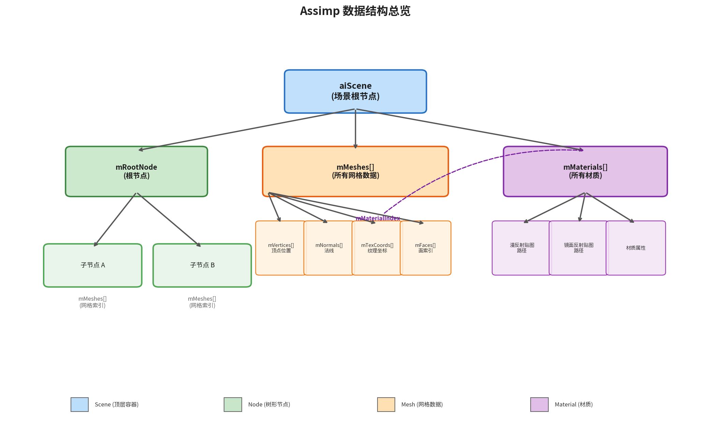
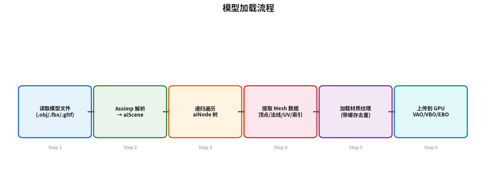
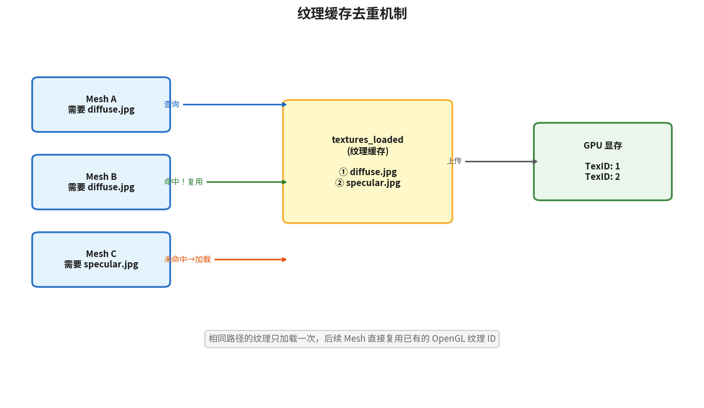

# 第8篇：模型加载 — 渲染真实的 3D 模型

## 前置知识

- 第1篇：开发环境搭建与第一个窗口
- 第2篇：渲染管线与第一个三角形
- 第3篇：深入着色器与 GLSL
- 第4篇：纹理映射
- 第5篇：坐标系统与 3D 变换
- 第6篇：摄像机系统
- 第7篇：基础光照
- 理解 Phong 光照模型、纹理采样、MVP 矩阵变换

## 本篇目标

**使用 Assimp 库加载外部 3D 模型文件，封装 Mesh 和 Model 类，渲染带有漫反射贴图与镜面反射贴图的完整模型。**

完成本篇后，你将告别手写顶点数据的时代，能够加载任意 .obj/.fbx/.gltf 等格式的 3D 模型并配合光照系统进行渲染。

---

## 一、为什么需要模型加载

在之前的章节中，我们一直在手动编写顶点数据 —— 一个立方体就需要 36 个顶点、216 个浮点数。这对于简单图元来说尚可接受，但真实的 3D 模型（如人物、建筑、车辆）通常包含数万甚至数百万个顶点，靠手写完全不可行。

现实工作流是：

1. **美术人员**使用 Blender、Maya、3ds Max 等建模软件创建 3D 模型
2. 导出为标准格式文件（.obj、.fbx、.gltf 等）
3. **程序员**在引擎中加载这些文件并渲染

我们需要一个库来解析这些格式各异的模型文件，把其中的顶点、法线、纹理坐标、材质信息提取出来。这就是 **Assimp** 的作用。

---

## 二、3D 模型文件格式概览

常见的 3D 模型格式：

| 格式 | 扩展名 | 特点 |
|------|--------|------|
| Wavefront OBJ | .obj + .mtl | 纯文本、简单直观、不支持动画 |
| FBX | .fbx | Autodesk 私有格式、支持动画/骨骼 |
| glTF 2.0 | .gltf / .glb | "3D 界的 JPEG"，开放标准、PBR 材质、现代首选 |
| Collada | .dae | XML 格式、功能全面但文件较大 |
| STL | .stl | 仅几何体、常用于 3D 打印 |

每种格式的内部结构各不相同。如果我们为每种格式写一个解析器，工作量巨大。Assimp 帮我们抹平了这些差异。

---

## 三、Assimp 库简介

### 3.1 什么是 Assimp

**Assimp**（Open Asset Import Library）是一个开源的模型导入库，支持 40+ 种 3D 格式。它的核心思想是：**无论输入什么格式，都转换为统一的数据结构**。



### 3.2 Assimp 的数据结构

Assimp 将模型数据组织为一棵树：

```
aiScene（场景根节点）
├── mRootNode（根节点）
│   ├── mMeshes[]        — 该节点引用的网格索引
│   └── mChildren[]      — 子节点
├── mMeshes[]（所有网格数据）
│   ├── mVertices[]      — 顶点位置
│   ├── mNormals[]       — 法线
│   ├── mTextureCoords[] — 纹理坐标
│   ├── mFaces[]         — 面（索引数据）
│   └── mMaterialIndex   — 材质索引
└── mMaterials[]（所有材质）
    ├── 漫反射贴图路径
    ├── 镜面反射贴图路径
    └── 其他材质属性
```

关键概念：
- **Scene（场景）**：顶层容器，持有所有网格和材质
- **Node（节点）**：树形结构的节点，每个节点引用若干 Mesh，并可以有子节点
- **Mesh（网格）**：一组顶点、法线、纹理坐标和面数据
- **Material（材质）**：纹理路径和材质属性
- **Face（面）**：由若干索引组成的一个图元（三角形）

### 3.3 安装 Assimp

**macOS (Homebrew):**
```bash
brew install assimp
```

**Ubuntu/Debian:**
```bash
sudo apt install libassimp-dev
```

**CMake 集成：**
```cmake
find_package(assimp REQUIRED)
target_link_libraries(${PROJECT_NAME} ${ASSIMP_LIBRARIES})
target_include_directories(${PROJECT_NAME} PRIVATE ${ASSIMP_INCLUDE_DIRS})
```

---



---

## 四、数据结构设计

在 OpenGL 端，我们需要三个核心数据结构来对接 Assimp 的输出。

### 4.1 Vertex 结构体

每个顶点包含位置、法线和纹理坐标：

```cpp
struct Vertex {
    glm::vec3 Position;
    glm::vec3 Normal;
    glm::vec2 TexCoords;
};
```

使用 `glm` 类型让数据自然对齐。`offsetof` 宏可以获取成员偏移量，用于 `glVertexAttribPointer`。

### 4.2 Texture 结构体

记录纹理的 OpenGL ID、类型和文件路径：

```cpp
struct Texture {
    unsigned int id;       // OpenGL 纹理对象 ID
    std::string  type;     // "texture_diffuse" 或 "texture_specular"
    std::string  path;     // 纹理文件路径（用于去重）
};
```

### 4.3 为什么需要路径去重



一个模型可能有多个 Mesh 引用同一张纹理。如果每次都重新加载，既浪费内存又浪费时间。我们用 `path` 字段来检查纹理是否已经加载过，实现简单的纹理缓存。

---

## 五、Mesh 类

`Mesh` 类封装了一个网格的所有数据和绘制逻辑。

### 5.1 类接口

```cpp
class Mesh
{
public:
    std::vector<Vertex>       vertices;
    std::vector<unsigned int> indices;
    std::vector<Texture>      textures;
    unsigned int VAO;

    Mesh(std::vector<Vertex> vertices,
         std::vector<unsigned int> indices,
         std::vector<Texture> textures);

    void Draw(const Shader &shader) const;

private:
    unsigned int VBO, EBO;
    void setupMesh();
};
```

### 5.2 setupMesh — 上传数据到 GPU

```cpp
void setupMesh()
{
    glGenVertexArrays(1, &VAO);
    glGenBuffers(1, &VBO);
    glGenBuffers(1, &EBO);

    glBindVertexArray(VAO);

    glBindBuffer(GL_ARRAY_BUFFER, VBO);
    glBufferData(GL_ARRAY_BUFFER,
                 vertices.size() * sizeof(Vertex),
                 &vertices[0], GL_STATIC_DRAW);

    glBindBuffer(GL_ELEMENT_ARRAY_BUFFER, EBO);
    glBufferData(GL_ELEMENT_ARRAY_BUFFER,
                 indices.size() * sizeof(unsigned int),
                 &indices[0], GL_STATIC_DRAW);

    // 位置 (location = 0)
    glEnableVertexAttribArray(0);
    glVertexAttribPointer(0, 3, GL_FLOAT, GL_FALSE,
                          sizeof(Vertex), (void*)0);

    // 法线 (location = 1)
    glEnableVertexAttribArray(1);
    glVertexAttribPointer(1, 3, GL_FLOAT, GL_FALSE,
                          sizeof(Vertex),
                          (void*)offsetof(Vertex, Normal));

    // 纹理坐标 (location = 2)
    glEnableVertexAttribArray(2);
    glVertexAttribPointer(2, 2, GL_FLOAT, GL_FALSE,
                          sizeof(Vertex),
                          (void*)offsetof(Vertex, TexCoords));

    glBindVertexArray(0);
}
```

这里用 `sizeof(Vertex)` 作为步长，`offsetof` 获取各成员的偏移量。由于 `glm::vec3` 和 `glm::vec2` 内部就是连续的浮点数，这种方式完全兼容 `glVertexAttribPointer` 的要求。

### 5.3 Draw — 绑定纹理并绘制

```cpp
void Draw(const Shader &shader) const
{
    unsigned int diffuseNr  = 1;
    unsigned int specularNr = 1;

    for (unsigned int i = 0; i < textures.size(); i++)
    {
        glActiveTexture(GL_TEXTURE0 + i);

        std::string number;
        std::string name = textures[i].type;
        if (name == "texture_diffuse")
            number = std::to_string(diffuseNr++);
        else if (name == "texture_specular")
            number = std::to_string(specularNr++);

        // 设置采样器 uniform，如 "material.texture_diffuse1"
        shader.setInt(("material." + name + number).c_str(), i);
        glBindTexture(GL_TEXTURE_2D, textures[i].id);
    }

    glBindVertexArray(VAO);
    glDrawElements(GL_TRIANGLES,
                   static_cast<GLsizei>(indices.size()),
                   GL_UNSIGNED_INT, 0);
    glBindVertexArray(0);
    glActiveTexture(GL_TEXTURE0);
}
```

纹理命名约定：着色器中统一使用 `material.texture_diffuse1`、`material.texture_specular1` 等名称。编号从 1 开始，支持同一类型的多张纹理。

---

## 六、Model 类

`Model` 类负责加载完整模型、遍历 Assimp 的场景树、提取每个 Mesh 的数据。

### 6.1 类接口

```cpp
class Model
{
public:
    std::vector<Texture> textures_loaded;  // 已加载纹理缓存
    std::vector<Mesh>    meshes;
    std::string          directory;         // 模型所在目录

    Model(const std::string &path);
    void Draw(const Shader &shader) const;

private:
    void loadModel(const std::string &path);
    void processNode(aiNode *node, const aiScene *scene);
    Mesh processMesh(aiMesh *mesh, const aiScene *scene);
    std::vector<Texture> loadMaterialTextures(
        aiMaterial *mat, aiTextureType type,
        const std::string &typeName);
};
```

### 6.2 loadModel — 使用 Assimp 加载

```cpp
void loadModel(const std::string &path)
{
    Assimp::Importer importer;
    const aiScene* scene = importer.ReadFile(path,
        aiProcess_Triangulate       |  // 将所有图元转为三角形
        aiProcess_GenSmoothNormals  |  // 如果没有法线则自动生成
        aiProcess_FlipUVs           |  // 翻转 Y 轴纹理坐标
        aiProcess_CalcTangentSpace);   // 计算切线（法线贴图需要）

    if (!scene || scene->mFlags & AI_SCENE_FLAGS_INCOMPLETE
        || !scene->mRootNode)
    {
        std::cout << "ERROR::ASSIMP:: "
                  << importer.GetErrorString() << std::endl;
        return;
    }

    // 提取模型所在目录（纹理路径是相对于此目录的）
    directory = path.substr(0, path.find_last_of('/'));
    processNode(scene->mRootNode, scene);
}
```

`aiProcess` 标志位说明：

| 标志 | 作用 |
|------|------|
| `aiProcess_Triangulate` | 将四边面、多边面转为三角形 |
| `aiProcess_GenSmoothNormals` | 没有法线数据时自动生成平滑法线 |
| `aiProcess_FlipUVs` | OpenGL 的纹理原点在左下角，某些格式原点在左上角 |
| `aiProcess_CalcTangentSpace` | 计算切线和副切线，法线贴图所需 |

### 6.3 processNode — 递归遍历场景树

```cpp
void processNode(aiNode *node, const aiScene *scene)
{
    // 处理当前节点的所有网格
    for (unsigned int i = 0; i < node->mNumMeshes; i++)
    {
        aiMesh* mesh = scene->mMeshes[node->mMeshes[i]];
        meshes.push_back(processMesh(mesh, scene));
    }
    // 递归处理子节点
    for (unsigned int i = 0; i < node->mNumChildren; i++)
    {
        processNode(node->mChildren[i], scene);
    }
}
```

节点本身并不直接存储网格数据，而是存储了**索引**，指向 `scene->mMeshes[]` 数组。这种间接引用允许多个节点共享同一个 Mesh。

### 6.4 processMesh — 提取网格数据

这是最核心的函数，从 Assimp 的 `aiMesh` 中提取顶点、索引和纹理：

```cpp
Mesh processMesh(aiMesh *mesh, const aiScene *scene)
{
    std::vector<Vertex>       vertices;
    std::vector<unsigned int> indices;
    std::vector<Texture>      textures;

    // ===== 顶点 =====
    for (unsigned int i = 0; i < mesh->mNumVertices; i++)
    {
        Vertex vertex;
        glm::vec3 vec;

        // 位置
        vec.x = mesh->mVertices[i].x;
        vec.y = mesh->mVertices[i].y;
        vec.z = mesh->mVertices[i].z;
        vertex.Position = vec;

        // 法线
        if (mesh->HasNormals())
        {
            vec.x = mesh->mNormals[i].x;
            vec.y = mesh->mNormals[i].y;
            vec.z = mesh->mNormals[i].z;
            vertex.Normal = vec;
        }

        // 纹理坐标（Assimp 支持最多 8 套 UV，我们只用第一套）
        if (mesh->mTextureCoords[0])
        {
            glm::vec2 texVec;
            texVec.x = mesh->mTextureCoords[0][i].x;
            texVec.y = mesh->mTextureCoords[0][i].y;
            vertex.TexCoords = texVec;
        }
        else
        {
            vertex.TexCoords = glm::vec2(0.0f, 0.0f);
        }

        vertices.push_back(vertex);
    }

    // ===== 索引 =====
    for (unsigned int i = 0; i < mesh->mNumFaces; i++)
    {
        aiFace face = mesh->mFaces[i];
        for (unsigned int j = 0; j < face.mNumIndices; j++)
            indices.push_back(face.mIndices[j]);
    }

    // ===== 材质 / 纹理 =====
    aiMaterial* material = scene->mMaterials[mesh->mMaterialIndex];

    // 漫反射贴图
    std::vector<Texture> diffuseMaps = loadMaterialTextures(
        material, aiTextureType_DIFFUSE, "texture_diffuse");
    textures.insert(textures.end(),
                    diffuseMaps.begin(), diffuseMaps.end());

    // 镜面反射贴图
    std::vector<Texture> specularMaps = loadMaterialTextures(
        material, aiTextureType_SPECULAR, "texture_specular");
    textures.insert(textures.end(),
                    specularMaps.begin(), specularMaps.end());

    return Mesh(std::move(vertices),
                std::move(indices),
                std::move(textures));
}
```

### 6.5 loadMaterialTextures — 加载材质纹理

```cpp
std::vector<Texture> loadMaterialTextures(
    aiMaterial *mat, aiTextureType type,
    const std::string &typeName)
{
    std::vector<Texture> textures;
    for (unsigned int i = 0; i < mat->GetTextureCount(type); i++)
    {
        aiString str;
        mat->GetTexture(type, i, &str);

        // 检查纹理是否已加载
        bool skip = false;
        for (unsigned int j = 0; j < textures_loaded.size(); j++)
        {
            if (std::strcmp(textures_loaded[j].path.data(),
                            str.C_Str()) == 0)
            {
                textures.push_back(textures_loaded[j]);
                skip = true;
                break;
            }
        }

        if (!skip)
        {
            Texture texture;
            texture.id   = TextureFromFile(str.C_Str(), directory);
            texture.type = typeName;
            texture.path = str.C_Str();
            textures.push_back(texture);
            textures_loaded.push_back(texture);
        }
    }
    return textures;
}
```

纹理缓存机制的关键在于 `textures_loaded` 向量。每次加载新纹理前，先遍历已加载列表，用文件路径匹配。如果找到了就直接复用，避免重复的磁盘 IO 和 GPU 上传。

### 6.6 TextureFromFile — 加载图片到 GPU

```cpp
unsigned int TextureFromFile(const char *path,
                              const std::string &directory)
{
    std::string filename = directory + '/' + std::string(path);

    unsigned int textureID;
    glGenTextures(1, &textureID);

    int width, height, nrComponents;
    unsigned char *data = stbi_load(filename.c_str(),
                                    &width, &height,
                                    &nrComponents, 0);
    if (data)
    {
        GLenum format = GL_RGB;
        if      (nrComponents == 1) format = GL_RED;
        else if (nrComponents == 3) format = GL_RGB;
        else if (nrComponents == 4) format = GL_RGBA;

        glBindTexture(GL_TEXTURE_2D, textureID);
        glTexImage2D(GL_TEXTURE_2D, 0, format,
                     width, height, 0, format,
                     GL_UNSIGNED_BYTE, data);
        glGenerateMipmap(GL_TEXTURE_2D);

        glTexParameteri(GL_TEXTURE_2D, GL_TEXTURE_WRAP_S, GL_REPEAT);
        glTexParameteri(GL_TEXTURE_2D, GL_TEXTURE_WRAP_T, GL_REPEAT);
        glTexParameteri(GL_TEXTURE_2D, GL_TEXTURE_MIN_FILTER,
                        GL_LINEAR_MIPMAP_LINEAR);
        glTexParameteri(GL_TEXTURE_2D, GL_TEXTURE_MAG_FILTER,
                        GL_LINEAR);

        stbi_image_free(data);
    }
    else
    {
        std::cout << "Texture failed to load at path: "
                  << filename << std::endl;
        stbi_image_free(data);
    }

    return textureID;
}
```

这里使用了我们在第4篇中介绍过的 `stb_image` 库。注意根据通道数自动选择纹理格式（`GL_RED` / `GL_RGB` / `GL_RGBA`）。

---

## 七、着色器适配

### 7.1 顶点着色器

与第7篇类似，但新增了纹理坐标的传递：

```glsl
#version 330 core
layout (location = 0) in vec3 aPos;
layout (location = 1) in vec3 aNormal;
layout (location = 2) in vec2 aTexCoords;

out vec3 FragPos;
out vec3 Normal;
out vec2 TexCoords;

uniform mat4 model;
uniform mat4 view;
uniform mat4 projection;

void main()
{
    FragPos   = vec3(model * vec4(aPos, 1.0));
    Normal    = mat3(transpose(inverse(model))) * aNormal;
    TexCoords = aTexCoords;
    gl_Position = projection * view * vec4(FragPos, 1.0);
}
```

### 7.2 片段着色器

材质属性不再是纯色值，而是**纹理采样器**：

```glsl
struct Material {
    sampler2D texture_diffuse1;   // 漫反射贴图
    sampler2D texture_specular1;  // 镜面反射贴图
    float     shininess;
};
```

光照计算与第7篇结构一致，只是将 `material.diffuse` 替换为 `texture(material.texture_diffuse1, TexCoords)`：

```glsl
vec3 CalcDirLight(DirLight light, vec3 normal, vec3 viewDir)
{
    vec3 lightDir = normalize(-light.direction);
    float diff = max(dot(normal, lightDir), 0.0);
    vec3 reflectDir = reflect(-lightDir, normal);
    float spec = pow(max(dot(viewDir, reflectDir), 0.0),
                     material.shininess);

    vec3 ambient  = light.ambient
                    * vec3(texture(material.texture_diffuse1, TexCoords));
    vec3 diffuse  = light.diffuse * diff
                    * vec3(texture(material.texture_diffuse1, TexCoords));
    vec3 specular = light.specular * spec
                    * vec3(texture(material.texture_specular1, TexCoords));
    return ambient + diffuse + specular;
}
```

---

## 八、核心 API 速查

| 函数 / 类 | 作用 |
|-----------|------|
| `Assimp::Importer` | Assimp 导入器对象 |
| `importer.ReadFile(path, flags)` | 加载模型文件并返回 `aiScene` |
| `aiProcess_Triangulate` | 将所有面转为三角形 |
| `aiProcess_FlipUVs` | 翻转纹理坐标 Y 轴 |
| `aiProcess_GenSmoothNormals` | 自动生成平滑法线 |
| `aiScene::mMeshes[]` | 场景中所有网格的数组 |
| `aiScene::mMaterials[]` | 场景中所有材质的数组 |
| `aiNode::mMeshes[]` | 节点引用的网格索引 |
| `aiMesh::mVertices[]` | 顶点位置数组 |
| `aiMesh::mNormals[]` | 法线数组 |
| `aiMesh::mTextureCoords[0][]` | 第一套纹理坐标 |
| `aiMesh::mFaces[]` | 面（索引）数组 |
| `aiMaterial::GetTexture()` | 获取材质的纹理路径 |
| `aiMaterial::GetTextureCount()` | 获取指定类型纹理的数量 |
| `offsetof(Struct, Member)` | 获取结构体成员的字节偏移量 |

---

## 九、完整代码

### 9.1 项目结构

```
08-模型加载/
├── article.md
├── images/
└── src/
    ├── main.cpp
    ├── shader.h
    ├── camera.h
    ├── mesh.h
    ├── model.h
    ├── CMakeLists.txt
    ├── shaders/
    │   ├── model.vs
    │   └── model.fs
    └── resources/
        └── backpack/        ← 将下载的模型放在这里
            ├── backpack.obj
            ├── backpack.mtl
            ├── diffuse.jpg
            └── specular.jpg
```

### 9.2 获取测试模型

推荐使用 LearnOpenGL 提供的背包模型进行测试：

1. 下载地址：[learnopengl.com/data/models/backpack.zip](https://learnopengl.com/data/models/backpack.zip)
2. 解压到 `src/resources/backpack/` 目录下

你也可以使用其他 .obj 模型，只需修改 `main.cpp` 中的路径即可。

### 9.3 main.cpp 核心部分

```cpp
#include "shader.h"
#include "camera.h"
#include "model.h"

// ... 窗口创建、回调设置（与前几篇相同）...

int main()
{
    // ... 窗口和 OpenGL 初始化 ...
    glEnable(GL_DEPTH_TEST);

    Shader modelShader("shaders/model.vs", "shaders/model.fs");

    // 加载模型
    Model ourModel("resources/backpack/backpack.obj");

    while (!glfwWindowShouldClose(window))
    {
        // deltaTime、输入处理...

        glClearColor(0.05f, 0.05f, 0.08f, 1.0f);
        glClear(GL_COLOR_BUFFER_BIT | GL_DEPTH_BUFFER_BIT);

        modelShader.use();
        modelShader.setVec3("viewPos", camera.Position);

        // 设置光照
        modelShader.setVec3("dirLight.direction", -0.2f, -1.0f, -0.3f);
        modelShader.setVec3("dirLight.ambient",    0.2f,  0.2f,  0.2f);
        modelShader.setVec3("dirLight.diffuse",    0.5f,  0.5f,  0.5f);
        modelShader.setVec3("dirLight.specular",   1.0f,  1.0f,  1.0f);

        modelShader.setFloat("material.shininess", 32.0f);

        // 变换矩阵
        glm::mat4 projection = glm::perspective(
            glm::radians(camera.Zoom),
            (float)SCR_WIDTH / (float)SCR_HEIGHT,
            0.1f, 100.0f);
        glm::mat4 view = camera.GetViewMatrix();
        modelShader.setMat4("projection", projection);
        modelShader.setMat4("view", view);

        // 模型变换
        glm::mat4 model = glm::mat4(1.0f);
        model = glm::translate(model, glm::vec3(0.0f));
        model = glm::scale(model, glm::vec3(1.0f));
        modelShader.setMat4("model", model);

        // 绘制模型
        ourModel.Draw(modelShader);

        glfwSwapBuffers(window);
        glfwPollEvents();
    }
    // ...
}
```

> **完整可编译代码**请参阅 `src/` 目录下的源文件。

---

## 十、常见问题

### Q1：加载模型时 Assimp 报错 "No suitable reader found"

**检查清单：**
- 文件路径是否正确（注意相对路径是基于可执行文件的位置）
- 文件扩展名是否被 Assimp 支持
- Assimp 是否正确安装并链接

### Q2：模型加载成功但是全黑

- 检查纹理路径：模型文件中记录的纹理路径可能是绝对路径或使用反斜杠。打开 `.mtl` 文件确认纹理文件名
- 确认纹理文件确实存在于正确的位置
- 检查着色器中的采样器 uniform 名称是否与 `Mesh::Draw` 中设置的一致

### Q3：模型上下颠倒或纹理错乱

- 确认使用了 `aiProcess_FlipUVs` 标志
- 不同建模软件的坐标系约定不同。如果模型是 Z-up 的，可能需要旋转 -90 度到 OpenGL 的 Y-up 坐标系

### Q4：模型很大/很小，看不到或只看到一部分

不同模型的缩放差异很大。使用 `glm::scale` 调整：
```cpp
model = glm::scale(model, glm::vec3(0.01f));  // 缩小 100 倍
```

### Q5：加载大模型时卡顿

Assimp 的 `ReadFile` 是同步操作。对于复杂模型，可以考虑：
- 使用更简单的后处理标志
- 在单独的线程中加载
- 使用 Assimp 的二进制导出格式（`.assbin`）预处理模型

---

## 十一、练习题

### 练习 1：多模型渲染

在场景中同时加载并渲染多个模型，将它们放置在不同位置。例如在地面上摆放 3 个不同缩放和旋转的背包。

**提示：** 只需创建多个 `glm::mat4` 模型矩阵，用不同的位移/旋转/缩放参数，然后对同一个 `Model` 对象多次调用 `Draw`。

### 练习 2：与光照系统集成

将第7篇的完整多光源系统（平行光 + 4 个点光源 + 聚光灯）应用到加载的模型上。修改片段着色器以支持多光源。

**提示：** 复制第7篇的多光源着色器逻辑，将 `material.ambient/diffuse/specular` 替换为纹理采样。

### 练习 3：模型旋转展示

实现一个"模型展示台"效果：模型缓慢自动旋转，用户可以用鼠标拖拽改变旋转速度和方向。

**提示：** 用 `glfwGetTime()` 驱动自动旋转角度，在 `glm::rotate` 中使用。鼠标回调中修改旋转速度变量。

---

## 十二、参考资料

1. [LearnOpenGL - Mesh](https://learnopengl.com/Model-Loading/Mesh)
2. [LearnOpenGL - Model](https://learnopengl.com/Model-Loading/Model)
3. [Assimp 官方文档](https://assimp.sourceforge.net/lib_html/index.html)
4. [Assimp GitHub 仓库](https://github.com/assimp/assimp)
5. [Wavefront OBJ 格式规范](https://en.wikipedia.org/wiki/Wavefront_.obj_file)
6. [glTF 2.0 规范](https://registry.khronos.org/glTF/specs/2.0/glTF-2.0.html)
7. [stb_image 库](https://github.com/nothings/stb)

---
