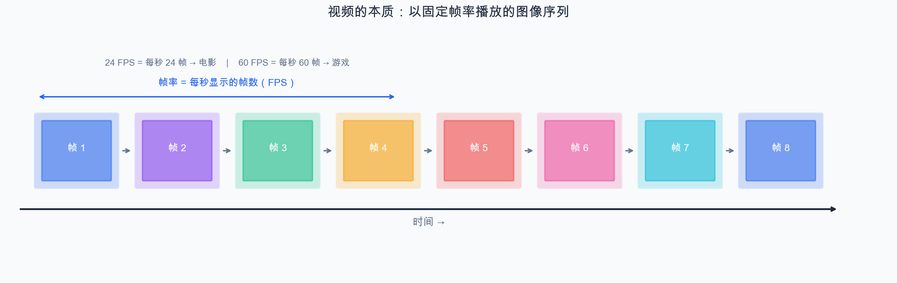
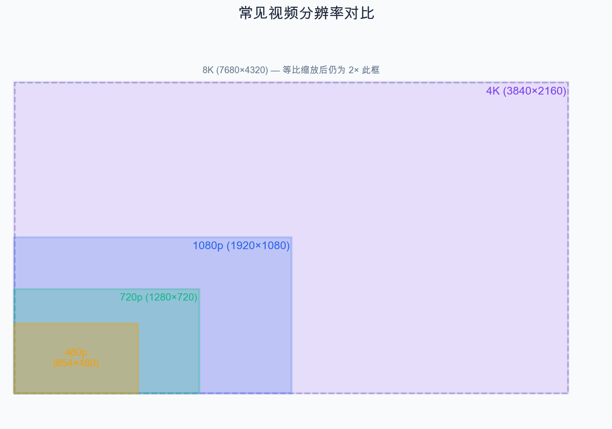
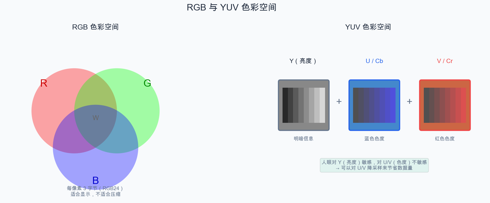
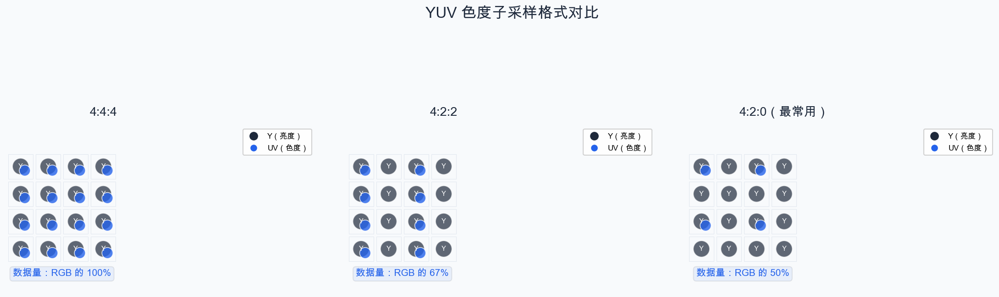
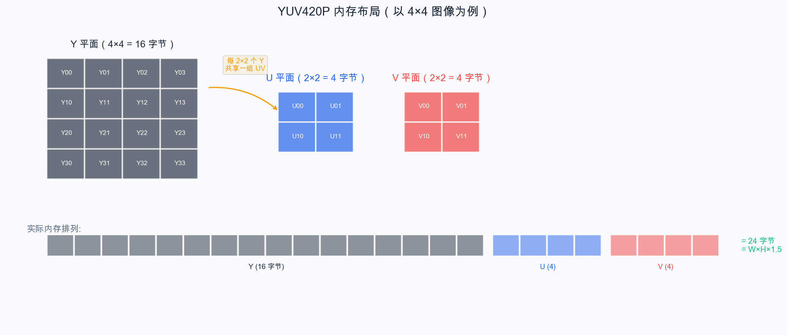
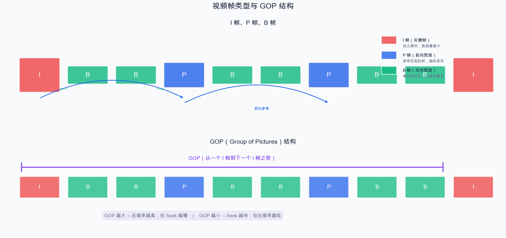
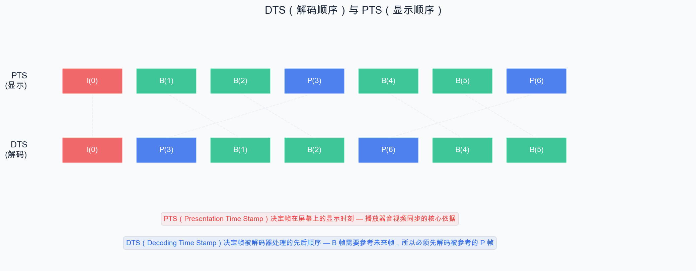

# 第 2 章：视频基础知识

> 在开始编写播放器代码之前，我们需要理解视频的本质。本章将带你深入了解视频的核心概念：分辨率、帧率、色彩空间、编码压缩等。

## 2.1 什么是视频？

视频的本质非常简单：**一系列连续的图像（帧），以足够快的速度逐帧播放，利用人眼的视觉暂留效应，产生"运动"的错觉。**



就像翻书动画一样——每一页是一张静止的画面，快速翻动就形成了动画。

## 2.2 核心参数

### 2.2.1 分辨率（Resolution）

分辨率描述了一帧画面的尺寸，即**宽度 × 高度**（单位：像素）。

| 名称 | 分辨率 | 像素总数 |
| --- | --- | --- |
| 480p（SD） | 854 × 480 | ~41 万 |
| 720p（HD） | 1280 × 720 | ~92 万 |
| 1080p（Full HD） | 1920 × 1080 | ~207 万 |
| 4K（UHD） | 3840 × 2160 | ~829 万 |
| 8K | 7680 × 4320 | ~3317 万 |



分辨率越高，画面越清晰，但数据量也成倍增长。

### 2.2.2 帧率（Frame Rate / FPS）

帧率是**每秒显示的帧数**（Frames Per Second），决定了视频的流畅度。

| 帧率 | 应用场景 | 观感 |
| --- | --- | --- |
| 24 fps | 电影 | 有"电影感"，轻微不连贯 |
| 30 fps | 电视、网络视频 | 流畅 |
| 60 fps | 游戏、体育直播 | 非常流畅 |
| 120 fps | 高帧率电影、VR | 极致流畅 |

帧率越高，运动越流畅，但也意味着单位时间内需要处理更多的帧。

### 2.2.3 码率（Bitrate）

码率是**单位时间内的数据量**（单位：bps，bits per second），直接反映了视频的质量和文件大小。

```
文件大小 ≈ 码率 × 时长

例：一个 5Mbps 码率、2小时的视频：
文件大小 = 5,000,000 bps × 7200 s ÷ 8 ÷ 1024 ÷ 1024 ÷ 1024 ≈ 4.2 GB
```

码率分为两种模式：

- **CBR（恒定码率）**：全程码率不变，适合直播
- **VBR（可变码率）**：复杂画面多分配码率，简单画面少分配，总体质量更好

## 2.3 像素格式与色彩空间

### 2.3.1 RGB 色彩空间

我们最熟悉的颜色表示方式。每个像素用三个分量表示：

- **R**（Red，红）：0~255
- **G**（Green，绿）：0~255
- **B**（Blue，蓝）：0~255

一个像素占 3 字节（24 位），也叫 **RGB24** 格式。

```
像素 [R=255, G=0, B=0] → 纯红色
像素 [R=0, G=255, B=0] → 纯绿色
像素 [R=255, G=255, B=255] → 白色
```

RGB 是显示器和图形处理的原生格式，但**不适合视频压缩**。



### 2.3.2 YUV 色彩空间

视频领域广泛使用 YUV 色彩空间，它将颜色分解为：

- **Y**（亮度，Luminance）：表示明暗程度
- **U / Cb**（蓝色色度）：蓝色与亮度的差值
- **V / Cr**（红色色度）：红色与亮度的差值

```
RGB 转 YUV（BT.601 标准）:
Y  =  0.299 × R + 0.587 × G + 0.114 × B
U  = -0.169 × R - 0.331 × G + 0.500 × B + 128
V  =  0.500 × R - 0.419 × G - 0.081 × B + 128
```

### 2.3.3 为什么视频使用 YUV？

关键原因是**人眼对亮度的敏感度远高于对色彩的敏感度**。

利用这一特性，我们可以对色度分量（U、V）进行降采样，在几乎不影响人眼感知的情况下大幅减少数据量。这就是 **色度子采样（Chroma Subsampling）**。

### 2.3.4 常见 YUV 采样格式

YUV 采样格式用 `J:a:b` 三个数字表示：

| 格式 | 含义 | 数据量（相对于 RGB） |
| --- | --- | --- |
| 4:4:4 | 每个像素完整的 Y、U、V | 100%（和 RGB 相同） |
| 4:2:2 | 水平方向每 2 个像素共享 UV | 67% |
| **4:2:0** | 水平和垂直方向各半采样，每 2×2 共 4 个像素共享 UV | **50%** |
| 4:1:1 | 水平方向每 4 个像素共享 UV | 50% |



**YUV420P**（也叫 I420）是最常用的格式。`P` 表示 Planar（平面存储），即 Y、U、V 三个分量分开存储：



对于一帧 1920×1080 的 YUV420P 图像：

```
数据量 = 1920 × 1080 × 1.5 = 3,110,400 字节 ≈ 3 MB
而 RGB24 = 1920 × 1080 × 3 = 6,220,800 字节 ≈ 6 MB
```

**仅靠 YUV420P 采样，数据量就减半了**，且画质损失几乎不可感知。

## 2.4 视频编码基础

即使使用 YUV420P，原始视频数据量仍然巨大（1080p@30fps ≈ 93 MB/s）。视频编码通过去除**冗余信息**来大幅压缩数据。

### 2.4.1 冗余类型

| 冗余类型 | 描述 | 压缩手段 |
| --- | --- | --- |
| 空间冗余 | 同一帧中相邻像素颜色相近 | 帧内预测（Intra Prediction） |
| 时间冗余 | 相邻帧之间画面变化不大 | 帧间预测（Inter Prediction） |
| 编码冗余 | 数据中某些值出现频率更高 | 熵编码（CABAC/CAVLC） |
| 视觉冗余 | 人眼对某些细节不敏感 | 量化（Quantization） |

### 2.4.2 I 帧、P 帧、B 帧

视频编码中的帧分为三种类型：

- **I 帧（Intra Frame，关键帧）**：完全独立编码，不依赖其他帧。可以独立解码。数据量最大。
- **P 帧（Predicted Frame，前向预测帧）**：参考前面的 I 帧或 P 帧进行预测编码。只编码与参考帧的差异。
- **B 帧（Bidirectional Frame，双向预测帧）**：同时参考前面和后面的已编码帧进行双向预测。压缩率最高，但编解码复杂度也最高。

> **注意**：在 MPEG-2 中，B 帧只能参考 I 帧和 P 帧，不能参考其他 B 帧。而 H.264 引入了"参考 B 帧"机制，B 帧可以参考其他 B 帧，也可以被其他帧作为参考，从而实现更高的压缩效率。



### 2.4.3 GOP（Group of Pictures）

GOP 是从一个 I 帧开始到下一个 I 帧之前的一组帧。GOP 的大小影响：
- **GOP 越大**：压缩率越高，但 Seek（跳转）越慢（因为必须从 I 帧开始解码）
- **GOP 越小**：Seek 越快，但压缩率越低

### 2.4.4 DTS 与 PTS

由于 B 帧的存在，帧的**解码顺序**和**显示顺序**可能不同：



- **PTS（Presentation Time Stamp）**：显示时间戳，决定帧在屏幕上显示的时刻
- **DTS（Decoding Time Stamp）**：解码时间戳，决定帧被解码器处理的顺序

在播放器开发中，PTS 是我们做音视频同步的核心依据。

## 2.5 常见视频编码标准

| 编码标准 | 发布年份 | 特点 |
| --- | --- | --- |
| H.264 / AVC | 2003 | 目前最广泛使用，兼容性最好 |
| H.265 / HEVC | 2013 | 同等质量码率降低 ~50%，编码复杂度高 |
| VP9 | 2013 | Google 开源，YouTube 广泛使用 |
| AV1 | 2018 | 开源免版税，压缩率优于 H.265，编码非常慢 |

对于入门学习，我们主要关注 **H.264**，它是目前使用最广泛的编码标准。

## 2.6 Demo：理解帧率的概念

本章的 Demo 用 FFmpeg 命令行工具将一组图片合成视频，直观体验不同帧率的效果。

### 准备工作

首先创建一组简单的测试图片。我们使用 FFmpeg 生成带有帧编号的图片序列：

```bash
# 生成 60 张带编号的测试图片（640x480，白底黑字）
for i in $(seq -w 0 59); do
  ffmpeg -y -f lavfi -i \
    "color=white:s=640x480:d=0.1,drawtext=text='Frame ${i}':fontsize=72:x=(w-text_w)/2:y=(h-text_h)/2:fontcolor=black" \
    -frames:v 1 frame_${i}.png
done
```

### 不同帧率合成视频

```bash
# 以 10fps 合成视频（每秒 10 帧，看起来会有明显跳动）
ffmpeg -framerate 10 -i frame_%02d.png -c:v libx264 -pix_fmt yuv420p output_10fps.mp4

# 以 24fps 合成视频（电影帧率，比较流畅）
ffmpeg -framerate 24 -i frame_%02d.png -c:v libx264 -pix_fmt yuv420p output_24fps.mp4

# 以 60fps 合成视频（高帧率，非常流畅）
ffmpeg -framerate 60 -i frame_%02d.png -c:v libx264 -pix_fmt yuv420p output_60fps.mp4
```

### 播放对比

```bash
# 分别播放三个视频，感受帧率差异
ffplay output_10fps.mp4
ffplay output_24fps.mp4
ffplay output_60fps.mp4
```

你会明显感受到：

- **10fps**：画面跳动明显，不流畅
- **24fps**：较为流畅，有"电影感"
- **60fps**：非常流畅丝滑

### 用 ffprobe 查看视频信息

```bash
ffprobe -v quiet -show_format -show_streams output_24fps.mp4
```

输出中可以关注：

```
[STREAM]
codec_name=h264          # 编码格式
width=640                # 宽度
height=480               # 高度
r_frame_rate=24/1        # 帧率
pix_fmt=yuv420p          # 像素格式
...
[FORMAT]
duration=2.500000        # 时长（60帧 ÷ 24fps = 2.5秒）
bit_rate=...             # 码率
```

## 小结

本章我们学习了视频的核心基础知识：

1. **视频的本质**：逐帧播放的图像序列
2. **核心参数**：分辨率、帧率（FPS）、码率（Bitrate）
3. **色彩空间**：RGB 与 YUV 的区别，YUV420P 的优势
4. **视频编码**：I/P/B 帧、GOP、DTS 与 PTS
5. **编码标准**：H.264 是目前最通用的标准

这些概念会在后续编写播放器代码时反复出现。特别是 **YUV420P** 和 **PTS**，它们是播放器开发的核心。

---

> **上一篇**：[第 1 章：走进音视频的世界](01-走进音视频的世界.md)
> **下一篇**：[第 3 章：音频基础知识](03-音频基础知识.md)
