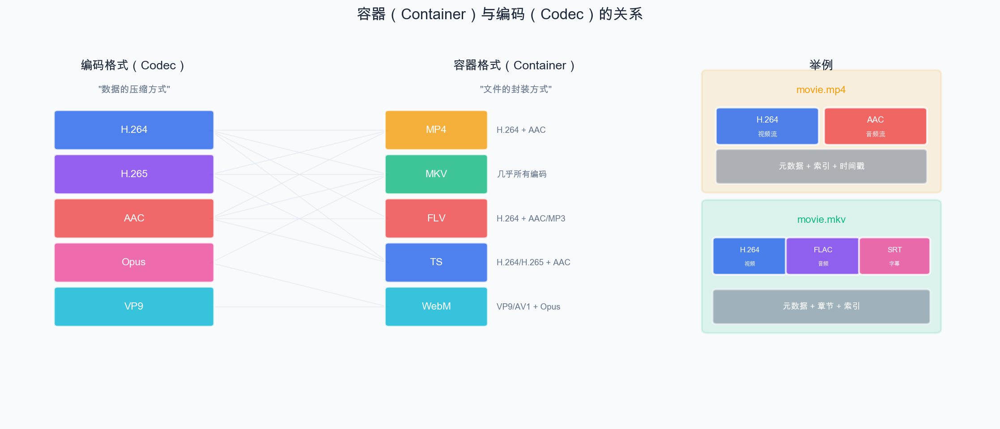
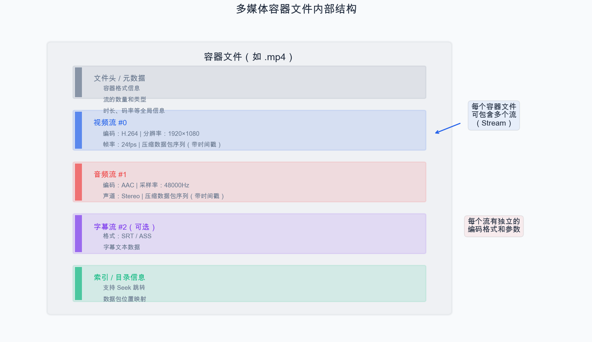
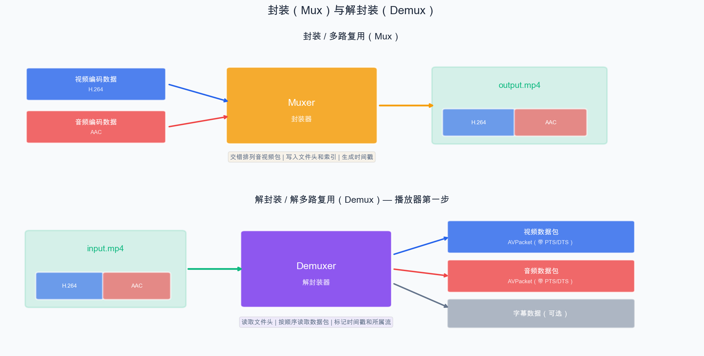
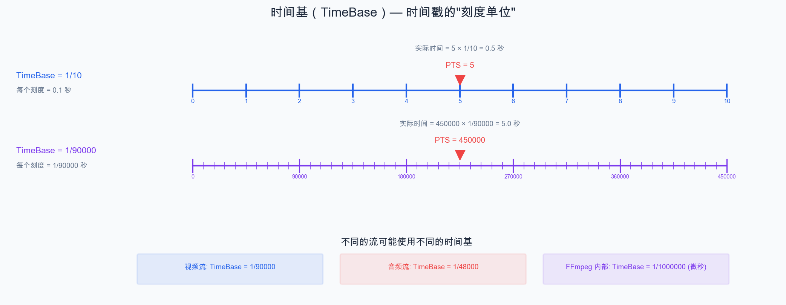
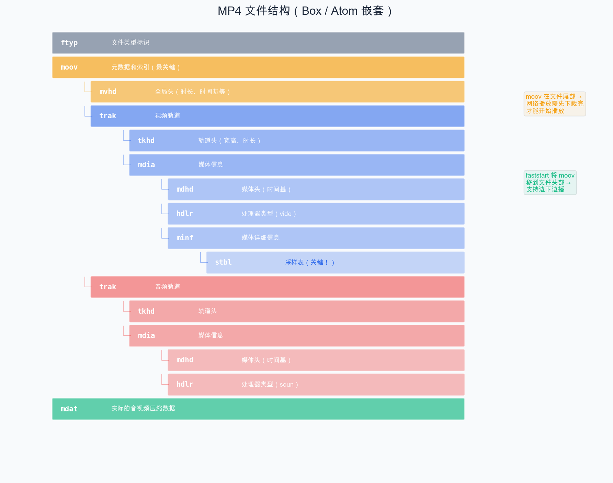

# 第 4 章：封装格式与多媒体容器

> 编码后的音频和视频数据如何"打包"成一个文件？答案是**封装格式**（Container Format）。本章我们来理清容器与编码的关系、了解常见封装格式，并重点掌握时间基（TimeBase）和 PTS/DTS 的概念。

## 4.1 容器 vs 编码：理清概念

这是初学者最容易混淆的概念之一：

- **编码（Codec）**：数据的压缩方式，如 H.264、AAC
- **容器（Container）**：文件的封装方式，如 MP4、MKV

两者的关系是：**容器负责"装"，编码负责"压"**。



例如：
- H.264 视频 + AAC 音频 → 可以封装到 MP4、MKV、FLV、TS 中
- 同一个 MKV 文件可以包含 H.264 视频 + FLAC 音频 + SRT 字幕

常见的组合：

| 容器 | 常见视频编码 | 常见音频编码 | 典型用途 |
| --- | --- | --- | --- |
| MP4 | H.264, H.265 | AAC | 通用视频文件，网络视频 |
| MKV | 几乎所有 | 几乎所有 | 高清视频，字幕支持好 |
| FLV | H.264 | AAC, MP3 | 直播流 |
| TS | H.264, H.265 | AAC, AC3 | 广播电视，HLS |
| WebM | VP8, VP9, AV1 | Vorbis, Opus | Web 视频 |
| AVI | 几乎所有 | 几乎所有 | 早期 Windows 视频 |

## 4.2 容器中包含什么？

一个多媒体容器文件通常包含以下内容：



每个容器文件可以包含**多个流（Stream）**，每个流有独立的编码格式和参数。

## 4.3 多路复用与解多路复用

### 封装 / 多路复用（Mux）

将多个独立的流"合并"到一个容器文件中。

### 解封装 / 解多路复用（Demux）

从容器文件中"分离"出各个独立的流，这是播放器的第一步操作。



- **Muxer** 负责：将音视频数据包按时间戳交错排列、写入文件头和索引信息
- **Demuxer** 负责：读取文件头获取流信息、按顺序读取数据包、标记时间戳和所属流

## 4.4 时间基（TimeBase）

时间基是音视频中一个非常重要且容易让初学者困惑的概念。

### 4.4.1 什么是时间基？

时间基定义了**时间戳的单位**。它是一个分数，表示每个时间刻度代表多少秒。



### 4.4.2 为什么不直接用秒？

因为浮点数不精确！在音视频处理中，微小的时间误差会导致音画不同步或者帧抖动。使用整数时间戳 + 有理数时间基可以做到**精确的时间表示**。

### 4.4.3 FFmpeg 中的时间基

在 FFmpeg 中，时间基用 `AVRational` 结构表示：

```c
typedef struct AVRational {
    int num;  // 分子
    int den;  // 分母
} AVRational;
```

常见的时间基：

| 场景 | 时间基 | 说明 |
| --- | --- | --- |
| AV_TIME_BASE | 1/1000000 | FFmpeg 内部统一时间基（微秒） |
| 视频流 | 1/90000 | MPEG-TS 中常见 |
| 视频流 | 1/24000 | 24fps 视频 |
| 音频流 | 1/44100 | 44100Hz 采样率音频 |

**重点**：不同的流可能有不同的时间基！在做音视频同步时，需要将时间戳转换到统一的时间参考下。

### 4.4.4 时间戳转换

FFmpeg 提供了时间戳转换函数：

```c
// 将时间戳从一个时间基转换到另一个
int64_t av_rescale_q(int64_t a, AVRational bq, AVRational cq);

// 示例：将视频流的 PTS 转换为秒
double time_in_seconds = pts * av_q2d(stream->time_base);
```

其中 `av_q2d()` 将 `AVRational` 转换为 `double`。

## 4.5 PTS 与 DTS 详解

上一章简要提到了 PTS 和 DTS，这里做更深入的讲解。

### 4.5.1 定义

- **PTS（Presentation Time Stamp）**：该帧/包应该在什么时间**显示/播放**
- **DTS（Decoding Time Stamp）**：该帧/包应该在什么时间**解码**

### 4.5.2 为什么需要两个时间戳？

对于**音频**和**不含 B 帧的视频**，PTS 和 DTS 是相同的，因为解码顺序就是显示顺序。

但对于**含 B 帧的视频**，由于 B 帧参考前后帧，解码顺序必须和显示顺序不同：

```
显示顺序：  I(0)  B(1)  B(2)  P(3)  B(4)  B(5)  P(6)
             ↓     ↓     ↓     ↓     ↓     ↓     ↓
解码顺序：  I(0)  P(3)  B(1)  B(2)  P(6)  B(4)  B(5)
```

P(3) 必须在 B(1)、B(2) 之前解码，因为 B(1)、B(2) 的解码依赖 P(3) 的参考数据。

### 4.5.3 在播放器中的应用

| 时间戳 | 用途 |
| --- | --- |
| DTS | 解码器按此顺序接收数据包 |
| PTS | 渲染/播放模块按此时间展示帧 |

在我们的播放器中：
- 送入解码器时按 DTS 排列（容器文件中已经按 DTS 排好了）
- 从解码器取出帧后，按 PTS 决定何时显示

## 4.6 常见容器格式详解

### 4.6.1 MP4（MPEG-4 Part 14）

最通用的视频容器格式，特点：

- 基于 ISO Base Media File Format（ISOBMFF）
- 由一系列"Box"（也叫"Atom"）嵌套组成
- 支持 H.264/H.265 + AAC
- 索引信息（moov box）通常在文件尾部，可以通过 `faststart` 移到头部以支持网络流式播放



### 4.6.2 MKV（Matroska）

开源、功能最丰富的容器：

- 支持几乎所有编码格式
- 强大的字幕支持（可内嵌多语言字幕）
- 支持多音轨
- 支持章节标记

### 4.6.3 FLV（Flash Video）

结构简单的容器，直播领域常用：

- 只支持少数编码格式（H.264 + AAC/MP3）
- 结构简单，解析开销小
- RTMP 直播的默认封装格式

### 4.6.4 TS（MPEG Transport Stream）

广播和流媒体领域的标准：

- 固定 188 字节包长，抗传输错误能力强
- 不需要完整文件即可开始播放
- HLS 切片的默认格式

## 4.7 Demo：用 ffprobe 深入分析视频文件

### 4.7.1 准备测试文件

如果你没有现成的测试视频，可以用 FFmpeg 生成一个：

```bash
# 生成一个 10 秒的测试视频
# 包含视频流（H.264, 1280x720, 24fps）和音频流（AAC, 48000Hz, Stereo）
ffmpeg -y \
  -f lavfi -i "testsrc2=size=1280x720:rate=24:duration=10" \
  -f lavfi -i "sine=frequency=440:duration=10:sample_rate=48000" \
  -c:v libx264 -preset fast -crf 23 \
  -c:a aac -b:a 128k \
  test_video.mp4
```

### 4.7.2 查看基本信息

```bash
ffprobe test_video.mp4
```

输出示例：

```
Input #0, mov,mp4,m4a,3gp,3g2,mj2, from 'test_video.mp4':
  Duration: 00:00:10.00, start: 0.000000, bitrate: 618 kb/s
  Stream #0:0(und): Video: h264 (High) (avc1), yuv420p, 1280x720 [SAR 1:1 DAR 16:9], 481 kb/s, 24 fps, 24 tbr, 12288 tbn
  Stream #0:1(und): Audio: aac (LC) (mp4a), 48000 Hz, mono, fltp, 128 kb/s
```

关键信息解读：

- `mov,mp4,m4a,3gp,...`：容器格式（MP4 家族）
- `Duration: 00:00:10.00`：时长 10 秒
- `Stream #0:0`：第一个流（视频）
  - `h264 (High)`：H.264 编码，High Profile
  - `yuv420p`：像素格式 YUV420P
  - `1280x720`：分辨率
  - `24 fps`：帧率
  - `12288 tbn`：时间基的分母（time_base = 1/12288）
- `Stream #0:1`：第二个流（音频）
  - `aac (LC)`：AAC-LC 编码
  - `48000 Hz`：采样率
  - `mono`：单声道
  - `fltp`：采样格式为 float planar

### 4.7.3 查看详细流信息

```bash
ffprobe -v quiet -show_streams -print_format json test_video.mp4
```

这会以 JSON 格式输出每个流的详细参数。关注以下字段：

```json
{
  "streams": [
    {
      "index": 0,
      "codec_name": "h264",
      "codec_type": "video",
      "width": 1280,
      "height": 720,
      "pix_fmt": "yuv420p",
      "r_frame_rate": "24/1",
      "time_base": "1/12288",
      "nb_frames": "240",
      "duration": "10.000000"
    },
    {
      "index": 1,
      "codec_name": "aac",
      "codec_type": "audio",
      "sample_rate": "48000",
      "channels": 1,
      "sample_fmt": "fltp",
      "time_base": "1/48000",
      "nb_frames": "469",
      "duration": "10.005333"
    }
  ]
}
```

注意看 `time_base`：视频流是 `1/12288`，音频流是 `1/48000`——它们的时间基不同！

### 4.7.4 查看每个数据包的信息

```bash
# 只看前 20 个包的信息
ffprobe -v quiet -show_packets -select_streams v:0 test_video.mp4 | head -100
```

输出：

```
[PACKET]
codec_type=video
stream_index=0
pts=0
pts_time=0.000000
dts=0
dts_time=0.000000
duration=512
duration_time=0.041667
size=9830
flags=K         ← K 表示关键帧（I 帧）
[/PACKET]
[PACKET]
codec_type=video
stream_index=0
pts=512
pts_time=0.041667
dts=512
dts_time=0.041667
duration=512
duration_time=0.041667
size=384
flags=__        ← 非关键帧
[/PACKET]
```

可以看到：
- I 帧（flags=K）的 `size` 远大于其他帧
- `pts` 和 `dts` 在无 B 帧时相同
- `duration=512` 对应时间基 1/12288 下一帧的时长（512/12288 ≈ 0.0417 ≈ 1/24 秒）

### 4.7.5 查看容器格式信息

```bash
ffprobe -v quiet -show_format -print_format json test_video.mp4
```

输出：

```json
{
  "format": {
    "filename": "test_video.mp4",
    "nb_streams": 2,
    "format_name": "mov,mp4,m4a,3gp,3g2,mj2",
    "duration": "10.005333",
    "size": "773268",
    "bit_rate": "618158"
  }
}
```

## 小结

本章我们学习了封装格式的核心知识：

1. **容器 vs 编码**：容器是"包装盒"，编码是"压缩方式"，两者独立
2. **容器内容**：多个流（视频/音频/字幕）+ 元数据 + 索引
3. **Mux 与 Demux**：封装与解封装，播放器的第一步是 Demux
4. **时间基（TimeBase）**：时间戳的单位，不同流的时间基可能不同
5. **PTS 与 DTS**：显示时间戳与解码时间戳，PTS 是音视频同步的关键
6. **常见容器格式**：MP4（通用）、MKV（功能丰富）、FLV（直播）、TS（广播）

至此，音视频基础知识部分结束。你已经掌握了视频、音频、容器格式的核心概念。下一章，我们将进入 FFmpeg 开发实战，从搭建开发环境开始！

---

> **上一篇**：[第 3 章：音频基础知识](03-音频基础知识.md)
> **下一篇**：[第 5 章：FFmpeg 开发环境搭建](05-FFmpeg开发环境搭建.md)
