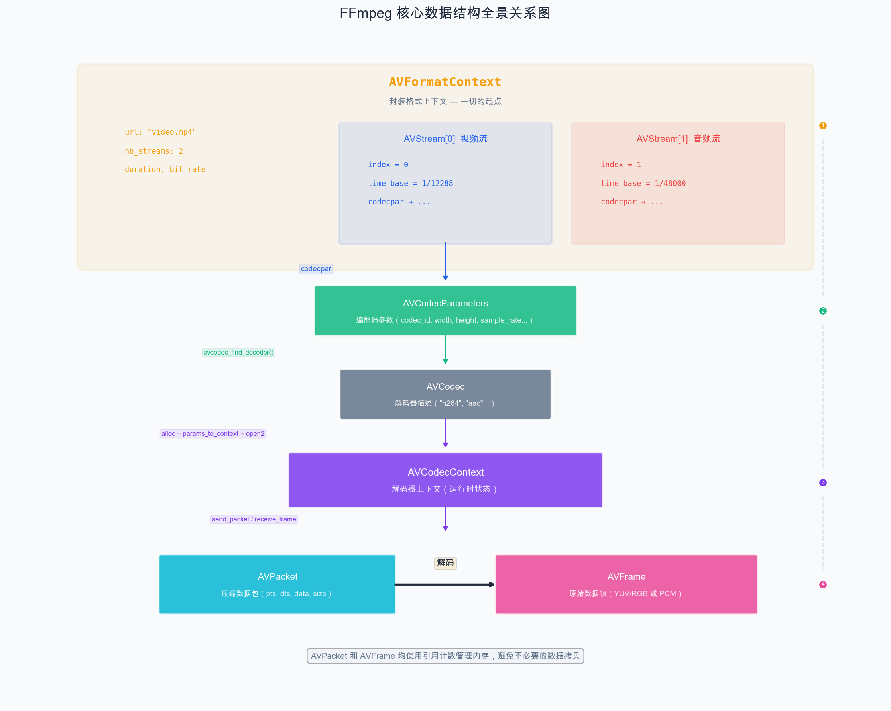
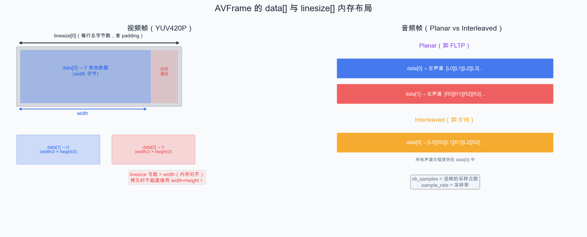
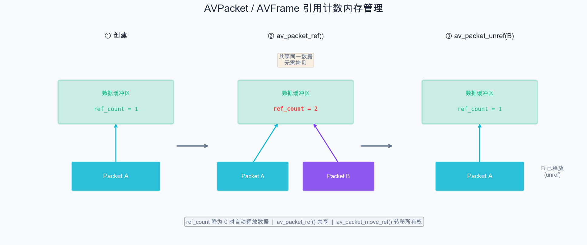

# 第 6 章：FFmpeg 核心数据结构详解

> FFmpeg 的 API 围绕几个核心数据结构展开。理解它们之间的关系，是编写 FFmpeg 程序的基础。本章我们将详细剖析每个核心数据结构，并通过 Demo 加深理解。

## 6.1 数据结构全景图

在 FFmpeg 播放流程中，核心数据结构之间的关系如下：



## 6.2 AVFormatContext —— 一切的起点

`AVFormatContext` 是 FFmpeg 中最重要的结构体之一。它代表一个多媒体文件（或流）的**封装格式上下文**，包含了文件的所有信息。

### 关键字段

```c
typedef struct AVFormatContext {
    const AVInputFormat *iformat;   // 输入格式（Demuxer），如 "mov,mp4,..."
    const AVOutputFormat *oformat;  // 输出格式（Muxer），播放器不用
    AVIOContext *pb;                // I/O 上下文

    unsigned int nb_streams;        // 流的数量
    AVStream **streams;             // 流数组

    char *url;                      // 文件路径/URL
    int64_t duration;               // 总时长（以 AV_TIME_BASE 为单位）
    int64_t bit_rate;               // 总码率

    // ... 还有很多其他字段
} AVFormatContext;
```

### 获取 AVFormatContext 的方式

```cpp
AVFormatContext* fmt_ctx = nullptr;

// 打开文件，FFmpeg 自动检测格式
int ret = avformat_open_input(&fmt_ctx, "video.mp4", nullptr, nullptr);
if (ret < 0) {
    // 错误处理
}

// 读取流信息（有些格式需要此步骤才能获得完整信息）
ret = avformat_find_stream_info(fmt_ctx, nullptr);

// 使用完毕后释放
avformat_close_input(&fmt_ctx);
```

### 获取时长

```cpp
// duration 以 AV_TIME_BASE（1/1000000，微秒）为单位
if (fmt_ctx->duration != AV_NOPTS_VALUE) {
    double duration_sec = fmt_ctx->duration / (double)AV_TIME_BASE;
    std::cout << "时长: " << duration_sec << " 秒" << std::endl;
}
```

## 6.3 AVStream —— 流信息

每个 `AVStream` 代表文件中的一个流（视频流、音频流、字幕流等）。

### 关键字段

```c
typedef struct AVStream {
    int index;                      // 流的索引号
    AVCodecParameters *codecpar;    // 编解码参数
    AVRational time_base;           // 该流的时间基
    int64_t duration;               // 该流的时长（以 time_base 为单位）
    int64_t nb_frames;              // 帧数（可能为 0，表示未知）
    AVRational avg_frame_rate;      // 平均帧率（仅视频流有意义）
    AVRational r_frame_rate;        // 真实帧率
    // ...
} AVStream;
```

### 遍历所有流

```cpp
for (unsigned int i = 0; i < fmt_ctx->nb_streams; i++) {
    AVStream* stream = fmt_ctx->streams[i];

    const char* type_str = av_get_media_type_string(stream->codecpar->codec_type);
    std::cout << "Stream #" << i << ": " << (type_str ? type_str : "unknown") << std::endl;
}
```

### 查找特定类型的流

```cpp
// 方法一：手动遍历
int video_stream_index = -1;
for (unsigned int i = 0; i < fmt_ctx->nb_streams; i++) {
    if (fmt_ctx->streams[i]->codecpar->codec_type == AVMEDIA_TYPE_VIDEO) {
        video_stream_index = i;
        break;
    }
}

// 方法二：使用 FFmpeg 提供的便捷函数（推荐）
int video_idx = av_find_best_stream(fmt_ctx, AVMEDIA_TYPE_VIDEO, -1, -1, nullptr, 0);
int audio_idx = av_find_best_stream(fmt_ctx, AVMEDIA_TYPE_AUDIO, -1, -1, nullptr, 0);
```

`av_find_best_stream()` 不仅能找到流，还会根据启发式规则选择"最佳"的流（例如分辨率最高的视频流）。

## 6.4 AVCodecParameters —— 编解码参数

`AVCodecParameters` 存储了流的编解码参数，是**只读**的描述信息。

### 关键字段

```c
typedef struct AVCodecParameters {
    enum AVMediaType codec_type;    // 媒体类型（视频/音频/字幕）
    enum AVCodecID codec_id;        // 编码ID（AV_CODEC_ID_H264 等）

    int format;                     // 格式（视频时为 AVPixelFormat，音频时为 AVSampleFormat）

    // 视频特有
    int width, height;              // 分辨率

    // 音频特有
    int sample_rate;                // 采样率
    AVChannelLayout ch_layout;      // 声道布局

    int64_t bit_rate;               // 码率
    // ...
} AVCodecParameters;
```

> **注意**：`format` 字段是一个 `int` 类型，对于视频流需要转换为 `AVPixelFormat`，对于音频流需要转换为 `AVSampleFormat`。

### 作用

`AVCodecParameters` 的主要用途是**将参数传递给解码器上下文**：

```cpp
// 从 codecpar 查找解码器
const AVCodec* codec = avcodec_find_decoder(stream->codecpar->codec_id);

// 创建解码器上下文
AVCodecContext* codec_ctx = avcodec_alloc_context3(codec);

// 将参数从 codecpar 复制到 codec_ctx
avcodec_parameters_to_context(codec_ctx, stream->codecpar);
```

## 6.5 AVCodecContext —— 解码器上下文

`AVCodecContext` 是解码器的运行时上下文，包含了解码所需的所有状态信息。

### 关键字段

```c
typedef struct AVCodecContext {
    const AVCodec *codec;           // 关联的编解码器
    enum AVCodecID codec_id;

    // 视频
    int width, height;
    enum AVPixelFormat pix_fmt;     // 输出像素格式
    AVRational time_base;
    AVRational framerate;

    // 音频
    int sample_rate;
    AVChannelLayout ch_layout;
    enum AVSampleFormat sample_fmt; // 输出采样格式
    int frame_size;                 // 每帧采样数

    // 多线程
    int thread_count;               // 解码线程数
    // ...
} AVCodecContext;
```

### 初始化和使用

```cpp
// 1. 查找解码器
const AVCodec* codec = avcodec_find_decoder(codecpar->codec_id);

// 2. 分配上下文
AVCodecContext* codec_ctx = avcodec_alloc_context3(codec);

// 3. 填入参数
avcodec_parameters_to_context(codec_ctx, codecpar);

// 4. 设置多线程解码（可选，提高性能）
codec_ctx->thread_count = 4;

// 5. 打开解码器
int ret = avcodec_open2(codec_ctx, codec, nullptr);
if (ret < 0) {
    // 错误处理
}

// ... 使用解码器 ...

// 6. 释放
avcodec_free_context(&codec_ctx);
```

## 6.6 AVCodec —— 编解码器

`AVCodec` 描述了一个编解码器的**静态信息**（能力、名称等）。

```c
typedef struct AVCodec {
    const char *name;               // 短名称，如 "h264"
    const char *long_name;          // 长名称，如 "H.264 / AVC / ..."
    enum AVMediaType type;          // 类型：视频/音频
    enum AVCodecID id;              // ID

    const AVRational *supported_framerates; // 支持的帧率（仅编码器）
    const enum AVPixelFormat *pix_fmts;     // 支持的像素格式
    const int *supported_samplerates;       // 支持的采样率（仅音频）
    // ...
} AVCodec;
```

获取方式：

```cpp
// 通过 codec_id 查找
const AVCodec* codec = avcodec_find_decoder(AV_CODEC_ID_H264);

// 通过名称查找
const AVCodec* codec = avcodec_find_decoder_by_name("h264");
```

## 6.7 AVPacket —— 压缩数据包

`AVPacket` 是从容器中读取的一个**压缩数据包**，对应编码后的一帧（或部分帧）数据。

### 关键字段

```c
typedef struct AVPacket {
    AVBufferRef *buf;       // 引用计数的数据缓冲区
    int64_t pts;            // 显示时间戳
    int64_t dts;            // 解码时间戳
    uint8_t *data;          // 压缩数据指针
    int size;               // 数据大小
    int stream_index;       // 所属流的索引
    int flags;              // 标志位（AV_PKT_FLAG_KEY = 关键帧）
    int64_t duration;       // 持续时长
    // ...
} AVPacket;
```

### 使用方式

```cpp
// 分配
AVPacket* pkt = av_packet_alloc();

// 从文件中读取一个包
int ret = av_read_frame(fmt_ctx, pkt);

// 判断是哪个流的
if (pkt->stream_index == video_stream_index) {
    // 视频包
} else if (pkt->stream_index == audio_stream_index) {
    // 音频包
}

// 使用完后释放数据（不销毁 pkt 本身）
av_packet_unref(pkt);

// 最终释放 pkt
av_packet_free(&pkt);
```

### 引用计数

`AVPacket` 使用引用计数管理内存：

```cpp
AVPacket* pkt2 = av_packet_alloc();

// 创建引用（共享数据，引用计数 +1）
av_packet_ref(pkt2, pkt);

// 释放引用（引用计数 -1，降为 0 时自动释放数据）
av_packet_unref(pkt2);
```

## 6.8 AVFrame —— 原始数据帧

`AVFrame` 是**解码后的原始数据帧**。对于视频是 YUV/RGB 像素数据，对于音频是 PCM 采样数据。

### 关键字段

```c
typedef struct AVFrame {
    // 数据指针（最多 8 个平面）
    uint8_t *data[AV_NUM_DATA_POINTERS];
    // 每行数据的字节数
    int linesize[AV_NUM_DATA_POINTERS];

    int width, height;              // 视频帧的宽高
    enum AVPixelFormat format;      // 像素格式（视频）/ 采样格式（音频）

    int64_t pts;                    // 显示时间戳
    int64_t best_effort_timestamp;  // 最佳时间戳估计

    // 音频特有
    int nb_samples;                 // 采样点数
    int sample_rate;                // 采样率
    AVChannelLayout ch_layout;      // 声道布局

    // ...
} AVFrame;
```

### 视频帧的 data 和 linesize

对于 YUV420P 格式的视频帧：



注意 `linesize` 可能大于实际宽度！这是因为 FFmpeg 会对内存进行对齐（通常是 32 字节对齐），以提高 SIMD 等指令的执行效率。拷贝数据时不能直接用 `width × height`，必须按 `linesize` 逐行拷贝。

### 使用方式

```cpp
AVFrame* frame = av_frame_alloc();

// ... 解码填充数据 ...

// 引用计数
AVFrame* frame2 = av_frame_alloc();
av_frame_ref(frame2, frame);       // 共享数据
av_frame_unref(frame2);            // 释放引用

// 释放帧
av_frame_free(&frame);
```

## 6.9 内存管理：引用计数机制

FFmpeg 使用**引用计数**来管理 `AVPacket` 和 `AVFrame` 的内存，避免不必要的数据拷贝。



核心 API：

| 操作 | AVPacket | AVFrame | 说明 |
| --- | --- | --- | --- |
| 分配 | `av_packet_alloc()` | `av_frame_alloc()` | 分配结构体（不含数据） |
| 创建引用 | `av_packet_ref()` | `av_frame_ref()` | 共享数据，ref_count++ |
| 转移引用 | `av_packet_move_ref()` | `av_frame_move_ref()` | 转移所有权 |
| 释放引用 | `av_packet_unref()` | `av_frame_unref()` | ref_count--，为 0 时释放数据 |
| 释放结构体 | `av_packet_free()` | `av_frame_free()` | 释放结构体+数据 |

**最佳实践**：

```cpp
// 用 RAII 封装，避免忘记释放
struct PacketDeleter {
    void operator()(AVPacket* p) {
        av_packet_free(&p);
    }
};
using PacketPtr = std::unique_ptr<AVPacket, PacketDeleter>;

// 使用
PacketPtr pkt(av_packet_alloc());
av_read_frame(fmt_ctx, pkt.get());
// 离开作用域自动释放
```

## 6.10 Demo：实现一个简易 ffprobe

这个 Demo 打开一个视频文件，打印所有流的详细信息。

```cpp
// chapter-06-media-info/main.cpp

extern "C" {
#include <libavformat/avformat.h>
#include <libavcodec/avcodec.h>
#include <libavutil/avutil.h>
#include <libavutil/channel_layout.h>
}

#include <iostream>
#include <iomanip>
#include <string>

// 辅助函数：将时间戳转换为 "HH:MM:SS.mmm" 格式
std::string format_time(int64_t duration, AVRational time_base) {
    if (duration == AV_NOPTS_VALUE) return "N/A";

    double seconds = duration * av_q2d(time_base);
    int hours = static_cast<int>(seconds / 3600);
    int mins = static_cast<int>((seconds - hours * 3600) / 60);
    double secs = seconds - hours * 3600 - mins * 60;

    char buf[64];
    snprintf(buf, sizeof(buf), "%02d:%02d:%06.3f", hours, mins, secs);
    return buf;
}

// 辅助函数：获取声道布局描述
std::string get_channel_layout_desc(const AVChannelLayout* ch_layout) {
    char buf[128];
    av_channel_layout_describe(ch_layout, buf, sizeof(buf));
    return buf;
}

int main(int argc, char* argv[]) {
    if (argc < 2) {
        std::cerr << "用法: " << argv[0] << " <输入文件>" << std::endl;
        return 1;
    }

    const char* input_file = argv[1];

    // ========== 1. 打开文件 ==========
    AVFormatContext* fmt_ctx = nullptr;
    int ret = avformat_open_input(&fmt_ctx, input_file, nullptr, nullptr);
    if (ret < 0) {
        char errbuf[AV_ERROR_MAX_STRING_SIZE];
        av_strerror(ret, errbuf, sizeof(errbuf));
        std::cerr << "无法打开文件: " << errbuf << std::endl;
        return 1;
    }

    // ========== 2. 读取流信息 ==========
    ret = avformat_find_stream_info(fmt_ctx, nullptr);
    if (ret < 0) {
        std::cerr << "无法获取流信息" << std::endl;
        avformat_close_input(&fmt_ctx);
        return 1;
    }

    // ========== 3. 打印文件级信息 ==========
    std::cout << "================================================" << std::endl;
    std::cout << "  文件信息" << std::endl;
    std::cout << "================================================" << std::endl;
    std::cout << "文件名    : " << input_file << std::endl;
    std::cout << "封装格式  : " << fmt_ctx->iformat->name
              << " (" << fmt_ctx->iformat->long_name << ")" << std::endl;

    // 时长
    AVRational global_tb = {1, AV_TIME_BASE};
    std::cout << "时长      : " << format_time(fmt_ctx->duration, global_tb) << std::endl;

    // 码率
    if (fmt_ctx->bit_rate > 0) {
        std::cout << "总码率    : " << fmt_ctx->bit_rate / 1000 << " kbps" << std::endl;
    }

    std::cout << "流数量    : " << fmt_ctx->nb_streams << std::endl;

    // ========== 4. 遍历每个流，打印详细信息 ==========
    for (unsigned int i = 0; i < fmt_ctx->nb_streams; i++) {
        AVStream* stream = fmt_ctx->streams[i];
        AVCodecParameters* par = stream->codecpar;

        std::cout << std::endl;
        std::cout << "------------------------------------------------" << std::endl;
        std::cout << "  Stream #" << i << ": "
                  << av_get_media_type_string(par->codec_type) << std::endl;
        std::cout << "------------------------------------------------" << std::endl;

        // 编码器信息
        const AVCodec* codec = avcodec_find_decoder(par->codec_id);
        std::cout << "编码格式  : " << avcodec_get_name(par->codec_id);
        if (codec && codec->long_name) {
            std::cout << " (" << codec->long_name << ")";
        }
        std::cout << std::endl;

        // 码率
        if (par->bit_rate > 0) {
            std::cout << "码率      : " << par->bit_rate / 1000 << " kbps" << std::endl;
        }

        // 时间基
        std::cout << "时间基    : " << stream->time_base.num
                  << "/" << stream->time_base.den << std::endl;

        // 时长
        std::cout << "时长      : " << format_time(stream->duration, stream->time_base)
                  << std::endl;

        // 根据流类型打印特有信息
        switch (par->codec_type) {
            case AVMEDIA_TYPE_VIDEO: {
                std::cout << "分辨率    : " << par->width << "x" << par->height << std::endl;

                // 像素格式
                const char* pix_fmt_name = av_get_pix_fmt_name(
                    static_cast<AVPixelFormat>(par->format));
                std::cout << "像素格式  : " << (pix_fmt_name ? pix_fmt_name : "unknown")
                          << std::endl;

                // 帧率
                if (stream->avg_frame_rate.den && stream->avg_frame_rate.num) {
                    double fps = av_q2d(stream->avg_frame_rate);
                    std::cout << "帧率      : " << std::fixed << std::setprecision(2)
                              << fps << " fps" << std::endl;
                }

                // 帧数
                if (stream->nb_frames > 0) {
                    std::cout << "总帧数    : " << stream->nb_frames << std::endl;
                }
                break;
            }

            case AVMEDIA_TYPE_AUDIO: {
                std::cout << "采样率    : " << par->sample_rate << " Hz" << std::endl;

                // 声道布局
                std::cout << "声道      : "
                          << get_channel_layout_desc(&par->ch_layout)
                          << " (" << par->ch_layout.nb_channels << " channels)"
                          << std::endl;

                // 采样格式
                const char* sample_fmt_name = av_get_sample_fmt_name(
                    static_cast<AVSampleFormat>(par->format));
                std::cout << "采样格式  : " << (sample_fmt_name ? sample_fmt_name : "unknown")
                          << std::endl;

                // 每帧采样数
                if (par->frame_size > 0) {
                    std::cout << "每帧采样数: " << par->frame_size << std::endl;
                }
                break;
            }

            case AVMEDIA_TYPE_SUBTITLE: {
                std::cout << "(字幕流)" << std::endl;
                break;
            }

            default:
                std::cout << "(未知流类型)" << std::endl;
                break;
        }
    }

    std::cout << std::endl;

    // ========== 5. 使用 FFmpeg 内置的信息打印（对比） ==========
    std::cout << "================================================" << std::endl;
    std::cout << "  av_dump_format 输出（对比参考）" << std::endl;
    std::cout << "================================================" << std::endl;
    av_dump_format(fmt_ctx, 0, input_file, 0);

    // ========== 6. 清理 ==========
    avformat_close_input(&fmt_ctx);

    return 0;
}
```

### 运行示例

```bash
./media-info test_video.mp4
```

预期输出：

```
================================================
  文件信息
================================================
文件名    : test_video.mp4
封装格式  : mov,mp4,m4a,3gp,3g2,mj2 (QuickTime / MOV)
时长      : 00:00:10.005
总码率    : 618 kbps
流数量    : 2

------------------------------------------------
  Stream #0: video
------------------------------------------------
编码格式  : h264 (H.264 / AVC / MPEG-4 AVC / MPEG-4 part 10)
码率      : 481 kbps
时间基    : 1/12288
时长      : 00:00:10.000
分辨率    : 1280x720
像素格式  : yuv420p
帧率      : 24.00 fps
总帧数    : 240

------------------------------------------------
  Stream #1: audio
------------------------------------------------
编码格式  : aac (AAC (Advanced Audio Coding))
码率      : 128 kbps
时间基    : 1/48000
时长      : 00:00:10.005
采样率    : 48000 Hz
声道      : mono (1 channels)
采样格式  : fltp
每帧采样数: 1024
```

## 6.11 代码解析

让我们重点分析几个 API：

### `avformat_open_input()`

```c
int avformat_open_input(AVFormatContext **ps, const char *url,
                        const AVInputFormat *fmt, AVDictionary **options);
```

- 打开文件并自动探测封装格式
- `ps` 传入一个 `nullptr`，函数内部会分配 `AVFormatContext`
- `fmt` 通常传 `nullptr`，让 FFmpeg 自动探测
- 成功返回 0，失败返回负错误码

### `avformat_find_stream_info()`

```c
int avformat_find_stream_info(AVFormatContext *ic, AVDictionary **options);
```

- 读取一部分数据来分析流信息（编码格式、帧率等）
- 某些容器（如 MPEG-TS）必须调用此函数才能获得完整的流信息
- 可能会比较耗时（因为要实际读取和分析数据）

### `av_dump_format()`

```c
void av_dump_format(AVFormatContext *ic, int index, const char *url, int is_output);
```

- 将文件格式信息以人类可读的形式打印到 stderr
- 非常方便的调试工具

## 小结

本章我们详细学习了 FFmpeg 的核心数据结构：

| 结构体 | 角色 | 生命周期 |
| --- | --- | --- |
| AVFormatContext | 封装格式上下文，入口 | 打开文件到关闭文件 |
| AVStream | 流信息 | 跟随 AVFormatContext |
| AVCodecParameters | 编解码参数（只读） | 跟随 AVStream |
| AVCodec | 编解码器描述（静态） | 全局存在 |
| AVCodecContext | 解码器运行时上下文 | 打开到关闭解码器 |
| AVPacket | 压缩数据包 | 读取后到送入解码器 |
| AVFrame | 原始数据帧 | 解码后到渲染/播放 |

理解了这些数据结构之间的关系，下一章我们就可以学习完整的解封装和解码流程了。

---

> **上一篇**：[第 5 章：FFmpeg 开发环境搭建](05-FFmpeg开发环境搭建.md)
> **下一篇**：[第 7 章：FFmpeg 核心工作流程](07-FFmpeg核心工作流程.md)
