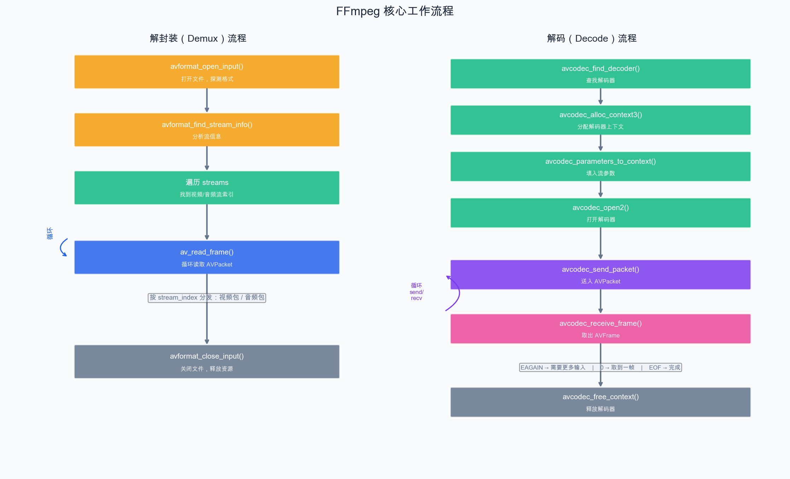

# 第 7 章：FFmpeg 核心工作流程

> 上一章我们认识了 FFmpeg 的核心数据结构。本章将把它们串联起来，学习完整的解封装和解码流程，并通过 Demo 实现"打开文件 → 解码第一帧视频 → 保存为 PPM 图片"。

## 7.1 解封装（Demux）流程

解封装就是从容器文件中分离出各个流的压缩数据包（AVPacket）。



### 关键函数

**`av_read_frame()`**：

```c
int av_read_frame(AVFormatContext *s, AVPacket *pkt);
```

- 每次调用读取一个数据包
- 返回 0 表示成功
- 返回 `AVERROR_EOF` 表示文件结束
- 返回其他负值表示错误
- 读取到的包是**完整的一帧**（对于大多数编码格式）
- **注意**：函数名虽然叫 "read_frame"，但返回的是 AVPacket（压缩包），不是 AVFrame（原始帧）

### 基本示例

```cpp
AVPacket* pkt = av_packet_alloc();

while (true) {
    int ret = av_read_frame(fmt_ctx, pkt);
    if (ret < 0) {
        if (ret == AVERROR_EOF) {
            std::cout << "到达文件末尾" << std::endl;
        }
        break;
    }

    if (pkt->stream_index == video_stream_index) {
        // 处理视频包
        std::cout << "视频包: pts=" << pkt->pts
                  << ", size=" << pkt->size
                  << ", key=" << (pkt->flags & AV_PKT_FLAG_KEY)
                  << std::endl;
    } else if (pkt->stream_index == audio_stream_index) {
        // 处理音频包
    }

    // 重要：每次使用完必须 unref，释放数据
    av_packet_unref(pkt);
}

av_packet_free(&pkt);
```

## 7.2 解码（Decode）流程

解码将压缩数据包（AVPacket）还原为原始数据帧（AVFrame）。

上图右侧展示了完整的解码流程（图中已包含）。

### 7.2.1 Send/Receive 模型

FFmpeg 使用**异步的 send/receive 模型**进行解码：

解码器接收 AVPacket，输出 AVFrame，内部可能缓冲多帧：

这个模型是**多对多**的：

- 一个 AVPacket 可能产生 0 个或多个 AVFrame（如 B 帧需要多个输入才能输出）
- 解码器内部有缓冲，可能延迟输出

### 7.2.2 解码循环的标准写法

```cpp
// 解码一个数据包（可能输出 0 到多个帧）
int decode_packet(AVCodecContext* codec_ctx, AVPacket* pkt, AVFrame* frame) {
    // 送入数据包
    int ret = avcodec_send_packet(codec_ctx, pkt);
    if (ret < 0) {
        std::cerr << "发送数据包失败" << std::endl;
        return ret;
    }

    // 循环取出解码后的帧
    while (true) {
        ret = avcodec_receive_frame(codec_ctx, frame);
        if (ret == AVERROR(EAGAIN)) {
            // 需要更多输入数据
            break;
        } else if (ret == AVERROR_EOF) {
            // 解码器已清空，不会再有输出
            break;
        } else if (ret < 0) {
            std::cerr << "解码错误" << std::endl;
            return ret;
        }

        // 成功得到一帧！在这里处理
        process_frame(frame);

        // 释放帧数据（为下次 receive 做准备）
        av_frame_unref(frame);
    }

    return 0;
}
```

### 7.2.3 Flush 解码器

到达文件末尾时，解码器内部可能还缓存着帧（特别是含 B 帧时）。需要向解码器发送一个 `nullptr` 包来"冲刷"它：

```cpp
// 文件读取结束后，冲刷解码器
avcodec_send_packet(codec_ctx, nullptr);  // 发送空包
while (avcodec_receive_frame(codec_ctx, frame) == 0) {
    process_frame(frame);
    av_frame_unref(frame);
}
```

## 7.3 完整的 Demux + Decode 流水线

将解封装和解码串联起来：

```cpp
// 伪代码
while (av_read_frame(fmt_ctx, pkt) >= 0) {
    if (pkt->stream_index == video_idx) {
        avcodec_send_packet(video_codec_ctx, pkt);
        while (avcodec_receive_frame(video_codec_ctx, frame) == 0) {
            // 得到一帧解码后的视频帧（YUV 格式）
            handle_video_frame(frame);
            av_frame_unref(frame);
        }
    } else if (pkt->stream_index == audio_idx) {
        avcodec_send_packet(audio_codec_ctx, pkt);
        while (avcodec_receive_frame(audio_codec_ctx, frame) == 0) {
            // 得到一帧解码后的音频帧（PCM 格式）
            handle_audio_frame(frame);
            av_frame_unref(frame);
        }
    }
    av_packet_unref(pkt);
}

// Flush
avcodec_send_packet(video_codec_ctx, nullptr);
while (avcodec_receive_frame(video_codec_ctx, frame) == 0) { ... }

avcodec_send_packet(audio_codec_ctx, nullptr);
while (avcodec_receive_frame(audio_codec_ctx, frame) == 0) { ... }
```

## 7.4 错误处理与资源释放

### 7.4.1 FFmpeg 错误码

FFmpeg 的函数大多返回 `int`，负值表示错误：

```cpp
// 将错误码转换为可读字符串
char errbuf[AV_ERROR_MAX_STRING_SIZE];
av_strerror(ret, errbuf, sizeof(errbuf));
std::cerr << "错误: " << errbuf << std::endl;
```

常见错误码：

| 错误码 | 含义 |
| --- | --- |
| `AVERROR_EOF` | 文件结束 |
| `AVERROR(EAGAIN)` | 暂时无数据，需要更多输入 |
| `AVERROR(ENOMEM)` | 内存分配失败 |
| `AVERROR(EINVAL)` | 参数无效 |
| `AVERROR_INVALIDDATA` | 数据无效 |

### 7.4.2 资源释放的最佳实践

使用 C++ RAII 或 goto 模式确保资源正确释放：

```cpp
// 方法一：C++ RAII 封装
class FormatContext {
    AVFormatContext* ctx_ = nullptr;
public:
    bool open(const char* url) {
        return avformat_open_input(&ctx_, url, nullptr, nullptr) == 0;
    }
    AVFormatContext* get() { return ctx_; }
    ~FormatContext() {
        if (ctx_) avformat_close_input(&ctx_);
    }
};

// 方法二：使用 unique_ptr 自定义删除器
auto fmt_ctx_deleter = [](AVFormatContext* ctx) {
    avformat_close_input(&ctx);
};
std::unique_ptr<AVFormatContext, decltype(fmt_ctx_deleter)>
    fmt_ctx(nullptr, fmt_ctx_deleter);

// 方法三：传统的 goto 清理（C 风格）
AVFormatContext* fmt_ctx = nullptr;
AVCodecContext* codec_ctx = nullptr;
AVPacket* pkt = nullptr;
AVFrame* frame = nullptr;
// ... 使用 ...
cleanup:
    if (frame) av_frame_free(&frame);
    if (pkt) av_packet_free(&pkt);
    if (codec_ctx) avcodec_free_context(&codec_ctx);
    if (fmt_ctx) avformat_close_input(&fmt_ctx);
```

## 7.5 Demo：解码第一帧视频并保存为 PPM 图片

这是一个里程碑式的 Demo——我们第一次完成了从文件到原始像素的全链路。

```cpp
// chapter-07-decode-first-frame/main.cpp

extern "C" {
#include <libavformat/avformat.h>
#include <libavcodec/avcodec.h>
#include <libavutil/avutil.h>
#include <libavutil/imgutils.h>
#include <libswscale/swscale.h>
}

#include <iostream>
#include <fstream>
#include <string>

// 将 RGB 帧保存为 PPM 文件
void save_frame_as_ppm(AVFrame* frame, int width, int height, const std::string& filename) {
    std::ofstream file(filename, std::ios::binary);
    if (!file.is_open()) {
        std::cerr << "无法创建文件: " << filename << std::endl;
        return;
    }

    // PPM 文件头
    file << "P6\n" << width << " " << height << "\n255\n";

    // 写入 RGB 像素数据
    for (int y = 0; y < height; y++) {
        file.write(reinterpret_cast<char*>(frame->data[0] + y * frame->linesize[0]),
                   width * 3);
    }

    std::cout << "已保存: " << filename << std::endl;
}

int main(int argc, char* argv[]) {
    if (argc < 2) {
        std::cerr << "用法: " << argv[0] << " <输入文件>" << std::endl;
        return 1;
    }

    const char* input_file = argv[1];
    int ret = 0;

    // 资源声明
    AVFormatContext* fmt_ctx = nullptr;
    AVCodecContext* video_codec_ctx = nullptr;
    AVPacket* pkt = nullptr;
    AVFrame* frame = nullptr;
    AVFrame* rgb_frame = nullptr;
    SwsContext* sws_ctx = nullptr;
    uint8_t* rgb_buffer = nullptr;

    // ========== 1. 打开文件 ==========
    ret = avformat_open_input(&fmt_ctx, input_file, nullptr, nullptr);
    if (ret < 0) {
        char errbuf[AV_ERROR_MAX_STRING_SIZE];
        av_strerror(ret, errbuf, sizeof(errbuf));
        std::cerr << "无法打开文件: " << errbuf << std::endl;
        goto cleanup;
    }

    ret = avformat_find_stream_info(fmt_ctx, nullptr);
    if (ret < 0) {
        std::cerr << "无法获取流信息" << std::endl;
        goto cleanup;
    }

    // 打印文件信息
    av_dump_format(fmt_ctx, 0, input_file, 0);

    {
        // ========== 2. 找到视频流 ==========
        int video_stream_idx = av_find_best_stream(
            fmt_ctx, AVMEDIA_TYPE_VIDEO, -1, -1, nullptr, 0);
        if (video_stream_idx < 0) {
            std::cerr << "找不到视频流" << std::endl;
            goto cleanup;
        }

        AVStream* video_stream = fmt_ctx->streams[video_stream_idx];
        AVCodecParameters* codecpar = video_stream->codecpar;

        std::cout << "\n视频流: #" << video_stream_idx
                  << " [" << codecpar->width << "x" << codecpar->height << "]"
                  << std::endl;

        // ========== 3. 初始化解码器 ==========
        const AVCodec* codec = avcodec_find_decoder(codecpar->codec_id);
        if (!codec) {
            std::cerr << "找不到解码器" << std::endl;
            goto cleanup;
        }
        std::cout << "使用解码器: " << codec->name << std::endl;

        video_codec_ctx = avcodec_alloc_context3(codec);
        if (!video_codec_ctx) {
            std::cerr << "无法分配解码器上下文" << std::endl;
            goto cleanup;
        }

        ret = avcodec_parameters_to_context(video_codec_ctx, codecpar);
        if (ret < 0) {
            std::cerr << "无法复制解码器参数" << std::endl;
            goto cleanup;
        }

        ret = avcodec_open2(video_codec_ctx, codec, nullptr);
        if (ret < 0) {
            std::cerr << "无法打开解码器" << std::endl;
            goto cleanup;
        }

        // ========== 4. 准备格式转换（YUV → RGB） ==========
        int width = video_codec_ctx->width;
        int height = video_codec_ctx->height;

        sws_ctx = sws_getContext(
            width, height, video_codec_ctx->pix_fmt,   // 输入：原始格式
            width, height, AV_PIX_FMT_RGB24,           // 输出：RGB24
            SWS_BILINEAR, nullptr, nullptr, nullptr
        );
        if (!sws_ctx) {
            std::cerr << "无法创建 SwsContext" << std::endl;
            goto cleanup;
        }

        // 分配 RGB 帧
        rgb_frame = av_frame_alloc();
        int rgb_buffer_size = av_image_get_buffer_size(AV_PIX_FMT_RGB24, width, height, 1);
        rgb_buffer = static_cast<uint8_t*>(av_malloc(rgb_buffer_size));
        av_image_fill_arrays(rgb_frame->data, rgb_frame->linesize,
                             rgb_buffer, AV_PIX_FMT_RGB24, width, height, 1);

        // ========== 5. 读取并解码第一帧 ==========
        pkt = av_packet_alloc();
        frame = av_frame_alloc();
        bool got_frame = false;

        while (av_read_frame(fmt_ctx, pkt) >= 0 && !got_frame) {
            if (pkt->stream_index == video_stream_idx) {
                ret = avcodec_send_packet(video_codec_ctx, pkt);
                if (ret < 0) {
                    std::cerr << "发送数据包失败" << std::endl;
                    av_packet_unref(pkt);
                    goto cleanup;
                }

                while (ret >= 0) {
                    ret = avcodec_receive_frame(video_codec_ctx, frame);
                    if (ret == AVERROR(EAGAIN) || ret == AVERROR_EOF) {
                        break;
                    } else if (ret < 0) {
                        std::cerr << "解码失败" << std::endl;
                        goto cleanup;
                    }

                    // 成功解码一帧！
                    std::cout << "\n成功解码第一帧!" << std::endl;
                    std::cout << "  格式: " << av_get_pix_fmt_name(video_codec_ctx->pix_fmt)
                              << std::endl;
                    std::cout << "  PTS: " << frame->pts << std::endl;
                    std::cout << "  类型: " << av_get_picture_type_char(frame->pict_type)
                              << " 帧" << std::endl;

                    // ========== 6. 转换为 RGB 并保存 ==========
                    sws_scale(sws_ctx,
                              frame->data, frame->linesize,  // 输入
                              0, height,                      // 输入行范围
                              rgb_frame->data, rgb_frame->linesize  // 输出
                    );

                    save_frame_as_ppm(rgb_frame, width, height, "first_frame.ppm");
                    got_frame = true;

                    av_frame_unref(frame);
                    break;
                }
            }
            av_packet_unref(pkt);
        }

        if (!got_frame) {
            std::cout << "未能解码任何帧" << std::endl;
        }
    }

cleanup:
    if (rgb_buffer) av_free(rgb_buffer);
    if (rgb_frame) av_frame_free(&rgb_frame);
    if (frame) av_frame_free(&frame);
    if (pkt) av_packet_free(&pkt);
    if (sws_ctx) sws_freeContext(sws_ctx);
    if (video_codec_ctx) avcodec_free_context(&video_codec_ctx);
    if (fmt_ctx) avformat_close_input(&fmt_ctx);

    return (ret < 0 && ret != AVERROR_EOF) ? 1 : 0;
}
```

### 运行和验证

```bash
# 编译运行
./decode-first-frame test_video.mp4

# 查看生成的 PPM 图片
# Linux: eog first_frame.ppm 或 display first_frame.ppm
# macOS: open first_frame.ppm
```

### 代码关键点分析

**1. `sws_getContext()` —— 创建像素格式转换上下文**

```c
SwsContext* sws_getContext(
    int srcW, int srcH, enum AVPixelFormat srcFormat,  // 源
    int dstW, int dstH, enum AVPixelFormat dstFormat,  // 目标
    int flags,        // 缩放算法（SWS_BILINEAR, SWS_BICUBIC 等）
    ...
);
```

**2. `sws_scale()` —— 执行格式转换/缩放**

```c
int sws_scale(SwsContext *c,
    const uint8_t *const srcSlice[], const int srcStride[],  // 输入数据和行宽
    int srcSliceY, int srcSliceH,                             // 输入行范围
    uint8_t *const dst[], const int dstStride[]               // 输出数据和行宽
);
```

**3. `av_image_fill_arrays()` —— 为帧分配图像缓冲区**

这个函数不分配内存，而是将已有的缓冲区指针填入 AVFrame 的 data 和 linesize 数组中。

**4. PPM 格式**

PPM 是最简单的图片格式之一：
- 文件头：`P6\n宽 高\n255\n`
- 数据：紧接着就是 RGB 像素，每像素 3 字节
- 无压缩，可以被大多数图片查看器打开

## 7.6 流程回顾

让我们用一张图回顾完整流程：

```
test_video.mp4
       │
       ▼  avformat_open_input()
  AVFormatContext
       │
       ▼  avformat_find_stream_info()
  获得流信息（2 个流：视频 + 音频）
       │
       ▼  av_find_best_stream(AVMEDIA_TYPE_VIDEO)
  video_stream_idx = 0
       │
       ▼  avcodec_find_decoder() + avcodec_open2()
  AVCodecContext（H.264 解码器就绪）
       │
       ▼  av_read_frame()
  AVPacket（H.264 压缩数据）
       │
       ▼  avcodec_send_packet() + avcodec_receive_frame()
  AVFrame（YUV420P 原始帧）
       │
       ▼  sws_scale()
  AVFrame（RGB24 像素数据）
       │
       ▼  save_frame_as_ppm()
  first_frame.ppm 图片文件
```

## 小结

本章我们完成了 FFmpeg 最核心的工作流程：

1. **解封装流程**：`avformat_open_input` → `av_read_frame` → AVPacket
2. **解码流程**：`avcodec_send_packet` → `avcodec_receive_frame` → AVFrame
3. **Send/Receive 异步模型**：一个包可能产生多帧，需要循环 receive
4. **格式转换**：用 `sws_scale` 将 YUV 转为 RGB
5. **错误处理与资源释放**：使用 RAII 或 goto 清理

至此，FFmpeg 核心概念部分结束。你已经掌握了使用 FFmpeg API 读取和解码视频文件的完整流程。接下来进入实战阶段——我们将分别处理视频和音频的解码、渲染和播放。

---

> **上一篇**：[第 6 章：FFmpeg 核心数据结构详解](06-FFmpeg核心数据结构详解.md)
> **下一篇**：[第 8 章：视频解码与格式转换](08-视频解码与格式转换.md)
