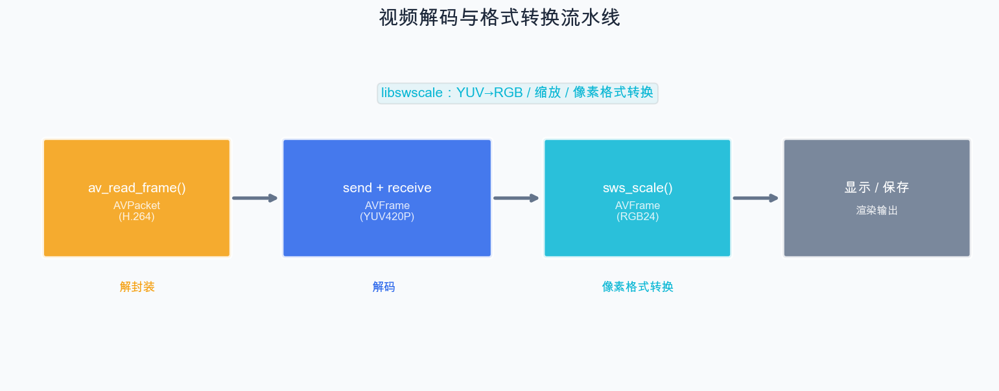

# 第 8 章：视频解码与格式转换

> 上一章我们解码了第一帧视频。本章将扩展为连续解码多帧，深入理解 AVFrame 中的 YUV 数据结构，并使用 libswscale 进行像素格式转换。

## 8.1 视频解码的完整流程回顾



## 8.2 深入理解 AVFrame 中的 YUV 数据

### 8.2.1 YUV420P 的内存布局

对于一个 1920×1080 的 YUV420P 帧：

```
AVFrame:
  data[0] → Y 平面 (1920 × 1080 字节)
  data[1] → U 平面 (960 × 540 字节)
  data[2] → V 平面 (960 × 540 字节)

  linesize[0] → Y 平面每行字节数 (≥ 1920，可能有对齐填充)
  linesize[1] → U 平面每行字节数 (≥ 960)
  linesize[2] → V 平面每行字节数 (≥ 960)
```

### 8.2.2 linesize 与对齐

`linesize` 通常大于等于图像宽度，因为 FFmpeg 会进行内存对齐：

```
假设 width = 1920, 对齐到 32 字节边界:
linesize[0] = 1920 (刚好是 32 的倍数)

假设 width = 1280:
linesize[0] = 1280 (刚好是 32 的倍数)

假设 width = 854:
linesize[0] = 864 (对齐到 32 的倍数: 854 → 864)
有效数据 854 字节 + 填充 10 字节 = 864 字节
```

**读取像素时必须考虑 linesize**：

```cpp
// 正确：使用 linesize 定位每行
for (int y = 0; y < height; y++) {
    uint8_t* row = frame->data[0] + y * frame->linesize[0];
    for (int x = 0; x < width; x++) {
        uint8_t Y_value = row[x];
    }
}

// 错误：使用 width 定位每行
// uint8_t* row = frame->data[0] + y * width;  // linesize 可能 > width！
```

### 8.2.3 访问 YUV 各分量

```cpp
// 获取像素 (x, y) 的 YUV 值
int get_yuv_pixel(AVFrame* frame, int x, int y,
                  uint8_t& Y, uint8_t& U, uint8_t& V) {
    // Y 分量：逐像素存储
    Y = frame->data[0][y * frame->linesize[0] + x];

    // U、V 分量：4:2:0 下采样，每 2×2 个像素共享一个 UV 值
    int uv_x = x / 2;
    int uv_y = y / 2;
    U = frame->data[1][uv_y * frame->linesize[1] + uv_x];
    V = frame->data[2][uv_y * frame->linesize[2] + uv_x];

    return 0;
}
```

## 8.3 使用 libswscale 进行格式转换

### 8.3.1 SwsContext

`SwsContext` 是 libswscale 的核心结构，封装了格式转换的上下文信息。

```cpp
SwsContext* sws_ctx = sws_getContext(
    src_width, src_height, src_pix_fmt,   // 源格式
    dst_width, dst_height, dst_pix_fmt,   // 目标格式
    flags,                                 // 缩放算法
    nullptr, nullptr, nullptr              // 可选参数
);
```

### 8.3.2 缩放算法

| 算法 | 常量 | 速度 | 质量 | 适用场景 |
| --- | --- | --- | --- | --- |
| 最近邻 | `SWS_POINT` | 最快 | 最低 | 像素画、调试 |
| 双线性 | `SWS_BILINEAR` | 快 | 中等 | 实时播放（推荐） |
| 双三次 | `SWS_BICUBIC` | 中 | 较高 | 高质量缩放 |
| Lanczos | `SWS_LANCZOS` | 慢 | 最高 | 离线转码 |

对于实时播放，`SWS_BILINEAR` 是速度和质量的最佳平衡。

### 8.3.3 执行转换

```cpp
int sws_scale(
    SwsContext *c,
    const uint8_t *const srcSlice[],  // 源数据指针数组
    const int srcStride[],            // 源每行字节数
    int srcSliceY,                    // 起始行（通常为 0）
    int srcSliceH,                    // 处理行数（通常为 height）
    uint8_t *const dst[],             // 目标数据指针数组
    const int dstStride[]             // 目标每行字节数
);
```

### 8.3.4 常见转换场景

```cpp
// 场景 1：YUV420P → RGB24（用于保存图片）
SwsContext* ctx = sws_getContext(
    w, h, AV_PIX_FMT_YUV420P,
    w, h, AV_PIX_FMT_RGB24,
    SWS_BILINEAR, nullptr, nullptr, nullptr);

// 场景 2：YUV420P → BGRA（用于某些 GUI 框架）
SwsContext* ctx = sws_getContext(
    w, h, AV_PIX_FMT_YUV420P,
    w, h, AV_PIX_FMT_BGRA,
    SWS_BILINEAR, nullptr, nullptr, nullptr);

// 场景 3：缩放（1080p → 720p）
SwsContext* ctx = sws_getContext(
    1920, 1080, AV_PIX_FMT_YUV420P,
    1280, 720, AV_PIX_FMT_YUV420P,
    SWS_BILINEAR, nullptr, nullptr, nullptr);
```

## 8.4 为目标帧分配缓冲区

```cpp
// 方法一：手动分配（推荐，更灵活）
AVFrame* dst_frame = av_frame_alloc();
int buffer_size = av_image_get_buffer_size(AV_PIX_FMT_RGB24, width, height, 1);
uint8_t* buffer = static_cast<uint8_t*>(av_malloc(buffer_size));
av_image_fill_arrays(dst_frame->data, dst_frame->linesize,
                     buffer, AV_PIX_FMT_RGB24, width, height, 1);

// 使用完毕后：
av_free(buffer);
av_frame_free(&dst_frame);

// 方法二：使用 av_frame_get_buffer（自动管理）
AVFrame* dst_frame = av_frame_alloc();
dst_frame->format = AV_PIX_FMT_RGB24;
dst_frame->width = width;
dst_frame->height = height;
av_frame_get_buffer(dst_frame, 0);  // 自动分配数据缓冲区

// 使用完毕后：
av_frame_free(&dst_frame);  // 自动释放缓冲区
```

## 8.5 Demo：解码视频帧并保存为 BMP 图片序列

这个 Demo 解码视频前 100 帧，将每帧转换为 RGB24 并保存为 BMP 格式。

```cpp
// chapter-08-video-decode/main.cpp

extern "C" {
#include <libavformat/avformat.h>
#include <libavcodec/avcodec.h>
#include <libavutil/avutil.h>
#include <libavutil/imgutils.h>
#include <libswscale/swscale.h>
}

#include <iostream>
#include <fstream>
#include <string>
#include <cstring>
#include <iomanip>

// BMP 文件头结构
#pragma pack(push, 1)
struct BMPHeader {
    uint16_t type = 0x4D42;       // "BM"
    uint32_t size;                 // 文件总大小
    uint16_t reserved1 = 0;
    uint16_t reserved2 = 0;
    uint32_t offset = 54;          // 像素数据偏移
    uint32_t header_size = 40;     // 信息头大小
    int32_t  width;
    int32_t  height;               // 负值表示从上到下存储
    uint16_t planes = 1;
    uint16_t bpp = 24;             // 24 位色
    uint32_t compression = 0;
    uint32_t image_size;
    int32_t  x_ppm = 0;
    int32_t  y_ppm = 0;
    uint32_t colors_used = 0;
    uint32_t colors_important = 0;
};
#pragma pack(pop)

void save_frame_as_bmp(AVFrame* frame, int width, int height, const std::string& filename) {
    int row_size = ((width * 3 + 3) / 4) * 4;  // BMP 每行 4 字节对齐
    int image_size = row_size * height;

    BMPHeader header;
    header.size = 54 + image_size;
    header.width = width;
    header.height = -height;  // 负值：从上到下
    header.image_size = image_size;

    std::ofstream file(filename, std::ios::binary);
    if (!file.is_open()) return;

    file.write(reinterpret_cast<char*>(&header), sizeof(header));

    // 写入像素数据（BMP 使用 BGR 顺序，但我们输出的是 BGR24）
    std::vector<uint8_t> row_buf(row_size, 0);
    for (int y = 0; y < height; y++) {
        uint8_t* src = frame->data[0] + y * frame->linesize[0];
        std::memcpy(row_buf.data(), src, width * 3);
        file.write(reinterpret_cast<char*>(row_buf.data()), row_size);
    }
}

int main(int argc, char* argv[]) {
    if (argc < 2) {
        std::cerr << "用法: " << argv[0] << " <输入文件> [最大帧数]" << std::endl;
        return 1;
    }

    const char* input_file = argv[1];
    int max_frames = (argc >= 3) ? std::atoi(argv[2]) : 100;

    AVFormatContext* fmt_ctx = nullptr;
    AVCodecContext* codec_ctx = nullptr;
    SwsContext* sws_ctx = nullptr;
    AVPacket* pkt = nullptr;
    AVFrame* frame = nullptr;
    AVFrame* bgr_frame = nullptr;
    uint8_t* bgr_buffer = nullptr;

    int ret = avformat_open_input(&fmt_ctx, input_file, nullptr, nullptr);
    if (ret < 0) {
        std::cerr << "无法打开文件" << std::endl;
        return 1;
    }
    avformat_find_stream_info(fmt_ctx, nullptr);

    int video_idx = av_find_best_stream(fmt_ctx, AVMEDIA_TYPE_VIDEO, -1, -1, nullptr, 0);
    if (video_idx < 0) {
        std::cerr << "找不到视频流" << std::endl;
        goto cleanup;
    }

    {
        AVCodecParameters* par = fmt_ctx->streams[video_idx]->codecpar;
        const AVCodec* codec = avcodec_find_decoder(par->codec_id);
        codec_ctx = avcodec_alloc_context3(codec);
        avcodec_parameters_to_context(codec_ctx, par);
        avcodec_open2(codec_ctx, codec, nullptr);

        int width = codec_ctx->width;
        int height = codec_ctx->height;

        std::cout << "视频: " << width << "x" << height
                  << ", 格式: " << av_get_pix_fmt_name(codec_ctx->pix_fmt)
                  << std::endl;

        // 创建格式转换上下文（YUV → BGR24，BMP 使用 BGR 顺序）
        sws_ctx = sws_getContext(
            width, height, codec_ctx->pix_fmt,
            width, height, AV_PIX_FMT_BGR24,
            SWS_BILINEAR, nullptr, nullptr, nullptr);

        // 分配 BGR 帧缓冲
        bgr_frame = av_frame_alloc();
        int buf_size = av_image_get_buffer_size(AV_PIX_FMT_BGR24, width, height, 1);
        bgr_buffer = static_cast<uint8_t*>(av_malloc(buf_size));
        av_image_fill_arrays(bgr_frame->data, bgr_frame->linesize,
                             bgr_buffer, AV_PIX_FMT_BGR24, width, height, 1);

        pkt = av_packet_alloc();
        frame = av_frame_alloc();
        int frame_count = 0;

        std::cout << "开始解码前 " << max_frames << " 帧..." << std::endl;

        while (av_read_frame(fmt_ctx, pkt) >= 0 && frame_count < max_frames) {
            if (pkt->stream_index == video_idx) {
                avcodec_send_packet(codec_ctx, pkt);

                while (avcodec_receive_frame(codec_ctx, frame) == 0) {
                    // 格式转换
                    sws_scale(sws_ctx, frame->data, frame->linesize,
                              0, height, bgr_frame->data, bgr_frame->linesize);

                    // 每 10 帧保存一张图片
                    if (frame_count % 10 == 0) {
                        std::string filename = "frame_" + std::to_string(frame_count) + ".bmp";
                        save_frame_as_bmp(bgr_frame, width, height, filename);
                    }

                    frame_count++;
                    if (frame_count >= max_frames) break;

                    // 打印进度
                    if (frame_count % 10 == 0) {
                        double pts_sec = frame->pts *
                            av_q2d(fmt_ctx->streams[video_idx]->time_base);
                        std::cout << "已解码 " << frame_count << " 帧, PTS="
                                  << std::fixed << std::setprecision(3)
                                  << pts_sec << "s" << std::endl;
                    }

                    av_frame_unref(frame);
                }
            }
            av_packet_unref(pkt);
        }

        std::cout << "\n解码完成！共 " << frame_count << " 帧" << std::endl;
    }

cleanup:
    if (bgr_buffer) av_free(bgr_buffer);
    if (bgr_frame) av_frame_free(&bgr_frame);
    if (frame) av_frame_free(&frame);
    if (pkt) av_packet_free(&pkt);
    if (sws_ctx) sws_freeContext(sws_ctx);
    if (codec_ctx) avcodec_free_context(&codec_ctx);
    if (fmt_ctx) avformat_close_input(&fmt_ctx);
    return 0;
}
```

### 运行

```bash
./video-decode test_video.mp4 100
# 会生成 frame_0.bmp, frame_10.bmp, frame_20.bmp, ... 等文件
```

## 8.6 性能注意事项

### 避免不必要的格式转换

格式转换（`sws_scale`）有一定的 CPU 开销。在实际播放器中：

- 如果使用 SDL2 渲染，SDL2 的 Texture 可以直接接收 YUV 数据，**不需要转为 RGB**
- 只有在保存图片或使用不支持 YUV 的 GUI 框架时才需要转换

### 复用 SwsContext

`sws_getContext` 有一定开销，应该在解码循环之前创建一次，重复使用：

```cpp
// 正确：循环外创建
SwsContext* sws_ctx = sws_getContext(...);
while (...) {
    sws_scale(sws_ctx, ...);  // 复用
}
sws_freeContext(sws_ctx);

// 错误：每帧都创建
while (...) {
    SwsContext* ctx = sws_getContext(...);  // 浪费！
    sws_scale(ctx, ...);
    sws_freeContext(ctx);
}
```

## 小结

本章我们学习了：

1. **AVFrame 的 YUV 数据布局**：data[] 指针和 linesize 的含义
2. **linesize 对齐**：读取像素必须使用 linesize，而非 width
3. **libswscale 格式转换**：SwsContext 的创建和 sws_scale 的使用
4. **连续视频解码**：完整的解码循环实现
5. **保存为 BMP**：理解 BMP 文件格式，实现帧导出

下一章我们将学习音频的解码和重采样。

---

> **上一篇**：[第 7 章：FFmpeg 核心工作流程](07-FFmpeg核心工作流程.md)
> **下一篇**：[第 9 章：音频解码与重采样](09-音频解码与重采样.md)
