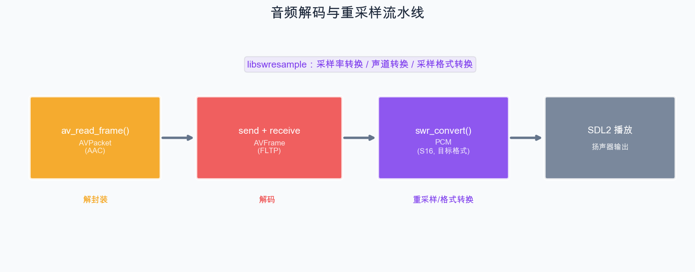

# 第 9 章：音频解码与重采样

> 视频解码已经搞定，现在轮到音频了。本章我们将学习如何用 FFmpeg 解码音频流、理解 Planar 和 Packed 格式的区别，以及使用 libswresample 进行音频重采样。

## 9.1 音频解码流程

音频解码与视频解码的流程完全一致，只是处理的数据不同：



## 9.2 音频 AVFrame 详解

解码后的音频 AVFrame 包含以下关键信息：

```cpp
AVFrame* frame;  // 解码后的音频帧

frame->nb_samples;    // 该帧包含的采样点数（如 1024）
frame->sample_rate;   // 采样率（如 48000）
frame->format;        // 采样格式（如 AV_SAMPLE_FMT_FLTP）
frame->ch_layout;     // 声道布局（如 stereo）
frame->data[];        // 音频数据指针
frame->linesize[0];   // 数据大小
frame->pts;           // 时间戳
```

### 9.2.1 Planar vs Packed 格式

FFmpeg 解码器输出的音频通常是 **Planar**（平面）格式：

| 格式 | 枚举值 | 存储方式 | 说明 |
| --- | --- | --- | --- |
| Float Planar | `AV_SAMPLE_FMT_FLTP` | 每声道分开 | 最常见的解码输出 |
| S16 Planar | `AV_SAMPLE_FMT_S16P` | 每声道分开 | |
| S32 Planar | `AV_SAMPLE_FMT_S32P` | 每声道分开 | |
| Float Packed | `AV_SAMPLE_FMT_FLT` | 声道交错 | |
| S16 Packed | `AV_SAMPLE_FMT_S16` | 声道交错 | SDL2 需要此格式 |

```
Planar 格式（AV_SAMPLE_FMT_FLTP，双声道）:
  data[0] → [L0][L1][L2][L3]...  左声道数据
  data[1] → [R0][R1][R2][R3]...  右声道数据

Packed 格式（AV_SAMPLE_FMT_S16，双声道）:
  data[0] → [L0][R0][L1][R1][L2][R2]...  交错排列
  data[1] → nullptr
```

**问题**：大多数音频输出设备（包括 SDL2）需要 Packed 格式（通常是 S16 交错），但解码器通常输出 Planar 格式。这就是我们需要**重采样**的原因。

## 9.3 使用 libswresample 进行音频重采样

libswresample 可以进行以下转换：

1. **采样格式转换**：如 float planar → s16 packed
2. **采样率转换**：如 48000Hz → 44100Hz
3. **声道布局转换**：如 5.1 环绕声 → 立体声

### 9.3.1 创建重采样上下文

```cpp
#include <libswresample/swresample.h>

SwrContext* swr_ctx = nullptr;

// 使用 swr_alloc_set_opts2（FFmpeg 5.1+ 推荐）
AVChannelLayout out_ch_layout = AV_CHANNEL_LAYOUT_STEREO;
AVChannelLayout in_ch_layout;
av_channel_layout_copy(&in_ch_layout, &codec_ctx->ch_layout);

ret = swr_alloc_set_opts2(
    &swr_ctx,
    &out_ch_layout,            // 输出声道布局
    AV_SAMPLE_FMT_S16,        // 输出采样格式（S16 交错）
    44100,                     // 输出采样率
    &in_ch_layout,             // 输入声道布局
    codec_ctx->sample_fmt,     // 输入采样格式
    codec_ctx->sample_rate,    // 输入采样率
    0, nullptr
);

if (ret < 0 || !swr_ctx) {
    std::cerr << "无法创建重采样上下文" << std::endl;
    return -1;
}

// 初始化
ret = swr_init(swr_ctx);
if (ret < 0) {
    std::cerr << "无法初始化重采样上下文" << std::endl;
    return -1;
}
```

### 9.3.2 执行重采样

```cpp
// 计算输出采样点数（采样率可能不同，需要换算）
int out_samples = av_rescale_rnd(
    swr_get_delay(swr_ctx, codec_ctx->sample_rate) + frame->nb_samples,
    44100,                      // 输出采样率
    codec_ctx->sample_rate,     // 输入采样率
    AV_ROUND_UP
);

// 分配输出缓冲区
uint8_t* output_buffer = nullptr;
int out_linesize;
av_samples_alloc(
    &output_buffer,
    &out_linesize,
    2,                          // 输出声道数
    out_samples,
    AV_SAMPLE_FMT_S16,         // 输出格式
    0
);

// 执行重采样
int samples_out = swr_convert(
    swr_ctx,
    &output_buffer,             // 输出缓冲区
    out_samples,                // 输出缓冲区最大采样数
    (const uint8_t**)frame->data,  // 输入数据
    frame->nb_samples           // 输入采样数
);

if (samples_out > 0) {
    // output_buffer 中包含 samples_out 个采样点的 S16 交错数据
    int data_size = samples_out * 2 * sizeof(int16_t);  // 2 声道，每个采样 2 字节
    // ... 处理数据 ...
}

// 释放
av_freep(&output_buffer);
```

### 9.3.3 处理残留数据

当采样率转换时，重采样器内部可能缓存一些数据。在结束时需要冲刷：

```cpp
// 冲刷重采样器
int samples_out = swr_convert(swr_ctx, &output_buffer, out_samples,
                               nullptr, 0);  // 输入为 nullptr
```

## 9.4 计算音频相关数值

### 9.4.1 每帧数据大小

```cpp
// 一帧音频的数据大小
int frame_data_size = av_samples_get_buffer_size(
    nullptr,
    frame->ch_layout.nb_channels,
    frame->nb_samples,
    static_cast<AVSampleFormat>(frame->format),
    1  // 对齐
);
```

### 9.4.2 每个采样点的字节数

```cpp
// 每个采样点每个声道的字节数
int bytes_per_sample = av_get_bytes_per_sample(
    static_cast<AVSampleFormat>(frame->format));

// 例：AV_SAMPLE_FMT_S16 → 2 字节
// 例：AV_SAMPLE_FMT_FLTP → 4 字节
```

### 9.4.3 时长计算

```cpp
// 一帧音频的时长（秒）
double frame_duration = (double)frame->nb_samples / frame->sample_rate;

// 例：1024 采样 / 48000 Hz ≈ 0.0213 秒 ≈ 21.3 毫秒
```

## 9.5 Demo：解码音频并保存为 PCM 文件

```cpp
// chapter-09-audio-decode/main.cpp

extern "C" {
#include <libavformat/avformat.h>
#include <libavcodec/avcodec.h>
#include <libavutil/avutil.h>
#include <libavutil/channel_layout.h>
#include <libswresample/swresample.h>
}

#include <iostream>
#include <fstream>
#include <iomanip>
#include <vector>

int main(int argc, char* argv[]) {
    if (argc < 2) {
        std::cerr << "用法: " << argv[0] << " <输入文件>" << std::endl;
        return 1;
    }

    const char* input_file = argv[1];

    // 目标参数
    const int OUT_SAMPLE_RATE = 44100;
    const AVSampleFormat OUT_SAMPLE_FMT = AV_SAMPLE_FMT_S16;
    const AVChannelLayout OUT_CH_LAYOUT = AV_CHANNEL_LAYOUT_STEREO;

    AVFormatContext* fmt_ctx = nullptr;
    AVCodecContext* codec_ctx = nullptr;
    SwrContext* swr_ctx = nullptr;
    AVPacket* pkt = nullptr;
    AVFrame* frame = nullptr;

    int ret = avformat_open_input(&fmt_ctx, input_file, nullptr, nullptr);
    if (ret < 0) {
        std::cerr << "无法打开文件" << std::endl;
        return 1;
    }
    avformat_find_stream_info(fmt_ctx, nullptr);

    // 查找音频流
    int audio_idx = av_find_best_stream(fmt_ctx, AVMEDIA_TYPE_AUDIO, -1, -1, nullptr, 0);
    if (audio_idx < 0) {
        std::cerr << "找不到音频流" << std::endl;
        avformat_close_input(&fmt_ctx);
        return 1;
    }

    AVStream* audio_stream = fmt_ctx->streams[audio_idx];
    AVCodecParameters* par = audio_stream->codecpar;

    // 打印源音频信息
    std::cout << "源音频信息:" << std::endl;
    std::cout << "  编码: " << avcodec_get_name(par->codec_id) << std::endl;
    std::cout << "  采样率: " << par->sample_rate << " Hz" << std::endl;
    std::cout << "  声道数: " << par->ch_layout.nb_channels << std::endl;

    const char* src_fmt_name = av_get_sample_fmt_name(
        static_cast<AVSampleFormat>(par->format));
    std::cout << "  采样格式: " << (src_fmt_name ? src_fmt_name : "unknown") << std::endl;

    // 初始化解码器
    const AVCodec* codec = avcodec_find_decoder(par->codec_id);
    codec_ctx = avcodec_alloc_context3(codec);
    avcodec_parameters_to_context(codec_ctx, par);
    avcodec_open2(codec_ctx, codec, nullptr);

    // 初始化重采样器
    AVChannelLayout out_layout = OUT_CH_LAYOUT;
    AVChannelLayout in_layout;
    av_channel_layout_copy(&in_layout, &codec_ctx->ch_layout);

    ret = swr_alloc_set_opts2(
        &swr_ctx,
        &out_layout, OUT_SAMPLE_FMT, OUT_SAMPLE_RATE,
        &in_layout, codec_ctx->sample_fmt, codec_ctx->sample_rate,
        0, nullptr);
    av_channel_layout_uninit(&in_layout);

    if (ret < 0 || !swr_ctx || swr_init(swr_ctx) < 0) {
        std::cerr << "无法初始化重采样器" << std::endl;
        goto cleanup;
    }

    std::cout << "\n目标格式:" << std::endl;
    std::cout << "  采样率: " << OUT_SAMPLE_RATE << " Hz" << std::endl;
    std::cout << "  声道数: " << OUT_CH_LAYOUT.nb_channels << std::endl;
    std::cout << "  采样格式: " << av_get_sample_fmt_name(OUT_SAMPLE_FMT) << std::endl;

    {
        // 打开输出文件
        std::ofstream out_file("output.pcm", std::ios::binary);
        if (!out_file.is_open()) {
            std::cerr << "无法创建输出文件" << std::endl;
            goto cleanup;
        }

        pkt = av_packet_alloc();
        frame = av_frame_alloc();
        int total_samples = 0;
        int frame_count = 0;

        std::cout << "\n开始解码..." << std::endl;

        while (av_read_frame(fmt_ctx, pkt) >= 0) {
            if (pkt->stream_index != audio_idx) {
                av_packet_unref(pkt);
                continue;
            }

            ret = avcodec_send_packet(codec_ctx, pkt);
            av_packet_unref(pkt);
            if (ret < 0) continue;

            while (avcodec_receive_frame(codec_ctx, frame) == 0) {
                // 计算输出采样数
                int out_samples = av_rescale_rnd(
                    swr_get_delay(swr_ctx, codec_ctx->sample_rate) + frame->nb_samples,
                    OUT_SAMPLE_RATE, codec_ctx->sample_rate, AV_ROUND_UP);

                // 分配输出缓冲区
                uint8_t* out_buf = nullptr;
                av_samples_alloc(&out_buf, nullptr,
                                 OUT_CH_LAYOUT.nb_channels, out_samples,
                                 OUT_SAMPLE_FMT, 0);

                // 重采样
                int samples_converted = swr_convert(
                    swr_ctx,
                    &out_buf, out_samples,
                    (const uint8_t**)frame->data, frame->nb_samples);

                if (samples_converted > 0) {
                    int data_size = av_samples_get_buffer_size(
                        nullptr, OUT_CH_LAYOUT.nb_channels,
                        samples_converted, OUT_SAMPLE_FMT, 1);
                    out_file.write(reinterpret_cast<char*>(out_buf), data_size);
                    total_samples += samples_converted;
                }

                av_freep(&out_buf);
                frame_count++;

                if (frame_count % 100 == 0) {
                    double time = static_cast<double>(total_samples) / OUT_SAMPLE_RATE;
                    std::cout << "  已解码 " << frame_count << " 帧, 时长 "
                              << std::fixed << std::setprecision(1)
                              << time << "s" << std::endl;
                }

                av_frame_unref(frame);
            }
        }

        // 冲刷解码器
        avcodec_send_packet(codec_ctx, nullptr);
        while (avcodec_receive_frame(codec_ctx, frame) == 0) {
            int out_samples = av_rescale_rnd(
                swr_get_delay(swr_ctx, codec_ctx->sample_rate) + frame->nb_samples,
                OUT_SAMPLE_RATE, codec_ctx->sample_rate, AV_ROUND_UP);
            uint8_t* out_buf = nullptr;
            av_samples_alloc(&out_buf, nullptr,
                             OUT_CH_LAYOUT.nb_channels, out_samples,
                             OUT_SAMPLE_FMT, 0);
            int samples_converted = swr_convert(
                swr_ctx, &out_buf, out_samples,
                (const uint8_t**)frame->data, frame->nb_samples);
            if (samples_converted > 0) {
                int data_size = av_samples_get_buffer_size(
                    nullptr, OUT_CH_LAYOUT.nb_channels,
                    samples_converted, OUT_SAMPLE_FMT, 1);
                out_file.write(reinterpret_cast<char*>(out_buf), data_size);
                total_samples += samples_converted;
            }
            av_freep(&out_buf);
            av_frame_unref(frame);
        }

        double total_time = static_cast<double>(total_samples) / OUT_SAMPLE_RATE;
        std::cout << "\n解码完成！" << std::endl;
        std::cout << "  总帧数: " << frame_count << std::endl;
        std::cout << "  总采样数: " << total_samples << std::endl;
        std::cout << "  总时长: " << std::fixed << std::setprecision(2)
                  << total_time << " 秒" << std::endl;

        out_file.close();
        std::cout << "\n已保存至 output.pcm" << std::endl;
        std::cout << "播放命令: ffplay -f s16le -ar " << OUT_SAMPLE_RATE
                  << " -ac " << OUT_CH_LAYOUT.nb_channels
                  << " output.pcm" << std::endl;
    }

cleanup:
    if (frame) av_frame_free(&frame);
    if (pkt) av_packet_free(&pkt);
    if (swr_ctx) swr_free(&swr_ctx);
    if (codec_ctx) avcodec_free_context(&codec_ctx);
    if (fmt_ctx) avformat_close_input(&fmt_ctx);
    return 0;
}
```

### 运行和验证

```bash
# 解码音频
./audio-decode test_video.mp4

# 使用 ffplay 播放 PCM 文件验证
ffplay -f s16le -ar 44100 -ac 2 output.pcm

# 或使用 Audacity 导入 Raw Data:
# File → Import → Raw Data → 选择 output.pcm
# 格式: Signed 16-bit PCM, Little-endian, Stereo, 44100Hz
```

## 小结

本章我们学习了：

1. **音频 AVFrame**：nb_samples、sample_rate、format、ch_layout 等字段
2. **Planar vs Packed**：解码器通常输出 Planar，播放需要 Packed
3. **libswresample**：创建 SwrContext、swr_convert 执行重采样
4. **完整的音频解码流程**：读包 → 解码 → 重采样 → 输出 PCM

下一章我们将引入 SDL2，实现视频帧的实时渲染。

---

> **上一篇**：[第 8 章：视频解码与格式转换](08-视频解码与格式转换.md)
> **下一篇**：[第 10 章：SDL2 视频渲染](10-SDL2视频渲染.md)
