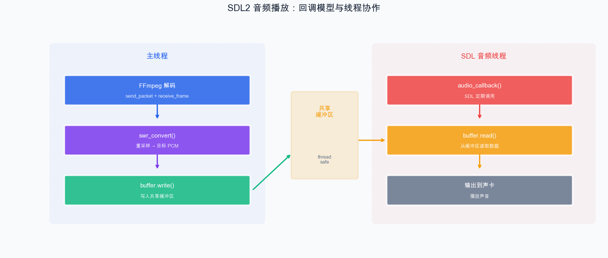

# 第 11 章：SDL2 音频播放

> 上一章我们实现了视频渲染。本章实现音频播放——使用 SDL2 的音频子系统将 FFmpeg 解码的音频数据播放出来。

## 11.1 SDL2 音频子系统

SDL2 音频使用**回调函数**模式：你注册一个回调函数，SDL2 在需要音频数据时自动调用它。



### 11.1.1 SDL_AudioSpec

```cpp
SDL_AudioSpec wanted_spec;
wanted_spec.freq = 44100;                    // 采样率
wanted_spec.format = AUDIO_S16SYS;           // 16位有符号整数，系统字节序
wanted_spec.channels = 2;                    // 双声道
wanted_spec.silence = 0;                     // 静音值
wanted_spec.samples = 1024;                  // 音频缓冲区大小（采样数）
wanted_spec.callback = audio_callback;       // 回调函数
wanted_spec.userdata = &audio_state;         // 传递给回调的自定义数据
```

`samples` 参数影响延迟：
- 值越小：延迟越低，但回调更频繁，CPU 开销更大
- 值越大：延迟越高，但更稳定
- 推荐值：1024 或 2048

### 11.1.2 打开音频设备

```cpp
SDL_AudioDeviceID audio_dev = SDL_OpenAudioDevice(
    nullptr,           // 设备名，nullptr 使用默认设备
    0,                 // 0=播放，1=录制
    &wanted_spec,      // 期望的参数
    &obtained_spec,    // 实际得到的参数
    SDL_AUDIO_ALLOW_FORMAT_CHANGE  // 允许格式调整
);

if (audio_dev == 0) {
    std::cerr << "无法打开音频设备: " << SDL_GetError() << std::endl;
}

// 开始播放（取消暂停）
SDL_PauseAudioDevice(audio_dev, 0);

// 暂停播放
SDL_PauseAudioDevice(audio_dev, 1);

// 关闭
SDL_CloseAudioDevice(audio_dev);
```

### 11.1.3 回调函数

```cpp
// SDL 音频回调函数（在 SDL 音频线程中执行）
void audio_callback(void* userdata, Uint8* stream, int len) {
    // userdata: 自定义数据指针
    // stream:   需要填充的音频缓冲区
    // len:      需要的字节数

    // 用静音填充（避免噪声）
    memset(stream, 0, len);

    // 从你的音频缓冲区中读取数据并混合到 stream
    // SDL_MixAudioFormat(stream, audio_data, AUDIO_S16SYS, data_len, SDL_MIX_MAXVOLUME);

    // 或者直接拷贝
    // memcpy(stream, audio_data, len);
}
```

## 11.2 音频缓冲区管理

关键问题：FFmpeg 解码音频的速度和 SDL 消费音频的速度不同步。我们需要一个缓冲区来"桥接"生产者（解码线程）和消费者（SDL 回调）。

### 11.2.1 简单的环形缓冲区

```cpp
#include <mutex>
#include <vector>
#include <algorithm>
#include <cstring>

class AudioBuffer {
public:
    explicit AudioBuffer(size_t capacity = 192000)  // 约 1 秒 44100Hz stereo s16
        : buffer_(capacity), write_pos_(0), read_pos_(0), size_(0) {}

    // 写入数据（解码线程调用）
    size_t write(const uint8_t* data, size_t len) {
        std::lock_guard<std::mutex> lock(mutex_);

        size_t available = buffer_.size() - size_;
        size_t to_write = std::min(len, available);

        for (size_t i = 0; i < to_write; i++) {
            buffer_[write_pos_] = data[i];
            write_pos_ = (write_pos_ + 1) % buffer_.size();
        }
        size_ += to_write;
        return to_write;
    }

    // 读取数据（SDL 回调调用）
    size_t read(uint8_t* data, size_t len) {
        std::lock_guard<std::mutex> lock(mutex_);

        size_t to_read = std::min(len, size_);
        for (size_t i = 0; i < to_read; i++) {
            data[i] = buffer_[read_pos_];
            read_pos_ = (read_pos_ + 1) % buffer_.size();
        }
        size_ -= to_read;
        return to_read;
    }

    size_t available() const {
        std::lock_guard<std::mutex> lock(mutex_);
        return size_;
    }

private:
    std::vector<uint8_t> buffer_;
    size_t write_pos_;
    size_t read_pos_;
    size_t size_;
    mutable std::mutex mutex_;
};
```

## 11.3 Demo：FFmpeg 音频解码 + SDL2 播放

```cpp
// chapter-11-sdl-audio/main.cpp

extern "C" {
#include <libavformat/avformat.h>
#include <libavcodec/avcodec.h>
#include <libavutil/avutil.h>
#include <libavutil/channel_layout.h>
#include <libswresample/swresample.h>
}

#include <SDL2/SDL.h>
#include <iostream>
#include <vector>
#include <mutex>
#include <algorithm>
#include <cstring>
#include <atomic>

// ==================== 音频环形缓冲区 ====================
class AudioRingBuffer {
public:
    explicit AudioRingBuffer(size_t capacity = 1024 * 1024)
        : buffer_(capacity), write_pos_(0), read_pos_(0), size_(0) {}

    size_t write(const uint8_t* data, size_t len) {
        std::lock_guard<std::mutex> lock(mutex_);
        size_t space = buffer_.size() - size_;
        size_t n = std::min(len, space);
        for (size_t i = 0; i < n; i++) {
            buffer_[write_pos_] = data[i];
            write_pos_ = (write_pos_ + 1) % buffer_.size();
        }
        size_ += n;
        return n;
    }

    size_t read(uint8_t* data, size_t len) {
        std::lock_guard<std::mutex> lock(mutex_);
        size_t n = std::min(len, size_);
        for (size_t i = 0; i < n; i++) {
            data[i] = buffer_[read_pos_];
            read_pos_ = (read_pos_ + 1) % buffer_.size();
        }
        size_ -= n;
        return n;
    }

    size_t available() const {
        std::lock_guard<std::mutex> lock(mutex_);
        return size_;
    }

    void clear() {
        std::lock_guard<std::mutex> lock(mutex_);
        write_pos_ = read_pos_ = size_ = 0;
    }

private:
    std::vector<uint8_t> buffer_;
    size_t write_pos_, read_pos_, size_;
    mutable std::mutex mutex_;
};

// 全局状态
struct AudioState {
    AudioRingBuffer buffer;
    int volume = SDL_MIX_MAXVOLUME;
};

// SDL 音频回调
void audio_callback(void* userdata, Uint8* stream, int len) {
    auto* state = static_cast<AudioState*>(userdata);

    // 先填充静音
    memset(stream, 0, len);

    // 从缓冲区读取数据
    std::vector<uint8_t> temp(len);
    size_t got = state->buffer.read(temp.data(), len);

    if (got > 0) {
        SDL_MixAudioFormat(stream, temp.data(), AUDIO_S16SYS,
                           static_cast<Uint32>(got), state->volume);
    }
}

int main(int argc, char* argv[]) {
    if (argc < 2) {
        std::cerr << "用法: " << argv[0] << " <输入文件>" << std::endl;
        return 1;
    }

    const char* input_file = argv[1];

    // 输出参数
    const int OUT_SAMPLE_RATE = 44100;
    const int OUT_CHANNELS = 2;
    const AVSampleFormat OUT_FMT = AV_SAMPLE_FMT_S16;

    // ========== FFmpeg 初始化 ==========
    AVFormatContext* fmt_ctx = nullptr;
    avformat_open_input(&fmt_ctx, input_file, nullptr, nullptr);
    avformat_find_stream_info(fmt_ctx, nullptr);

    int audio_idx = av_find_best_stream(fmt_ctx, AVMEDIA_TYPE_AUDIO, -1, -1, nullptr, 0);
    if (audio_idx < 0) {
        std::cerr << "找不到音频流" << std::endl;
        return 1;
    }

    AVStream* audio_stream = fmt_ctx->streams[audio_idx];
    const AVCodec* codec = avcodec_find_decoder(audio_stream->codecpar->codec_id);
    AVCodecContext* codec_ctx = avcodec_alloc_context3(codec);
    avcodec_parameters_to_context(codec_ctx, audio_stream->codecpar);
    avcodec_open2(codec_ctx, codec, nullptr);

    // 重采样器
    SwrContext* swr_ctx = nullptr;
    AVChannelLayout out_layout = AV_CHANNEL_LAYOUT_STEREO;
    AVChannelLayout in_layout;
    av_channel_layout_copy(&in_layout, &codec_ctx->ch_layout);
    swr_alloc_set_opts2(&swr_ctx,
        &out_layout, OUT_FMT, OUT_SAMPLE_RATE,
        &in_layout, codec_ctx->sample_fmt, codec_ctx->sample_rate,
        0, nullptr);
    av_channel_layout_uninit(&in_layout);
    swr_init(swr_ctx);

    std::cout << "音频: " << avcodec_get_name(codec_ctx->codec_id)
              << ", " << codec_ctx->sample_rate << " Hz"
              << ", " << codec_ctx->ch_layout.nb_channels << " ch"
              << std::endl;

    // ========== SDL2 初始化 ==========
    SDL_Init(SDL_INIT_AUDIO);

    AudioState audio_state;

    SDL_AudioSpec wanted_spec{}, obtained_spec{};
    wanted_spec.freq = OUT_SAMPLE_RATE;
    wanted_spec.format = AUDIO_S16SYS;
    wanted_spec.channels = OUT_CHANNELS;
    wanted_spec.silence = 0;
    wanted_spec.samples = 1024;
    wanted_spec.callback = audio_callback;
    wanted_spec.userdata = &audio_state;

    SDL_AudioDeviceID audio_dev = SDL_OpenAudioDevice(
        nullptr, 0, &wanted_spec, &obtained_spec,
        SDL_AUDIO_ALLOW_FORMAT_CHANGE);

    if (audio_dev == 0) {
        std::cerr << "无法打开音频设备: " << SDL_GetError() << std::endl;
        return 1;
    }

    std::cout << "SDL 音频设备已打开: " << obtained_spec.freq << " Hz, "
              << (int)obtained_spec.channels << " ch" << std::endl;
    std::cout << "按 Ctrl+C 退出" << std::endl;

    // 开始播放
    SDL_PauseAudioDevice(audio_dev, 0);

    // ========== 解码循环 ==========
    AVPacket* pkt = av_packet_alloc();
    AVFrame* frame = av_frame_alloc();
    std::atomic<bool> running(true);

    while (running && av_read_frame(fmt_ctx, pkt) >= 0) {
        if (pkt->stream_index != audio_idx) {
            av_packet_unref(pkt);
            continue;
        }

        avcodec_send_packet(codec_ctx, pkt);
        av_packet_unref(pkt);

        while (avcodec_receive_frame(codec_ctx, frame) == 0) {
            // 重采样
            int out_samples = av_rescale_rnd(
                swr_get_delay(swr_ctx, codec_ctx->sample_rate) + frame->nb_samples,
                OUT_SAMPLE_RATE, codec_ctx->sample_rate, AV_ROUND_UP);

            uint8_t* out_buf = nullptr;
            av_samples_alloc(&out_buf, nullptr, OUT_CHANNELS, out_samples, OUT_FMT, 0);

            int converted = swr_convert(swr_ctx, &out_buf, out_samples,
                                        (const uint8_t**)frame->data, frame->nb_samples);

            if (converted > 0) {
                int data_size = av_samples_get_buffer_size(
                    nullptr, OUT_CHANNELS, converted, OUT_FMT, 1);

                // 等待缓冲区有足够空间
                while (audio_state.buffer.available() > 800000) {
                    SDL_Delay(10);
                }

                audio_state.buffer.write(out_buf, data_size);
            }

            av_freep(&out_buf);
            av_frame_unref(frame);
        }

        // 处理 SDL 事件（防止无响应）
        SDL_Event event;
        while (SDL_PollEvent(&event)) {
            if (event.type == SDL_QUIT) running = false;
        }
    }

    // 等待缓冲区播放完
    std::cout << "等待播放完成..." << std::endl;
    while (audio_state.buffer.available() > 0) {
        SDL_Delay(100);
    }
    SDL_Delay(500);  // 额外等待

    // 清理
    SDL_CloseAudioDevice(audio_dev);
    SDL_Quit();

    av_frame_free(&frame);
    av_packet_free(&pkt);
    swr_free(&swr_ctx);
    avcodec_free_context(&codec_ctx);
    avformat_close_input(&fmt_ctx);

    std::cout << "播放结束" << std::endl;
    return 0;
}
```

### 运行

```bash
./sdl-audio test_video.mp4
# 你应该能听到视频中的音频被播放出来
```

## 11.4 理解回调模式的线程安全

上方架构图已完整展示了主线程和 SDL 音频线程的协作关系。

`AudioRingBuffer` 使用 `mutex` 保护共享数据，确保两个线程安全地读写。

**注意事项**：
- 回调函数中不要做耗时操作（不要阻塞、不要分配大量内存）
- 回调函数中不要调用 SDL 的其他音频函数
- 缓冲区不足时应填充静音，而非阻塞

## 11.5 音量控制

```cpp
// SDL_MixAudioFormat 支持音量参数
SDL_MixAudioFormat(stream, data, AUDIO_S16SYS, len, volume);
// volume: 0 (静音) ~ SDL_MIX_MAXVOLUME (128, 最大)

// 在回调中调节音量
void audio_callback(void* userdata, Uint8* stream, int len) {
    auto* state = static_cast<AudioState*>(userdata);
    memset(stream, 0, len);

    std::vector<uint8_t> temp(len);
    size_t got = state->buffer.read(temp.data(), len);
    if (got > 0) {
        // 使用当前音量
        SDL_MixAudioFormat(stream, temp.data(), AUDIO_S16SYS, got, state->volume);
    }
}
```

## 小结

本章我们学习了：

1. **SDL2 音频子系统**：回调函数模式的工作原理
2. **SDL_AudioSpec**：采样率、格式、声道数、缓冲区大小的配置
3. **环形缓冲区**：桥接解码线程和 SDL 音频线程
4. **完整的音频播放链路**：FFmpeg 解码 → 重采样 → 缓冲区 → SDL 回调 → 声卡
5. **音量控制**：使用 SDL_MixAudioFormat

至此，我们已经分别实现了视频渲染和音频播放。接下来进入第四部分——将它们整合到一起，构建一个真正的视频播放器！

---

> **上一篇**：[第 10 章：SDL2 视频渲染](10-SDL2视频渲染.md)
> **下一篇**：[第 12 章：播放器架构设计](12-播放器架构设计.md)
