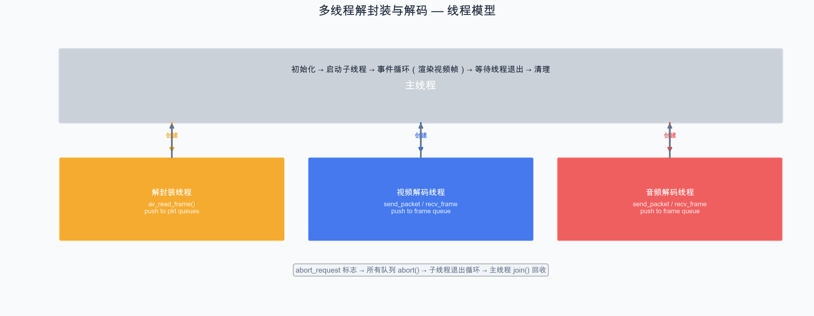

# 第 13 章：多线程解封装与解码

> 上一章我们设计了播放器的多线程架构并实现了线程安全队列。本章将基于此架构，实现完整的多线程解封装和解码框架。

## 13.1 线程模型



## 13.2 线程管理

### 13.2.1 使用 std::thread

```cpp
#include <thread>
#include <atomic>

class PlayerContext {
public:
    std::atomic<bool> abort_request{false};  // 全局退出标志
    std::atomic<bool> paused{false};         // 暂停标志

    // 队列
    PacketQueue video_pkt_queue;
    PacketQueue audio_pkt_queue;
    FrameQueue video_frame_queue;
    FrameQueue audio_frame_queue;

    // FFmpeg 上下文
    AVFormatContext* fmt_ctx = nullptr;
    AVCodecContext* video_codec_ctx = nullptr;
    AVCodecContext* audio_codec_ctx = nullptr;
    int video_stream_idx = -1;
    int audio_stream_idx = -1;

    // 线程
    std::thread demux_thread;
    std::thread video_decode_thread;
    std::thread audio_decode_thread;
};
```

### 13.2.2 线程的启动与退出

```cpp
// 启动所有线程
void start_threads(PlayerContext& ctx) {
    ctx.demux_thread = std::thread(demux_thread_func, &ctx);
    ctx.video_decode_thread = std::thread(video_decode_thread_func, &ctx);
    ctx.audio_decode_thread = std::thread(audio_decode_thread_func, &ctx);
}

// 停止所有线程
void stop_threads(PlayerContext& ctx) {
    // 设置退出标志
    ctx.abort_request = true;

    // 中止所有队列（唤醒阻塞的线程）
    ctx.video_pkt_queue.abort();
    ctx.audio_pkt_queue.abort();
    ctx.video_frame_queue.abort();
    ctx.audio_frame_queue.abort();

    // 等待线程退出
    if (ctx.demux_thread.joinable()) ctx.demux_thread.join();
    if (ctx.video_decode_thread.joinable()) ctx.video_decode_thread.join();
    if (ctx.audio_decode_thread.joinable()) ctx.audio_decode_thread.join();
}
```

## 13.3 解封装线程

```cpp
void demux_thread_func(PlayerContext* ctx) {
    AVPacket* pkt = av_packet_alloc();

    while (!ctx->abort_request) {
        // 暂停处理
        if (ctx->paused) {
            std::this_thread::sleep_for(std::chrono::milliseconds(10));
            continue;
        }

        // 队列满时等一会儿
        if (ctx->video_pkt_queue.size() > 100 || ctx->audio_pkt_queue.size() > 100) {
            std::this_thread::sleep_for(std::chrono::milliseconds(10));
            continue;
        }

        int ret = av_read_frame(ctx->fmt_ctx, pkt);
        if (ret < 0) {
            if (ret == AVERROR_EOF) {
                // 文件结束，可以选择循环播放或发送结束标志
                break;
            }
            // 读取错误，短暂等待后重试
            std::this_thread::sleep_for(std::chrono::milliseconds(10));
            continue;
        }

        // 分发到对应的包队列
        if (pkt->stream_index == ctx->video_stream_idx) {
            ctx->video_pkt_queue.push(pkt);
        } else if (pkt->stream_index == ctx->audio_stream_idx) {
            ctx->audio_pkt_queue.push(pkt);
        }

        av_packet_unref(pkt);
    }

    av_packet_free(&pkt);

    // 通知解码线程没有更多数据了
    ctx->video_pkt_queue.abort();
    ctx->audio_pkt_queue.abort();
}
```

## 13.4 视频解码线程

```cpp
void video_decode_thread_func(PlayerContext* ctx) {
    AVPacket* pkt = av_packet_alloc();
    AVFrame* frame = av_frame_alloc();

    while (!ctx->abort_request) {
        // 从包队列取出一个包
        if (!ctx->video_pkt_queue.pop(pkt)) {
            break;  // 队列被中止
        }

        // 送入解码器
        int ret = avcodec_send_packet(ctx->video_codec_ctx, pkt);
        av_packet_unref(pkt);

        if (ret < 0) {
            continue;
        }

        // 取出解码后的帧
        while (ret >= 0 && !ctx->abort_request) {
            ret = avcodec_receive_frame(ctx->video_codec_ctx, frame);
            if (ret == AVERROR(EAGAIN) || ret == AVERROR_EOF) {
                break;
            }
            if (ret < 0) {
                break;
            }

            // 设置帧的时间信息
            frame->pts = frame->best_effort_timestamp;

            // 放入帧队列
            if (!ctx->video_frame_queue.push(frame)) {
                av_frame_unref(frame);
                break;
            }
        }
    }

    av_frame_free(&frame);
    av_packet_free(&pkt);
}
```

## 13.5 音频解码线程

```cpp
void audio_decode_thread_func(PlayerContext* ctx) {
    AVPacket* pkt = av_packet_alloc();
    AVFrame* frame = av_frame_alloc();

    while (!ctx->abort_request) {
        if (!ctx->audio_pkt_queue.pop(pkt)) {
            break;
        }

        int ret = avcodec_send_packet(ctx->audio_codec_ctx, pkt);
        av_packet_unref(pkt);
        if (ret < 0) continue;

        while (ret >= 0 && !ctx->abort_request) {
            ret = avcodec_receive_frame(ctx->audio_codec_ctx, frame);
            if (ret == AVERROR(EAGAIN) || ret == AVERROR_EOF) break;
            if (ret < 0) break;

            frame->pts = frame->best_effort_timestamp;

            if (!ctx->audio_frame_queue.push(frame)) {
                av_frame_unref(frame);
                break;
            }
        }
    }

    av_frame_free(&frame);
    av_packet_free(&pkt);
}
```

## 13.6 Demo：多线程解封装与解码验证

```cpp
// chapter-13-multithread/main.cpp

#include "../chapter-12-queue/packet_queue.h"
#include "../chapter-12-queue/frame_queue.h"

extern "C" {
#include <libavformat/avformat.h>
#include <libavcodec/avcodec.h>
#include <libavutil/avutil.h>
}

#include <iostream>
#include <thread>
#include <atomic>
#include <chrono>

struct Context {
    std::atomic<bool> abort_request{false};

    AVFormatContext* fmt_ctx = nullptr;
    AVCodecContext* video_codec_ctx = nullptr;
    AVCodecContext* audio_codec_ctx = nullptr;
    int video_idx = -1;
    int audio_idx = -1;

    PacketQueue video_pkt_queue;
    PacketQueue audio_pkt_queue;
    FrameQueue video_frame_queue;
    FrameQueue audio_frame_queue;

    std::atomic<int> video_frames_decoded{0};
    std::atomic<int> audio_frames_decoded{0};
};

void demux_func(Context* ctx) {
    AVPacket* pkt = av_packet_alloc();
    while (!ctx->abort_request) {
        if (ctx->video_pkt_queue.size() > 64 || ctx->audio_pkt_queue.size() > 64) {
            std::this_thread::sleep_for(std::chrono::milliseconds(5));
            continue;
        }

        int ret = av_read_frame(ctx->fmt_ctx, pkt);
        if (ret < 0) break;

        if (pkt->stream_index == ctx->video_idx) {
            ctx->video_pkt_queue.push(pkt);
        } else if (pkt->stream_index == ctx->audio_idx) {
            ctx->audio_pkt_queue.push(pkt);
        }
        av_packet_unref(pkt);
    }
    av_packet_free(&pkt);
    ctx->video_pkt_queue.abort();
    ctx->audio_pkt_queue.abort();
}

void video_decode_func(Context* ctx) {
    AVPacket* pkt = av_packet_alloc();
    AVFrame* frame = av_frame_alloc();

    while (!ctx->abort_request) {
        if (!ctx->video_pkt_queue.pop(pkt)) break;

        int ret = avcodec_send_packet(ctx->video_codec_ctx, pkt);
        av_packet_unref(pkt);
        if (ret < 0) continue;

        while (ret >= 0) {
            ret = avcodec_receive_frame(ctx->video_codec_ctx, frame);
            if (ret == AVERROR(EAGAIN) || ret == AVERROR_EOF) break;
            if (ret < 0) break;

            frame->pts = frame->best_effort_timestamp;
            if (!ctx->video_frame_queue.push(frame)) {
                av_frame_unref(frame);
                break;
            }
            ctx->video_frames_decoded++;
        }
    }

    av_frame_free(&frame);
    av_packet_free(&pkt);
    ctx->video_frame_queue.abort();
}

void audio_decode_func(Context* ctx) {
    AVPacket* pkt = av_packet_alloc();
    AVFrame* frame = av_frame_alloc();

    while (!ctx->abort_request) {
        if (!ctx->audio_pkt_queue.pop(pkt)) break;

        int ret = avcodec_send_packet(ctx->audio_codec_ctx, pkt);
        av_packet_unref(pkt);
        if (ret < 0) continue;

        while (ret >= 0) {
            ret = avcodec_receive_frame(ctx->audio_codec_ctx, frame);
            if (ret == AVERROR(EAGAIN) || ret == AVERROR_EOF) break;
            if (ret < 0) break;

            frame->pts = frame->best_effort_timestamp;
            if (!ctx->audio_frame_queue.push(frame)) {
                av_frame_unref(frame);
                break;
            }
            ctx->audio_frames_decoded++;
        }
    }

    av_frame_free(&frame);
    av_packet_free(&pkt);
    ctx->audio_frame_queue.abort();
}

int main(int argc, char* argv[]) {
    if (argc < 2) {
        std::cerr << "用法: " << argv[0] << " <输入文件>" << std::endl;
        return 1;
    }

    Context ctx;

    avformat_open_input(&ctx.fmt_ctx, argv[1], nullptr, nullptr);
    avformat_find_stream_info(ctx.fmt_ctx, nullptr);
    av_dump_format(ctx.fmt_ctx, 0, argv[1], 0);

    // 初始化视频解码器
    ctx.video_idx = av_find_best_stream(ctx.fmt_ctx, AVMEDIA_TYPE_VIDEO, -1, -1, nullptr, 0);
    if (ctx.video_idx >= 0) {
        auto* par = ctx.fmt_ctx->streams[ctx.video_idx]->codecpar;
        auto* codec = avcodec_find_decoder(par->codec_id);
        ctx.video_codec_ctx = avcodec_alloc_context3(codec);
        avcodec_parameters_to_context(ctx.video_codec_ctx, par);
        ctx.video_codec_ctx->thread_count = 2;
        avcodec_open2(ctx.video_codec_ctx, codec, nullptr);
    }

    // 初始化音频解码器
    ctx.audio_idx = av_find_best_stream(ctx.fmt_ctx, AVMEDIA_TYPE_AUDIO, -1, -1, nullptr, 0);
    if (ctx.audio_idx >= 0) {
        auto* par = ctx.fmt_ctx->streams[ctx.audio_idx]->codecpar;
        auto* codec = avcodec_find_decoder(par->codec_id);
        ctx.audio_codec_ctx = avcodec_alloc_context3(codec);
        avcodec_parameters_to_context(ctx.audio_codec_ctx, par);
        avcodec_open2(ctx.audio_codec_ctx, codec, nullptr);
    }

    // 启动线程
    auto start = std::chrono::steady_clock::now();

    std::thread demux_thread(demux_func, &ctx);
    std::thread video_thread(video_decode_func, &ctx);
    std::thread audio_thread(audio_decode_func, &ctx);

    // 消费帧（模拟渲染/播放）
    AVFrame* frame = av_frame_alloc();
    int video_consumed = 0, audio_consumed = 0;

    while (true) {
        bool got_video = ctx.video_frame_queue.pop(frame);
        if (got_video) {
            video_consumed++;
            av_frame_unref(frame);
        }

        bool got_audio = ctx.audio_frame_queue.pop(frame);
        if (got_audio) {
            audio_consumed++;
            av_frame_unref(frame);
        }

        if (!got_video && !got_audio) break;
    }

    demux_thread.join();
    video_thread.join();
    audio_thread.join();

    auto end = std::chrono::steady_clock::now();
    auto ms = std::chrono::duration_cast<std::chrono::milliseconds>(end - start).count();

    std::cout << "\n========== 多线程解码统计 ==========" << std::endl;
    std::cout << "视频帧: " << video_consumed << std::endl;
    std::cout << "音频帧: " << audio_consumed << std::endl;
    std::cout << "总耗时: " << ms << " ms" << std::endl;

    av_frame_free(&frame);
    if (ctx.video_codec_ctx) avcodec_free_context(&ctx.video_codec_ctx);
    if (ctx.audio_codec_ctx) avcodec_free_context(&ctx.audio_codec_ctx);
    avformat_close_input(&ctx.fmt_ctx);

    return 0;
}
```

## 13.7 线程控制要点

### 退出控制

```
abort_request = true
        │
        ▼
  队列 abort() ──→ 唤醒所有阻塞的 pop/push
        │
        ▼
  各线程检测 abort/pop 返回 false ──→ 退出循环
        │
        ▼
  主线程 join() ──→ 等待线程结束
```

### 暂停控制

暂停时不需要停止线程，只需要让解封装线程暂停读取。解码线程会因为队列为空自然阻塞。

## 小结

本章我们实现了：

1. **解封装线程**：持续读取 AVPacket 并分发到对应队列
2. **视频/音频解码线程**：从 PacketQueue 取包，解码后放入 FrameQueue
3. **线程的启动与退出控制**：通过 abort 标志和队列中止机制
4. **完整的多线程解码验证**

下一章将实现播放器最核心的功能——音视频同步。

---

> **上一篇**：[第 12 章：播放器架构设计](12-播放器架构设计.md)
> **下一篇**：[第 14 章：音视频同步](14-音视频同步.md)
