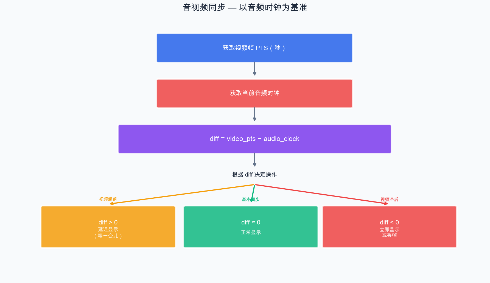

# 第 14 章：音视频同步

> 音视频同步是播放器开发中最核心也最有难度的部分。如果没有同步机制，视频和音频会各自以不同的速度播放，导致"口型不对"的问题。本章我们将深入理解同步原理，并实现基于音频时钟的同步方案。

## 14.1 为什么需要音视频同步？

理想情况下，视频以固定帧率播放（如 24fps），音频以固定采样率播放（如 48000Hz），它们应该自然同步。但现实中会出现偏差：

- 视频解码速度不均匀（I 帧比 P/B 帧慢）
- 系统调度导致的时间抖动
- 累积误差（微小偏差随时间放大）

不同步的表现：
- **视频快于音频**：画面提前，嘴型先动再出声
- **视频慢于音频**：画面滞后，声音先出再动嘴
- 人眼对音画不同步非常敏感，**超过 80ms** 就能明显感知

## 14.2 三种同步策略

| 策略 | 描述 | 优缺点 |
| --- | --- | --- |
| **以音频为主时钟** | 视频根据音频播放进度调整显示时机 | 最常用，因为音频卡顿最为明显 |
| 以视频为主时钟 | 音频根据视频帧率调整播放速度 | 很少使用，音频变速会变调 |
| 以外部时钟为主 | 音视频都参照系统时钟 | 复杂，用于多设备同步 |

**我们采用"以音频为主时钟"的方案。** 原因：

1. 音频播放由声卡硬件驱动，时间精度高且均匀
2. 音频卡顿/变速比视频更容易被人感知
3. 视频丢帧或延迟显示相对不那么明显

## 14.3 音频时钟

### 14.3.1 什么是音频时钟？

音频时钟 = **当前已播放到的音频时间点**。

由于音频数据是持续不断地送入声卡的，我们可以根据"已送出的音频数据量"精确计算当前的播放时间。

### 14.3.2 音频时钟的维护

```cpp
class AudioClock {
public:
    // 在每次向 SDL 音频缓冲区写入数据后调用
    void update(double pts, int serial) {
        std::lock_guard<std::mutex> lock(mutex_);
        pts_ = pts;
        last_updated_ = av_gettime_relative() / 1000000.0;
    }

    // 获取当前音频播放位置
    double get() const {
        std::lock_guard<std::mutex> lock(mutex_);
        // 当前时间 = 上次更新的 PTS + 从上次更新到现在经过的时间
        double now = av_gettime_relative() / 1000000.0;
        return pts_ + (now - last_updated_);
    }

private:
    double pts_ = 0.0;              // 上次更新时的 PTS（秒）
    double last_updated_ = 0.0;     // 上次更新的系统时间
    mutable std::mutex mutex_;
};
```

### 14.3.3 在音频回调中更新时钟

```cpp
void audio_callback(void* userdata, Uint8* stream, int len) {
    auto* ctx = static_cast<PlayerContext*>(userdata);
    memset(stream, 0, len);

    int bytes_remaining = len;
    while (bytes_remaining > 0) {
        if (ctx->audio_buf_index >= ctx->audio_buf_size) {
            // 从帧队列取一帧新的音频数据
            AVFrame* frame = av_frame_alloc();
            if (!ctx->audio_frame_queue.pop(frame)) {
                av_frame_free(&frame);
                break;
            }

            // 重采样
            // ... (将 frame 重采样为 S16 格式填入 audio_buf) ...

            // 更新音频时钟
            double pts = frame->pts * av_q2d(ctx->audio_stream->time_base);
            ctx->audio_clock.update(pts, 0);

            ctx->audio_buf_index = 0;
            av_frame_free(&frame);
        }

        // 将数据拷贝到 SDL stream
        int copy_len = std::min(bytes_remaining,
                                ctx->audio_buf_size - ctx->audio_buf_index);
        memcpy(stream + (len - bytes_remaining),
               ctx->audio_buf + ctx->audio_buf_index, copy_len);
        bytes_remaining -= copy_len;
        ctx->audio_buf_index += copy_len;
    }
}
```

## 14.4 视频帧显示时机控制

### 14.4.1 核心逻辑



### 14.4.2 实现

```cpp
// 获取视频帧的显示延迟
double calculate_display_delay(PlayerContext* ctx, double video_pts) {
    // 当前音频时钟
    double audio_clock = ctx->audio_clock.get();

    // 视频与音频的时间差
    double diff = video_pts - audio_clock;

    // 同步阈值
    const double AV_SYNC_THRESHOLD_MIN = 0.04;   // 40ms
    const double AV_SYNC_THRESHOLD_MAX = 0.1;     // 100ms
    const double AV_NOSYNC_THRESHOLD = 10.0;       // 10s，超过就不同步了

    // 基础帧间隔
    double frame_duration = 1.0 / av_q2d(ctx->video_stream->avg_frame_rate);

    if (std::abs(diff) > AV_NOSYNC_THRESHOLD) {
        // 差距太大，可能是 Seek 后，不同步
        return frame_duration;
    }

    if (diff <= -AV_SYNC_THRESHOLD_MAX) {
        // 视频严重落后，需要丢帧（返回 0 表示立即显示，不等待）
        return 0;
    } else if (diff <= -AV_SYNC_THRESHOLD_MIN) {
        // 视频轻微落后，缩短等待时间
        return std::max(0.0, frame_duration + diff);
    } else if (diff >= AV_SYNC_THRESHOLD_MIN) {
        // 视频超前，延长等待时间
        return frame_duration + diff;
    } else {
        // 在阈值范围内，正常等待
        return frame_duration;
    }
}
```

### 14.4.3 丢帧策略

当视频严重滞后时，需要丢帧来追赶：

```cpp
void video_display_loop(PlayerContext* ctx) {
    AVFrame* frame = av_frame_alloc();

    while (!ctx->abort_request) {
        if (!ctx->video_frame_queue.pop(frame)) break;

        double video_pts = frame->pts * av_q2d(ctx->video_stream->time_base);
        double audio_clock = ctx->audio_clock.get();
        double diff = video_pts - audio_clock;

        // 如果视频落后超过阈值，丢弃这一帧
        if (diff < -0.1 && ctx->video_frame_queue.size() > 0) {
            // 丢帧
            av_frame_unref(frame);
            continue;
        }

        // 计算需要等待的时间
        double delay = calculate_display_delay(ctx, video_pts);

        if (delay > 0) {
            // 使用高精度等待
            av_usleep(static_cast<unsigned>(delay * 1000000));
        }

        // 渲染这一帧
        render_video_frame(ctx, frame);

        av_frame_unref(frame);
    }

    av_frame_free(&frame);
}
```

## 14.5 PTS 的转换和使用

### 14.5.1 PTS 转换为秒

```cpp
// 每个流有自己的 time_base
AVStream* stream = fmt_ctx->streams[stream_index];

// 帧的 PTS（以流的 time_base 为单位）
int64_t pts = frame->pts;

// 转换为秒
double pts_in_seconds = pts * av_q2d(stream->time_base);
```

### 14.5.2 best_effort_timestamp

`AVFrame::best_effort_timestamp` 是 FFmpeg 为我们估算的"最佳时间戳"，比直接使用 `pts` 更可靠：

```cpp
// 解码后，优先使用 best_effort_timestamp
frame->pts = frame->best_effort_timestamp;
```

它处理了以下情况：
- 某些包没有 PTS（只有 DTS）
- PTS 不连续或有跳跃
- 时间戳需要根据解码顺序推算

## 14.6 Demo：音视频同步播放

```cpp
// chapter-14-av-sync/main.cpp（核心同步逻辑）

// 这个 Demo 整合了前面所有章节的内容：
// - FFmpeg 解封装 + 多线程解码
// - SDL2 视频渲染 + 音频播放
// - 基于音频时钟的音视频同步

// 由于完整代码较长，这里展示核心的同步逻辑部分
// 完整代码请参考 chapter-14-av-sync/ 目录

#include "../chapter-12-queue/packet_queue.h"
#include "../chapter-12-queue/frame_queue.h"

extern "C" {
#include <libavformat/avformat.h>
#include <libavcodec/avcodec.h>
#include <libavutil/avutil.h>
#include <libavutil/time.h>
#include <libavutil/channel_layout.h>
#include <libswscale/swscale.h>
#include <libswresample/swresample.h>
}

#include <SDL2/SDL.h>
#include <iostream>
#include <thread>
#include <atomic>
#include <mutex>
#include <cstring>
#include <vector>
#include <algorithm>

// ==================== 音频时钟 ====================
class AudioClock {
public:
    void update(double pts) {
        std::lock_guard<std::mutex> lock(mutex_);
        pts_ = pts;
        last_updated_ = av_gettime_relative() / 1000000.0;
    }

    double get() const {
        std::lock_guard<std::mutex> lock(mutex_);
        double now = av_gettime_relative() / 1000000.0;
        return pts_ + (now - last_updated_);
    }

private:
    double pts_ = 0.0;
    double last_updated_ = 0.0;
    mutable std::mutex mutex_;
};

// ==================== 播放器上下文 ====================
struct PlayerContext {
    std::atomic<bool> abort_request{false};

    AVFormatContext* fmt_ctx = nullptr;
    AVCodecContext* video_codec_ctx = nullptr;
    AVCodecContext* audio_codec_ctx = nullptr;
    SwrContext* swr_ctx = nullptr;
    int video_idx = -1;
    int audio_idx = -1;
    AVStream* video_stream = nullptr;
    AVStream* audio_stream = nullptr;

    PacketQueue video_pkt_queue;
    PacketQueue audio_pkt_queue;
    FrameQueue video_frame_queue;
    FrameQueue audio_frame_queue;

    AudioClock audio_clock;

    // 音频缓冲
    std::vector<uint8_t> audio_buf;
    int audio_buf_size = 0;
    int audio_buf_index = 0;

    // SDL
    SDL_Window* window = nullptr;
    SDL_Renderer* renderer = nullptr;
    SDL_Texture* texture = nullptr;
    SDL_AudioDeviceID audio_dev = 0;
};

// ==================== 音频回调 ====================
void audio_callback(void* userdata, Uint8* stream, int len) {
    auto* ctx = static_cast<PlayerContext*>(userdata);
    memset(stream, 0, len);

    int written = 0;
    while (written < len && !ctx->abort_request) {
        if (ctx->audio_buf_index >= ctx->audio_buf_size) {
            AVFrame* frame = av_frame_alloc();
            if (!ctx->audio_frame_queue.pop(frame)) {
                av_frame_free(&frame);
                break;
            }

            // 更新音频时钟
            if (frame->pts != AV_NOPTS_VALUE) {
                double pts = frame->pts * av_q2d(ctx->audio_stream->time_base);
                ctx->audio_clock.update(pts);
            }

            // 重采样
            int out_samples = av_rescale_rnd(
                swr_get_delay(ctx->swr_ctx, ctx->audio_codec_ctx->sample_rate)
                    + frame->nb_samples,
                44100, ctx->audio_codec_ctx->sample_rate, AV_ROUND_UP);

            ctx->audio_buf.resize(out_samples * 2 * 2);
            uint8_t* out_buf = ctx->audio_buf.data();

            int converted = swr_convert(ctx->swr_ctx, &out_buf, out_samples,
                (const uint8_t**)frame->data, frame->nb_samples);

            ctx->audio_buf_size = converted * 2 * 2;  // stereo, s16
            ctx->audio_buf_index = 0;

            av_frame_free(&frame);
        }

        int remaining = ctx->audio_buf_size - ctx->audio_buf_index;
        int copy_len = std::min(len - written, remaining);
        memcpy(stream + written, ctx->audio_buf.data() + ctx->audio_buf_index, copy_len);
        written += copy_len;
        ctx->audio_buf_index += copy_len;
    }
}

// ==================== 线程函数 ====================
void demux_thread(PlayerContext* ctx) {
    AVPacket* pkt = av_packet_alloc();
    while (!ctx->abort_request) {
        if (ctx->video_pkt_queue.size() > 64 || ctx->audio_pkt_queue.size() > 64) {
            std::this_thread::sleep_for(std::chrono::milliseconds(5));
            continue;
        }
        if (av_read_frame(ctx->fmt_ctx, pkt) < 0) break;

        if (pkt->stream_index == ctx->video_idx)
            ctx->video_pkt_queue.push(pkt);
        else if (pkt->stream_index == ctx->audio_idx)
            ctx->audio_pkt_queue.push(pkt);

        av_packet_unref(pkt);
    }
    av_packet_free(&pkt);
    ctx->video_pkt_queue.abort();
    ctx->audio_pkt_queue.abort();
}

void video_decode_thread(PlayerContext* ctx) {
    AVPacket* pkt = av_packet_alloc();
    AVFrame* frame = av_frame_alloc();
    while (!ctx->abort_request) {
        if (!ctx->video_pkt_queue.pop(pkt)) break;
        avcodec_send_packet(ctx->video_codec_ctx, pkt);
        av_packet_unref(pkt);
        int ret = 0;
        while (ret >= 0) {
            ret = avcodec_receive_frame(ctx->video_codec_ctx, frame);
            if (ret < 0) break;
            frame->pts = frame->best_effort_timestamp;
            if (!ctx->video_frame_queue.push(frame)) { av_frame_unref(frame); break; }
        }
    }
    av_frame_free(&frame);
    av_packet_free(&pkt);
    ctx->video_frame_queue.abort();
}

void audio_decode_thread(PlayerContext* ctx) {
    AVPacket* pkt = av_packet_alloc();
    AVFrame* frame = av_frame_alloc();
    while (!ctx->abort_request) {
        if (!ctx->audio_pkt_queue.pop(pkt)) break;
        avcodec_send_packet(ctx->audio_codec_ctx, pkt);
        av_packet_unref(pkt);
        int ret = 0;
        while (ret >= 0) {
            ret = avcodec_receive_frame(ctx->audio_codec_ctx, frame);
            if (ret < 0) break;
            frame->pts = frame->best_effort_timestamp;
            if (!ctx->audio_frame_queue.push(frame)) { av_frame_unref(frame); break; }
        }
    }
    av_frame_free(&frame);
    av_packet_free(&pkt);
    ctx->audio_frame_queue.abort();
}

// ==================== 主程序 ====================
int main(int argc, char* argv[]) {
    if (argc < 2) {
        std::cerr << "用法: " << argv[0] << " <输入文件>" << std::endl;
        return 1;
    }

    PlayerContext ctx;

    // FFmpeg 初始化
    avformat_open_input(&ctx.fmt_ctx, argv[1], nullptr, nullptr);
    avformat_find_stream_info(ctx.fmt_ctx, nullptr);

    ctx.video_idx = av_find_best_stream(ctx.fmt_ctx, AVMEDIA_TYPE_VIDEO, -1, -1, nullptr, 0);
    ctx.audio_idx = av_find_best_stream(ctx.fmt_ctx, AVMEDIA_TYPE_AUDIO, -1, -1, nullptr, 0);

    if (ctx.video_idx >= 0) {
        ctx.video_stream = ctx.fmt_ctx->streams[ctx.video_idx];
        auto* codec = avcodec_find_decoder(ctx.video_stream->codecpar->codec_id);
        ctx.video_codec_ctx = avcodec_alloc_context3(codec);
        avcodec_parameters_to_context(ctx.video_codec_ctx, ctx.video_stream->codecpar);
        avcodec_open2(ctx.video_codec_ctx, codec, nullptr);
    }

    if (ctx.audio_idx >= 0) {
        ctx.audio_stream = ctx.fmt_ctx->streams[ctx.audio_idx];
        auto* codec = avcodec_find_decoder(ctx.audio_stream->codecpar->codec_id);
        ctx.audio_codec_ctx = avcodec_alloc_context3(codec);
        avcodec_parameters_to_context(ctx.audio_codec_ctx, ctx.audio_stream->codecpar);
        avcodec_open2(ctx.audio_codec_ctx, codec, nullptr);

        // 重采样器
        AVChannelLayout out_layout = AV_CHANNEL_LAYOUT_STEREO;
        AVChannelLayout in_layout;
        av_channel_layout_copy(&in_layout, &ctx.audio_codec_ctx->ch_layout);
        swr_alloc_set_opts2(&ctx.swr_ctx, &out_layout, AV_SAMPLE_FMT_S16, 44100,
            &in_layout, ctx.audio_codec_ctx->sample_fmt,
            ctx.audio_codec_ctx->sample_rate, 0, nullptr);
        av_channel_layout_uninit(&in_layout);
        swr_init(ctx.swr_ctx);
    }

    int w = ctx.video_codec_ctx ? ctx.video_codec_ctx->width : 640;
    int h = ctx.video_codec_ctx ? ctx.video_codec_ctx->height : 480;

    // SDL 初始化
    SDL_Init(SDL_INIT_VIDEO | SDL_INIT_AUDIO);
    ctx.window = SDL_CreateWindow("AV Sync Player", SDL_WINDOWPOS_CENTERED,
        SDL_WINDOWPOS_CENTERED, w, h, SDL_WINDOW_SHOWN | SDL_WINDOW_RESIZABLE);
    ctx.renderer = SDL_CreateRenderer(ctx.window, -1, SDL_RENDERER_ACCELERATED);
    ctx.texture = SDL_CreateTexture(ctx.renderer, SDL_PIXELFORMAT_IYUV,
        SDL_TEXTUREACCESS_STREAMING, w, h);

    // SDL 音频
    SDL_AudioSpec wanted{}, obtained{};
    wanted.freq = 44100;
    wanted.format = AUDIO_S16SYS;
    wanted.channels = 2;
    wanted.samples = 1024;
    wanted.callback = audio_callback;
    wanted.userdata = &ctx;
    ctx.audio_dev = SDL_OpenAudioDevice(nullptr, 0, &wanted, &obtained, 0);
    SDL_PauseAudioDevice(ctx.audio_dev, 0);

    // 启动线程
    std::thread t_demux(demux_thread, &ctx);
    std::thread t_vdec(video_decode_thread, &ctx);
    std::thread t_adec(audio_decode_thread, &ctx);

    // 主循环：视频渲染 + 音视频同步
    AVFrame* frame = av_frame_alloc();
    double fps = ctx.video_stream ? av_q2d(ctx.video_stream->avg_frame_rate) : 25.0;
    if (fps <= 0) fps = 25.0;
    double frame_duration = 1.0 / fps;

    while (!ctx.abort_request) {
        SDL_Event event;
        while (SDL_PollEvent(&event)) {
            if (event.type == SDL_QUIT ||
                (event.type == SDL_KEYDOWN && event.key.keysym.sym == SDLK_ESCAPE))
                ctx.abort_request = true;
        }
        if (ctx.abort_request) break;

        if (!ctx.video_frame_queue.pop(frame)) break;

        double video_pts = frame->pts * av_q2d(ctx.video_stream->time_base);
        double audio_clk = ctx.audio_clock.get();
        double diff = video_pts - audio_clk;

        // 音视频同步
        if (diff < -0.1 && ctx.video_frame_queue.size() > 0) {
            // 视频严重落后，丢帧
            av_frame_unref(frame);
            continue;
        }

        double delay = frame_duration;
        if (diff > 0.04) {
            delay = frame_duration + diff;
        } else if (diff < -0.04) {
            delay = std::max(0.001, frame_duration + diff);
        }

        av_usleep(static_cast<unsigned>(delay * 1000000));

        // 渲染
        SDL_UpdateYUVTexture(ctx.texture, nullptr,
            frame->data[0], frame->linesize[0],
            frame->data[1], frame->linesize[1],
            frame->data[2], frame->linesize[2]);
        SDL_RenderClear(ctx.renderer);
        SDL_RenderCopy(ctx.renderer, ctx.texture, nullptr, nullptr);
        SDL_RenderPresent(ctx.renderer);

        av_frame_unref(frame);
    }

    // 清理
    ctx.abort_request = true;
    ctx.video_pkt_queue.abort();
    ctx.audio_pkt_queue.abort();
    ctx.video_frame_queue.abort();
    ctx.audio_frame_queue.abort();

    t_demux.join();
    t_vdec.join();
    t_adec.join();

    av_frame_free(&frame);
    SDL_CloseAudioDevice(ctx.audio_dev);
    SDL_DestroyTexture(ctx.texture);
    SDL_DestroyRenderer(ctx.renderer);
    SDL_DestroyWindow(ctx.window);
    SDL_Quit();

    if (ctx.swr_ctx) swr_free(&ctx.swr_ctx);
    if (ctx.video_codec_ctx) avcodec_free_context(&ctx.video_codec_ctx);
    if (ctx.audio_codec_ctx) avcodec_free_context(&ctx.audio_codec_ctx);
    avformat_close_input(&ctx.fmt_ctx);

    return 0;
}
```

## 14.7 同步效果验证

运行播放器后，你可以通过以下方式验证同步效果：

1. 播放带有对话的视频，观察口型是否与声音对齐
2. 播放音乐视频，观察节拍是否匹配
3. 在代码中打印 diff 值，观察音视频时间差是否保持在 ±40ms 以内

## 小结

本章我们实现了音视频同步的核心机制：

1. **音频时钟**：基于已播放的音频数据维护精确的播放时间
2. **同步策略**：以音频时钟为基准，调整视频帧的显示时机
3. **丢帧机制**：视频严重落后时跳过帧以追赶音频
4. **PTS 使用**：正确转换和比较时间戳

---

> **上一篇**：[第 13 章：多线程解封装与解码](13-多线程解封装与解码.md)
> **下一篇**：[第 15 章：播放控制功能](15-播放控制功能.md)
