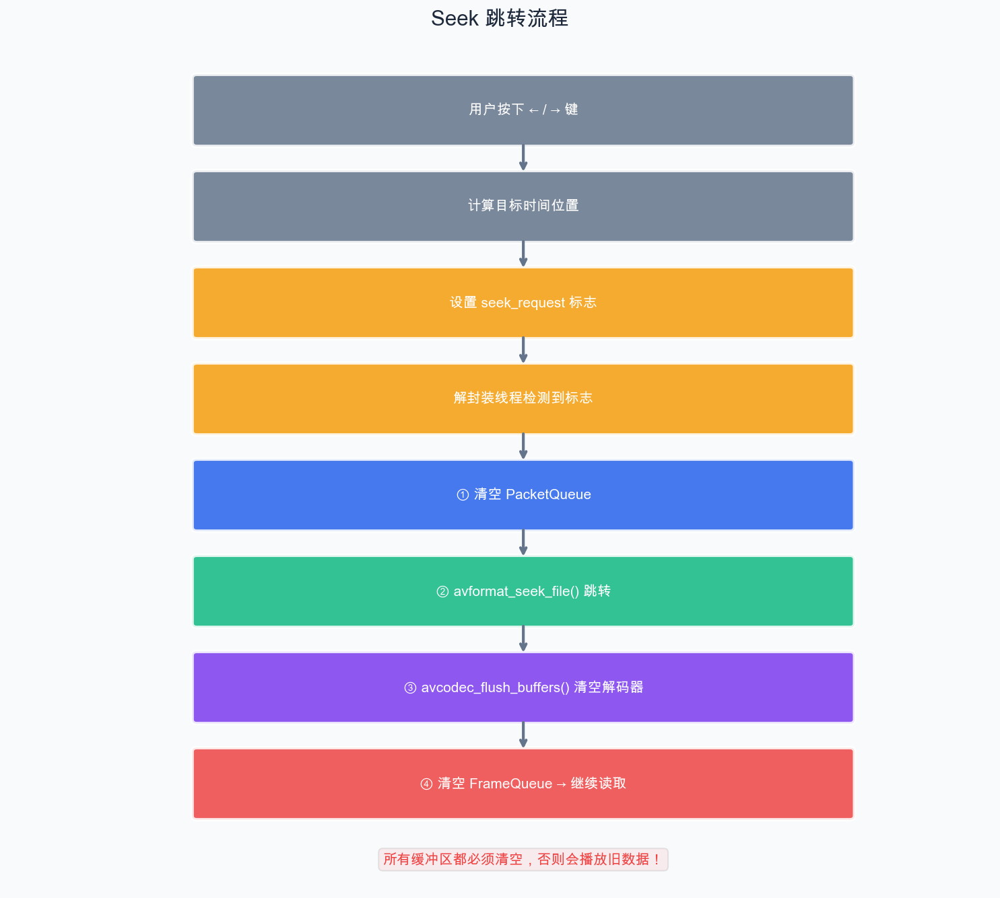

# 第 15 章：播放控制功能

> 上一章我们实现了音视频同步播放。但一个播放器不仅能"播"，还要能"控"——暂停、快进、快退、音量调节。本章我们来实现这些播放控制功能。

## 15.1 暂停/恢复

### 15.1.1 暂停的实现思路

暂停时需要：
1. 暂停音频输出（停止声卡消费数据）
2. 暂停视频渲染（停止刷新画面）
3. 暂停音频时钟（否则时钟继续走，恢复后同步会出错）
4. 解封装和解码线程可以继续工作（填满队列后自然阻塞）

```cpp
// 在 PlayerContext 中添加
struct PlayerContext {
    std::atomic<bool> paused{false};
    double pause_time = 0;  // 暂停时的时钟值
    // ...
};

// 切换暂停状态
void toggle_pause(PlayerContext* ctx) {
    ctx->paused = !ctx->paused;

    if (ctx->paused) {
        // 暂停：记录当前时间，暂停 SDL 音频
        SDL_PauseAudioDevice(ctx->audio_dev, 1);
    } else {
        // 恢复：恢复 SDL 音频，更新音频时钟
        SDL_PauseAudioDevice(ctx->audio_dev, 0);
    }
}
```

### 15.1.2 主循环中处理暂停

```cpp
while (!ctx.abort_request) {
    // 事件处理
    SDL_Event event;
    while (SDL_PollEvent(&event)) {
        switch (event.type) {
            case SDL_QUIT:
                ctx.abort_request = true;
                break;
            case SDL_KEYDOWN:
                switch (event.key.keysym.sym) {
                    case SDLK_SPACE:      // 空格键：暂停/恢复
                        toggle_pause(&ctx);
                        break;
                    case SDLK_ESCAPE:     // ESC：退出
                        ctx.abort_request = true;
                        break;
                }
                break;
        }
    }

    // 暂停时不渲染新帧，只维持当前画面
    if (ctx.paused) {
        SDL_Delay(10);
        continue;
    }

    // 正常的视频渲染和同步逻辑
    // ...
}
```

## 15.2 Seek（跳转）

Seek 是播放器中最复杂的操作之一，需要协调多个线程。

### 15.2.1 Seek 的流程



### 15.2.2 在 PlayerContext 中添加 Seek 支持

```cpp
struct PlayerContext {
    // Seek 相关
    std::atomic<bool> seek_request{false};
    int64_t seek_pos = 0;        // 目标位置（微秒）
    int seek_flags = 0;          // Seek 标志
    // ...
};

// 请求 Seek
void request_seek(PlayerContext* ctx, double target_sec) {
    ctx->seek_pos = static_cast<int64_t>(target_sec * AV_TIME_BASE);
    ctx->seek_flags = (target_sec < ctx->audio_clock.get())
                      ? AVSEEK_FLAG_BACKWARD : 0;
    ctx->seek_request = true;
}
```

### 15.2.3 解封装线程中处理 Seek

```cpp
void demux_thread(PlayerContext* ctx) {
    AVPacket* pkt = av_packet_alloc();

    while (!ctx->abort_request) {
        // 处理 Seek 请求
        if (ctx->seek_request) {
            int64_t seek_target = ctx->seek_pos;
            int64_t seek_min = seek_target - 2 * AV_TIME_BASE;  // 向前搜索范围
            int64_t seek_max = seek_target + 2 * AV_TIME_BASE;

            int ret = avformat_seek_file(ctx->fmt_ctx, -1,
                                          seek_min, seek_target, seek_max,
                                          ctx->seek_flags);

            if (ret >= 0) {
                // 清空包队列
                ctx->video_pkt_queue.flush();
                ctx->audio_pkt_queue.flush();

                // 清空解码器缓冲
                if (ctx->video_codec_ctx)
                    avcodec_flush_buffers(ctx->video_codec_ctx);
                if (ctx->audio_codec_ctx)
                    avcodec_flush_buffers(ctx->audio_codec_ctx);

                // 清空帧队列
                ctx->video_frame_queue.flush();
                ctx->audio_frame_queue.flush();
            }

            ctx->seek_request = false;
        }

        // 正常读取逻辑
        // ...
    }
}
```

### 15.2.4 键盘控制 Seek

```cpp
case SDL_KEYDOWN:
    switch (event.key.keysym.sym) {
        case SDLK_LEFT:   // 左键：快退 10 秒
            request_seek(&ctx, ctx.audio_clock.get() - 10.0);
            break;
        case SDLK_RIGHT:  // 右键：快进 10 秒
            request_seek(&ctx, ctx.audio_clock.get() + 10.0);
            break;
        case SDLK_UP:     // 上键：快进 60 秒
            request_seek(&ctx, ctx.audio_clock.get() + 60.0);
            break;
        case SDLK_DOWN:   // 下键：快退 60 秒
            request_seek(&ctx, ctx.audio_clock.get() - 60.0);
            break;
    }
    break;
```

### 15.2.5 Seek 的关键问题

**1. 关键帧对齐**

`avformat_seek_file` 通常会跳转到目标位置之前最近的关键帧（I 帧），因为只有从 I 帧才能开始正确解码。这意味着实际跳转位置可能早于目标位置几秒。

**2. 缓冲区清空时序**

Seek 时必须确保：
- 先暂停消费端（或容忍短暂的旧数据）
- 清空队列中的旧数据
- 清空解码器内部缓存
- 再开始读入新数据

**3. 时钟重置**

Seek 后音频时钟会自然更新（因为新的音频帧有新的 PTS），视频同步也会自动追踪。

## 15.3 音量控制

```cpp
struct PlayerContext {
    std::atomic<int> volume{SDL_MIX_MAXVOLUME};  // 0~128
    // ...
};

// 音频回调中使用音量
void audio_callback(void* userdata, Uint8* stream, int len) {
    auto* ctx = static_cast<PlayerContext*>(userdata);
    memset(stream, 0, len);

    // ... 获取音频数据到 temp ...

    SDL_MixAudioFormat(stream, temp.data(), AUDIO_S16SYS,
                       got, ctx->volume);
}

// 键盘控制音量（使用 +/- 键，避免与方向键 Seek 冲突）
case SDLK_EQUALS:  // '=' 或 '+' 键
case SDLK_PLUS:
    ctx.volume = std::min(ctx.volume + 8, (int)SDL_MIX_MAXVOLUME);
    std::cout << "音量: " << ctx.volume * 100 / SDL_MIX_MAXVOLUME << "%" << std::endl;
    break;
case SDLK_MINUS:
    ctx.volume = std::max(ctx.volume - 8, 0);
    std::cout << "音量: " << ctx.volume * 100 / SDL_MIX_MAXVOLUME << "%" << std::endl;
    break;
```

## 15.4 Demo：带控制功能的播放器

这个 Demo 在上一章的基础上添加了键盘控制：

| 按键 | 功能 |
| --- | --- |
| 空格 | 暂停/恢复 |
| 左箭头 | 快退 10 秒 |
| 右箭头 | 快进 10 秒 |
| 上箭头 | 快进 60 秒 |
| 下箭头 | 快退 60 秒 |
| +/= | 音量增加 |
| - | 音量减少 |
| ESC | 退出 |

核心改动是在主循环的事件处理中添加上述逻辑，以及在解封装线程中添加 Seek 处理。完整代码请参考 `chapter-15-controls/` 目录。

## 15.5 处理 EOF

```cpp
// 在解封装线程中
int ret = av_read_frame(ctx->fmt_ctx, pkt);
if (ret == AVERROR_EOF) {
    // 方案一：停止播放
    ctx->eof = true;
    break;

    // 方案二：循环播放
    // av_seek_frame(ctx->fmt_ctx, -1, 0, AVSEEK_FLAG_BACKWARD);
    // avcodec_flush_buffers(ctx->video_codec_ctx);
    // avcodec_flush_buffers(ctx->audio_codec_ctx);
    // continue;
}
```

## 小结

本章我们实现了：

1. **暂停/恢复**：暂停 SDL 音频输出，停止视频渲染更新
2. **Seek 跳转**：avformat_seek_file + 清空队列和解码器缓冲
3. **音量控制**：通过 SDL_MixAudioFormat 的音量参数
4. **键盘交互**：空格暂停、方向键快进快退和音量调节
5. **EOF 处理**：文件结束的停止或循环播放

下一章我们将完善播放器的 UI 和细节，制作最终版本。

---

> **上一篇**：[第 14 章：音视频同步](14-音视频同步.md)
> **下一篇**：[第 16 章：完善播放器](16-完善播放器.md)
